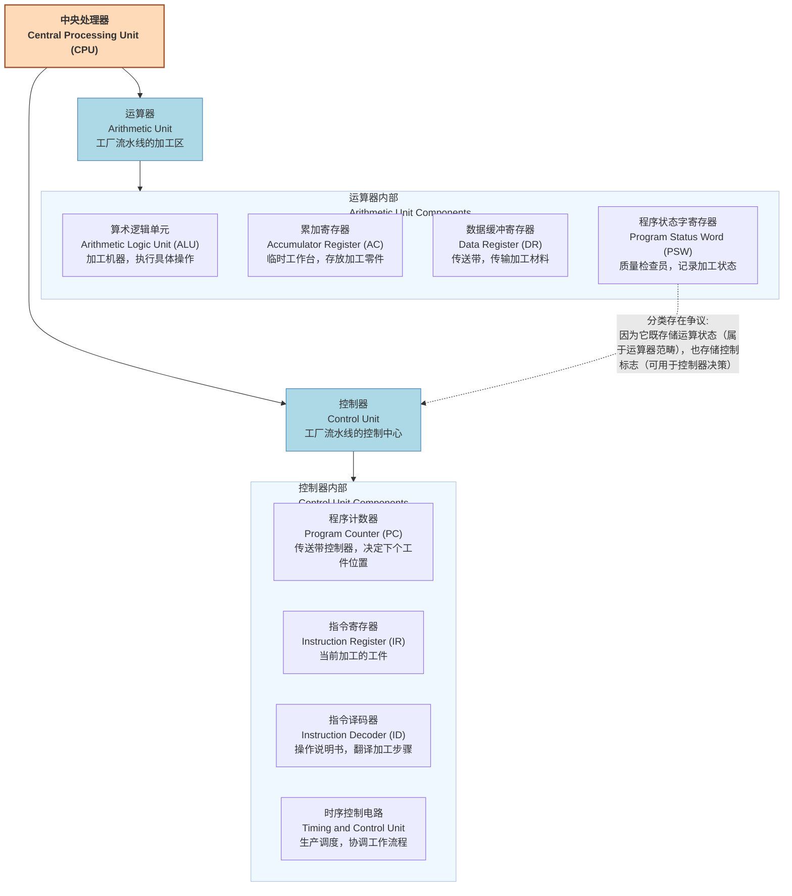

## 海明校验位 (R)的求取

$$
2^R \geq M + R + 1
$$

*   `R`：海明校验位的个数（即需要增加的冗余位数）。
*   `M`：信息位的个数（即原始数据的位数）。
*   通过代入 `M` 的值，找到满足不等式的最小 `R` 值。
*   通过"分组奇偶校验"实现检错纠错。
*   校验位和信息位是相互掺杂在一起的，而不是简单地拼接在末尾。
*   海明校验位通常放置在 \(2^R) （即 $(2^0, 2^1, 2^2, \dots)$的位置上，也就是第 1、2、4、8、16… 位。
*   其他非 \(2^R\) 的位置则放置信息位。

$$
\textbf{示例}：
\begin{array}{l}
\textbf{当信息位 } M = 16 \textbf{ 时：} \\
\quad \text{公式: } 2^R \ge M + R + 1 \\
\quad \text{若 } R = 4 \text{: } 2^4 = 16 \\
\quad \quad M + R + 1 = 16 + 4 + 1 = 21 \\
\quad \quad 16 < 21 \quad (\text{不满足}) \\
\quad \text{若 } R = 5 \text{: } 2^5 = 32 \\
\quad \quad M + R + 1 = 16 + 5 + 1 = 22 \\
\quad \quad 32 \ge 22 \quad (\text{满足}) \\
\quad \text{结论：当信息位为16位时，至少需要增加 } 5 \text{ 个海明校验位。} \\
\end{array}
$$

## 例题：海明码校验
$$
\begin{array}{l}
\text{海明码是一种纠错码，其方法是为需要校验的数据位增加若干校验位，} \\
\text{使得校验位的值决定于某些被校验位的数据，当被校验数据出错时，} \\
\text{可根据校验位的变化找到出错位，从而纠正错误。} \\
\\
\textbf{1. 对于 } 32 \textbf{ 位的数据，至少需要增加（ } 6 \textbf{ ）个校验位才能构成海明码。}\\
\textbf{当信息位 } M = 32 \textbf{ 时：} \\
\quad \text{公式: } 2^R \ge M + R + 1 \\
\quad \text{若 } R = 5 \text{: } 2^5 = 32 \\
\quad \quad M + R + 1 = 32 + 5 + 1 = 38 \\
\quad \quad 32 < 38 \quad (\text{不满足}) \\
\quad \text{若 } R = 6 \text{: } 2^6 = 64 \\
\quad \quad M + R + 1 = 32 + 6 + 1 = 39 \\
\quad \quad 64 \ge 39 \quad (\text{满足}) \\
\quad \text{结论：当信息位为32位时，至少需要增加 } 6 \text{ 个海明校验位。}
\\
\textbf{2. 以10位数据为例，其海明码表示为：}\\
\quad D_9D_8D_7D_6D_5D_4P_4D_3D_2D_1P_3D_0P_2P_1 \\
\quad \text{其中 } D_i \text{ (} 0 \le i \le 9 \text{) 表示数据位，} P_j \text{ (} 1 \le j \le 4 \text{) 表示校验位。} \\
\quad \text{数据位 } D_9 \text{ （从右至左 } D_9 \text{ 的位序为 } 14 \text{，即等于 } 8+4+2 \text{）由第8位的 } P_4 \text{、第4位的 } P_3 \text{ 和第2位的 } P_2 \text{ 进行校验。}\\
\quad \text{数据位 } D_5 \text{ 由（ } P_4 \text{、} P_2 \text{ ）进行校验。}\\
\quad \quad \textbf{解析：找规律} \\
\quad \quad \text{首先确定 } D_5 \text{ 的位序。根据给出的码字序列，} D_5 \text{ 从右向左的位序是 } 10 \text{。} \\
\quad \quad \text{将 } 10 \text{ 分解为 } 2 \text{ 的幂次之和：} \\
\quad \quad 10 = 8 + 2 \\
\quad \quad \text{这意味着 } D_5 \text{ 将由位序为 } 8 \text{ 的校验位 } P_4 \text{ 和位序为 } 2 \text{ 的校验位 } P_2 \text{ 进行校验。}
\end{array}
$$

## 校验码对比

| 校验方式   | 检错能力         | 纠错能力 | 校验位数量              | 放置方式           | 特点               |
| :--------- | :--------------- | :------- | :---------------------- | :----------------- | :----------------- |
| 奇偶校验   | 只能检测**奇数位**错误 | 不可纠错 | 1位                     | 拼接在头部或尾部     | 奇校验 (Odd Parity): 确保整个码字中“1”的个数为奇数。  偶校验 (Even Parity): 确保整个码字中“1”的个数为偶数。 |
| CRC校验    | 可检测多种错误   | 不可纠错 | 由生成多项式决定        | 拼接在信息位尾部   | **模二除法**求余数，拼接作为校验位 |
| 海明校验码 | 可检错           | 可纠错   | $2^R \geq M + R + 1$ | 相互掺杂 | 分组奇偶校验 |

## CPU组成（运算器与控制器）

## 寻址方式（Addressing Modes）

