# Mermaid 图表常用命令参考

> 在 Markdown 中书写 Mermaid 图表时，常用且在多数渲染器中兼容性良好广泛支持的基础命令和图表类型。Mermaid 代码块通常以 ` ```mermaid ` 开始，以 ` ``` ` 结束。

## 1. 流程图 (Flowchart / Graph)

流程图用于表示工作流程或过程。

### 方向：

| 命令 (`graph` 后) | 含义                     |
| ----------------- | ------------------------ |
| `TD` 或 `TB`      | 从上到下 (Top to Bottom) |
| `BT`              | 从下到上 (Bottom to Top) |
| `LR`              | 从左到右 (Left to Right) |
| `RL`              | 从右到左 (Right to Left) |

### 节点形状：

| 语法            | 形状                   | 说明         |
| --------------- | ---------------------- | ------------ |
| `id[文本]`      | 矩形                   | 默认         |
| `id(文本)`      | 圆角矩形               |              |
| `id((文本))`    | 圆形                   |              |
| `id>文本]`      | 不对称矩形 (右侧尖)    |              |
| `id{文本}`      | 菱形                   | 条件判断     |
| `id[[文本]]`    | 平行四边形             | 输入/输出    |

### 连接线：

| 语法        | 类型         | 说明         |
| ----------- | ------------ | ------------ |
| `-->`       | 带箭头实线   |              |
| `---`       | 不带箭头实线 |              |
| `-.->`      | 带箭头虚线   |              |
| `-.-`       | 不带箭头虚线 |              |
| `==>`       | 带箭头粗线   |              |
| `-->|文本|` | 带标签的连接线 |              |

### 示例：

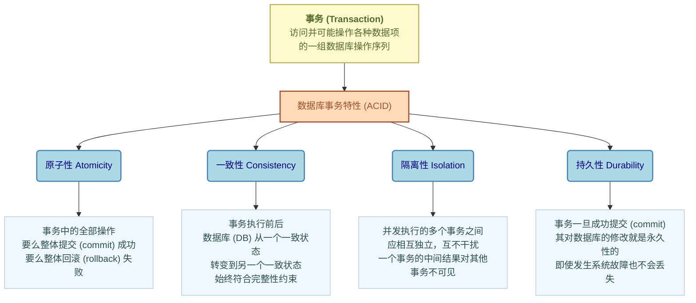


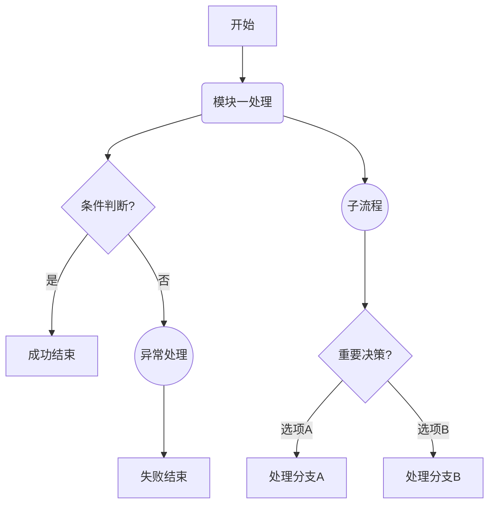

## 2. 序列图 (Sequence Diagram)

序列图显示对象之间交互的时间顺序。

### 参与者：

| 语法                       | 说明                 |
| -------------------------- | -------------------- |
| `participant P as 参与者P` | 定义名为"参与者P"的参与者P |

### 消息：

| 语法             | 类型                     | 说明           |
| ---------------- | ------------------------ | -------------- |
| `A->B: 消息文本`  | 实线箭头同步消息         |                |
| `A-->B: 消息文本` | 虚线箭头异步消息         |                |
| `A->>B: 消息文本` | 实线开放箭头             | 通常表示返回   |
| `A-->>B: 消息文本`| 虚线开放箭头             |                |

### 激活/停用：

| 语法           | 说明     |
| -------------- | -------- |
| `activate A`   | 激活参与者A |
| `deactivate A` | 停用参与者A |

### 注释：

| 语法                      | 说明           |
| ------------------------- | -------------- |
| `Note right of A: 这是注释` | 在A右侧添加注释 |
| `Note over A,B: 跨参与者注释` | 在A和B上方添加注释 |

### 循环/条件：

| 关键字 | 结构                                                                 | 说明         |
| ------ | -------------------------------------------------------------------- | ------------ |
| `loop` | `loop [循环条件]` <br> &nbsp;&nbsp;&nbsp;&nbsp;... <br> `end`         | 循环块       |
| `alt`  | `alt [条件1]` <br> &nbsp;&nbsp;&nbsp;&nbsp;... <br> `else [条件2]` <br> &nbsp;&nbsp;&nbsp;&nbsp;... <br> `end` | 条件选择块   |
| `opt`  | `opt [可选条件]` <br> &nbsp;&nbsp;&nbsp;&nbsp;... <br> `end`         | 可选块       |

### 示例：

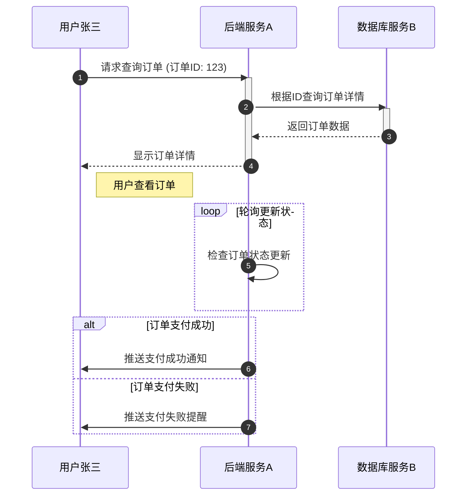

## 3. 甘特图 (Gantt Chart)

甘特图用于项目管理，显示任务和时间表。

### 日期格式：

| 语法                   | 说明         |
| ---------------------- | ------------ |
| `dateFormat YYYY-MM-DD` | 设置日期显示格式 |

### 任务：

| 语法                                                       | 说明                                   |
| ---------------------------------------------------------- | -------------------------------------- |
| `任务名称 :id, after id_prev, 开始日期, 持续时间/结束日期` | 定义一个任务及其依赖、时间             |
| `任务名称 :done, id, ...`                                  | 将任务标记为 "已完成" (视觉上通常有变化) |
| `任务名称 :active, id, ...`                                | 将任务标记为 "进行中" (视觉上通常有变化) |
| `任务名称 :crit, id, ...`                                  | 将任务标记为 "关键任务" (视觉上通常有变化) |

### 里程碑：

| 语法                             | 说明         |
| -------------------------------- | ------------ |
| `里程碑名称 :milestone, id, 日期` | 定义一个里程碑 |

### 示例：

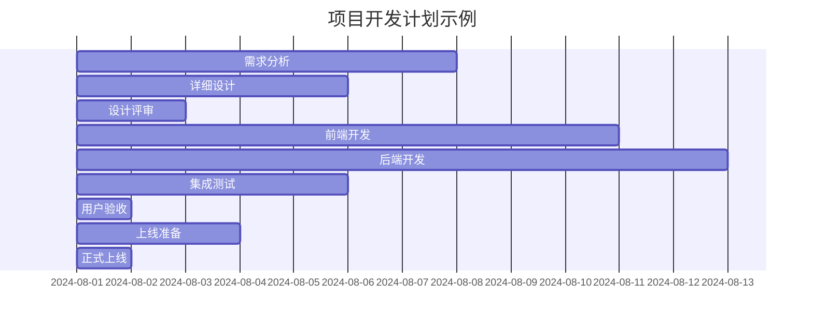

### 组合方式：甘特图+markdown表格+markdown文字描述

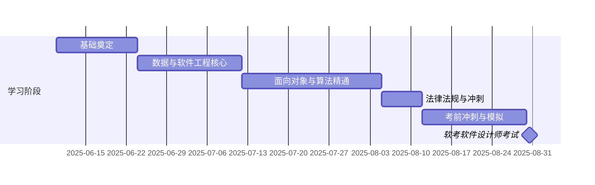

**阶段内容详情:**

*   **基础奠定**: 计算机组成与体系结构 / 操作系统 / 计算机网络
*   **数据与软件工程核心**: 数据库系统 / 数据库设计 / 系统开发基础 / 数据流图
*   **面向对象与算法精通**: 面向对象技术 / UML建模 / 面向对象程序设计 / 数据结构 / 算法基础 / 数据结构与算法应用
*   **法律法规与冲刺**: 知识产权与标准化 / 程序设计语言与语言处理程序基础
*   **考前冲刺与模拟**: 系统复习 / 历年真题演练 / 模拟考试

**详细学习计划表**

| 阶段                   | 模块               | 课程                           | 预计开始日期 | 预计结束日期 | 预计耗时 (天) |
| :--------------------- | :----------------- | :----------------------------- | :----------- | :----------- | :------------ |
| **基础奠定**           | 计算机系统基础     | 计算机组成与体系结构           | 2025-06-10   | 2025-06-14   | 5             |
|                        |                    | 操作系统                       | 2025-06-15   | 2025-06-19   | 5             |
|                        |                    | 计算机网络                     | 2025-06-20   | 2025-06-23   | 4             |
| **数据与软件工程核心** | 数据管理           | 数据库系统                     | 2025-06-24   | 2025-06-28   | 5             |
|                        |                    | 数据库设计                     | 2025-06-29   | 2025-07-01   | 3             |
|                        | 软件工程与项目管理 | 系统开发基础                   | 2025-07-02   | 2025-07-08   | 7             |
|                        |                    | 数据流图                       | 2025-07-09   | 2025-07-11   | 3             |
| **面向对象与算法精通** | 面向对象与UML      | 面向对象技术                   | 2025-07-12   | 2025-07-15   | 4             |
|                        |                    | UML建模                        | 2025-07-16   | 2025-07-18   | 3             |
|                        |                    | 面向对象程序设计               | 2025-07-19   | 2025-07-21   | 3             |
|                        | 数据结构与算法     | 数据结构                       | 2025-07-22   | 2025-07-27   | 6             |
|                        |                    | 算法基础                       | 2025-07-28   | 2025-08-01   | 5             |
|                        |                    | 数据结构与算法应用             | 2025-08-02   | 2025-08-04   | 3             |
| **法律法规与冲刺**     | 法律法规与高级主题 | 知识产权与标准化               | 2025-08-05   | 2025-08-07   | 3             |
|                        |                    | 程序设计语言与语言处理程序基础 | 2025-08-08   | 2025-08-11   | 4             |
| **考前冲刺与模拟**     | 考前冲刺与模拟     | 系统复习                       | 2025-08-12   | 2025-08-17   | 6             |
|                        |                    | 历年真题演练                   | 2025-08-18   | 2025-08-23   | 6             |
|                        |                    | 模拟考试                       | 2025-08-24   | 2025-08-29   | 6             |
| **软考软件设计师考试** |                    | 考试                           | 2025-08-30   | 2025-08-30   | 1             |

## 4. 类图 (Class Diagram) - 基础

类图用于描述系统的静态结构。

### 类定义：

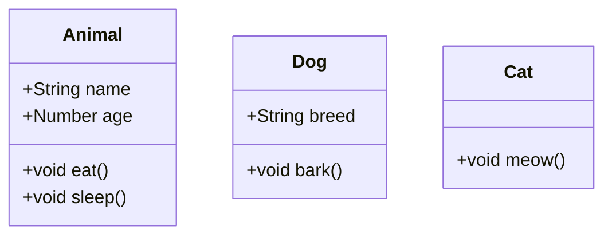

### 关系：

| 语法      | 类型     | 说明             |
| --------- | -------- | ---------------- |
| `A --|> B` | 继承     | B是A的父类       |
| `A --* B`  | 组合     | A包含B (实心菱形) |
| `A --o B`  | 聚合     | A拥有B (空心菱形) |
| `A --> B`  | 关联     | A指向B           |
| `A ..> B`  | 依赖     | A依赖B (虚线箭头) |
| `A -- B`   | 简单连接 | 无方向           |

### 基数 (Cardinality)：

| 示例语法                     | 说明                                   |
| ---------------------------- | -------------------------------------- |
| `A "1" -- "0..*" B : 包含`   | 定义A和B之间的关系，并标注基数和关系标签 |

### 示例：

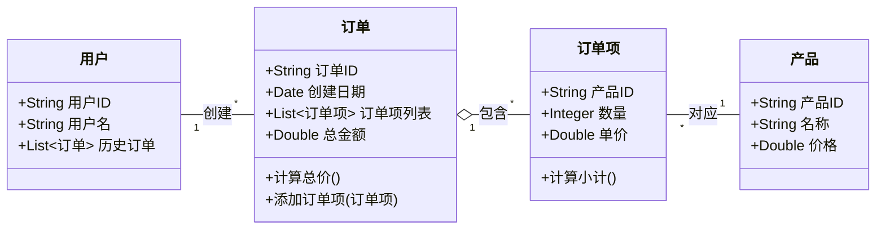

## 5. 状态图 (State Diagram) - 基础

状态图描述对象可能存在的状态以及状态之间的转换。

### 状态：

| 语法                       | 说明             |
| -------------------------- | ---------------- |
| `[*]`                      | 起始或结束状态     |
| `stateName`                | 定义一个简单状态   |
| `state "描述" as longName` | 定义带描述和别名的状态 |

### 转换：

| 语法                  | 说明                     |
| --------------------- | ------------------------ |
| `S1 --> S2 : 事件/动作` | 定义从状态S1到S2的转换，可带标签 |

### 复合状态：

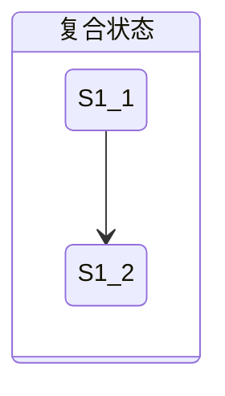

### 示例：

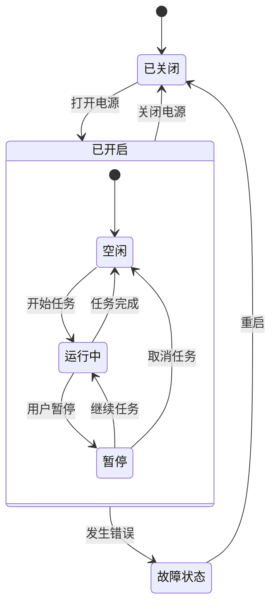

## 6. 饼图 (Pie Chart)

饼图显示各部分占整体的比例。

### 语法：

| 语法                  | 说明           |
| --------------------- | -------------- |
| `pie title "图表标题"` | 设置饼图的标题   |
| `"标签1" : 数值1`     | 定义一个扇区及其值 |
| `"标签2" : 数值2`     | 定义另一个扇区及其值 |

### 示例：

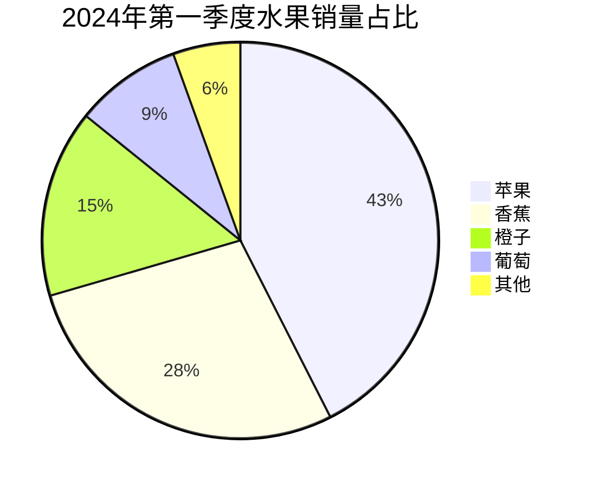

## 7. 实体关系图 (ER Diagram) - 基础

ER图用于数据库设计，显示实体及其关系。

### 实体：

| 语法                                         | 说明         |
| -------------------------------------------- | ------------ |
| `ENTITY_NAME { primaryKey type "comment" ... }` | 定义一个实体及其属性 |

### 关系：

| 语法                             | 类型   | 说明                 |
| -------------------------------- | ------ | -------------------- |
| `ENTITY1 ||--o{ ENTITY2 : "label"` | 一对多 | ENTITY2是多的一方    |
| `ENTITY1 ||--|| ENTITY2 : "label"` | 一对一 |                      |
| `ENTITY1 }o--o{ ENTITY2 : "label"` | 多对多 |                      |

### 属性 (在实体定义内部)：

| 语法                | 说明                         |
| ------------------- | ---------------------------- |
| `type name "comment"` | 定义属性的类型、名称和可选注释 |

### 示例：

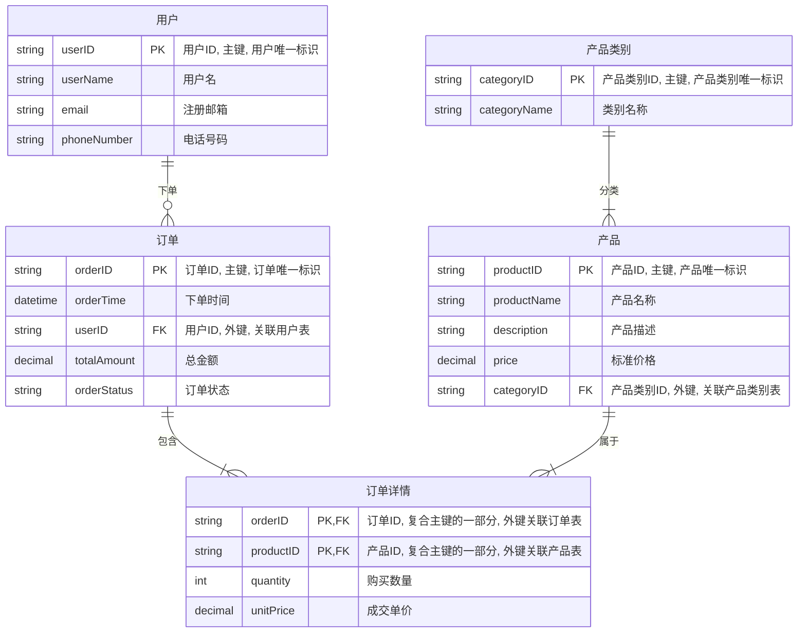
