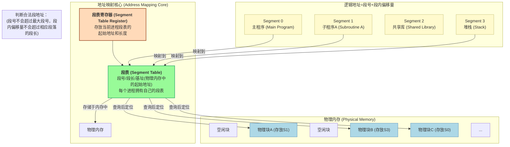
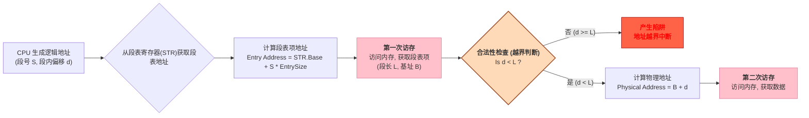

# 操作系统核心概念：段式存储管理 (Segmented Storage Management)

这份笔记基于课程字幕，系统性地梳理了段式存储管理的核心概念。与页式存储的“物理视角”不同，段式存储从“逻辑视角”出发，按照程序的自身逻辑功能（如主程序、子程序、数据段、堆栈段等）来划分内存，这使得内存管理更符合程序员的思维方式，也更便于实现信息的共享和保护。

---

## 1. 段式存储基本原理

段式存储的核心思想是 **“按需分段，逻辑独立”**。它将程序的逻辑地址空间划分为若干个大小不一的 **段 (Segment)**，每个段都是一个逻辑上完整的单位。

**关键概念:**
- **段 (Segment)**: 程序的逻辑地址空间按功能的集合，如代码段、数据段等。每个段的长度是可变的。
- **地址结构 (二维)**: 
  - **逻辑地址** = `段号 (Segment Number)` + `段内偏移 (Segment Offset)`
- **段表 (Segment Table)**: 每个条目记录了一个段的两个关键信息：
  1.  **段长 (Segment Length)**: 该段的大小。
  2.  **基址 (Base Address)**: 该段在物理内存中的起始地址。

---

## 2. 地址转换与越界保护

段式存储的地址转换过程比页式多了一个关键步骤：**合法性检查**，即判断访问是否越界。这是其保护机制的核心。

这个流程清晰地展示了段式存储的保护机制：任何试图访问超出本段范围的地址都会被硬件立即捕获，从而有效隔离了不同逻辑段，提高了系统的安全性。

---

## 3. 段式 vs. 页式存储对比

| 特性 | 段式存储 (Segmentation) | 页式存储 (Paging) |
| :--- | :--- | :--- |
| **划分单位** | 程序的 **逻辑** 功能模块 | 内存的 **物理** 块 |
| **大小** | **可变长** | **固定大小** |
| **地址空间** | **二维** (段号, 段内偏移) | **一维** (逻辑地址被视为线性) |
| **碎片** | 存在 **外部碎片** (难以利用的小空闲块) | 存在 **内部碎片** (最后一页用不满) |
| **共享与保护** | **方便**，以逻辑单位进行，更精准 | **不直观**，需映射到同一页框 |
| **程序员视角** | **可见**，段的划分对程序员有意义 | **透明**，程序员无需关心分页过程 |

---

## 4. 典型计算题解析

本题旨在考察对段式地址转换中 **合法性检查** 的理解。

$$
\begin{array}{l}
\textbf{题目与解析} \\
\hline \\
\begin{array}{l}
\text{某系统采用段式存储，段表内容如下所示。在给出的四个逻辑地址中，} \\
\text{哪些是合法的，可以成功转换为物理地址？} \\
\\ 
\textbf{已知段表 (Segment Table):} \\
\begin{array}{|c|c|c|}
\hline
\textbf{段号 (S)} & \textbf{段长 (Length)} & \textbf{基址 (Base)} \\
\hline
0 & 600 & 1400 \\
1 & 50 & 6300 \\
2 & 100 & 4300 \\
3 & 2988 & 3200 \\
4 & 960 & 4700 \\
\hline
\end{array}
\\ \\
\textbf{待检查的逻辑地址 (段号, 段内偏移):} \\
\text{A. (0, 601)} \quad \text{B. (1, 30)} \quad \text{C. (0, 700)} \quad \text{D. (4, 960)}
\end{array}
\\ \hline \\
\textbf{解题分析 (核心：段内偏移必须严格小于段长):} \\
\begin{array}{|c|c|c|l|}
\hline
\textbf{选项} & \textbf{逻辑地址 (S, d)} & \textbf{合法性检查 (d < Length?)} & \textbf{分析过程与结论} \\
\hline
\text{A} & (0, 601) & 601 \not< 600 & \begin{array}{l} \text{访问段 0，段长为 600。段内偏移 601 超出范围。} \\ \textbf{地址非法，越界。} \end{array} \\
\hline
\text{B} & (1, 30) & 30 < 50 & \begin{array}{l} \text{访问段 1，段长为 50。段内偏移 30 在范围内。} \\ \textbf{地址合法。} \end{array} \\
\hline
\text{C} & (0, 700) & 700 \not< 600 & \begin{array}{l} \text{访问段 0，段长为 600。段内偏移 700 超出范围。} \\ \textbf{地址非法，越界。} \end{array} \\
\hline
\text{D} & (4, 960) & 960 \not< 960 & \begin{array}{l} \text{访问段 4，段长为 960。段内偏移 960 等于段长，} \\ \text{已超出合法索引范围 [0, 959]。} \\ \textbf{地址非法，越界。} \end{array} \\
\hline
\end{array}
\\ \hline \\
\textbf{最终结论:} \\
\text{只有选项 B 的逻辑地址 (1, 30) 是合法的，可以成功转换为物理地址。}
\end{array}
$$

---

$$
\begin{array}{l}
\textbf{例题讲解 II} \\
\hline \\
\begin{array}{l}
\text{设某进程的段表如下所示，逻辑地址 } \underline{\hspace{1cm}} \text{ 可以转换为对应的物理地址。} \\\\
\textbf{已知段表 (Segment Table):} \\
\begin{array}{|c|c|c|}
\hline
\textbf{段号 (S)} & \textbf{基地址 (Base)} & \textbf{段长 (Length)} \\
\hline
0 & 1598 & 600 \\
1 & 486 & 50 \\
2 & 90 & 100 \\
3 & 1327 & 2988 \\
4 & 1952 & 960 \\
\hline
\end{array}
\\ \\
\textbf{选项:} \\
\text{A. (0, 1597)、(1, 30) 和 (3, 1390)} \\
\text{B. (0, 128)、(1, 30) 和 (3, 1390)} \\
\text{C. (0, 1597)、(2, 98) 和 (3, 1390)} \\
\text{D. (0, 128)、(2, 98) 和 (4, 1066)}
\end{array}
\\ \hline \\
\textbf{解题分析 (核心：段内偏移 d < 段长 L):} \\
\begin{array}{|c|c|c|l|}
\hline
\textbf{选项} & \textbf{待检查地址 (S, d)} & \textbf{检查 (d < L?)} & \textbf{分析与结论} \\
\hline
\text{A} & (0, 1597) & 1597 \not< 600 & \text{段 0 段长为 600，偏移 1597 越界。选项 A 错误。} \\
\hline
\text{B} & \begin{array}{l} (0, 128) \\ (1, 30) \\ (3, 1390) \end{array} & \begin{array}{l} 128 < 600 \\ 30 < 50 \\ 1390 < 2988 \end{array} & \begin{array}{l} \text{地址(0, 128)合法。} \\ \text{地址(1, 30)合法。} \\ \text{地址(3, 1390)合法。} \\ \textbf{选项 B 全部合法。} \end{array} \\
\hline
\text{C} & (0, 1597) & 1597 \not< 600 & \text{段 0 段长为 600，偏移 1597 越界。选项 C 错误。} \\
\hline
\text{D} & (4, 1066) & 1066 \not< 960 & \text{段 4 段长为 960，偏移 1066 越界。选项 D 错误。} \\
\hline
\end{array}
\\ \hline \\
\textbf{最终结论:} \\
\text{选项 B 中的所有逻辑地址均合法，可以成功转换为物理地址。}
\end{array}
$$
