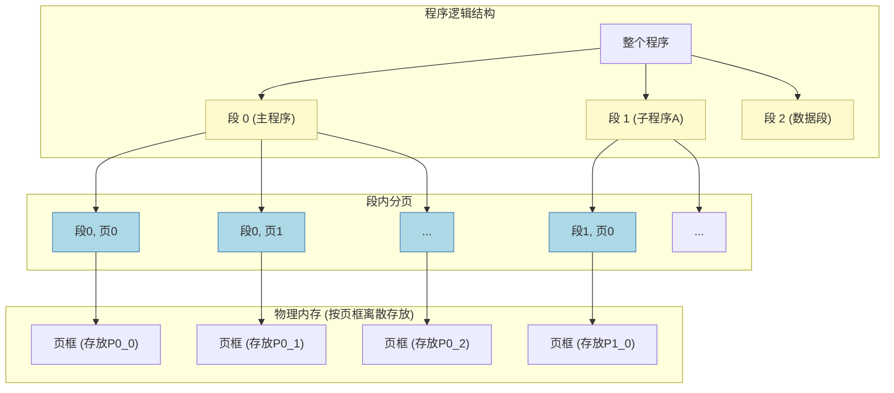
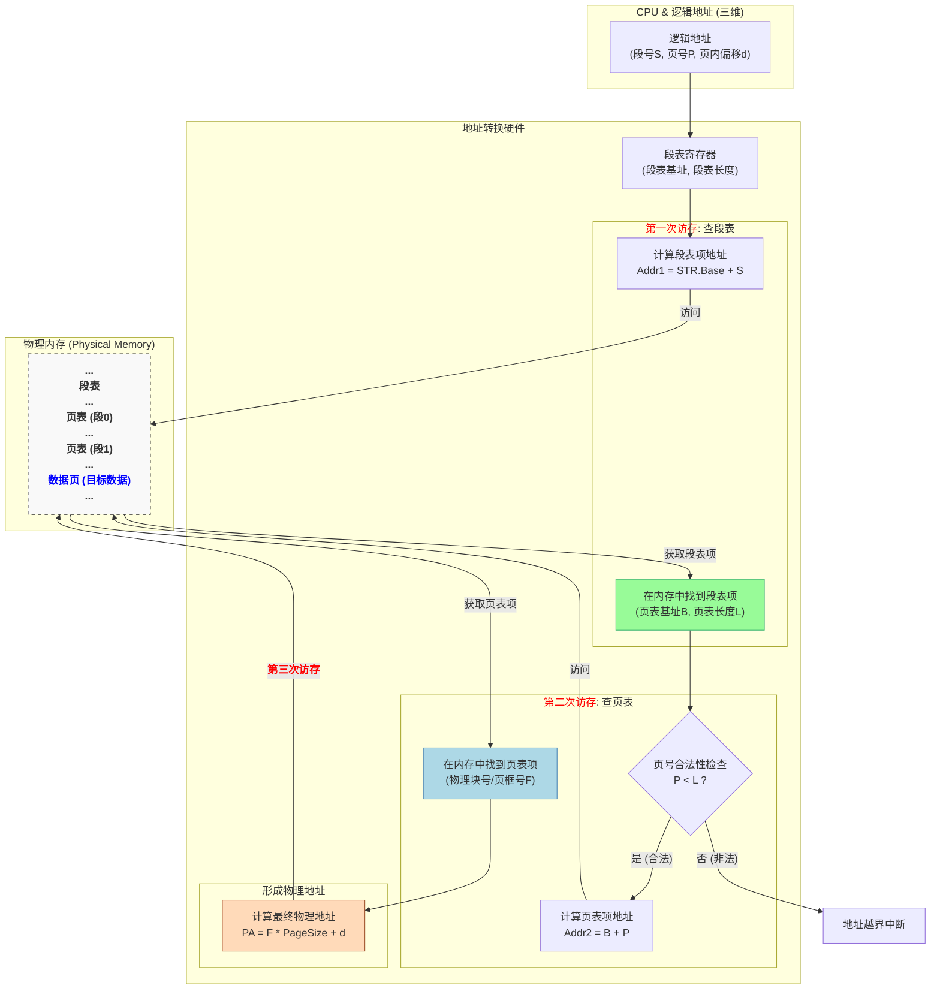

# 操作系统核心概念：段页式存储管理 (Segmented Paged Storage)

段页式存储管理是 **段式存储** 和 **页式存储** 的结合体，旨在吸收两者的优点，克服它们的缺点。它既实现了按逻辑模块划分的灵活性和保护性，又通过分页解决了外部碎片问题，提高了内存利用率。

---

## 1. 核心思想：先分段，再分页

段页式管理的基本思路非常直观：

1.  **先分段**：将整个程序按照逻辑功能（如主程序、子程序、数据段等）划分成若干个 **段 (Segment)**。
2.  **再分页**：将每个段的内部，再进一步划分成若干个大小固定的 **页 (Page)**。

这样，内存的分配和管理单位是 **页**，但逻辑上的组织和保护单位是 **段**。

---

## 2. 地址结构与转换

段页式存储的逻辑地址是 **三维** 的，地址转换过程也相应地更为复杂，需要查询两级表：段表和页表。

-   **逻辑地址** = `段号 (S)` + `页号 (P)` + `页内偏移 (d)`

地址转换的核心是 **三次访存**，这也是段页式区别于段式（两次）和页式（两次，不考虑快表）的关键特征。

---

## 3. 三种存储管理方式对比

为了更清晰地理解三者的区别与联系，下表从多个维度进行了综合对比：

| 特性 | 页式存储 (Paging) | 段式存储 (Segmentation) | 段页式存储 (Segmented Paging) |
| :--- | :--- | :--- | :--- |
| **划分单位** | 物理块 (大小固定) | 逻辑段 (功能独立) | 逻辑段 + 物理块 |
| **大小** | **固定** | **可变** | 段可变，页固定 |
| **地址空间** | **一维** (线性地址) | **二维** (段号, 段内偏移) | **三维** (段号, 页号, 页内偏移) |
| **内存碎片** | **内部碎片** | **外部碎片** | **内部碎片** (最后一页) |
| **共享与保护** | 不直观，较难实现 | **方便**，以逻辑单位进行 | **方便**，以逻辑单位进行 |
| **访存次数** | **2次** (无快表) | **2次** (无快表) | **3次** (无快表) |
| **核心目的** | 提高内存利用率 | 满足程序逻辑需求 | 兼顾二者，取长补短 |

---

## 4. 典型计算题解析

本题旨在考察对段页式 **地址结构** 的分析能力。

$$
\begin{array}{l}
\textbf{题目与解析} \\
\hline \\
\begin{array}{l}
\text{假设某段页式存储系统的逻辑地址结构如下图所示，那么关于该系统的描述，正确的是？} \\\\
\textbf{逻辑地址结构:} \\
\begin{array}{|c|c|c|}
\hline
\text{段号 (8位)} & \text{页号 (11位)} & \text{页内偏移 (13位)} \\
\hline
\end{array}
\end{array}
\\ \hline \\
\textbf{解题分析:} \\
\begin{array}{|c|c|l|}
\hline
\textbf{分析项} & \textbf{计算过程} & \textbf{结论} \\
\hline
\text{页面大小} & 2^{13} \text{ B} & \begin{array}{l} \text{页内偏移占 13 位，因此页面大小是 } 2^{13} \text{ 字节。} \\ 2^{13} = 8192 \text{ B} = 8 \text{ KB。} \\ \textbf{页面大小是固定的 8 KB。} \end{array} \\
\hline
\text{每段最大页数} & 2^{11} & \begin{array}{l} \text{页号占 11 位，因此每个段最多可以包含 } 2^{11} \text{ 个页面。} \\ 2^{11} = 2048 \text{ 个页。} \\ \textbf{每个段最多允许有 2048 个页。} \end{array} \\
\hline
\text{最大段数} & 2^8 & \begin{array}{l} \text{段号占 8 位，因此整个系统最多可以拥有 } 2^8 \text{ 个段。} \\ 2^8 = 256 \text{ 个段。} \\ \textbf{系统最多允许有 256 个段。} \end{array} \\
\hline
\text{段的大小} & \text{不固定} & \begin{array}{l} \text{段的大小由其包含的页数决定，是可变的。} \\ \text{一个段可以有 1 页，也可以有 2048 页。} \\ \textbf{段的大小不是固定的。} \end{array} \\
\hline
\end{array}
\\ \hline \\
\textbf{最终结论:} \\
\text{该系统中，页面大小固定为 8KB，每个段最多包含 2048 个页，系统最多有 256 个段。}
\end{array}
$$

---

$$
\begin{array}{l}
\textbf{例题讲解 II} \\
\hline \\
\begin{array}{l}
\text{假设段页式存储管理系统中的地址结构如下图所示，则系统 ( )。} \\\\
\textbf{逻辑地址结构 (32位):} \\
\begin{array}{|c|c|c|}
\hline
\text{31..24} & \text{23..13} & \text{12..0} \\
\hline
\text{段号 (8位)} & \text{页号 (11位)} & \text{页内地址 (13位)} \\
\hline
\end{array} \\\\
\textbf{选项:} \\
\text{A. 最多可有256个段，每个段的大小均为2048个页，页的大小为8K} \\
\text{B. 最多可有256个段，每个段最大允许有2048个页，页的大小为8K} \\
\text{C. 最多可有512个段，每个段的大小均为1024个页，页的大小为4K} \\
\text{D. 最多可有512个段，每个段最大允许有1024个页，页的大小为4K}
\end{array}
\\ \hline \\
\textbf{解题分析:} \\
\begin{array}{|c|c|l|}
\hline
\textbf{分析项} & \textbf{计算过程} & \textbf{结论与辨析} \\
\hline
\text{最大段数} & 2^8 = 256 & \begin{array}{l} \text{段号占 8 位，所以系统最多支持 } 2^8 = 256 \text{ 个段。} \\ \text{立即排除选项 C 和 D。} \end{array} \\
\hline
\text{页大小} & 2^{13} \text{ B} = 8 \text{ KB} & \begin{array}{l} \text{页内地址占 13 位，所以页大小为 } 2^{13} = 8192 \text{ 字节，即 8KB。} \\ \text{再次确认选项 C 和 D 错误。} \end{array} \\
\hline
\text{每段最大页数} & 2^{11} = 2048 & \begin{array}{l} \text{页号占 11 位，所以每个段最多可以映射到 } 2^{11} = 2048 \text{ 个页。} \\ \text{这是“最大允许”的数量，而非“固定”大小。} \end{array} \\
\hline
\text{选项辨析} & \text{A vs. B} & \begin{array}{l} \text{A选项说“大小均为”，这是错误的。段是逻辑单位，大小可变，} \\ \text{不一定用满所有可分配的页。} \\ \text{B选项说“最大允许有”，这准确描述了地址空间的上限。} \\ \textbf{因此，选项 B 正确。} \end{array} \\
\hline
\end{array}
\\ \hline \\
\textbf{最终结论:} \\
\text{选项 B 是唯一完全正确的描述。}
\end{array}
$$
