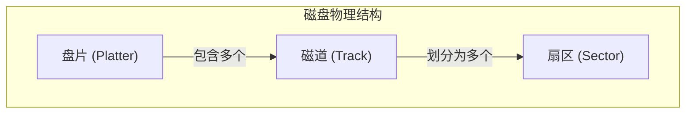
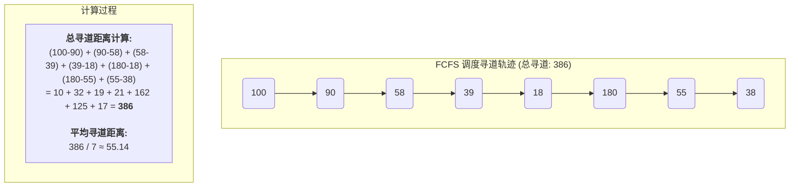
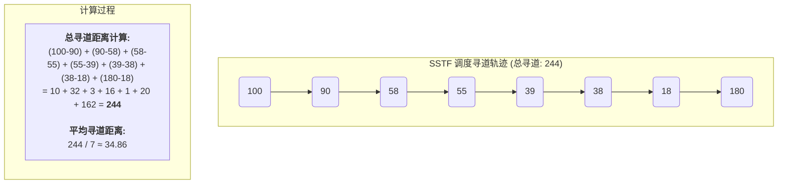
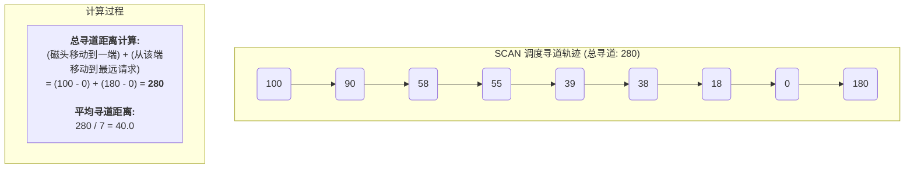
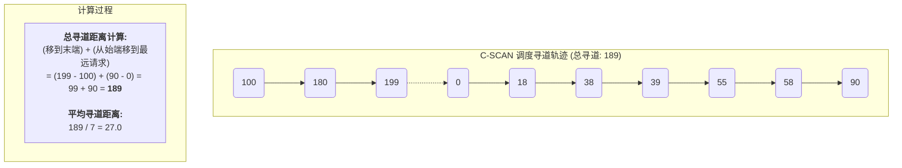

# 操作系统核心概念：磁盘管理 (Disk Management)

磁盘管理是操作系统中连接内存与持久化存储的关键环节。它主要关注如何高效地组织和访问外存设备（如硬盘），其核心性能指标是 **磁盘I/O时间**。理解磁盘读写时间的构成，是掌握磁盘调度算法和文件系统实现的基础。

---

## 1. 磁盘读写时间构成

一次磁盘读/写操作的总时间 (T_total) 主要由三个部分组成：

-   **寻道时间 (T_seek)**: 磁头从当前位置移动到目标磁道所需的时间。这是机械运动，通常是总时间中最耗时的部分。
-   **旋转延迟 (T_latency)**: 等待目标扇区旋转到磁头正下方所需的时间。
-   **传输时间 (T_transfer)**: 将数据从磁盘扇区传输到内存所需的时间。

---

## 2. 典型计算题解析

本题旨在考察对磁盘I/O时间三个核心组成部分的计算能力。

$$
\begin{array}{l}
\textbf{题目与解析} \\
\hline \\
\begin{array}{l}
\text{读取磁盘数据的时间应包括以下三个部分：} \\
\text{(1) 找磁道的时间 (寻道时间)} \\
\text{(2) 找块(扇区)的时间，即旋转延迟时间} \\
\text{(3) 传输时间} \\\\
\text{某磁盘磁头从一个磁道移至另一个磁道需要10ms。文件在磁盘上非连续存放，} \\
\text{逻辑上相邻数据块的平均移动距离为10个磁道，每块的旋转延迟时间及传输时间} \\
\text{分别为100ms和2ms，则读取一个100块的文件需要 } \underline{\hspace{1cm}} \text{ ms时间。} \\\\
\text{A. 10200} \quad \text{B. 11000} \quad \text{C. 11200} \quad \text{D. 20200}
\end{array}
\\
\textbf{解题分析:} \\
\begin{array}{|c|c|l|}
\hline
\textbf{分析项} & \textbf{计算过程} & \textbf{结论与辨析} \\
\hline
\text{读取单个块的时间} & T_{block} = T_{seek} + T_{latency} + T_{transfer} & \begin{array}{l} \text{由于文件非连续存放，读取每一块都需要一次完整} \\ \text{的寻道、旋转和传输过程。} \end{array} \\
\hline
\text{平均寻道时间} & 10 \text{ (磁道)} \times 10 \text{ (ms/磁道)} = 100 \text{ ms} & \begin{array}{l} \text{逻辑上相邻块的平均移动距离是10个磁道，} \\ \text{因此每次寻道的平均时间是 100ms。} \end{array} \\
\hline
\text{旋转延迟时间} & 100 \text{ ms} & \text{题目已知，每块的旋转延迟时间为 100ms。} \\
\hline
\text{传输时间} & 2 \text{ ms} & \text{题目已知，每块的传输时间为 2ms。} \\
\hline
\text{总时间} & \begin{array}{l} T_{total} = \text{块数} \times T_{block} \\ = 100 \times (100 + 100 + 2) \\ = 100 \times 202 \\ = 20200 \text{ ms} \end{array} & \begin{array}{l} \text{将读取单块所需的各项时间相加，再乘以总块数100，} \\ \text{得到总读取时间。} \\ \textbf{因此，选项 D 正确。} \end{array} \\
\hline
\end{array}
\\
\textbf{最终结论:} \\
\text{读取一个100块的非连续文件需要 20200 ms。}
\end{array}
$$

---

## 3. 磁盘调度算法 (Disk Scheduling Algorithms)

当多个进程同时请求访问磁盘时，会产生一个磁盘I/O请求队列。磁盘调度算法的核心目标是 **合理安排队列中请求的执行顺序**，以缩短平均寻道时间，从而提高磁盘的整体访问性能。

**场景设定**：假设当前磁头在 **100** 号磁道，请求队列中的磁道号依次为：`90, 58, 39, 18, 180, 55, 38`。磁盘磁道范围为 0-199。

### 3.1. 先来先服务 (First-Come, First-Served, FCFS)

-   **定义**：按请求到达的先后顺序进行处理，是最简单的调度算法。
-   **优点**：公平，所有请求都会被响应。
-   **缺点**：效率低下，未对寻道进行优化，可能导致磁头在磁盘上大幅度来回移动。

### 3.2. 最短寻道时间优先 (Shortest Seek Time First, SSTF)

-   **定义**：优先处理与当前磁头位置最近的请求。
-   **优点**：性能比FCFS好，显著减少了平均寻道时间。
-   **缺点**：可能导致 **饥饿 (Starvation)** 现象，即某些远离磁头的请求可能长时间得不到服务。

#### 典型计算题：SSTF

$$
\begin{array}{l}
\textbf{例题讲解} \\
\hline \\
\begin{array}{l}
\text{假设磁盘臂位于15号柱面上，进程的请求序列如下表表示，如果采用} \\
\text{最短移臂调度算法 (SSTF)，那么系统的响应序列应为 ( B )。} \\
\end{array}
\\
\begin{array}{|c|c|c|c|}
\hline
\textbf{请求序列} & \textbf{柱面号} & \textbf{磁头号} & \textbf{扇区号} \\
\hline
\text{①} & 12 & 8 & 9 \\
\hline
\text{②} & 19 & 6 & 5 \\
\hline
\text{③} & 23 & 9 & 6 \\
\hline
\text{④} & 19 & 10 & 5 \\
\hline
\text{⑤} & 12 & 8 & 4 \\
\hline
\text{⑥} & 28 & 3 & 10 \\
\hline
\end{array}
\\
\begin{array}{ll}
\text{A. ①②③④⑤⑥} & \text{B. ⑤①②④③⑥} \\
\text{C. ②③④⑤①⑥} & \text{D. ④②③⑤①⑥} \\
\end{array}
\\
\textbf{解题分析 (SSTF 算法):} \\
\begin{array}{|c|c|c|c|l|}
\hline
\textbf{步骤} & \textbf{当前磁头位置} & \textbf{待处理请求 (柱面号)} & \textbf{计算与决策} & \textbf{服务序列} \\
\hline
\text{Start} & 15 & \text{\{①(12), ②(19), ③(23), ④(19), ⑤(12), ⑥(28)\}} & \text{初始位置在 15。} & \text{} \\
\hline
1 & 15 & \text{\{12, 19, 23, 28\}} & \begin{array}{l} \text{计算与各柱面距离：} \\ |15-12|=3 \\ |15-19|=4 \\ |15-23|=8 \\ |15-28|=13 \\ \text{选择最近的 12 号柱面。} \end{array} & \text{} \\
\hline
2 & 12 & \text{\{②(19), ③(23), ④(19), ⑥(28)\}} & \begin{array}{l} \text{处理 12 号柱面的所有请求：⑤, ①。} \\ \text{计算与剩余请求距离：} \\ |12-19|=7 \\ |12-23|=11 \\ |12-28|=16 \\ \text{选择最近的 19 号柱面。} \end{array} & \text{⑤, ①} \\
\hline
3 & 19 & \text{\{③(23), ⑥(28)\}} & \begin{array}{l} \text{处理 19 号柱面的所有请求：②, ④。} \\ \text{计算与剩余请求距离：} \\ |19-23|=4 \\ |19-28|=9 \\ \text{选择最近的 23 号柱面。} \end{array} & \text{⑤, ①, ②, ④} \\
\hline
4 & 23 & \text{\{⑥(28)\}} & \begin{array}{l} \text{处理 23 号柱面的请求：③。} \\ \text{计算与剩余请求距离：} \\ |23-28|=5 \\ \text{选择唯一的 28 号柱面。} \end{array} & \text{⑤, ①, ②, ④, ③} \\
\hline
5 & 28 & \text{\{\}} & \text{处理 28 号柱面的请求：⑥。} & \text{⑤, ①, ②, ④, ③, ⑥} \\
\hline
\end{array}
\\
\textbf{最终结论:} \text{ 响应序列为 ⑤①②④③⑥，选择 B。}
\end{array}
$$

### 3.3. 扫描算法 (SCAN / 电梯算法)

-   **定义**：磁头在一个方向上移动（例如，从磁道号小到大），处理所有沿途的请求，直到到达磁盘末端（如199号磁道），然后立即反向移动，处理返回途中的所有请求。这个过程就像电梯，先满足一个方向上的所有楼层请求，再反向。
-   **优点**：克服了SSTF的饥饿问题，对各个位置的请求响应时间比较平均。
-   **缺点**：对两端的磁道请求不公平。例如，当磁头刚从0号磁道移开，一个新的对0号磁道的请求就必须等待磁头移动到最外侧再折返才能被服务。

**假设磁头初始移动方向为磁道号减小的方向：**

### 3.4. 循环扫描算法 (Circular SCAN, C-SCAN)

-   **定义**：SCAN算法的变种。磁头只在一个方向上处理请求（例如，从内到外），到达磁盘末端后，立即 **跳跃** 回到起始端，而不处理返回途中的任何请求，然后再次开始单向扫描。
-   **优点**：相比SCAN，C-SCAN为所有请求提供了更公平的等待时间，因为它总是从同一个方向开始。

**假设磁头初始移动方向为磁道号增大的方向：**

