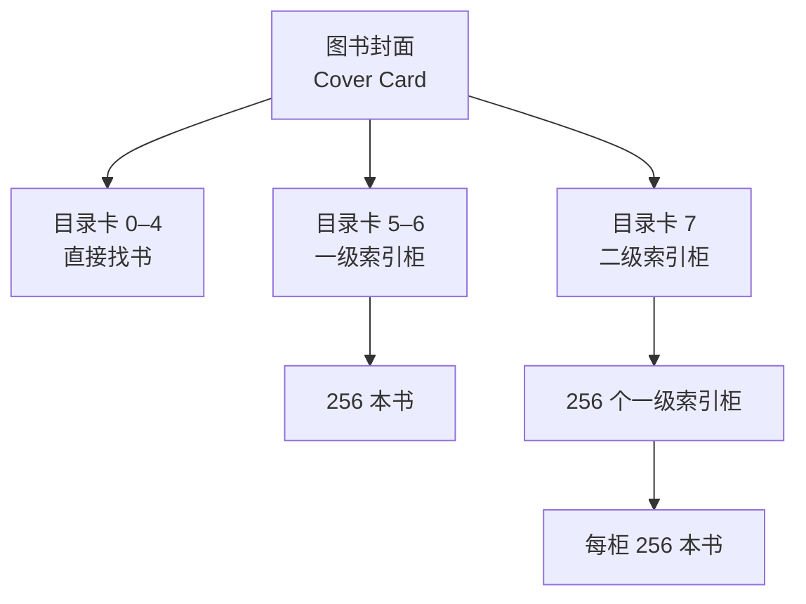

# 2.9.5 索引文件（Indexed Allocation）

> 本笔记基于课程字幕 *2.9.5. 索引文件* 整理，独立成篇。遵循统一结构：概念 → 形象化比喻 → 核心考点 → 典型计算题。

---

## 1. 核心概念（What & Why）

* 将大文件切分为 **1 KB 物理块**；索引节点（inode）记录这些块号，实现 **随机存取**。
* inode 结构：8 个 4 B 地址项 `iaddr[0]~iaddr[7]`  
  * `iaddr[0]~[4]`：直接块地址  
  * `iaddr[5]~[6]`：一级间接块地址  
  * `iaddr[7]`：二级间接块地址
* 设计目标：
  1. 兼顾**小文件效率**（直接访问少量块）。
  2. 满足**大文件需求**（多级间接扩展寻址）。

---

## 2. 形象化比喻（Analogy）

将 inode 想象成 **多层图书索引卡**：



* **直接地址**好比封面直接写了 5 本书的架号。
* **一级间接**如同打开抽屉拿索引卡，再找到 256 本书。
* **二级间接**则是大图书馆：先找 256 个抽屉，每个抽屉里再有 256 张卡。

---

## 3. 考点速览

| 考点 | 说明 |
| --- | --- |
| 块大小与地址项 | 物理/索引块 = 1 KB；地址项 = 4 B；1 KB 块可存 **256** 地址项 |
| 最大文件长度 | `5 + 2×256 + 256×256 = 66053` 块 → **66 053 KB** |
| 块号定位 | 判断落在哪个区间：0‒4 直接；5‒260 一级 1；261‒516 一级 2；>516 进入二级 |
| 计算套路 | 明确“项”=地址指针数，用块数×块大小 |

---## 4. 典型计算题 1：逻辑块定位

```latex
$$
\begin{array}{l}
\textbf{题干} \\
\hline \\
\text{块大小 1 KB，每 inode 8 个地址项：0‒4 直接、5‒6 一级、7 二级。}\\
\text{问：逻辑块号 445 应采用何种访问方式？}\\
\\
\textbf{解法} \\
\begin{array}{|c|c|l|}
\hline
\text{区段} & \text{块号范围} & \text{说明} \\
\hline
\text{直接} & 0‒4 & 5 个块 \\
\hline
\text{一级 1} & 5‒260 & 256 块 \\
\hline
\text{一级 2} & 261‒516 & 256 块 \\
\hline
\text{二级} & 517‒66052 & 65536 块 \\
\hline
\end{array} \\
\\
445 \in [261,516] \Rightarrow \textbf{一级间接地址访问}。
\end{array}
$$
```

---

## 5. 典型计算题 2：最大文件长度

```latex
$$
\begin{array}{l}
\textbf{题干} \\
\hline \\
\text{同上结构，求单文件最大长度。}\\
\\
\textbf{计算} \\
5 + 2\times256 + 256\times256 = 66053 \text{ 块} \\
66053 \times 1 \text{ KB} = 66053 \text{ KB}
\end{array}
$$
```

---

## 6. 记忆场景

> 把 inode 当作「文件的大脑」：前 5 条**短期记忆**直接给出数据，接下来 2 条**中期记忆**指向笔记本（一级索引），最后 1 条**长期记忆**指向图书馆（二级索引）。

---

**关键词**：索引节点 (inode)、直接地址 (Direct Block)、一级间接 (Single Indirect)、二级间接 (Double Indirect)、块 (Block)、指针项 (Entry)
