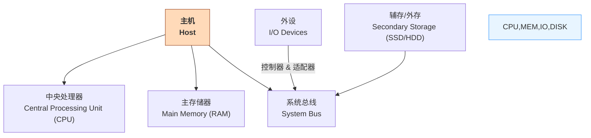
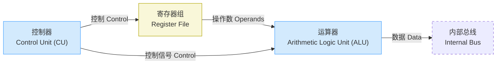
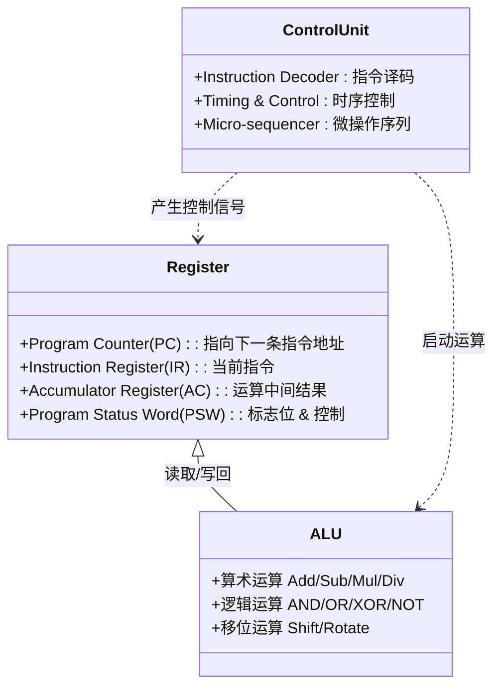

# CPU 组成 CPU Components

> 来源：网课《计算机组成与体系结构 1.3 CPU 组成（运算器与控制器）》字幕整理

## 1️⃣ 计算机整体结构速览 | Computer Architecture Overview

---

## 2️⃣ CPU 内部高层划分 | High-level Division

---

## 3️⃣ 关键子部件 | Key Sub-components

---

## 4️⃣ 核心寄存器功能速查 | Core Registers Cheat-Sheet
| 寄存器 | 英文全称 (缩写) | 功能说明 |
|---------|---------------|---------|
| 程序计数器 | Program Counter (PC) | 存放下一条将要执行指令的地址 |
| 指令寄存器 | Instruction Register (IR) | 存放当前正在执行的指令 |
| 累加寄存器 | Accumulator Register (AC) | 暂存操作数及中间结果，为 ALU 提供工作区 |
| 程序状态字寄存器 | Program Status Word (PSW) | 存放运算产生的状态标志 & 控制标志 |

---

## 5️⃣ 考试高频考点 | Exam Focus
1. **寄存器功能配对题**：记忆上表关键作用。
2. **总线类型判断**：数据 / 地址 / 控制 三线并行传输。
3. **ALU 运算类别**：算术 vs 逻辑 vs 移位；注意标志位影响。
4. **控制器工作流程**：`取指→译码→执行` 时序，与流水线阶段衔接。

---

## 6️⃣ 形象化记忆 | Visualization
> 把 **CPU** 想象成<strong>公司</strong>：
> - **ALU = 生产部门**，负责“加工”数据产品；
> - **寄存器组 = 仓库**，短期存放原料和半成品；
> - **控制器 = 调度中心**，根据“生产计划”（指令）下达各类调度指令；
> - **总线 = 传送带**，负责各部门之间物料流转。

---

### 参考 / Reference
- 《计算机组成原理》华中科技大学版
- 软考历年上午题 CPU 结构相关

---

> **文件创建说明**：本笔记为独立 Markdown 文件，适配“图表优先、双语术语、信息聚合”格式，可直接加入软考知识库。
