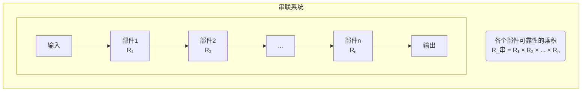
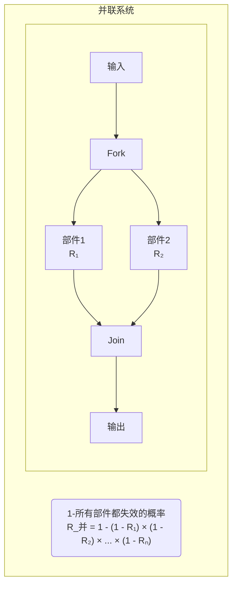
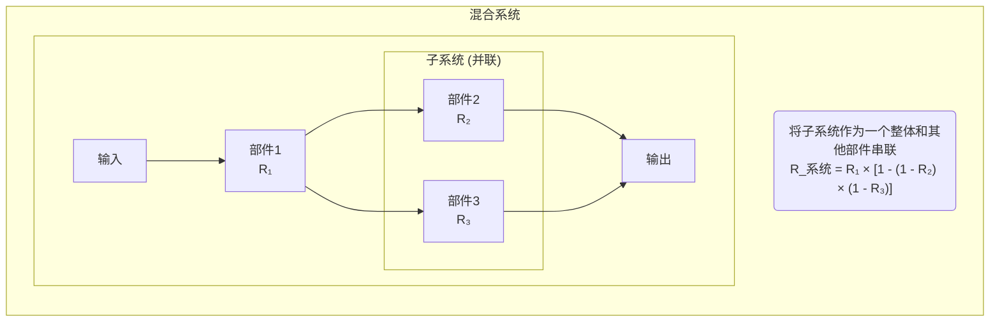

# 网课笔记 - 系统可靠性 (System Reliability)

根据您提供的课程字幕，我为您整理了关于计算机系统可靠性的结构化学习笔记。

## 1. 可靠性基本指标 (Basic Reliability Metrics)

可靠性是衡量一个系统在规定时间内、在规定条件下无故障地执行其功能的概率。在实际工程中，我们通常用以下几个关键指标来量化它。

### 1.1 核心概念

```mermaid
timeline
    title 系统运行状态时间轴
    section 第一次故障前
        : 正常运行 (MTTF₁)
    section 第一次故障
        : 故障修复 (MTTR₁)
    section 第二次故障前
        : 正常运行 (MTTF₂)
    section 第二次故障
        : 故障修复 (MTTR₂)
    section ...
        : ...
```

-   **平均无故障时间 (MTTF - Mean Time To Failure)**: 系统从开始正常运行到下一次发生故障之间的平均时间。MTTF 越长，系统越可靠。
-   **平均故障修复时间 (MTTR - Mean Time To Repair)**: 系统从发生故障到修复完成、恢复正常运行所需的平均时间。MTTR 越短，系统可维护性越好。
-   **平均故障间隔时间 (MTBF - Mean Time Between Failures)**: 指系统两次相邻故障之间的平均时间。它是衡量一个产品（尤其是机械产品）的可靠性指标。

### 1.2 重要计算公式

1.  **平均故障间隔时间 (MTBF)**
    > MTBF = MTTF + MTTR

2.  **系统可用性 (Availability)**
    系统在总时间内处于正常工作状态的时间比例。
    > 可用性 (A) = MTTF / MTBF = MTTF / (MTTF + MTTR) × 100%

## 2. 系统可靠性计算

计算机系统通常由多个部件（子系统）构成，其整体可靠性取决于这些部件的可靠性及其组织结构。
### 2.1 串联系统 (Series System)

在串联系统中，所有部件必须同时正常工作，系统才能正常工作。任何一个部件失效，整个系统都会失效。

> **场景比喻**: 就像一串节日彩灯，只要其中一个灯泡坏了（部件失效），整串灯就都不亮了（系统失效）。



-   **可靠性 (R)**: 各个部件可靠性的乘积。
    
    > R_串 = R₁ × R₂ × ... × Rₙ
-   **失效率 (λ)**: 各个部件失效率之和。
    > λ_串 = λ₁ + λ₂ + ... + λₙ

### 2.2 并联系统 (Parallel System)

在并联系统中，只要有一个部件正常工作，整个系统就能正常工作。只有当所有部件都失效时，系统才会失效。

> **场景比喻**: 就像飞机的多个引擎，只要至少有一个引擎在工作，飞机就能继续飞行。只有所有引擎都熄火了，才会发生危险。



-   **可靠性 (R)**: 计算所有部件都失效的概率，然后用 1 减去这个概率。
    
    > R_并 = 1 - (1 - R₁) × (1 - R₂) × ... × (1 - Rₙ)

## 3. 混合系统可靠性计算

复杂的系统通常是串联和并联的组合。计算其可靠性时，遵循“先并后串”的原则：

1.  **先计算并联部分**：将并联的子系统看作一个等效部件，计算出其等效可靠性。
2.  **再计算串联部分**：将所有串联的部件（包括上一步计算出的等效部件）的可靠性相乘。

### 示例分析

**题目：** 某系统由三个部件构成，其结构如下图所示，R₁、R₂、R₃ 分别为三个部件的可靠性。该系统的可靠性为？



**解析：**

1.  **识别结构**: 部件 R₂ 和 R₃ 是并联关系，它们共同组成一个子系统。然后，这个子系统与部件 R₁ 是串联关系。
2.  **先算并联**: 计算 R₂ 和 R₃ 构成的并联子系统的可靠性 R₂₃。
    > R₂₃ = 1 - (1 - R₂) × (1 - R₃)
3.  **再算串联**: 将 R₁ 和等效部件 R₂₃ 进行串联计算。
    > R_系统 = R₁ × R₂₃ = R₁ × [1 - (1 - R₂) × (1 - R₃)]

**结论：** 该系统的可靠性表达式为 `R₁ × (1 - (1 - R₂) × (1 - R₃))`。