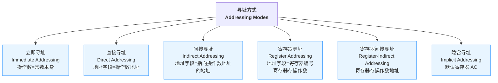
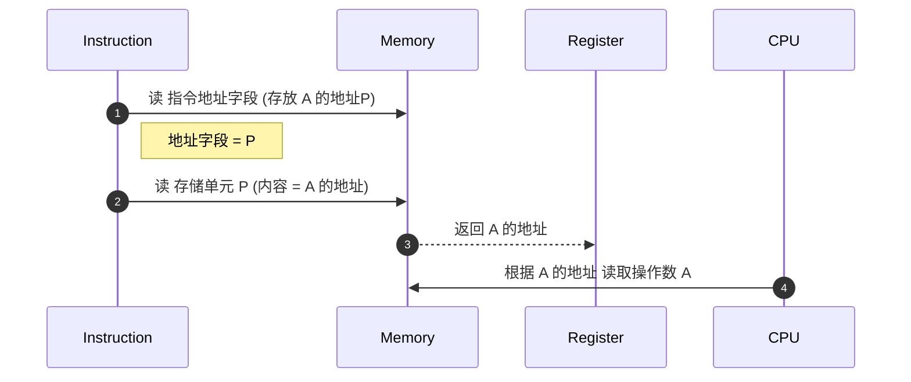

# 寻址方式 Addressing Modes

> 来源：网课《计算机组成与体系结构 1.4 寻址方式》字幕整理

## 1️⃣ 基本概念 | Fundamentals
- **寻址方式**：指令地址字段 **如何定位操作数** (Operands)。
- 指令格式通常 = **操作码 Operation Code (Opcode)** + **地址码 Address Field**。
- 地址字段可存放：
  1. **立即数** (操作数本身)
  2. **直接地址** (操作数所在单元地址)
  3. **间接地址** (存放操作数地址的单元地址)
  4. **寄存器编号** (寄存器或其间接地址)
  5. **隐含寄存器** (默认寄存器，如 AC)

---

## 2️⃣ 分类总览 | Addressing Mode Map

---

## 3️⃣ 特性对比表 | Feature Comparison
| # | 寻址方式 | 地址字段含义 | 取操作数次数 | 指令长度 | 灵活性 | 典型用途 |
|---|-----------|--------------|--------------|----------|---------|-----------|
| 1 | 立即 Immediate | 操作数本身 | 0 | 较长 (含常数) | ★ | 加载常量 Load constants |
| 2 | 直接 Direct | 操作数地址 | 1 | 中 | ★★ | 访问静态变量 |
| 3 | 间接 Indirect | 存操作数地址的地址 | 2 | 中 | ★★★ | 访问动态数据结构 Dynamic data |
| 4 | 寄存器 Register | 寄存器编号，寄存器存数据 | 0 | 短 | ★★ | 高速临时运算 |
| 5 | 寄存器间接 Reg-Indirect | 寄存器存操作数地址 | 1 | 短 | ★★★★ | 数组遍历、指针 |
| 6 | 隐含 Implicit | 默认 AC 寄存器 | 0 | 最短 | ★ | 累加器体系指令 |

---

## 4️⃣ 工作流程示例 | Indirect Addressing Flow

---

## 5️⃣ 高频考点 | Exam Focus
1. **立即 vs 直接**：立即数=数据本身，直接=数据地址。
2. **直接 vs 间接**：取数次数不同 (1 vs 2)。
3. **寄存器直接/间接**：寄存器存数据 or 地址。
4. **隐含寻址**：默认寄存器 AC，多见于累加器结构 CPU。
5. **一条指令可混合多种寻址方式**。

---

## 6️⃣ 形象化记忆 | Mnemonic Scene
> 把 **寻址方式** 想象成 **找书**：
> - 立即寻址 = 直接拿到书 (书=数据)。
> - 直接寻址 = 得到书架号，去书架取书。
> - 间接寻址 = 得到卡片箱号→卡片上写书架号→再去书架取书 (两跳)。
> - 寄存器寻址 = 手里拿着小篮子(寄存器)装书。
> - 寄存器间接 = 篮子里放着书架号，再去取书。
> - 隐含寻址 = 默认口袋(AC)里的书。

---

### 参考 / References
- 《计算机组成原理》唐朔飞
- 历年软考上午题 地址码考点

---

> **文件创建说明**：本笔记为独立 Markdown 文件，可直接加入软考知识库。
