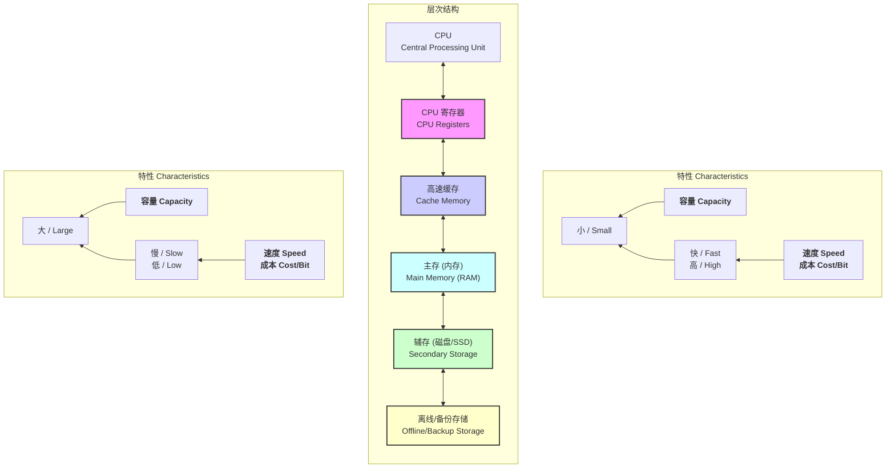

# 层次化存储体系 Hierarchical Storage System

> 来源：网课《1.7.2 层次化存储》字幕整理

## 1️⃣ 核心矛盾与设计思想 | Core Conflict & Philosophy

计算机系统对存储器的要求是 **“速度快、容量大、成本低”**，但这三者在物理上是相互矛盾的。层次化存储正是为了解决这一矛盾而设计的，其核心思想是：

- **利用程序的局部性原理**，将不同速度、容量、价格的存储器组合成一个有机的整体。
- **对用户透明**，使得程序员看到的仿佛是一个速度接近顶层、容量和价格却接近底层的“虚拟存储器”。

---

## 2️⃣ 存储器金字塔 | The Memory Pyramid

---

## 3️⃣ 理论基石：局部性原理 | Principle of Locality

层次化存储之所以有效，是因为程序在运行时对存储器的访问存在局部性，即在某个时间段内，访问的地址空间高度集中。

| 类型 (Type) | 中文定义 (Definition) | 英文定义 (English Definition) | 示例 (Example) |
| :--- | :--- | :--- | :--- |
| **时间局部性** Temporal Locality | 最近被访问的数据，在不久的将来很可能再次被访问。 | Items accessed recently are likely to be accessed again soon. | 循环体中的变量、函数栈中的局部变量。 |
| **空间局部性** Spatial Locality | 当某个数据被访问时，其物理上相邻的数据也可能很快被访问。 | Items with nearby addresses tend to be accessed close together in time. | 顺序执行代码、遍历数组、访问结构体成员。 |

---

## 4️⃣ Cache-主存系统：性能核心

Cache 的存在是为了弥合 CPU 与主存之间的巨大速度鸿沟。

### 平均访存时间 (Average Access Time, $t_a$)

这是衡量 Cache 性能的核心指标，也是考试的重点计算题。

$$
\begin{aligned}
t_a &= H \times t_c + (1-H) \times t_m \\
\\
\text{其中 (Where):} \\
t_a &= \text{系统平均访存时间 (Average Memory Access Time)} \\
H &= \text{Cache 的命中率 (Cache Hit Rate)} \\
t_c &= \text{Cache 的存取时间 (Cache Access Time)} \\
t_m &= \text{主存的存取时间 (Main Memory Access Time)} \\
(1-H) &= \text{失效率 / 未命中率 (Miss Rate)}
\end{aligned}
$$

**推论**: 当同时考虑 Cache 和 TLB (快表) 时，公式会变得更复杂，需要分情况讨论是否命中。

---

## 5️⃣ 考试要点与 Checklist ✅

- **层次结构识别**：能清晰画出“寄存器-Cache-主存-辅存”金字塔，并说出各层特点（速度、容量、成本）。
- **局部性原理**：理解并能举例说明时间局部性和空间局部性。
- **平均访存时间计算**：熟练掌握 $t_a = H \cdot t_c + (1-H) \cdot t_m$ 公式的应用，这是计算大题的核心。
- **Cache-主存映射**：了解直接映射、全相联映射、组相联映射的基本思想（常考选择题）。
- **地址空间与容量计算**：掌握根据地址范围计算容量大小以及所需芯片数量的方法，是常见的计算题型。

### 计算例题：存储器地址与容量

$$
\begin{aligned}
&\text{1. 问题描述 (Problem Description)} \\
&\quad \text{内存按字节编址，地址从 A0000H 到 CFFFFH。} \\
&\quad \text{若使用 64K x 8bit 的存储芯片，至少需要几片？} \\
\\
&\text{2. 解题步骤 (Solution Steps)} \\
&\quad \text{a. 计算总容量 (Calculate Total Capacity)} \\
&\qquad \text{地址单元数} &&= (\text{末地址} - \text{首地址} + 1) \\
& &&= \text{CFFFFH} - \text{A0000H} + 1 \\
& &&= \text{D0000H} - \text{A0000H} \\
& &&= 30000\text{H} \\
\\
&\qquad \text{总容量} &&= \text{地址单元数} \times \text{编址单位} \\
& &&= 30000\text{H} \times 1\text{B} \quad (\text{按字节编址, 1B = 8bit}) \\
& &&= (3 \times 16^4) \text{ B} \\
& &&= (3 \times 2^{16}) \text{ B} \\
\\
&\qquad \text{单位换算} &&= \frac{3 \times 2^{16} \text{ B}}{2^{10} \text{ B/KB}} = (3 \times 2^6) \text{ KB} = 192 \text{ KB} \\
\\
&\quad \text{b. 计算所需芯片数量 (Calculate Number of Chips)} \\
&\qquad \text{所需芯片数} &&= \frac{\text{总容量}}{\text{单个芯片容量}} \quad (\text{单个芯片容量} = 64\text{K} \times 8 \text{ bit} = 64\text{KB}) \\
& &&= \frac{192 \text{ KB}}{64 \text{ KB}} \\
& &&= 3 \text{ 片 (chips)}
\end{aligned}
$$

---

## 6️⃣ 形象化记忆 | Visualization

> 把存储系统想象成你的 **书房**：
> - **CPU (你)**: 正在工作的你。
> - **寄存器 (你的大脑)**: 正在思考的几个念头，速度最快但容量极小。
> - **Cache (你的桌面)**: 当前任务最常用的几本书和资料，伸手即得。
> - **主存 (你的书架)**: 你所有的藏书，找起来比桌面慢，但容量大得多。
> - **辅存 (图书馆/仓库)**: 不常用的书，需要出门去取，速度最慢但容量无限。

**局部性原理** 体现为：你一旦开始研究某个主题（如“计算机网络”），在接下来的一段时间里，你很可能会反复翻阅桌面上那几本网络相关的书（时间局部性），并且会把它们旁边的其他章节也顺便看了（空间局部性）。
