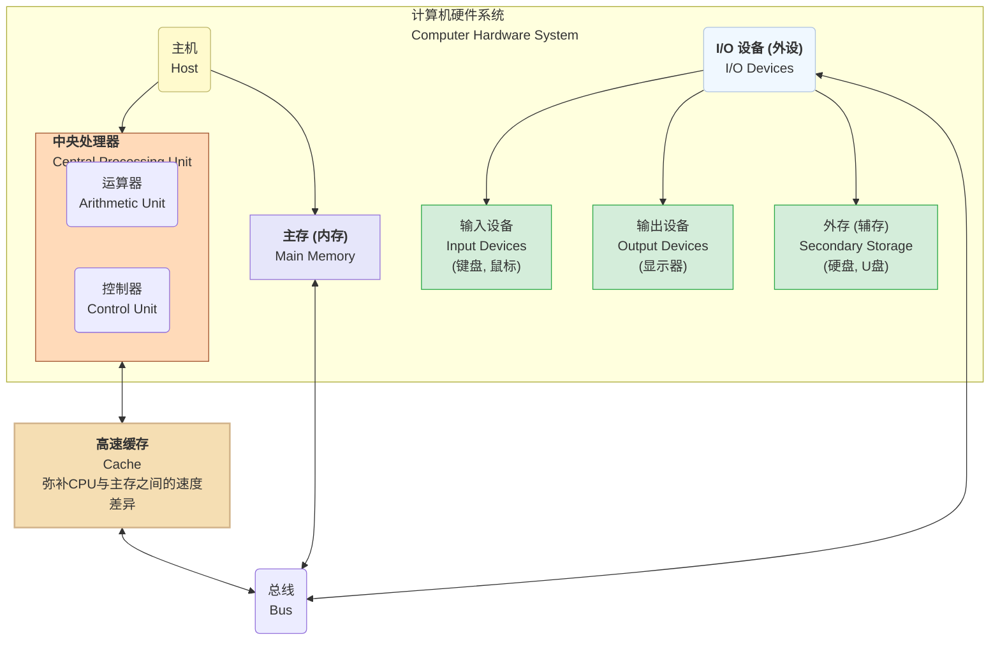

```mermaid
graph TD
    subgraph A ["计算机硬件系统<br/>Computer Hardware System"]
        direction LR
        H("主机<br/>Host") --> M["<strong>主存 (内存)</strong><br/>Main Memory"]
        H --> CPU
        
        P("<strong>I/O 设备 (外设)</strong><br/>I/O Devices") --> I["输入设备<br/>Input Devices<br/>(键盘, 鼠标)"]
        P --> O["输出设备<br/>Output Devices<br/>(显示器)"]
        P --> E["外存 (辅存)<br/>Secondary Storage<br/>(硬盘, U盘)"]
    end

    CPU <--> Cache["<strong>高速缓存</strong><br/>Cache<br/>弥补CPU与主存之间的速度差异"]
    Cache <--> B("总线<br/>Bus")
    M <--> B
    P <--> B

    subgraph CPU ["<strong>中央处理器</strong><br/>Central Processing Unit"]
        direction LR
        ARU("运算器<br/>Arithmetic Unit")
        CU("控制器<br/>Control Unit")
    end
    
    %% 样式定义
    style H fill:#FFFACD,stroke:#BDB76B
    style P fill:#F0F8FF,stroke:#B0C4DE
    style CPU fill:#FFDAB9,stroke:#A0522D
    style Cache fill:#F5DEB3,stroke:#D2B48C,stroke-width:2px
    style M fill:#E6E6FA,stroke:#9370DB
    style I fill:#D4EDDA,stroke:#28A745
    style O fill:#D4EDDA,stroke:#28A745
    style E fill:#D4EDDA,stroke:#28A745
```
