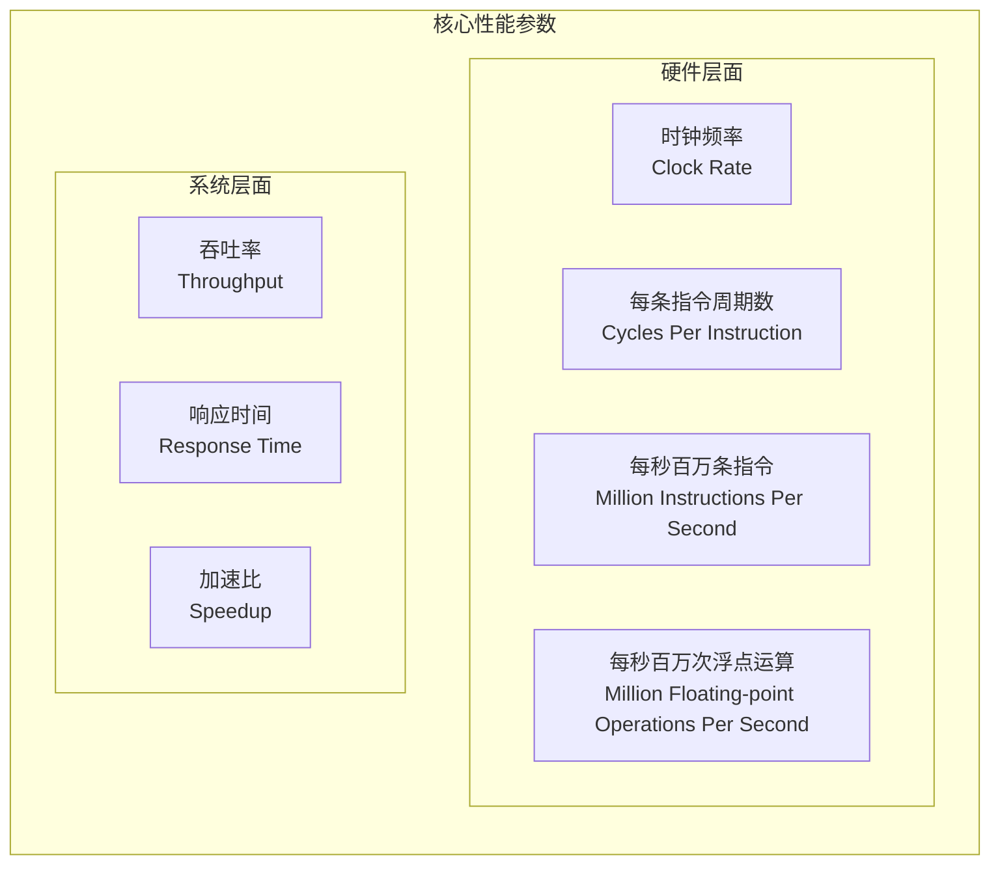

# 网课笔记 - 计算机性能指标 (Performance Metrics)

根据您提供的课程字幕，我为您整理了关于计算机性能指标的结构化学习笔记。

## 1. 性能指标概述

性能指标是衡量计算机系统性能的重要参数。在软考中，性能指标虽然不是高频考点，但近年来分值有所增加，一次考试中可能占到1~3分。

## 2. 核心性能指标

### 2.1 主要性能参数

### 2.2 关键概念

1.  **时钟频率 (Clock Rate)**
    -   单位：Hz（赫兹）或 GHz（吉赫兹）
    -   表示 CPU 每秒发出的时钟脉冲数
    -   时钟周期 = 1/时钟频率

2.  **CPI (Cycles Per Instruction)**
    -   表示执行一条指令平均所需的时钟周期数
    -   计算公式：CPI = 总时钟周期数 / 总指令数
    -   反映了指令执行的效率

3.  **MIPS (Million Instructions Per Second)**
    -   表示每秒执行的百万条指令数
    -   计算公式：MIPS = (总指令数 × 10^6) / (执行时间 × 10^-3)
    -   单位：MIPS

4.  **MFLOPS (Million Floating-point Operations Per Second)**
    -   表示每秒执行的百万次浮点运算数
    -   专门用于衡量科学计算性能
    -   单位：MFLOPS