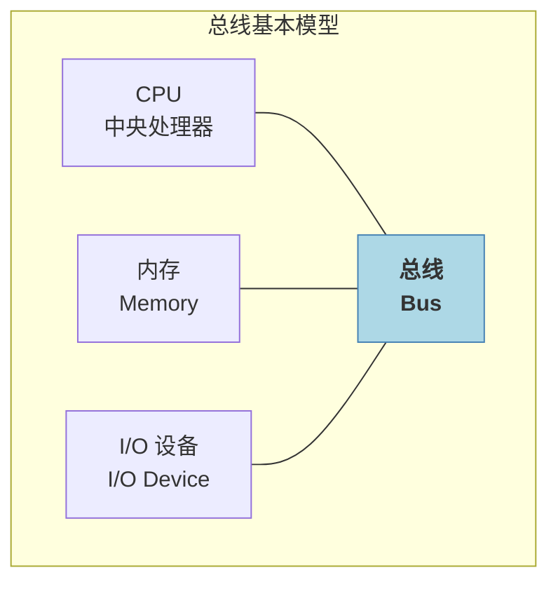
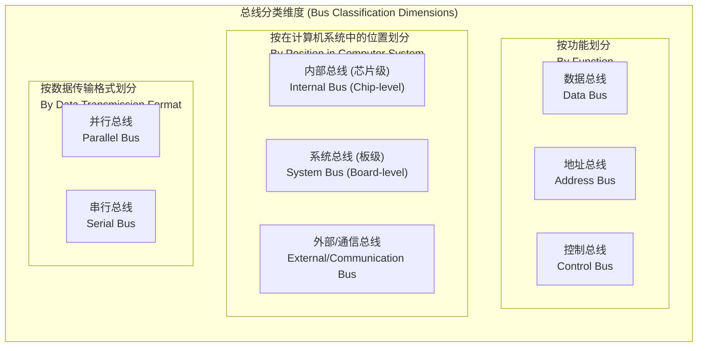
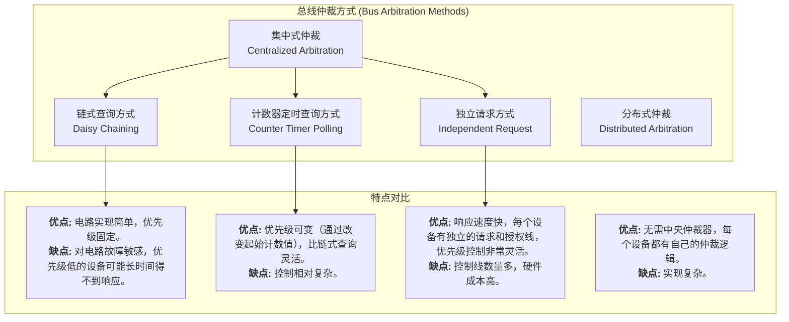

# 网课笔记 - 总线技术 (Bus Technology)

根据您提供的课程字幕，我为您整理了关于计算机总线技术的结构化学习笔记。

## 1. 总线的基本概念 (Basic Concepts of Bus)

总线是连接计算机各个功能部件（如CPU、内存、I/O设备）的公共信息通道，是计算机的“骨架”和“神经网络”。

### 核心特点：分时与共享 (Core Feature: Time-sharing & Shared)

总线的一个核心特点是 **分时双工 (Time-sharing Duplex)**。

-   **共享 (Shared)**: 所有挂接在总线上的设备共享这条通路。
-   **分时 (Time-sharing)**: 在同一时刻，只允许一个设备发送信息，但可以有多个设备接收信息。

> **场景比喻**: 就像一个公司的会议室（总线），同一时间只允许一个人发言（发送），但所有参会人员（其他设备）都可以听（接收）。

## 2. 总线的分类 (Bus Classification)

总线可以从不同维度进行分类，以便更好地理解其结构和功能。

### 2.1 按功能划分 (By Function)

-   **数据总线 (Data Bus)**: 双向传输数据信息。其位数（宽度）决定了单次能传输的数据量，是影响总线性能的关键因素。
-   **地址总线 (Address Bus)**: 单向传输，由CPU发出，用于指定数据在内存或I/O端口的地址。其位数决定了CPU可寻址的最大空间（例如，32位地址总线可寻址 2^32 = 4GB 空间）。
-   **控制总线 (Control Bus)**: 双向传输，负责发送各种控制信号、时序信号和状态信息（如读/写信号、中断请求、总线请求等）。

### 2.2 按在计算机系统中的位置划分 (By Position)

-   **内部总线 (Internal Bus)**: 芯片内部的总线，连接CPU内部的寄存器、ALU等部件。
-   **系统总线 (System Bus)**: 连接CPU、内存、I/O控制器等主要功能板卡的板级总线。通常我们所说的总线就是指系统总线。
-   **外部/通信总线 (External/Communication Bus)**: 用于计算机之间或计算机与外部设备之间的通信，如USB、SATA、PCIe等。

### 2.3 按数据传输格式划分 (By Data Transmission Format)

-   **并行总线 (Parallel Bus)**: 多条数据线同时传输多位数据，速度快，成本高，适合近距离高速传输（如内存总线）。
-   **串行总线 (Serial Bus)**: 数据按位顺序在一条数据线上逐位传输，成本低，适合长距离传输（如USB、SATA）。

## 3. 总线的性能指标 (Bus Performance Metrics)

总线最重要的性能指标是其 **带宽 (Bandwidth)**，也称为数据传输速率。
总线带宽的计算公式为：

**总线带宽 = 总线时钟频率 × (总线宽度 / 8)**

-   **单位**: MB/s (兆字节每秒)
-   **总线时钟频率 (Bus Clock Frequency)**: 单位为 MHz，表示总线每秒工作的周期数。
-   **总线宽度 (Bus Width)**: 通常指数据总线的位数，表示每个周期能传输的位数。
-   **除以 8**: 将位数 (bit) 转换为字节 (Byte)。

## 4. 总线仲裁 (Bus Arbitration)

由于总线是共享资源，当多个设备（称为“主设备”，如CPU、DMAC）同时需要使用总线时，就需要一个机制来决定谁拥有总线的使用权，这个过程就是 **总线仲裁 (Bus Arbitration)**。

> **场景比喻**: 多个部门（主设备）都想使用公司的唯一一间会议室（总线），需要由行政部门（总线仲裁器）来决定使用顺序。

### 常见仲裁方式

## 5. 真题解析

根据课程内容，我们分析以下这道关于总线特点的题目：

**题目：下列关于总线的叙述中，错误的是？**

-   A. 并行总线适合近距离高速数据传输。
-   B. 串行总线可以适合长距离的数据传输。
-   C. 单总线结构在一个总线上可以适应不同种类的设备，设计简单，并且性能很高。
-   D. 专用总线在设计上可以与连接设备实现最佳的匹配。

**解析:**

-   **A 选项 (正确)**: 并行总线通过多条线同时传输数据，速度快，但线间干扰和成本使其只适合近距离通信。
-   **B 选项 (正确)**: 串行总线成本低，抗干扰能力强，适合长距离传输。
-   **C 选项 (错误)**: 单总线结构虽然设计简单、易于扩展，但因为所有设备共享一条总线，存在严重的性能瓶颈，**性能并不高**。其“分时共享”的特点决定了其效率有限。
-   **D 选项 (正确)**: 专用总线为特定设备或特定用途设计，因此能实现最佳的性能匹配。

**结论：** C 选项的表述是错误的。