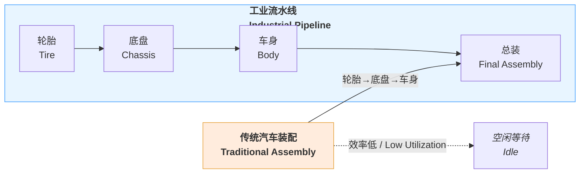
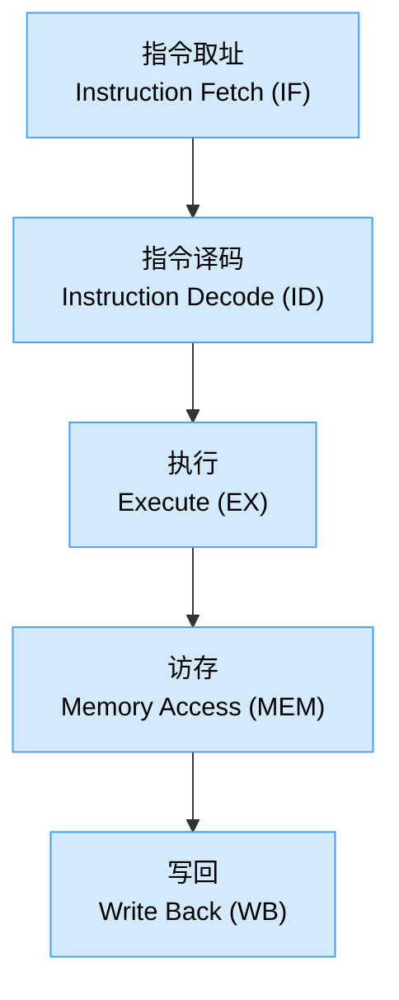

# 流水线技术 Pipeline Technology

> 来源：网课《计算机组成与体系结构 1.6 流水线技术》字幕整理

## 1️⃣ 场景引入 | Industrial Analogy

**启示 Insight**：通过“分段并行（Stage Parallelism）”提升资源利用率，正是计算机指令流水线的核心思想。

---

## 2️⃣ 指令流水线分段 | Stage Division

> 实际考试题中常见 3~5 段，请按题意采用相应阶段数 **k**。

---

## 3️⃣ 时间空间图 | Time–Space Diagram
假设每段耗时 `Δt`，5 段流水线执行 5 条指令的时序如下：

```mermaid
gantt
    title "5-Stage Pipeline Time–Space Diagram"
    dateFormat  X
    section IF
    I1 :0, 1
    I2 :1, 1
    I3 :2, 1
    I4 :3, 1
    I5 :4, 1
    section ID
    I1 :1, 1
    I2 :2, 1
    I3 :3, 1
    I4 :4, 1
    I5 :5, 1
    section EX
    I1 :2, 1
    I2 :3, 1
    I3 :4, 1
    I4 :5, 1
    I5 :6, 1
    section MEM
    I1 :3, 1
    I2 :4, 1
    I3 :5, 1
    I4 :6, 1
    I5 :7, 1
    section WB
    I1 :4, 1
    I2 :5, 1
    I3 :6, 1
    I4 :7, 1
    I5 :8, 1
```

---

## 4️⃣ 关键性能指标 | Key Metrics
$$
\begin{array}{|l|l|l|}
\hline
\textbf{指标 Metric} & \textbf{公式 Formula} & \textbf{说明 Description}\\
\hline
\text{加速比}Speed\;Up~(S) & S = \dfrac{T_{串行}}{T_{流水}} & 越大越好/Greater is better \\
\hline
\text{吞吐率}Throughput~(TP) & TP = \dfrac{n}{T_{总}} = \dfrac{1}{T_{周期}} & 单位时间完成指令数 \\
\hline
\text{效率}Efficiency~(E) & E = \dfrac{S}{k} & k = 阶段数 / Stage count \\
\hline
\text{理想加速比} & S_{ideal}=k & 无冲突、无限缓存假设 \\
\hline
\end{array}
$$

---

## 5️⃣ 考试常见计算步骤
1. **识别阶段数 k**（读题关注“取指/译码/执行 …”段数）。
2. **取单段时间 Δt 或给定不同时延**。
3. **非流水 & 流水总时间**：
   * 串行：`T_serial = n × k × Δt`。
   * 流水：`T_pipe   = (k + n - 1) × Δt`。
4. **加速比、效率、吞吐率** 按上表公式代入。
5. 若有 **气泡 (Bubble)** / **冲突 (Hazard)**，在时间图中补空段再重新计算。

---

## 6️⃣ 综合计算例题

$$
\begin{aligned}
& \textbf{题目} \\
& \quad \text{一条指令的执行过程可分解为取指、分析和执行三步，} \\
& \quad \text{在取指时间 } t_{\text{取指}}=3\Delta t\text{、分析时间 } t_{\text{分析}}=2\Delta t\text{、} \\
& \quad \text{执行时间 } t_{\text{执行}}=4\Delta t \text{ 的情况下，} \\
& \quad \text{求 10 条指令的串行时间、流水线时间、吞吐率及最大吞吐率。} \\
\\ 
& \textbf{解题过程} \\
& \text{1. 串行执行时间 } (T_{\text{serial}}) \\
& \quad T_{\text{serial}} = 10 \times (3\Delta t + 2\Delta t + 4\Delta t) = \boxed{90\Delta t} \\
\\ 
& \text{2. 流水线周期 (Pipeline Cycle, t)} \\
& \quad t = \max\{3\Delta t, 2\Delta t, 4\Delta t\} = \boxed{4\Delta t} \\
\\ 
& \text{3. 流水线执行时间 } (T_{\text{pipe}}) \\
& \quad T_{\text{pipe}} = \left( \sum_{i=1}^{k} t_i \right) + (n-1)t \\
& \qquad\quad = (9\Delta t) + (10-1) \times 4\Delta t = \boxed{45\Delta t} \\
\\ 
& \text{4. 吞吐率 } (\text{TP for } n=10) \\
& \quad \text{TP} = \frac{n}{T_{\text{pipe}}} = \frac{10}{45\Delta t} = \boxed{\frac{2}{9\Delta t}} \\
\\ 
& \text{5. 最大吞吐率 } (\text{TP}_{\max}) \\
& \quad \text{TP}_{\max} = \lim_{n \to \infty} \frac{n}{T_{\text{pipe}}} = \frac{1}{t} = \boxed{\frac{1}{4\Delta t}}
\end{aligned}
$$

---

## 7️⃣ 易错点 Checklist ✅
- **公式选择**：当各阶段耗时不同时，必须使用**理论公式** `(Σtᵢ) + (n-1)t`。实践公式 `(k+n-1)t` 是其在各阶段耗时相等时的特例。
- **阶段数 k**：题目给的“阶段”不一定等于 CPU 五段经典模型，注意阅读。
- **理论上限**：加速比与效率常需比较理论上限，`S_max = k`，`E_max = 1`。
- **吞吐率单位**：常出现在“条/周期”或“条/秒”，需结合 `Δt` 换算。

---

## 8️⃣ 形象化记忆 | Visualization
> 想象一条 **5 站地铁**：首站上客 IF，末站下客 WB。首列车启动后，每隔一个站点时间就有一列新车驶出终点——这正是 <u>高吞吐</u> 的流水线！

---

### 参考 / Reference
- 软考午/上午真题（历年流水线计算）
- Hennessy & Patterson, 《Computer Architecture: A Quantitative Approach》

---

> **文件创建说明**：本笔记为独立 Markdown 文件，已符合“图表优先、双语节点、信息聚合”规范，可直接纳入 `/网课笔记` 目录。
