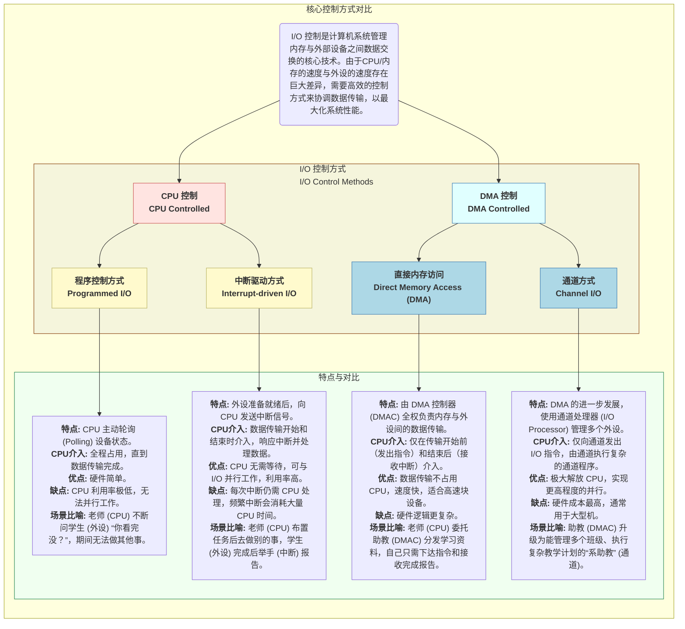
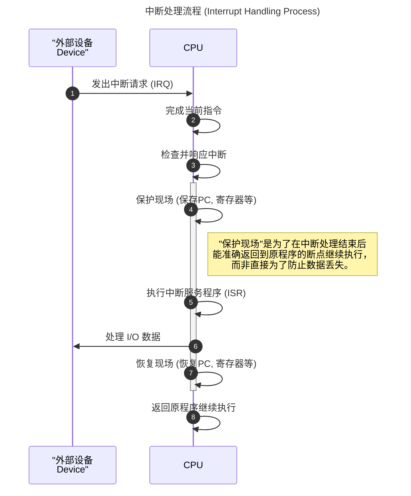
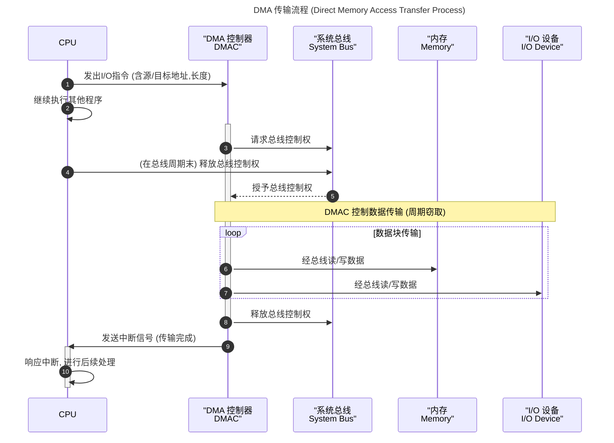

# 网课笔记 - 输入输出技术 (I/O Technology) - 完整版

根据您提供的完整课程字幕，我为您重新整理并补充了关于计算机输入输出（I/O）技术的结构化学习笔记。

## 1. I/O 控制方式概述

I/O 控制是计算机系统管理内存与外部设备之间数据交换的核心技术。由于CPU/内存的速度与外设的速度存在巨大差异，需要高效的控制方式来协调数据传输，以最大化系统性能。

## 2. 详细流程

## 3. 真题解析

#### 题目 1

**原题：** 计算机系统当中，常用输入输出控制方式有无条件传送、中断、程序查询和 DMA。其中，在传送数据过程中，最不需要 CPU 执行指令干预的是哪一种？

$$
\large
\begin{array}{|l|l|}
\hline
\textbf{选项} & \textbf{分析} \\
\hline
\textbf{A. 程序查询} & CPU 需要反复执行查询指令来检查设备状态，全程高度介入。 \\
\hline
\textbf{B. 无条件传送} & 默认设备总是就绪，CPU 直接执行传送指令，全程介入。 \\
\hline
\textbf{C. 中断} & CPU 在数据传输的每个字节/字都需要响应中断并执行中断服务程序。 \\
\hline
\textbf{D. DMA} & \textbf{正确。} CPU 仅在传输开始前授权，结束后接收中断。在整个数据块的传送过程中， \\
& CPU 不执行任何数据传送指令，由 DMAC 负责。 \\
\hline
\end{array}
$$

**结论：** DMA 方式在数据传送过程中最少需要 CPU 干预。

#### 题目 2

**原题：** 计算机运行过程当中，遇到因某种原因引起的突发事件时，应如何处理？

$$
\large
\begin{array}{|l|l|}
\hline
\textbf{选项/概念} & \textbf{分析} \\
\hline
\textbf{A. 中断方式} & \textbf{正确。} 中断机制就是为了处理各种“突发事件”（如 I/O 完成、硬件故障、 \\
& 程序异常等）而设计的。它允许 CPU 暂停当前任务，转去处理紧急事件， \\
& 处理完毕后再返回原任务。 \\
\hline
\textbf{B. 其他方式} & 其他方式（如轮询）是主动检查，而非响应“突发”事件。 \\
\hline
\end{array}
$$

**结论：** 处理突发事件是中断机制的核心功能。

#### 题目 3

**原题：** 在中断响应过程中，“保护现场”的直接目的是什么？

$$
\large
\begin{array}{|l|l|}
\hline
\textbf{选项} & \textbf{分析} \\
\hline
\textbf{A. 防止数据丢失} & 间接相关，但不是直接目的。现场保护主要保护的是程序的执行状态。 \\
\hline
\textbf{B. 使中断程序正确执行} & 中断程序的执行不依赖于原程序的现场。 \\
\hline
\textbf{C. 不破坏其他部件} & 与硬件部件无关。 \\
\hline
\textbf{D. 能正确返回原程序并继续执行} & \textbf{正确。} “保护现场”指保存当前程序的程序计数器(PC)、状态寄存器(PSW) \\
& 和通用寄存器等。这样，在中断服务程序执行完毕后，可以准确地恢复 \\
& 这些值，使原程序从被中断处无缝地继续执行。 \\
\hline
\end{array}
$$

**结论：** 保护现场的核心是为了能够正确地恢复被中断的程序。

#### 题目 4

**原题：** CPU 是在什么时刻响应 DMA 请求的？

$$
\large
\begin{array}{|l|l|}
\hline
\textbf{选项/概念} & \textbf{分析} \\
\hline
\textbf{A. 指令执行结束时} & DMA 请求的响应粒度比指令更细。 \\
\hline
\textbf{B. 一个总线周期结束时} & \textbf{正确。} DMA 控制器通过“周期窃取”或“周期挪用”的方式与 CPU 分时 \\
& 使用总线。CPU 在执行一条指令的过程中，会包含若干个总线周期（如取指、 \\
& 读写数据等）。CPU 会在每个总线周期的末尾检查是否有 DMA 请求， \\
& 如果有，就将下一个总线周期的使用权交给 DMAC。 \\
\hline
\textbf{C. 中断周期结束时} & DMA 请求与中断周期是两种不同的机制。 \\
\hline
\end{array}
$$

**结论：** CPU 在一个总线周期结束后响应 DMA 请求。
