# E-R图概念设计 (Entity-Relationship Diagram Design)

## E-R图基础概念与图元符号 (Basic Concepts & Symbols)

## 实体、属性与联系详解 (Entities, Attributes & Relationships)

```mermaid
erDiagram
    "student(学生)" ||--o{ "class(班级)" : "属于"
    "class(班级)" ||--|| "student(学生)" : "班长关系"
    "student(学生)" ||--o{ "enrollment(选课记录)" : "选课"
    "course(课程)" ||--o{ "enrollment(选课记录)" : "被选"
    "employee(职工)" ||--o{ "family_member(家属)" : "拥有家属"
    "employee(职工)" ||--|| "manager(经理)" : "特殊化为经理"
    "employee(职工)" ||--|| "salesperson(销售员)" : "特殊化为销售员"
    "hospital_room(病房)" ||--o{ "treatment(治疗记录)" : "提供治疗"
    "patient(病人)" ||--o{ "treatment(治疗记录)" : "接受治疗"
    "doctor(医生)" ||--o{ "treatment(治疗记录)" : "进行治疗"
    "team(球队)" ||--o{ "match(比赛)" : "主队参赛"
    "team(球队)" ||--o{ "match(比赛)" : "客队参赛"

    "student(学生)" {
        string student_id PK "学号, 主键, 学生唯一标识, 简单属性"
        string student_name "学生姓名, 简单属性"
        int age "年龄, 派生属性, 可由出生日期计算"
        date birth_date "出生日期, 单值属性"
        string gender "性别, 简单属性"
        string phone_number "联系电话, 多值属性"
        string address "地址, 复合属性, 可拆分为省市街道"
        string parent_name "家长姓名, 多值属性"
    }

    "class(班级)" {
        string class_id PK "班级编号, 主键, 班级唯一标识"
        string class_name "班级名称"
        int student_count "学生人数"
        string classroom "教室位置"
        string monitor_id FK "班长学号, 外键, 关联学生表"
    }

    "course(课程)" {
        string course_id PK "课程编号, 主键, 课程唯一标识"
        string course_name "课程名称"
        int credits "学分"
        string description "课程描述, 可为NULL属性"
        decimal price "课程费用, 简单属性"
        int enrollment_count "选课人数"
        decimal total_revenue "总收入, 派生属性, 价格乘以人数"
    }

    "family_member(家属)" {
        string member_id PK "家属编号, 弱实体主键"
        string member_name "家属姓名"
        string relationship "关系, 父母配偶子女"
        string phone_number "联系电话"
        string employee_id FK "职工编号, 依赖键, 弱实体外键, 关联职工表"
    }

    "employee(职工)" {
        string employee_id PK "职工编号, 主键, 强实体唯一标识"
        string employee_name "职工姓名"
        string position "职位"
        decimal salary "薪资"
        string department "部门"
    }

    "manager(经理)" {
        string manager_id PK "经理编号, 特殊化实体主键"
        string employee_id FK "职工编号, IS-A关系外键, 关联职工表"
        string management_level "管理级别"
        decimal bonus "管理奖金"
        int team_size "团队规模"
    }

    "salesperson(销售员)" {
        string sales_id PK "销售员编号, 特殊化实体主键"
        string employee_id FK "职工编号, IS-A关系外键, 关联职工表"
        decimal commission_rate "提成比例"
        decimal sales_target "销售目标"
        string territory "销售区域"
    }

    "enrollment(选课记录)" {
        string student_id PK,FK "学生编号, 复合主键的一部分, 外键关联学生表"
        string course_id PK,FK "课程编号, 复合主键的一部分, 外键关联课程表"
        date enrollment_date "选课日期, 联系属性"
        decimal grade "成绩, 联系属性"
        string status "状态, 联系属性"
    }

    "treatment(治疗记录)" {
        string room_id PK,FK "病房编号, 三元联系复合主键的一部分, 外键关联病房表"
        string patient_id PK,FK "病人编号, 三元联系复合主键的一部分, 外键关联病人表"
        string doctor_id PK,FK "医生编号, 三元联系复合主键的一部分, 外键关联医生表"
        datetime treatment_date "治疗日期, 三元联系属性"
        string treatment_type "治疗类型, 三元联系属性"
        string notes "备注, 可为NULL属性"
    }

    "hospital_room(病房)" {
        string room_id PK "病房编号, 主键, 病房唯一标识"
        string room_type "病房类型"
        int bed_count "床位数"
        string building "楼栋"
    }

    "patient(病人)" {
        string patient_id PK "病人编号, 主键, 病人唯一标识"
        string patient_name "病人姓名"
        int age "年龄"
        string diagnosis "诊断"
        date admission_date "入院日期"
    }

    "doctor(医生)" {
        string doctor_id PK "医生编号, 主键, 医生唯一标识"
        string doctor_name "医生姓名"
        string specialty "专科"
        string title "职称"
        int experience_years "从业年限"
    }

    "team(球队)" {
        string team_id PK "球队编号, 主键, 球队唯一标识"
        string team_name "球队名称"
        string city "所在城市"
        string coach "教练"
    }

    "match(比赛)" {
        string match_id PK "比赛编号, 主键, 比赛唯一标识"
        string home_team_id FK "主队编号, 自联系外键, 关联球队表"
        string away_team_id FK "客队编号, 自联系外键, 关联球队表"
        datetime match_date "比赛日期"
        string venue "比赛场地"
        string result "比赛结果"
    }
```

$$
\begin{array}{l}
\textbf{E-R图核心概念与erDiagram对应关系} \\
\hline \\
\begin{array}{|c|l|l|l|}
\hline
\textbf{概念类型} & \textbf{定义与特点} & \textbf{典型例子} & \textbf{erDiagram表示} \\
\hline
\text{实体} & \text{现实世界中能够区别于} & \text{学生STUDENT} & \text{STUDENT \{ ... \}} \\
\text{Entity} & \text{其他事物的事件或对象} & \text{班级CLASS} & \text{实体名大写} \\
\hline
\text{简单属性} & \text{原子的，不可再分割} & \text{姓名、年龄、性别} & \text{string name} \\
\text{Simple Attribute} & \text{最基本的属性单元} & \text{学号、身份证号} & \text{基本数据类型定义} \\
\hline
\text{复合属性} & \text{可以细分为更小部分} & \text{地址(省+市+街道)} & \text{string address} \\
\text{Composite Attribute} & \text{由多个简单属性组成} & \text{姓名(姓+名)} & \text{或拆分为多个简单属性} \\
\hline
\text{多值属性} & \text{可以对应一组值} & \text{联系电话、家长姓名} & \text{string phone} \\
\text{Multi-valued} & \text{一对多的属性关系} & \text{兴趣爱好} & \text{或建立独立的关联表} \\
\hline
\text{派生属性} & \text{可以由其他属性得来} & \text{年龄(由出生日期计算)} & \text{int age} \\
\text{Derived Attribute} & \text{计算得出的属性} & \text{总额(单价×数量)} & \text{decimal total\_amount} \\
\hline
\text{主键属性} & \text{唯一标识实体的属性} & \text{学号、员工编号} & \text{string student\_id PK} \\
\text{Primary Key} & \text{实体的唯一标识符} & \text{课程编号} & \text{使用PK标记} \\
\hline
\text{外键属性} & \text{引用其他实体的属性} & \text{班级中的班长学号} & \text{string monitor\_id FK} \\
\text{Foreign Key} & \text{建立实体间的联系} & \text{选课表中的学生编号} & \text{使用FK标记} \\
\hline
\text{弱实体} & \text{不能独立存在的实体} & \text{家属依赖于职工} & \text{FAMILY\_MEMBER} \\
\text{Weak Entity} & \text{必须依赖其他实体} & \text{附件依赖于邮件} & \text{包含依赖实体的外键} \\
\hline
\text{特殊化} & \text{父类子类关系} & \text{经理是特殊的员工} & \text{MANAGER} \\
\text{Specialization} & \text{IS-A关系} & \text{销售员是特殊的员工} & \text{包含父实体的外键} \\
\hline
\text{一对一联系} & \text{一个萝卜一个坑} & \text{班级与班长} & \text{||--||} \\
\text{1:1 Relationship} & \text{双向唯一对应} & \text{部门与部门经理} & \text{双竖线双横线} \\
\hline
\text{一对多联系} & \text{一个对应多个} & \text{班级包含多个学生} & \text{||--o\{} \\
\text{1:N Relationship} & \text{单向一对多} & \text{部门包含多个员工} & \text{竖线对花括号} \\
\hline
\text{多对多联系} & \text{多个对应多个} & \text{学生选择多门课程} & \text{通过中间实体} \\
\text{M:N Relationship} & \text{双向多对多} & \text{课程被多个学生选} & \text{ENROLLMENT表} \\
\hline
\text{三元联系} & \text{三个实体的联系} & \text{病房-病人-医生} & \text{TREATMENT表} \\
\text{Ternary Relationship} & \text{复杂的多元关系} & \text{供应商-项目-零件} & \text{包含三个外键} \\
\hline
\text{自联系} & \text{实体内部的联系} & \text{球队比赛(主客队)} & \text{MATCH表} \\
\text{Self Relationship} & \text{同一实体的不同角色} & \text{员工管理关系} & \text{两个指向同一实体的外键} \\
\hline
\end{array}
\end{array}
$$

## 联系类型与多重度分析 (Relationship Types & Cardinality Analysis)

$$
\begin{array}{l}
\textbf{多重度分析详解与三元联系} \\
\hline \\
\begin{array}{l}
\text{1. 二元联系多重度分析步骤:} \\
\quad \text{① 选择一个实体作为核心} \\
\quad \text{② 假设另一端实体数量为一} \\
\quad \text{③ 分析核心端对应的数量} \\
\quad \text{④ 确定多重度关系} \\
\\
\text{2. 三元联系多重度分析:} \\
\quad \text{① 选择一个实体作为核心} \\
\quad \text{② 假设另外两端实体都是唯一的} \\
\quad \text{③ 只要有一端分析结果是多，整体多重度就是多} \\
\quad \text{④ 所有端都是一，多重度才是一} \\
\\
\text{3. 三元联系示例分析:} \\
\quad \text{病房-病人-医生联系:} \\
\quad \quad \text{• 以病房为核心：一个病人住一个病房，一个医生管一个病房 → 病房端为1} \\
\quad \quad \text{• 以病人为核心：一个病房住多个病人，一个医生治多个病人 → 病人端为多} \\
\quad \quad \text{• 以医生为核心：一个病房一个医生负责，一个病人多个医生负责 → 医生端为多} \\
\\
\text{4. 注意事项:} \\
\quad \text{• 多对多关系不要写成N对N，应使用不同字母如M对N} \\
\quad \text{• 相同字母表示一对一、二对二等固定对应关系} \\
\quad \text{• 一对多具有方向性，需要明确是A对B的一对多还是B对A的一对多}
\end{array}
\end{array}
$$

## 扩展E-R模型概念 (Extended E-R Model Concepts)

## 考试要点与实战应用 (Exam Points & Practical Application)

$$
\begin{array}{l}
\textbf{E-R图设计实战要点} \\
\hline \\
\begin{array}{|c|l|l|}
\hline
\textbf{设计步骤} & \textbf{具体操作} & \textbf{注意事项} \\
\hline
\text{1. 识别实体} & \text{从需求描述中找出名词} & \text{区分实体和属性} \\
& \text{确定哪些是独立存在的对象} & \text{考虑是否需要弱实体} \\
\hline
\text{2. 确定属性} & \text{为每个实体分配属性} & \text{区分简单/复合属性} \\
& \text{识别主键属性} & \text{考虑多值属性的处理} \\
\hline
\text{3. 建立联系} & \text{分析实体间的关联} & \text{确定联系的多重度} \\
& \text{识别联系的属性} & \text{考虑三元及以上联系} \\
\hline
\text{4. 完善模型} & \text{添加特殊化关系} & \text{检查模型完整性} \\
& \text{处理聚集关系} & \text{验证业务逻辑} \\
\hline
\end{array}
\end{array}
$$

## 记忆要点与总结 (Memory Points & Summary)

$$
\begin{array}{l}
\textbf{E-R图设计总结} \\
\hline \\
\begin{array}{|c|c|c|}
\hline
\textbf{概念} & \textbf{关键特征} & \textbf{考试重点} \\
\hline
\text{实体识别} & \text{独立存在的对象} & \text{区分实体与属性} \\
\hline
\text{属性分类} & \text{简单/复合，单值/多值} & \text{派生属性的识别} \\
\hline
\text{联系分析} & \text{多重度的正确判断} & \text{三元联系的处理} \\
\hline
\text{扩展概念} & \text{弱实体、特殊化、聚集} & \text{正确的图形表示} \\
\hline
\end{array}
\end{array}
$$

---

**总结**：E-R图是数据库概念设计阶段的核心工具，通过实体、属性、联系三要素描述现实世界的数据结构。在软考中，重点掌握图元符号的正确使用、多重度的准确分析、以及弱实体、特殊化、聚集等扩展概念的识别与应用。这是下午软件设计题的重要理论基础。