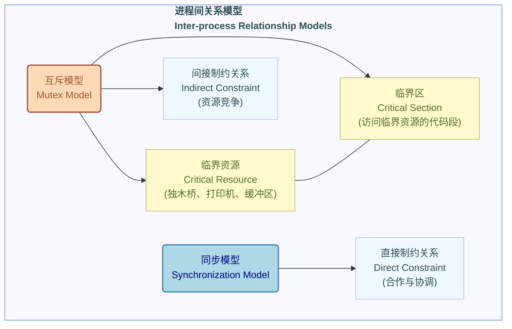

# 软考备考-PV操作概念

## 引言

本笔记旨在系统性地介绍操作系统中PV操作的核心概念、原理及其在进程同步与互斥中的应用。通过深入理解PV操作，考生将能掌握如何有效管理共享资源，避免并发执行带来的问题，这对于软件设计师的考点至关重要。

## PV操作基础概念 (Basic Concepts of PV Operations)

PV操作是由荷兰计算机科学家Dijkstra提出的，用于实现进程（线程）间同步与互斥的有效工具。它是一组不可中断的原子操作（原语），确保在多进程环境下对共享资源的正确访问。

### 1. 信号量 (Semaphore, S)

信号量是一个特殊的变量，用于控制对共享资源的访问。它表示资源的可用数量。信号量可以是一个整数，其值有以下含义：

*   **S > 0**：表示有 S 个可用资源。
*   **S = 0**：表示没有可用资源。
*   **S < 0**：表示有 |S| 个进程正在等待该资源（即被阻塞的进程数）。

*   **场景示例**：想象一个有3个停车位的停车场（共享资源）。初始时，信号量 S=3。每当一辆车驶入，S减1；每当一辆车驶出，S加1。如果S变为-1，意味着停车场已满，且有1辆车在等待。

### 2. P操作 (Wait/请求资源操作, `P(S)`)

P操作（也称为`wait`或`decrement`操作）用于申请一个资源。它包含两个原子步骤：

1.  **信号量减1 (Decrement Semaphore)**：`S = S - 1`。
2.  **检查资源是否足够 (Check Resource Availability)**：如果 `S < 0`，则表示资源不足，执行P操作的进程将被阻塞，并进入与该信号量关联的等待队列。如果 `S >= 0`，则进程继续执行。

*   **场景示例**：当一辆车试图驶入停车场时，它会执行P操作。停车位数量减1。如果停车位数量变为负数（即没有空位且有车在等），这辆车就会被阻塞，在停车场入口排队等待。

### 3. V操作 (Signal/释放资源操作, `V(S)`)

V操作（也称为`signal`或`increment`操作）用于释放一个资源。它包含两个原子步骤：

1.  **信号量加1 (Increment Semaphore)**：`S = S + 1`。
2.  **检查是否有进程等待 (Check for Waiting Processes)**：如果 `S <= 0`，则表示有进程正在等待该资源，系统将唤醒一个等待队列中的进程，使其进入就绪状态。如果 `S > 0`，则没有进程等待，不执行唤醒操作。

*   **场景示例**：当一辆车驶出停车场时，它会执行V操作。停车位数量加1。如果此时有车辆在入口排队等待（信号量S小于等于0），系统就会通知一辆等待的车辆，让它进入停车场。

### PV操作流程图 (使用时序图)

本节通过时序图展示PV操作的基本流程，强调进程与信号量之间的动态交互。

```mermaid
sequenceDiagram
    participant Process as 进程 (P)
    participant Semaphore as 信号量 (S)
    participant BlockedQueue as 阻塞队列 (BQ)

    Note over Process,Semaphore: P操作 (请求资源)
    Process->>Semaphore: P(S) (S = S - 1)
    activate Semaphore
    alt S < 0
        Semaphore-->>Process: 资源不足
        deactivate Semaphore
        Process->>BlockedQueue: 进程阻塞并入队
        activate BlockedQueue
        Note over Process,BlockedQueue: 进程进入等待状态
        deactivate BlockedQueue
    else S >= 0
        Semaphore-->>Process: 资源可用
        deactivate Semaphore
        Process->>Process: 继续执行
    end

    Note over Process,Semaphore: V操作 (释放资源)
    Process->>Semaphore: V(S) (S = S + 1)
    activate Semaphore
    alt S <= 0
        Semaphore-->>BlockedQueue: 唤醒一个等待进程
        activate BlockedQueue
        BlockedQueue-->>Process: 进程被唤醒 (出队)
        deactivate BlockedQueue
        deactivate Semaphore
        Process->>Process: 进程进入就绪状态
    else S > 0
        Semaphore-->>Process: 无等待进程
        deactivate Semaphore
        Process->>Process: 继续执行
    end
```

## PV操作详细流程 (使用时序图)

本节将通过时序图详细展示P操作和V操作的内部执行流程和进程状态变化。

```mermaid
sequenceDiagram
    participant P as 进程 (Process)
    participant S as 信号量 (Semaphore)
    participant BQ as 阻塞队列 (Blocked Queue)

    Note over P,S: P操作 (Wait/请求资源)
    P->>S: P(S) 请求资源
    activate S
    S->>S: S = S - 1
    alt S < 0
        S-->>P: 资源不足
        deactivate S
        P->>BQ: 阻塞并入队
        activate BQ
        Note over P,BQ: 进程进入等待状态
        deactivate BQ
    else S >= 0
        S-->>P: 资源可用
        deactivate S
        P->>P: 继续执行/进入临界区
    end

    Note over P,S: V操作 (Signal/释放资源)
    P->>S: V(S) 释放资源
    activate S
    S->>S: S = S + 1
    alt S <= 0
        S-->>BQ: 唤醒一个进程
        activate BQ
        BQ-->>P: 进程被唤醒 (移出队列)
        deactivate BQ
        deactivate S
        P->>P: 进程进入就绪状态
    else S > 0
        S-->>P: 无等待进程
        deactivate S
        P->>P: 继续执行
    end
```

## 进程间关系模型 (Inter-process Relationship Models)

在多进程并发执行的环境中，进程之间不可避免地会产生相互影响，主要表现为互斥和同步两种关系。理解这些关系是掌握PV操作的基础。

### 1. 互斥模型 (Mutex Model)

互斥关系指的是多个进程对共享资源的访问必须是排他性的，即在同一时刻只允许一个进程访问该资源。

*   **核心概念**：
    *   **临界资源 (Critical Resource)**：一次只允许一个进程访问的资源，如打印机、扫描仪、共享变量、缓冲区等。它们在全局上是共享的，但局部（某一时刻）是互斥的。
    *   **临界区 (Critical Section)**：进程中访问临界资源的那段代码。所有进程访问同一临界资源的代码段构成临界区。
    *   **间接制约关系 (Indirect Constraint Relationship)**：因多个进程竞争临界资源而产生的相互制约关系。例如，进程A正在使用打印机，进程B就必须等待。
*   **场景示例**：想象 "千军万马过独木桥"。独木桥是临界资源，一次只允许一个士兵（进程）通过。所有士兵都想过桥，但每次只能一个，这就是互斥。如果一个士兵正在过桥，其他士兵就必须等待，这形成了间接制约。

### 2. 同步模型 (Synchronization Model)

同步关系指的是多个进程之间存在合作或协作关系，它们需要按照特定的顺序执行，以确保结果的正确性。

*   **核心概念**：
    *   **直接制约关系 (Direct Constraint Relationship)**：因进程之间合作或协调（如数据依赖、事件顺序）而产生的相互制约关系。一个进程的执行需要等待另一个进程的特定操作完成。
*   **场景示例**：如同 "你和你的对象约好一起去看电影"。你提前到达电影院门口，但你需要等待你的对象到达后才能一起入场观看电影。你的进程（到达电影院）需要等待你对象的进程（到达电影院）完成，才能进行下一步操作（看电影）。这就是一种直接制约关系。

