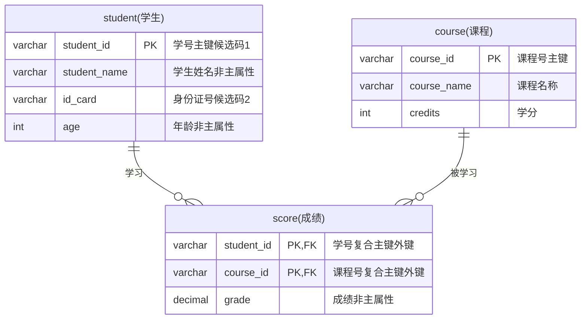
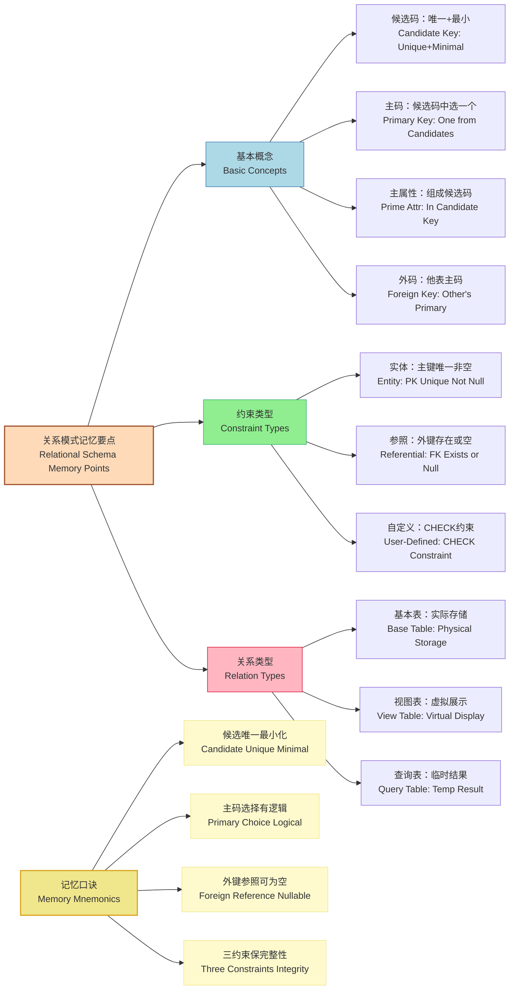

# 关系模式相关概念 (Relational Schema Concepts)

## 数据模型概述与关系模式基础 (Data Models Overview & Relational Schema Basics)

```mermaid
graph TD
    %% 数据库设计流程
    A["数据库设计流程<br/>Database Design Process"] --> B["需求分析<br/>Requirement Analysis"]
    B --> C["概念模型<br/>Conceptual Model"]
    C --> D["逻辑结构设计<br/>Logical Structure Design"]
    D --> E["数据模型转换<br/>Data Model Conversion"]
    
    %% 数据模型类型
    F["数据模型类型<br/>Data Model Types"] --> G["层次模型<br/>Hierarchical Model"]
    F --> H["网状模型<br/>Network Model"]
    F --> I["关系模型<br/>Relational Model"]
    F --> J["面向对象模型<br/>Object-Oriented Model"]
    
    G --> G1["树形结构<br/>Tree Structure"]
    G --> G2["父子关系<br/>Parent-Child Relationship"]
    G --> G3["组织结构图<br/>Organization Chart"]
    
    H --> H1["网状结构<br/>Network Structure"]
    H --> H2["随意联系<br/>Arbitrary Connections"]
    H --> H3["无层次关系<br/>No Hierarchical Relationship"]
    
    I --> I1["二维表形式<br/>Two-Dimensional Table"]
    I --> I2["行列结构<br/>Row-Column Structure"]
    I --> I3["软考重点<br/>Exam Focus"]
    
    J --> J1["对象为单位<br/>Object-Based"]
    J --> J2["面向对象思想<br/>OO Concepts"]
    
    %% 关系模式结构
    K["关系模式结构<br/>Relational Schema Structure"] --> L["关系模式名称<br/>Schema Name"]
    K --> M["属性集合<br/>Attribute Set"]
    K --> N["二维表对应<br/>Table Correspondence"]
    
    L --> L1["表名<br/>Table Name"]
    M --> M1["属性1, 属性2, ...<br/>Attr1, Attr2, ..."]
    N --> N1["列名对应属性<br/>Column Names as Attributes"]
    
    %% 数据模型三要素
    O["数据模型三要素<br/>Three Elements of Data Model"] --> P["数据结构<br/>Data Structure"]
    O --> Q["数据操作<br/>Data Operations"]
    O --> R["约束条件<br/>Constraints"]
    
    P --> P1["属性划分<br/>Attribute Division"]
    Q --> Q1["操作方式<br/>Operation Methods"]
    R --> R1["完整性约束<br/>Integrity Constraints"]
    
    %% 样式定义
    style A fill:#FFDAB9,stroke:#A0522D,stroke-width:2px
    style F fill:#ADD8E6,stroke:#4682B4,stroke-width:2px
    style I fill:#FFE4E1,stroke:#CD5C5C,stroke-width:2px
    style K fill:#F0FFF0,stroke:#228B22,stroke-width:2px
    style O fill:#E6E6FA,stroke:#9370DB,stroke-width:2px
```

## 关系模式核心概念详解 (Core Concepts of Relational Schema)

$$
\begin{array}{l}
\textbf{关系模式基本概念与术语} \\
\hline \\
\begin{array}{|c|l|l|l|}
\hline
\textbf{概念} & \textbf{定义} & \textbf{特点} & \textbf{示例} \\
\hline
\text{目(Degree)} & \text{关系模式中属性的个数} & \text{表示关系的复杂度} & \text{学生(学号,姓名,年龄)目为3} \\
\hline
\text{元组(Tuple)} & \text{关系中的一行记录} & \text{表示一个实体实例} & \text{(001,张三,20)} \\
\hline
\text{候选码} & \text{可以唯一标识元组} & \text{无冗余的属性集合} & \text{学号、身份证号} \\
\text{Candidate Key} & \text{且无冗余的属性集合} & \text{可以有多个} & \text{可以是单属性或多属性组合} \\
\hline
\text{主码/主键} & \text{从候选码中选择的一个} & \text{唯一且非空} & \text{选择学号作为主键} \\
\text{Primary Key} & \text{作为主要标识符} & \text{具有逻辑意义} & \text{而非身份证号} \\
\hline
\text{主属性} & \text{组成候选码的属性} & \text{参与唯一标识} & \text{学号、身份证号都是主属性} \\
\text{Prime Attribute} & \text{具有关键作用} & \text{不可缺少} & \text{在任何候选码中出现} \\
\hline
\text{非主属性} & \text{不组成候选码的属性} & \text{描述性属性} & \text{姓名、年龄等} \\
\text{Non-prime Attribute} & \text{不参与唯一标识} & \text{可以重复} & \text{提供额外信息} \\
\hline
\text{外码/外键} & \text{其他关系的主码} & \text{体现参照完整性} & \text{成绩表中的学号} \\
\text{Foreign Key} & \text{建立关系间联系} & \text{可以为空} & \text{参照学生表的学号} \\
\hline
\text{全码} & \text{所有属性组成候选码} & \text{极特殊情况} & \text{关系中所有属性} \\
\text{All Key} & \text{整个关系作为键} & \text{很少出现} & \text{都是候选码组成部分} \\
\hline
\end{array}
\end{array}
$$

## 候选码详解与实例分析 (Candidate Key Analysis & Examples)

$$
\begin{array}{l}
\textbf{候选码特性与分类详解} \\
\hline \\
\begin{array}{l}
\text{1. 候选码的基本特性:} \\
\quad \text{• 唯一标识性：能够唯一确定关系中的每一个元组} \\
\quad \text{• 最小性：不存在冗余，去掉任何一个属性都不能唯一标识} \\
\quad \text{• 非空性：候选码的值不能为空} \\
\\
\text{2. 候选码的数量特点:} \\
\quad \text{• 可以有多个：一个关系可以有多个候选码} \\
\quad \text{• 可以有一个：最常见的情况} \\
\quad \text{• 不能没有：每个关系至少要有一个候选码} \\
\\
\text{3. 候选码的组成特点:} \\
\quad \text{• 单属性候选码：如学号、身份证号} \\
\quad \text{• 多属性组合候选码：如(学号,课程号)} \\
\quad \text{• 全码：所有属性组成候选码(极特殊情况)} \\
\\
\text{4. 实例分析:} \\
\quad \text{学生关系：候选码有学号、身份证号(两个单属性候选码)} \\
\quad \text{成绩关系：候选码为(学号,课程号)(一个多属性候选码)} \\
\quad \text{主属性：学号、身份证号、课程号} \\
\quad \text{非主属性：学生姓名、年龄、成绩、课程名称、学分}
\end{array}
\end{array}
$$

## 关系类型与完整性约束 (Relation Types & Integrity Constraints)

```mermaid
graph TD
    %% 关系类型
    A["关系类型<br/>Relation Types"] --> B["基本关系表<br/>Base Relation"]
    A --> C["查询表<br/>Query Table"]
    A --> D["视图表<br/>View Table"]
    
    B --> B1["实际存储<br/>Physical Storage"]
    B --> B2["建表创建<br/>CREATE TABLE"]
    B --> B3["持久化数据<br/>Persistent Data"]
    
    C --> C1["查询结果<br/>Query Result"]
    C --> C2["临时表<br/>Temporary Table"]
    C --> C3["虚表<br/>Virtual Table"]
    
    D --> D1["数据抽取<br/>Data Extraction"]
    D --> D2["对外展示<br/>External Display"]
    D --> D3["虚表<br/>Virtual Table"]
    
    %% 完整性约束
    E["完整性约束<br/>Integrity Constraints"] --> F["实体完整性<br/>Entity Integrity"]
    E --> G["参照完整性<br/>Referential Integrity"]
    E --> H["用户自定义完整性<br/>User-Defined Integrity"]
    
    F --> F1["主键唯一<br/>Primary Key Unique"]
    F --> F2["主键非空<br/>Primary Key Not Null"]
    F --> F3["唯一标识<br/>Unique Identification"]
    
    G --> G1["外键约束<br/>Foreign Key Constraint"]
    G --> G2["参照其他表主键<br/>Reference Other Primary Key"]
    G --> G3["可以为空<br/>Can Be Null"]
    
    H --> H1["CHECK约束<br/>CHECK Constraint"]
    H --> H2["自定义条件<br/>Custom Conditions"]
    H --> H3["业务规则<br/>Business Rules"]
    
    %% 触发器
    I["触发器<br/>Trigger"] --> J["复杂约束<br/>Complex Constraints"]
    I --> K["监听变化<br/>Monitor Changes"]
    I --> L["自动执行<br/>Automatic Execution"]
    
    J --> J1["单条元组<br/>Single Tuple"]
    J --> J2["属性变化<br/>Attribute Changes"]
    K --> K1["INSERT监听<br/>INSERT Trigger"]
    K --> K2["UPDATE监听<br/>UPDATE Trigger"]
    K --> K3["DELETE监听<br/>DELETE Trigger"]
    L --> L1["触发执行<br/>Trigger Execution"]
    L --> L2["级联更新<br/>Cascade Update"]
    
    %% 样式定义
    style A fill:#FFDAB9,stroke:#A0522D,stroke-width:2px
    style E fill:#ADD8E6,stroke:#4682B4,stroke-width:2px
    style F fill:#FFE4E1,stroke:#CD5C5C
    style G fill:#F0FFF0,stroke:#228B22
    style H fill:#E6E6FA,stroke:#9370DB
    style I fill:#F0E68C,stroke:#DAA520,stroke-width:2px
```

$$
\begin{array}{l}
\textbf{完整性约束详解与实例} \\
\hline \\
\begin{array}{|c|l|l|l|}
\hline
\textbf{约束类型} & \textbf{约束内容} & \textbf{违反后果} & \textbf{实例说明} \\
\hline
\text{实体完整性} & \text{主键唯一且非空} & \text{无法插入或更新数据} & \text{不能有两个001学号} \\
\text{Entity Integrity} & \text{PRIMARY KEY约束} & \text{系统自动拒绝} & \text{主键不能为NULL} \\
\hline
\text{参照完整性} & \text{外键值必须在被参照} & \text{无法建立或维护} & \text{成绩表的学号必须} \\
\text{Referential Integrity} & \text{关系中存在或为空} & \text{关系间的联系} & \text{在学生表中存在} \\
\hline
\text{用户自定义} & \text{CHECK约束条件} & \text{违反业务规则} & \text{年龄CHECK(age>=0 AND age<=150)} \\
\text{User-Defined} & \text{自定义业务规则} & \text{数据不符合要求} & \text{性别CHECK(gender IN('男','女'))} \\
\hline
\end{array}
\\\\
\textbf{外键约束的两种可能值} \\
\hline \\
\begin{array}{l}
\text{1. 外键的有效值:} \\
\quad \text{• 其他关系的主键值：必须在被参照表中实际存在} \\
\quad \text{• NULL值：表示暂时未分配或不确定的情况} \\
\\
\text{2. 外键为空的典型场景:} \\
\quad \text{• 员工刚入职，尚未分配部门：部门号可以为NULL} \\
\quad \text{• 学生选课，某些课程尚未确定教师：教师号可以为NULL} \\
\quad \text{• 订单创建，但尚未分配配送员：配送员号可以为NULL} \\
\\
\text{3. 参照完整性的维护:} \\
\quad \text{• 插入：外键值必须在被参照表中存在或为NULL} \\
\quad \text{• 更新：新的外键值必须满足参照完整性} \\
\quad \text{• 删除：被参照的主键删除时需要处理外键} \\
\quad \text{• 级联操作：CASCADE、SET NULL、RESTRICT等}
\end{array}
\end{array}
$$

## 考试要点与实战应用 (Exam Points & Practical Application)

$$
\begin{array}{l}
\textbf{软考重点知识总结} \\
\hline \\
\begin{array}{|c|l|l|}
\hline
\textbf{知识点} & \textbf{考试重要性} & \textbf{掌握要点} \\
\hline
\text{候选码识别} & \text{中等频率} & \text{理解唯一性和最小性} \\
& \text{概念题为主} & \text{区分单属性和多属性候选码} \\
\hline
\text{主属性vs非主属性} & \text{较高频率} & \text{准确判断属性类型} \\
& \text{选择题常考} & \text{理解与候选码的关系} \\
\hline
\text{外键约束} & \text{中等频率} & \text{理解参照完整性} \\
& \text{完整性约束题} & \text{掌握外键的两种可能值} \\
\hline
\text{完整性约束} & \text{较高频率} & \text{三大类约束的区别} \\
& \text{数据库设计题} & \text{实体、参照、用户自定义} \\
\hline
\text{关系类型} & \text{较低频率} & \text{了解基本概念} \\
& \text{概念理解} & \text{基本表、视图、查询表} \\
\hline
\end{array}
\\\\
\textbf{典型考试题型与解题技巧} \\
\hline \\
\begin{array}{l}
\text{1. 候选码识别题:} \\
\quad \text{• 题型：给出关系模式，要求找出所有候选码} \\
\quad \text{• 技巧：逐一检查属性组合的唯一性和最小性} \\
\quad \text{• 注意：区分候选码数量和候选码组成属性数量} \\
\\
\text{2. 主属性判断题:} \\
\quad \text{• 题型：给出关系和候选码，判断哪些是主属性} \\
\quad \text{• 技巧：所有候选码中出现的属性都是主属性} \\
\quad \text{• 注意：一个属性只要在任一候选码中出现就是主属性} \\
\\
\text{3. 完整性约束题:} \\
\quad \text{• 题型：判断违反了哪种完整性约束} \\
\quad \text{• 技巧：主键问题→实体完整性，外键问题→参照完整性} \\
\quad \text{• 注意：CHECK约束属于用户自定义完整性} \\
\\
\text{4. 外键约束题:} \\
\quad \text{• 题型：判断外键值的合法性} \\
\quad \text{• 技巧：外键值要么是被参照表的主键值，要么为NULL} \\
\quad \text{• 注意：外键可以为空，但主键不能为空}
\end{array}
\end{array}
$$

## 记忆要点与总结 (Memory Points & Summary)

$$
\begin{array}{l}
\textbf{关系模式概念总结} \\
\hline \\
\begin{array}{|c|c|c|}
\hline
\textbf{概念层次} & \textbf{关键特征} & \textbf{考试重点} \\
\hline
\text{数据模型} & \text{关系模型是二维表} & \text{理解三要素：结构、操作、约束} \\
\hline
\text{候选码体系} & \text{唯一标识且最小} & \text{区分候选码、主码、主属性} \\
\hline
\text{完整性约束} & \text{保证数据质量} & \text{掌握三大类约束的应用} \\
\hline
\text{关系类型} & \text{基本表vs虚表} & \text{了解存储方式的区别} \\
\hline
\end{array}
\end{array}
$$

## 规范化理论-Armstrong公理体系 (Normalization Theory - Armstrong's Axioms)

$$
\begin{array}{l}
\textbf{Armstrong公理体系推导与记忆} \\
\hline \\
\begin{array}{l}
\text{设关系模式 } R \langle U, F \rangle \text{，其中 } U \text{ 是属性集，} F \text{ 是函数依赖集} \\
\\
\textbf{基本公理 (Basic Axioms):} \\
\\
\text{A1. 自反律 (Reflexivity):} \\
\quad \text{若 } Y \subseteq X \subseteq U \text{，则 } X \rightarrow Y \text{ 成立} \\
\quad \text{记忆：子集总是被父集决定} \\
\quad \text{例：} \{学号,姓名\} \rightarrow \{学号\} \\
\\
\text{A2. 增广律 (Augmentation):} \\
\quad \text{若 } Z \subseteq U \text{ 且 } X \rightarrow Y \text{，则 } XZ \rightarrow YZ \text{ 成立} \\
\quad \text{记忆：两边同时增加相同属性，依赖关系保持} \\
\quad \text{例：若 } 学号 \rightarrow 姓名 \text{，则 } \{学号,班级\} \rightarrow \{姓名,班级\} \\
\\
\text{A3. 传递律 (Transitivity):} \\
\quad \text{若 } X \rightarrow Y \text{ 且 } Y \rightarrow Z \text{，则 } X \rightarrow Z \text{ 成立} \\
\quad \text{记忆：函数依赖具有传递性} \\
\quad \text{例：若 } 学号 \rightarrow 班级 \text{ 且 } 班级 \rightarrow 班主任 \text{，则 } 学号 \rightarrow 班主任 \\
\\
\textbf{推导规则 (Derived Rules):} \\
\\
\text{合并规则 (Union Rule):} \\
\quad \text{由 } X \rightarrow Y \text{ 和 } X \rightarrow Z \text{，得 } X \rightarrow YZ \\
\quad \textbf{推导过程：} \\
\quad \quad \text{1) } X \rightarrow Y \text{ (已知)} \\
\quad \quad \text{2) } X \rightarrow Z \text{ (已知)} \\
\quad \quad \text{3) } XY \rightarrow YZ \text{ (由2和A2增广律)} \\
\quad \quad \text{4) } X \rightarrow XY \text{ (由1和A2增广律)} \\
\quad \quad \text{5) } X \rightarrow YZ \text{ (由4,3和A3传递律)} \\
\\
\text{伪传递规则 (Pseudo-transitivity Rule):} \\
\quad \text{由 } X \rightarrow Y \text{ 和 } WY \rightarrow Z \text{，得 } XW \rightarrow Z \\
\quad \textbf{推导过程：} \\
\quad \quad \text{1) } X \rightarrow Y \text{ (已知)} \\
\quad \quad \text{2) } WY \rightarrow Z \text{ (已知)} \\
\quad \quad \text{3) } XW \rightarrow YW \text{ (由1和A2增广律)} \\
\quad \quad \text{4) } XW \rightarrow Z \text{ (由3,2和A3传递律)} \\
\\
\text{分解规则 (Decomposition Rule):} \\
\quad \text{由 } X \rightarrow YZ \text{ 且 } Z \subseteq Y \text{，得 } X \rightarrow Z \\
\quad \textbf{推导过程：} \\
\quad \quad \text{1) } X \rightarrow YZ \text{ (已知)} \\
\quad \quad \text{2) } YZ \rightarrow Z \text{ (由A1自反律，因为 } Z \subseteq YZ \text{)} \\
\quad \quad \text{3) } X \rightarrow Z \text{ (由1,2和A3传递律)} \\
\\
\textbf{记忆口诀：} \\
\quad \text{自反子集被决定，增广两边加相同} \\
\quad \text{传递依赖可传导，合并分解伪传递} \\
\quad \text{Armstrong三公理，推导规则要牢记}
\end{array}
\end{array}
$$

$$
\begin{array}{l}
\textbf{函数依赖推导实例与应用} \\
\hline \\
\begin{array}{l}
\text{例：设关系模式 } R(A,B,C,D,E) \text{，函数依赖集 } F = \{A \rightarrow BC, CD \rightarrow E, B \rightarrow D, E \rightarrow A\} \\
\\
\textbf{求解 } A^+ \text{ (A的闭包):} \\
\\
\text{步骤1：初始化 } A^+ = \{A\} \\
\\
\text{步骤2：应用 } A \rightarrow BC \\
\quad A^+ = \{A, B, C\} \\
\\
\text{步骤3：应用 } B \rightarrow D \text{ (因为 } B \in A^+ \text{)} \\
\quad A^+ = \{A, B, C, D\} \\
\\
\text{步骤4：应用 } CD \rightarrow E \text{ (因为 } \{C,D\} \subseteq A^+ \text{)} \\
\quad A^+ = \{A, B, C, D, E\} \\
\\
\text{结论：} A^+ = \{A, B, C, D, E\} = U \text{，所以 } A \text{ 是候选码} \\
\\
\textbf{验证推导规则应用：} \\
\\
\text{1. 合并规则验证：} \\
\quad \text{已知：} A \rightarrow B \text{ 和 } A \rightarrow C \\
\quad \text{推导：} A \rightarrow BC \text{ ✓} \\
\\
\text{2. 传递律验证：} \\
\quad \text{已知：} A \rightarrow B \text{ 和 } B \rightarrow D \\
\quad \text{推导：} A \rightarrow D \text{ ✓} \\
\\
\text{3. 伪传递规则验证：} \\
\quad \text{已知：} A \rightarrow C \text{ 和 } CD \rightarrow E \\
\quad \text{推导：} AD \rightarrow E \\
\quad \text{验证：} AD \rightarrow CD \text{ (增广律)} \text{，} CD \rightarrow E \text{ (已知)} \\
\quad \text{所以：} AD \rightarrow E \text{ (传递律)} \text{ ✓}
\end{array}
\end{array}
$$

---

**总结**：关系模式相关概念是数据库逻辑结构设计的理论基础，涵盖了候选码、主码、完整性约束等核心概念。Armstrong公理体系为函数依赖的推导提供了严格的数学基础，通过三个基本公理可以推导出所有有效的函数依赖。在软考中，重点掌握候选码的识别、主属性与非主属性的区分、以及三大完整性约束的应用。这些概念不仅是上午选择题的考点，更是理解后续数据库规范化理论的重要基础。