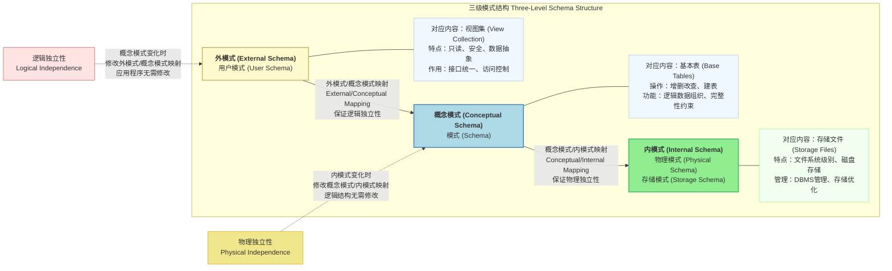
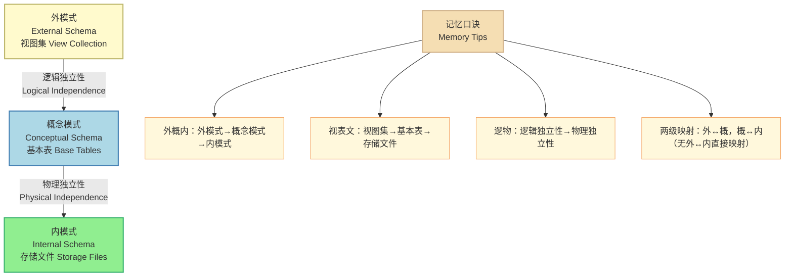

# 数据库三级模式结构 (Three-Level Schema Architecture)

## 概述与分层设计理念 (Overview & Layered Design Philosophy)

```mermaid
graph TD
    %% 概述部分
    A["<strong>数据库三级模式结构</strong><br/>Three-Level Schema Architecture"] --> B["适用范围<br/>Application Scope"]
    A --> C["考试重点<br/>Exam Focus"]
    A --> D["核心概念<br/>Core Concepts"]
    
    B --> B1["集中式数据库<br/>Centralized Database"]
    B --> B2["CS架构数据库<br/>Client-Server Architecture"]
    B --> B3["Oracle, SQL Server等<br/>Commercial DBMS"]
    
    C --> C1["考试频率：较高<br/>High Frequency"]
    C --> C2["分值：约1分<br/>~1 Point"]
    C --> C3["重点：映射关系<br/>Focus: Mapping Relations"]
    
    D --> D1["三级模式<br/>Three Schemas"]
    D --> D2["两级映射<br/>Two-Level Mapping"]
    D --> D3["数据独立性<br/>Data Independence"]
    
    %% 分层设计理念
    E["数据管理发展历程<br/>Data Management Evolution"] --> F["手工记录<br/>Manual Records"]
    F --> G["在线数据管理<br/>Online Data Management"]
    G --> H["CS结构数据库系统<br/>Client-Server Database System"]
    
    I["问题分析<br/>Problem Analysis"] --> J["强耦合问题<br/>Tight Coupling Issues"]
    J --> J1["应用程序直接访问物理文件<br/>Direct File Access"]
    J --> J2["文件位置变化需修改程序<br/>Location Changes Require Code Changes"]
    J --> J3["数据结构变化影响应用<br/>Schema Changes Affect Applications"]
    
    K["解决方案<br/>Solution"] --> L["分层解耦<br/>Layered Decoupling"]
    L --> L1["增加中间层次<br/>Add Intermediate Layers"]
    L --> L2["映射关系处理<br/>Mapping Relationships"]
    L --> L3["独立性保证<br/>Independence Guarantee"]
    
    %% 样式定义
    style A fill:#FFDAB9,stroke:#A0522D,stroke-width:2px
    style B fill:#ADD8E6,stroke:#4682B4
    style C fill:#FFE4E1,stroke:#CD5C5C
    style D fill:#F0FFF0,stroke:#228B22
    style E fill:#E6F3FF,stroke:#4A90E2
    style I fill:#FFE6E6,stroke:#E24A4A
    style K fill:#E6FFE6,stroke:#4AE24A
```

## 三级模式详解与映射关系 (Three Schema Levels & Mapping Relations)

## 考试要点与典型题目 (Exam Key Points & Typical Questions)

$$
\begin{array}{l}
\textbf{三级模式对应关系与两级映射总结} \\
\hline \\
\begin{array}{|c|c|c|c|}
\hline
\textbf{模式级别} & \textbf{别名} & \textbf{对应内容} & \textbf{主要特点} \\
\hline
\text{外模式} & \text{用户模式} & \text{视图集} & \text{面向用户，只读访问，安全性高} \\
\text{External Schema} & \text{User Schema} & \text{View Collection} & \text{数据抽象和封装} \\
\hline
\text{概念模式} & \text{模式} & \text{基本表} & \text{数据库逻辑结构} \\
\text{Conceptual Schema} & \text{Schema} & \text{Base Tables} & \text{完整性约束定义，全局数据视图} \\
\hline
\text{内模式} & \text{物理模式} & \text{存储文件} & \text{物理存储结构} \\
\text{Internal Schema} & \text{Storage Schema} & \text{Storage Files} & \text{文件组织方式，存储路径管理} \\
\hline
\end{array}
\\\\
\textbf{两级映射关系与数据独立性} \\
\hline \\
\begin{array}{|c|l|l|l|}
\hline
\textbf{映射类型} & \textbf{映射关系} & \textbf{保证的独立性} & \textbf{修改内容} \\
\hline
\text{第一级映射} & \text{外模式 ↔ 概念模式} & \text{逻辑独立性} & \text{视图定义和生成规则} \\
\hline
\text{第二级映射} & \text{概念模式 ↔ 内模式} & \text{物理独立性} & \text{存储路径和文件配置} \\
\hline
\end{array}
\\\\
\textbf{映射过程详解} \\
\hline \\
\begin{array}{l}
\text{1. 外模式/概念模式映射 (External/Conceptual Mapping):} \\
\quad \text{• 映射过程：从基本表中抽取所需数据，通过SQL语句或DBMS工具创建视图} \\
\quad \text{• 应用场景：第三方系统访问、数据安全、接口稳定} \\
\quad \text{• 独立性保证：概念模式变化时，修改映射关系，应用程序无需修改} \\
\\
\text{2. 概念模式/内模式映射 (Conceptual/Internal Mapping):} \\
\quad \text{• 映射过程：逻辑表与物理文件的地址映射，DBMS管理文件路径和存储位置} \\
\quad \text{• 应用场景：数据库迁移、存储优化、硬件升级} \\
\quad \text{• 独立性保证：物理存储变化时，修改地址映射，应用程序和逻辑结构无需修改}
\end{array}
\\\\
\textbf{典型考试题目解析} \\
\hline \\
\begin{array}{l}
\text{例题1：以下关于数据库两级映射的叙述中，正确的是（ ）。} \\
\text{A. 模式/内模式的映射实现了外模式到内模式之间的相互转换} \\
\text{B. 模式/内模式的映射实现了概念模式到内模式之间的相互转换} \\
\text{C. 外模式/模式的映射实现了概念模式到内模式之间的转换} \\
\text{D. 外模式到内模式的映射实现了外模式到内模式之间的相互转换} \\
\\
\text{解析：} \\
\quad \text{• A选项：模式/内模式映射与外模式无关 ❌} \\
\quad \text{• B选项：模式/内模式映射确实实现概念模式与内模式间转换 ✅} \\
\quad \text{• C选项：外模式/模式映射与内模式无关 ❌} \\
\quad \text{• D选项：不存在外模式直接到内模式的映射 ❌} \\
\quad \text{答案：B} \\
\\
\text{例题2：数据的物理独立性和逻辑独立性分别是通过修改（ ）来完成的。} \\
\text{A. 外模式/内模式映射，外模式/模式映射} \\
\text{B. 外模式/内模式映射，模式/内模式映射} \\
\text{C. 模式/内模式映射，外模式/内模式映射} \\
\text{D. 模式/内模式映射，外模式/模式映射} \\
\\
\text{解析：} \\
\quad \text{• 物理独立性：内模式变化时保持应用程序不变 → 修改模式/内模式映射} \\
\quad \text{• 逻辑独立性：概念模式变化时保持应用程序不变 → 修改外模式/模式映射} \\
\quad \text{• 注意：不存在外模式与内模式的直接映射关系} \\
\quad \text{答案：D} \\
\\
\text{例题3：数据库系统通常采用三级模式结构：外模式、模式和内模式。这三级模} \\
\text{式分别对应数据库的（ ）。} \\
\text{A. 基本表、存储文件和视图} \\
\text{B. 视图、基本表和存储文件} \\
\text{C. 基本表、视图和存储文件} \\
\text{D. 视图、存储文件和基本表} \\
\\
\text{解析：} \\
\quad \text{• 外模式 (External Schema) → 视图 (View)} \\
\quad \text{• 模式 (Schema) / 概念模式 (Conceptual Schema) → 基本表 (Base Table)} \\
\quad \text{• 内模式 (Internal Schema) → 存储文件 (Storage File)} \\
\quad \text{• 记忆口诀："外概内" 对应 "视表文"} \\
\quad \text{答案：B}
\end{array}
\end{array}
$$

## 记忆要点 (Memory Points)

### 核心记忆口诀与关键概念对比

$$
\begin{array}{l}
\textbf{关键概念对比总结} \\
\hline \\
\begin{array}{|c|c|c|}
\hline
\textbf{概念} & \textbf{逻辑独立性} & \textbf{物理独立性} \\
\hline
\text{变化层次} & \text{概念模式变化} & \text{内模式变化} \\
\hline
\text{修改内容} & \text{外模式/概念模式映射} & \text{概念模式/内模式映射} \\
\hline
\text{不变内容} & \text{应用程序和外模式} & \text{应用程序和逻辑结构} \\
\hline
\text{典型场景} & \text{表结构调整、业务变更} & \text{数据库迁移、存储优化} \\
\hline
\end{array}
\end{array}
$$

---

**总结**：数据库三级模式结构通过分层设计和两级映射，实现了数据的逻辑独立性和物理独立性，是数据库系统设计的重要理论基础。在软考中，重点掌握三级模式的对应关系、两级映射的作用机制，以及数据独立性的实现原理。