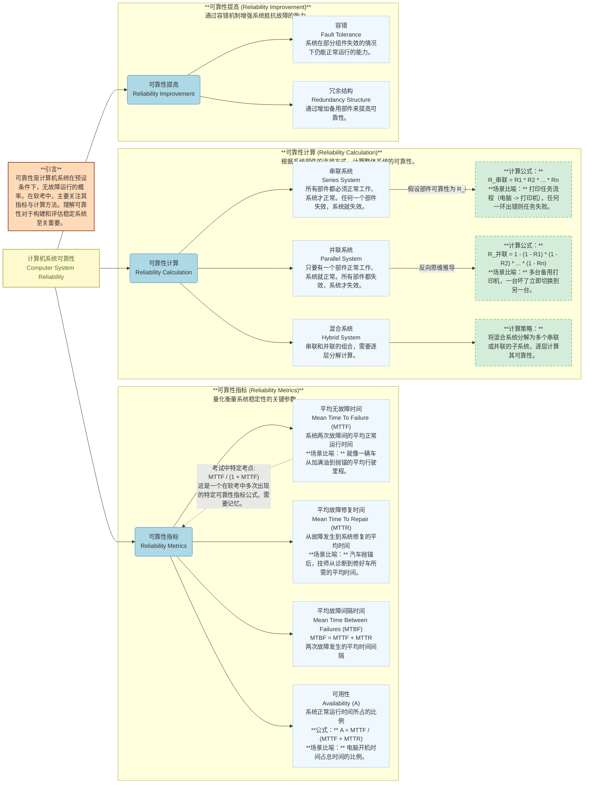

# 计算机可靠性 (Computer Reliability)

## 引言 (Introduction)

可靠性是衡量计算机系统在给定时间间隔内，在特定条件下无失效运行能力的概率。在软件设计师考试中，可靠性部分通常占据1到2分，主要考察可靠性指标的定义和可靠性计算问题。理解这些概念对于评估和设计高可用系统至关重要。

## 可靠性指标详解 (Detailed Explanation of Reliability Metrics)

在软件设计师考试中，有几个核心的可靠性指标需要掌握：

1.  **平均无故障时间 (Mean Time To Failure, MTTF)**
    *   **定义**：指系统从开始正常运行到发生第一次故障的平均时间，或者两次相邻故障之间的平均正常运行时间。它衡量了系统在无故障状态下持续运行的能力。
    *   **场景比喻**：想象一辆新车，从你购买（或上次大修）开始，到它第一次因为故障而无法行驶的平均时间。MTTF 越高，说明这辆车"抗跑"能力越强，越不容易坏。

2.  **平均故障修复时间 (Mean Time To Repair, MTTR)**
    *   **定义**：指从系统发生故障到故障被修复并恢复正常运行的平均时间。它衡量了系统维护和恢复的效率。
    *   **场景比喻**：你的汽车抛锚了，从你打电话给修理工到修理工将车修好，并能再次启动行驶的平均时间。MTTR 越短，说明维修效率越高，车子能更快回到路上。

3.  **平均故障间隔时间 (Mean Time Between Failures, MTBF)**
    *   **定义**：指两次相邻故障发生之间的平均时间间隔。它实际上是平均无故障时间 (MTTF) 和平均故障修复时间 (MTTR) 的总和。
    *   **公式**：$MTBF = MTTF + MTTR$
    *   **场景比喻**：从你开车开始，到它下一次抛锚的平均总时间。这个时间包含了你开车的这段时间（MTTF）以及它抛锚后等待修理和修理的这段时间（MTTR）。

4.  **可用性 (Availability, A)**
    *   **定义**：衡量系统在给定时间段内处于可操作状态的比例。它表示系统在需要时能够正常工作的概率。在软考中，可用性和可靠性有时会被视为近似概念。
    *   **公式**：$A = \frac{MTTF}{MTTF + MTTR} = \frac{MTTF}{MTBF}$
    *   **场景比喻**：一家24小时营业的便利店，可用性就是它开门营业的时间占24小时的比例。如果它因为停电、装修等原因关闭了一段时间，那么可用性就会下降。

    **软考特定可靠性指标：**
    在软件设计师考试中，还出现过一个特殊的可靠性指标表达式，虽然其理论来源不明确，但作为考点需要记住：
    $$
    R_{考试} = \frac{MTTF}{1 + MTTF}
    $$

## 可靠性计算模型 (Reliability Calculation Models)

系统通常由多个部件组成，这些部件的连接方式决定了整个系统的可靠性。

### 1. 串联系统 (Series System)

*   **特点**：所有部件都必须正常工作，系统才能正常运行。任何一个部件的失效都会导致整个系统的失效。
*   **场景比喻**：想象一个团队，每个成员负责一个环环相扣的任务。只要有一个成员掉链子，整个项目就无法推进。例如，打印任务需要"电脑正常"、"网络正常"、"打印机正常"三个环节都可靠才能成功打印。

*   **计算公式**：
    假设系统由 $n$ 个部件串联组成，每个部件的可靠性分别为 $R_1, R_2, \dots, R_n$。则整个串联系统的可靠性 $R_{串联}$ 为：
    $$
    R_{串联} = R_1 \times R_2 \times \dots \times R_n
    $$
    **核心思想**：因为所有部件都必须同时可靠，所以其可靠性是各部件可靠性的乘积。

### 2. 并联系统 (Parallel System)

*   **特点**：只要有一个部件正常工作，系统就能正常运行。只有当所有部件都失效时，整个系统才失效。并联系统常用于实现冗余，提高系统可靠性。
*   **场景比喻**：一家公司有多个销售代表，只要其中一位能成功签下合同，公司的销售目标就能达成。再比如，你有多台打印机，一台坏了，可以立即切换到另一台备用打印机，不影响打印任务的完成。

*   **计算公式**：
    假设系统由 $n$ 个部件并联组成，每个部件的可靠性分别为 $R_1, R_2, \dots, R_n$。
    并联系统的可靠性通常通过**反向思维**计算，即先计算所有部件都失效的概率，再用 1 减去这个概率。
    单个部件失效的概率为 $1 - R_i$。
    所有部件同时失效的概率为 $(1 - R_1) \times (1 - R_2) \times \dots \times (1 - R_n)$。
    则整个并联系统的可靠性 $R_{并联}$ 为：
    $$
    R_{并联} = 1 - (1 - R_1) \times (1 - R_2) \times \dots \times (1 - R_n)
    $$
    **核心思想**：通过冗余来降低系统失效的风险。

### 3. 混合系统 (Hybrid System)

*   **特点**：实际系统往往是串联和并联的混合结构。
*   **计算策略**：将复杂的混合系统分解为更小的串联子系统和并联子系统，然后逐层计算其可靠性。

*   **场景比喻**：一个数据中心，服务器可能采用并联（多台互为备份），但电源供应系统和网络连接可能又是串联的（任何一个中断都会影响所有服务器）。在计算整体可靠性时，我们需要先算出服务器集群的可靠性，再将其与电源和网络的可靠性进行串联计算。

## 真题解析 (Exam Question Analysis)

### 例题一：软件可靠性指标 (Software Reliability Metric)

**题目**：软件可靠性指的是系统在给定的时间间隔内，给定条件下无失效运行的概率。若用 $MTTF$ 和 $MTTR$ 分别表示平均无故障时间和平均修复时间，以下哪一个可以表示软件的可靠性？
A. $MTTR / (MTTF + MTTR)$
B. $MTTF / (MTTF + MTTR)$
C. $MTTF / (1 + MTTF)$
D. $MTTF \times MTTR$

**解析**：
本题考察对软件可靠性特定指标的记忆。根据软考的考纲，虽然可用性的标准公式是 $MTTF / (MTTF + MTTR)$，但在实际考试中，题目明确提出"软件可靠性"时，有时特指一个在软考系列中多次出现的表达式。

$$
\begin{array}{|c|l|l|}
\hline
\textbf{选项} & \textbf{表达式} & \textbf{分析与结论} \\
\hline
\text{A} & MTTR / (MTTF + MTTR) & \begin{array}{l} \text{此为系统不可用性 (Unavailability) 的计算公式，表示系统处于故障状态的比例。} \\ \textbf{结论：错误} \end{array} \\
\hline
\text{B} & MTTF / (MTTF + MTTR) & \begin{array}{l} \text{此为系统可用性 (Availability) 的标准计算公式。虽然可用性与可靠性密切相关, } \\ \text{但在本题特指"软件可靠性"且有特定选项时，需考虑考试惯例。} \\ \textbf{结论：通常表示可用性，但非本题特指的"软件可靠性"考点} \end{array} \\
\hline
\text{C} & MTTF / (1 + MTTF) & \begin{array}{l} \text{这是软件设计师考试中反复出现的一个表示"软件可靠性"的特定表达式。} \\ \text{它没有明确的通用理论来源，但作为考点需要直接记忆。} \\ \textbf{结论：正确} \end{array} \\
\hline
\text{D} & MTTF \times MTTR & \begin{array}{l} \text{此表达式无实际可靠性或可用性意义。} \\ \textbf{结论：错误} \end{array} \\
\hline
\end{array}
$$
**最终答案**：C

### 例题二：系统可靠性计算 (System Reliability Calculation)

**题目**：某系统由三个部件构成，每个部件的千小时可靠度都是 $R$。如果该系统千小时可靠度表达式为 $R \times (1 - (1 - R)^2)$，那么它的构成方式是什么？

A. 三个部件串联。
B. 三个部件并联。
C. 前面两个部件并联，再与第三个部件串联。
D. 第一个部件与后两个部件并联构成的子系统串联。

**解析**：
我们需要分析给定表达式 $R \times (1 - (1 - R)^2)$ 对应的系统结构。

1.  **分析表达式的组成部分**：
    *   最外部是乘法 $R \times \dots$，这通常表示串联关系。
    *   内部是 $(1 - (1 - R)^2)$，这符合并联系统的计算公式 $1 - (1 - R_1) \times (1 - R_2) \times \dots$。在这里，$R_1$ 和 $R_2$ 都被 $R$ 所取代，且只有两个部件，所以是 $1 - (1 - R) \times (1 - R)$，即 $1 - (1 - R)^2$。这表示两个可靠性均为 $R$ 的部件进行并联。

2.  **组合分析**：
    *   表达式可以解读为：一个可靠性为 $R$ 的部件，与一个由两个可靠性均为 $R$ 的部件并联组成的子系统，再进行串联。

3.  **对应选项**：
    *   A. 三个部件串联：可靠性应为 $R \times R \times R = R^3$。不符。
    *   B. 三个部件并联：可靠性应为 $1 - (1 - R)^3$。不符。
    *   C. **前面两个部件并联，再与第三个部件串联**：
        *   前面两个部件并联的可靠性：$1 - (1 - R)^2$。
        *   再与第三个部件（可靠性为 $R$）串联：$(1 - (1 - R)^2) \times R$。
        *   这与题目给定的表达式完全一致。
    *   D. 第一个部件与后两个部件并联构成的子系统串联：
        *   这与 C 选项在逻辑上描述的是同一种结构，只是表述顺序不同。在可靠性计算中，串联的顺序不影响结果。但在选择最佳描述时，通常会选择更直接的。

$$
\begin{array}{|c|l|l|}
\hline
\textbf{选项} & \textbf{描述} & \textbf{对应的可靠性表达式} \\
\hline
\text{A} & 三个部件串联 & $R \times R \times R = R^3$ \\
\hline
\text{B} & 三个部件并联 & $1 - (1 - R) \times (1 - R) \times (1 - R) = 1 - (1 - R)^3$ \\
\hline
\text{C} & 前面两个部件并联，再与第三个部件串联 & $(1 - (1 - R)^2) \times R$ \\
\hline
\text{D} & 第一个部件与后两个部件并联构成的子系统串联 & $R \times (1 - (1 - R)^2)$ \\
\hline
\end{array}
$$

**最终答案**：C 或 D。在实际考试中，通常会选择其中一个作为正确答案，因为它们描述的是同一种结构。本例中，C 选项的描述更直接地对应了表达式的结构。

## 总结 (Conclusion)

通过本节学习，我们了解了计算机系统可靠性的基本概念、核心指标（MTTF、MTTR、MTBF、可用性）及其计算方法。掌握串联、并联和混合系统的可靠性计算是软考中的重要考点。同时，也需要注意软考中出现的特定可靠性指标表达式。在实际系统设计中，通过容错和冗余结构可以有效提高系统的可靠性。 