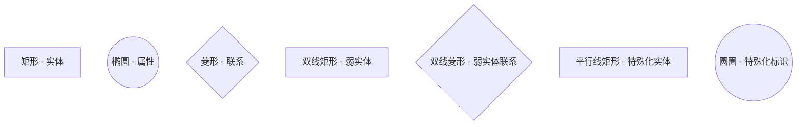
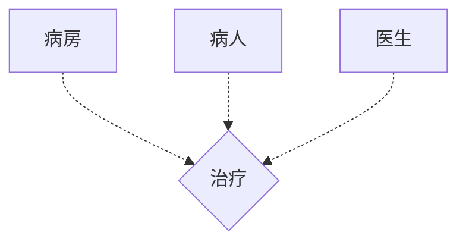
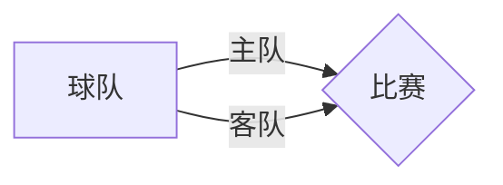
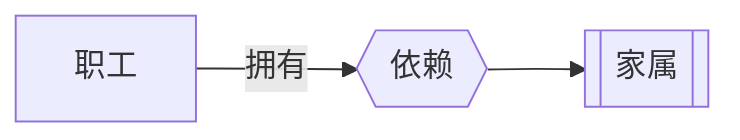
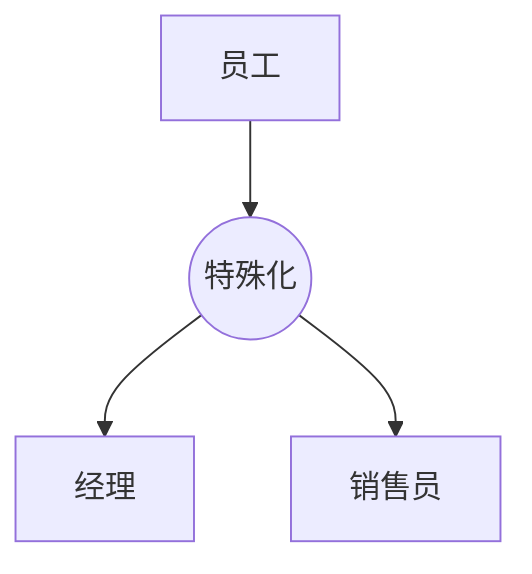
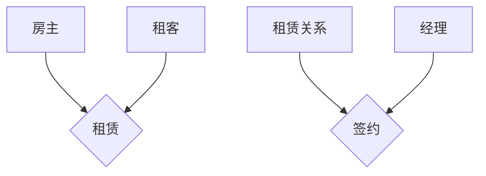

# E-R图概念设计 - 软考备考笔记

## 📚 知识点概述

E-R图（Entity-Relationship Diagram，实体关系图）是数据库概念设计阶段的重要工具，是软考下午软件设计题的重要基础知识。

## 🎯 基本概念

### E-R图定义
- **E**：Entity（实体）
- **R**：Relationship（关系/联系）
- 也称为实体联系图

### 基本图元表示方法

## 🏗️ 实体（Entity）

### 实体概念
- **定义**：现实世界中能够区别于其他事物的事件
- **实体集**：多个具有相同属性的实体归为一类

### 实体表示
- 用**矩形**表示
- 实体名称写在矩形内部

## 🏷️ 属性（Attribute）

### 属性基本概念
- **定义**：实体某方面的特性
- **适用范围**：不仅限于实体，联系也可以存在属性
- **表示方法**：用椭圆形表示，以线条连接实体或联系

### 属性分类体系

#### 1. 按复杂度分类

**简单属性 vs 复合属性**

$$\text{简单属性} = \text{原子的、不可再分割的属性}$$

$$\text{复合属性} = \text{可以细分为更小部分的属性}$$

- **简单属性示例**：姓名（通常情况）、年龄
- **复合属性示例**：
  - 地址 → 省、市、街道
  - 姓名 → 姓、名（特殊要求下）

#### 2. 按值的数量分类

**单值属性 vs 多值属性**

- **单值属性**：特定实体只有单独一个值
- **多值属性**：可以对应一组值
  - 示例：联系电话（可能有多个）
  - 示例：家长姓名（可能有多个）

#### 3. 特殊属性类型

**NULL属性**
- 表示空属性（没有意义或不知道）
- 在相应属性上记录值为NULL

**派生属性**
- 可以由其他属性得来的属性
- 示例：
  - 通过身份证号 → 推算年龄
  - 通过出生年月 → 推算年龄  
  - 通过单价×数量 → 计算销售总额

## 🔗 联系（Relationship）

### 联系基本概念
- **定义**：实体之间或实体内部的关联关系
- **表示方法**：用菱形表示
- **分类**：
  - 实体内部联系
  - 实体与实体之间联系

### 联系类型与多重度分析

#### 二元联系多重度

**分析方法：选择核心实体法**
1. 选择一个实体作为核心
2. 假设另一端实体数量为1
3. 分析核心实体的多重度
4. 交换核心，重复分析

#### 1. 一对一联系（1:1）

$$\text{实体A} \stackrel{1:1}{\longleftrightarrow} \text{实体B}$$

**示例**：班级 ↔ 班长
- 一个班级 → 一个班长
- 一个班长 → 一个班级

#### 2. 一对多联系（1:N）

$$\text{实体A} \stackrel{1:N}{\longrightarrow} \text{实体B}$$

**示例**：班级 → 学员
- 一个班级 → 多个学员
- 一个学员 → 一个班级

**注意**：具有方向性
- 班级对学员：一对多（1:N）
- 学员对班级：多对一（N:1）

#### 3. 多对多联系（M:N）

$$\text{实体A} \stackrel{M:N}{\longleftrightarrow} \text{实体B}$$

**示例**：学员 ↔ 课程
- 一个学员 → 多个课程
- 一个课程 → 多个学员

**重要提醒**：多对多关系中，不要使用相同字母（如N:N），应使用不同字母（如M:N、P:K）

### 三元联系

#### 分析方法
1. 选择一个实体作为核心
2. 假设另外两个实体都只有一个实例
3. 只要有一端分析结果是"多"，整体多重度就是"多"

#### 示例分析

**病房-病人-医生三元联系**

**分析过程**：
- 以病房为核心：一个病人住一个病房，一个医生管一个病房 → 病房端多重度为1
- 以病人为核心：一个病房住多个病人，一个医生治多个病人 → 病人端多重度为多
- 以医生为核心：一个病房有一个医生，一个病人有多个医生 → 医生端多重度为多

### 同一实体集内部的二元联系

**示例**：球队比赛关系
- 主队和客队都来源于球队实体集
- 在联系上标注身份和多重度

## 🔧 扩展E-R模型

### 1. 弱实体（Weak Entity）

#### 概念特征
- **定义**：不能独立存在，必须依赖于其他实体而存在
- **表示方法**：双线矩形
- **联系表示**：双线菱形

#### 典型示例
- 邮件 ← 附件（附件依赖邮件存在）
- 学生 ← 家长信息（家长信息依赖学生存在）
- 职工 ← 家属（家属依赖职工存在）

### 2. 特殊化（Specialization）

#### 概念特征
- **定义**：父类与子类之间的抽象关系
- **表示方法**：
  - 特殊化标识：圆圈
  - 特殊实体：平行线矩形

#### 典型示例
员工的特殊化：经理、销售员

### 3. 聚集关系（Aggregation）

#### 概念特征
- **定义**：将一个联系作为另一个联系的一端
- **表示方法**：用大矩形将联系圈起来

#### 示例
经理与租赁合同的签约关系

## 📋 重要考点总结

### 多重度分析口诀
1. **选核心**：选择一个实体作为分析核心
2. **假设一**：假设另一端实体数量为1
3. **看核心**：分析核心实体的数量关系
4. **交换核**：交换核心重复分析

### 三元联系判断标准
- 在同一个语句（句号或分号内）描述的过程中
- 涉及三个实体的情况
- 考虑是否存在三元联系

### 软件设计题应用要点
1. **实体识别**：从需求中提取关键名词
2. **属性归类**：确定每个实体的属性
3. **联系分析**：使用核心分析法确定多重度
4. **特殊情况**：注意弱实体、特殊化、聚集关系

## 🎯 考试重点

### 必须掌握的概念
- [ ] E-R图基本图元及表示方法
- [ ] 实体、属性、联系的概念和分类
- [ ] 多重度分析方法（核心分析法）
- [ ] 三元联系的判断和分析
- [ ] 弱实体、特殊化、聚集关系的识别

### 常见考试题型
1. **给定需求画E-R图**
2. **分析实体间联系的多重度**
3. **识别弱实体和特殊化关系**
4. **三元联系的建模**

---

**备注**：本笔记基于软考数据库系统概念设计阶段的E-R图网课内容整理，是下午软件设计题的重要理论基础。
