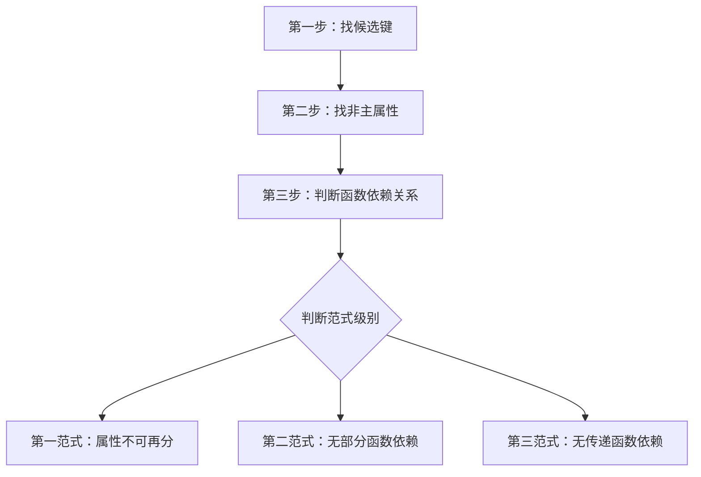

# 规范化理论 - 范式判断

## 概述

规范化理论是数据库设计中的重要概念，主要用于解决关系模式中的数据冗余和异常问题。在软件设计师考试中：
- **上午题**：给定情景判断关系模式的规范化程度
- **下午题**：考察规范化问题及解决方案

## 规范化存在的问题

### 问题类型
当关系模式未达到第三范式时，会存在以下四类问题：

1. **数据冗余**
   - 大量重复数据记录
   - 占用不必要的存储空间

2. **修改异常**
   - 数据修改时容易出现不一致
   - 需要修改多处相同数据

3. **插入异常**
   - 新增数据时主键为空无法插入
   - 例：新教师未授课时无法记录教师信息

4. **删除异常**
   - 删除记录时可能丢失有用信息
   - 例：学生毕业删除选课记录时教师信息也被删除

> **重要提示**：只要关系模式未达到第三范式，以上四个问题都会存在

## 范式判断方法

### 范式判断三步法



### 第一范式（1NF）

**定义**：关系模式中所有属性都是不可再分的数据项

**判断要点**：
- 属性值必须是原子性的
- 不能包含可分解的复合属性
- 题目通常会明确指出哪些属性可拆分

**示例**：
```
不满足1NF：系名称 | 高级职称人数(教授+副教授)
满足1NF：  系名称 | 教授人数 | 副教授人数
```

### 第二范式（2NF）

**定义**：满足1NF，且每个非主属性完全依赖于候选键（无部分函数依赖）

**关键概念**：
- **非主属性**：不属于任何候选键的属性
- **完全依赖**：非主属性依赖于候选键的全部属性
- **部分函数依赖**：非主属性只依赖于候选键的一部分

**判断步骤**：
1. 找出候选键
2. 确定非主属性
3. 检查是否存在非主属性对候选键的部分函数依赖

**示例分析**：
```
关系模式：R(学号, 课程号, 成绩, 学分)
函数依赖：学号,课程号 → 成绩
         课程号 → 学分

候选键：(学号, 课程号)
非主属性：成绩, 学分
问题：学分只依赖于课程号（候选键的一部分）→ 存在部分函数依赖
结论：不满足2NF
```

**2NF分解方法**：
```
原关系：R(学号, 课程号, 成绩, 学分)
分解为：
R1(课程号, 学分)        # 分离部分函数依赖
R2(学号, 课程号, 成绩)  # 保留完全函数依赖
```

### 第三范式（3NF）

**定义**：满足2NF，且没有非主属性传递依赖于候选键

**关键概念**：
- **传递函数依赖**：A → B, B → C，则A → C（B为非主属性）

**判断要点**：
- 单属性候选键自动满足2NF（无法部分依赖）
- 重点检查传递函数依赖

**示例分析**：
```
关系模式：R(学号, 姓名, 系号, 系名称, 系位置)
函数依赖：学号 → 姓名, 系号
         系号 → 系名称, 系位置

候选键：学号（单属性）
非主属性：姓名, 系号, 系名称, 系位置
传递依赖：学号 → 系号 → 系名称, 系位置
结论：不满足3NF
```

**3NF分解方法**：
```
原关系：R(学号, 姓名, 系号, 系名称, 系位置)
分解为：
R1(系号, 系名称, 系位置)  # 分离传递函数依赖
R2(学号, 姓名, 系号)      # 保留直接函数依赖
```

## BC范式（BCNF）

**定义**：满足3NF，且每个函数依赖的左边都包含候选键

**特点**：
- 比3NF更严格的范式
- 消除了主属性对候选键的部分和传递依赖

## 模式分解原则

### 分解要求
1. **保持函数依赖**：分解后的关系模式应保持原有的函数依赖关系
2. **无损连接**：分解后的关系模式能够通过自然连接还原为原关系
3. **候选键保留**：分解时需要保留必要的候选键以维持关系

### 分解策略
- **哪里不满足就拆哪里**
- 将导致范式不满足的函数依赖单独分离
- 保留必要的连接属性确保可还原性

## 考试要点总结

### 上午题考点
1. 给定关系模式判断满足哪个范式
2. 识别规范化问题类型
3. 理解函数依赖关系

### 下午题考点
1. 分析关系模式存在的规范化问题
2. 设计模式分解方案
3. 验证分解后的范式级别

### 答题技巧
1. **问题识别**：未达到3NF的关系模式，四类问题都存在
2. **分解步骤**：先找候选键 → 找非主属性 → 判断依赖关系 → 确定范式级别
3. **分值策略**：根据分值决定答案详细程度，通常写出问题名称即可

## 记忆要点

$$
\begin{align}
&\textbf{范式判断口诀：} \\
&\text{一范不可分，二范无部分} \\
&\text{三范无传递，BC更严格} \\\\
&\textbf{分解原则：} \\
&\text{保持依赖，无损连接} \\
&\text{哪里不满足，就拆哪里}
\end{align}
$$
