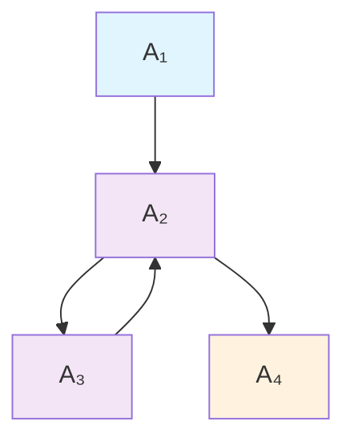
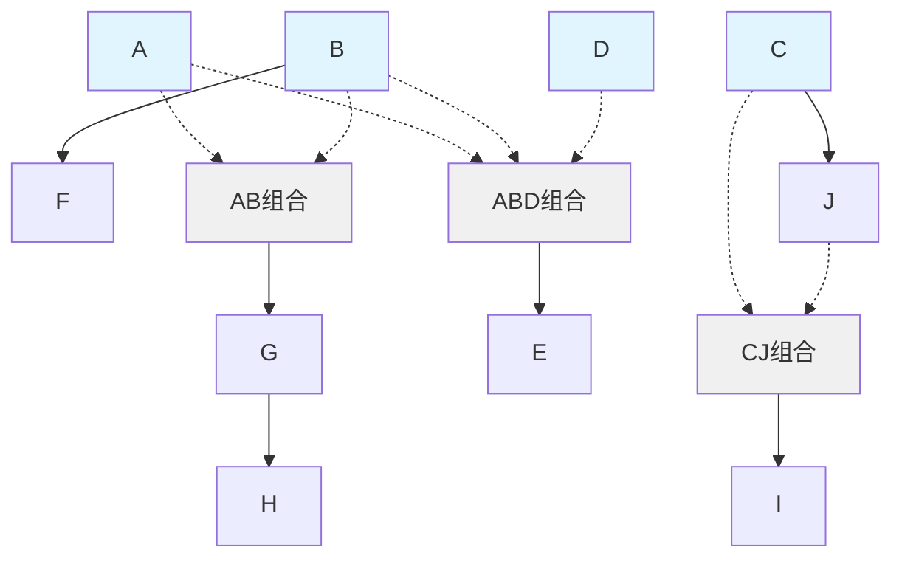
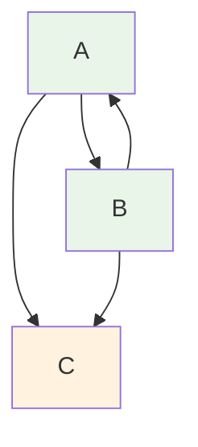
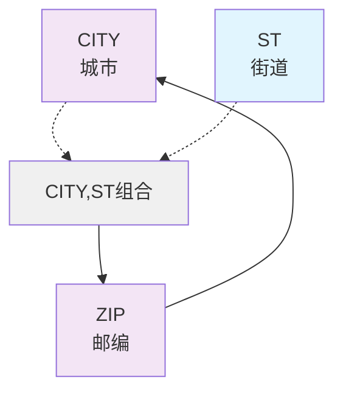

# 候选键求解 - 有向图法详解

## 📊 **有向图法求候选键 - 完整解题过程**

$$
\begin{align}
&\textbf{题目：} \text{给定关系} R(A_1, A_2, A_3, A_4) \text{上的函数依赖集} \\
&F = \{A_1 \rightarrow A_2, A_3 \rightarrow A_2, A_2 \rightarrow A_3, A_2 \rightarrow A_4\} \\
&\text{求：} R \text{的候选关键字} \\\\
&\textbf{选项：} \\
&\text{A. } A_1 \quad \text{B. } A_1A_3 \quad \text{C. } A_1A_3A_4 \quad \text{D. } A_1A_2A_3 \\\\
&\textbf{解题步骤：} \\\\
&\textbf{第一步：构建有向图并分析入度出度} \\
&\begin{array}{|c|c|c|c|}
\hline
\textbf{属性} & \textbf{入度} & \textbf{出度} & \textbf{说明} \\
\hline
A_1 & 0 & 1 & \text{入度为0，只有} A_1 \rightarrow A_2 \\
\hline
A_2 & 2 & 2 & \text{入度：} A_1 \rightarrow A_2, A_3 \rightarrow A_2 \\
& & & \text{出度：} A_2 \rightarrow A_3, A_2 \rightarrow A_4 \\
\hline
A_3 & 1 & 1 & \text{入度：} A_2 \rightarrow A_3 \\
& & & \text{出度：} A_3 \rightarrow A_2 \\
\hline
A_4 & 1 & 0 & \text{入度：} A_2 \rightarrow A_4 \\
\hline
\end{array} \\\\
&\textbf{第二步：确定入度为零的属性集合} \\
&\text{入度为0的属性集合：} \{A_1\} \\
&\text{分析原理：入度为0意味着没有其他属性能推导出该属性} \\
&\text{这样的属性必须包含在候选键中，否则无法被推导出} \\\\
&\textbf{第三步：验证遍历能力} \\
&\text{从} A_1 \text{开始的推导路径：} \\
&A_1 \rightarrow A_2 \quad \text{（直接函数依赖）} \\
&A_1 \rightarrow A_2 \rightarrow A_3 \quad \text{（传递性）} \\
&A_1 \rightarrow A_2 \rightarrow A_4 \quad \text{（传递性）} \\
&\text{遍历验证：} A_1^+ = \{A_1, A_2, A_3, A_4\} = U \\
&\text{因此} A_1 \text{可以推导出所有属性，满足候选键条件} \\\\
&\textbf{第四步：最小性验证} \\
&\text{候选键最小性检查：由于} A_1 \text{是单个属性，不存在真子集} \\
&\text{因此} A_1 \text{满足最小性要求} \\\\
&\textbf{第五步：其他选项分析} \\
&\textbf{选项B：} A_1A_3 \text{ - 冗余分析：} A_1 \rightarrow A_2 \rightarrow A_3 \\
&\text{因此} A_3 \text{可由} A_1 \text{推导，存在冗余} \\
&\textbf{选项C：} A_1A_3A_4 \text{ - 冗余分析：} A_1 \rightarrow A_2 \rightarrow A_3, A_1 \rightarrow A_2 \rightarrow A_4 \\
&\text{因此} A_3, A_4 \text{均可由} A_1 \text{推导，存在冗余} \\
&\textbf{选项D：} A_1A_2A_3 \text{ - 冗余分析：} A_1 \rightarrow A_2, A_1 \rightarrow A_2 \rightarrow A_3 \\
&\text{因此} A_2, A_3 \text{均可由} A_1 \text{推导，存在冗余} \\\\
&\boxed{\textbf{答案：A. } A_1}
\end{align}
$$

### 🎯 **有向图可视化**



### 📋 **解题总结**

**🔑 求解方法：有向图法**
1. **找入度为0的属性：** $A_1$
2. **验证遍历能力：** $A_1^+ = U$
3. **确认最小性：** 无冗余
4. **因此候选键为：** $A_1$

### 🧠 **记忆要点**

**📌 有向图法求候选键口诀：**
```
入度为零必包含，遍历全图是关键
最小集合无冗余，候选键值就确定
```

**🔑 关键步骤：**
1. **入度分析** → 找出入度为0的属性
2. **遍历验证** → 检查能否推导出所有属性  
3. **最小性检查** → 确保无冗余属性
4. **答案确认** → 验证候选键的唯一性和完整性

## 📚 **扩展知识**

### **候选键求解的通用方法**

#### **方法一：有向图法**
- 适用于函数依赖关系较复杂的情况
- 通过图形化方式直观展示依赖关系
- 重点关注入度为0的属性

#### **方法二：属性闭包法**
- 通过计算属性集合的闭包来验证
- 适用于验证给定属性集合是否为候选键
- 公式：$X^+ = X \cup \{A | X \rightarrow A \text{ 可由 } F \text{ 推导}\}$

#### **方法三：逐步消除法**
- 从全属性集合开始，逐步消除冗余属性
- 适用于属性较少的简单情况
- 确保消除后仍能推导出所有属性

### **常见考点总结**

1. **候选键的定义和性质**
2. **主属性与非主属性的区别**
3. **函数依赖的传递性应用**
4. **冗余函数依赖的识别**
5. **多候选键情况的处理**

## 📚 **候选键求解三题联练**

$$
\begin{align}
&\textbf{例题1：} \text{给定关系} R(A_1, A_2, A_3, A_4) \text{上的函数依赖集} \\
&F = \{A_1 \rightarrow A_2, A_3 \rightarrow A_2, A_2 \rightarrow A_3, A_2 \rightarrow A_4\} \\
&\text{选项：A. } A_1 \quad \text{B. } A_1A_3 \quad \text{C. } A_1A_3A_4 \quad \text{D. } A_1A_2A_3 \\
&\text{解答：入度为0的属性：} \{A_1\} \text{，验证：} A_1^+ = U \text{，答案：A} \\\\
&\textbf{例题2：} \text{关系模式} P(A, B, C, D, E, F, G, H, I, J) \\
&\text{函数依赖：} FD = \{ABD \rightarrow E, AB \rightarrow G, B \rightarrow F, C \rightarrow J, CJ \rightarrow I, G \rightarrow H\} \\
&\text{解答：入度为0的属性：} \{A, B, C, D\} \\
&\text{验证：} ABCD^+ = \{A,B,C,D,E,F,G,H,I,J\} = U \\
&\text{答案：} ABCD \\\\
&\textbf{例题3：} \text{关系} R(A, B, C) \text{满足函数依赖：} F = \{B \rightarrow C, B \rightarrow A, A \rightarrow BC\} \\
&\text{选项：A. } AB \quad \text{B. } A\text{和}B \quad \text{C. } A\text{和}BC \quad \text{D. } AC\text{和}AB \\
&\text{解答：无入度为0的属性，检查各选项：} \\
&A^+ = \{A, B, C\} = U \text{，} B^+ = \{A, B, C\} = U \\
&\text{因此A和B都是候选键，答案：B} \\\\
&\textbf{解题规律总结：} \\
&1. \text{入度分析} \rightarrow \text{找出入度为0的属性} \\
&2. \text{遍历验证} \rightarrow \text{检查能否推导出所有属性 } \\
&3. \text{最小性检查 } \rightarrow \text{确保无冗余属性} \\
&4. \text{答案确认} \rightarrow \text{验证候选键的唯一性和完整性}
\end{align}
$$

## 📊 **三题有向图分析与候选键求解**

### 🎯 **例题1：R(A₁, A₂, A₃, A₄)**

**函数依赖：** F = {A₁→A₂, A₃→A₂, A₂→A₃, A₂→A₄}

#### **有向图：**


$$
\begin{align}
&\textbf{入度出度分析：} \\
&\begin{array}{|c|c|c|c|}
\hline
\textbf{属性} & \textbf{入度} & \textbf{出度} & \textbf{说明} \\
\hline
A_1 & 0 & 1 & \text{入度为0，只有} A_1 \rightarrow A_2 \\
\hline
A_2 & 2 & 2 & \text{入度：} A_1 \rightarrow A_2, A_3 \rightarrow A_2 \\
& & & \text{出度：} A_2 \rightarrow A_3, A_2 \rightarrow A_4 \\
\hline
A_3 & 1 & 1 & \text{入度：} A_2 \rightarrow A_3 \\
& & & \text{出度：} A_3 \rightarrow A_2 \\
\hline
A_4 & 1 & 0 & \text{入度：} A_2 \rightarrow A_4 \\
\hline
\end{array} \\\\
&\textbf{候选键求解：} \\
&\text{入度为0的属性：} \{A_1\} \text{，必须包含在候选键中} \\
&A_1^+ = \{A_1\} \cup \{A_2\} \cup \{A_3, A_4\} = \{A_1, A_2, A_3, A_4\} = U \\
&\textbf{候选键：} A_1
\end{align}
$$

---

### 🎯 **例题2：P(A, B, C, D, E, F, G, H, I, J)**

**函数依赖：** FD = {ABD→E, AB→G, B→F, C→J, CJ→I, G→H}

#### **有向图：**


$$
\begin{align}
&\textbf{入度出度分析：} \\
&\begin{array}{|c|c|c|c|}
\hline
\textbf{属性} & \textbf{入度} & \textbf{出度} & \textbf{说明} \\
\hline
A & 0 & 0 & \text{入度为0，参与复合依赖} AB \rightarrow G, ABD \rightarrow E \\
\hline
B & 0 & 1 & \text{入度为0，} B \rightarrow F \text{，参与复合依赖} \\
\hline
C & 0 & 1 & \text{入度为0，} C \rightarrow J \text{，参与复合依赖} CJ \rightarrow I \\
\hline
D & 0 & 0 & \text{入度为0，参与复合依赖} ABD \rightarrow E \\
\hline
E & 1 & 0 & \text{入度：} ABD \rightarrow E \\
\hline
F & 1 & 0 & \text{入度：} B \rightarrow F \\
\hline
G & 1 & 1 & \text{入度：} AB \rightarrow G \text{，出度：} G \rightarrow H \\
\hline
H & 1 & 0 & \text{入度：} G \rightarrow H \\
\hline
I & 1 & 0 & \text{入度：} CJ \rightarrow I \\
\hline
J & 1 & 0 & \text{入度：} C \rightarrow J \text{，参与复合依赖} CJ \rightarrow I \\
\hline
\end{array} \\\\
&\textbf{候选键求解：} \\
&\text{入度为0的属性：} \{A, B, C, D\} \text{，必须全部包含在候选键中} \\
&(ABCD)^+ = \{A,B,C,D\} \cup \{E,F,G,H,I,J\} = U \\
&\textbf{候选键：} ABCD
\end{align}
$$

---

### 🎯 **例题3：R(A, B, C)**

**函数依赖：** F = {B→C, B→A, A→BC} （注：A→BC 等价于 A→B 和 A→C）

#### **有向图：**


$$
\begin{align}
&\textbf{入度出度分析：} \\
&\begin{array}{|c|c|c|c|}
\hline
\textbf{属性} & \textbf{入度} & \textbf{出度} & \textbf{说明} \\
\hline
A & 1 & 2 & \text{入度：} B \rightarrow A \\
& & & \text{出度：} A \rightarrow B, A \rightarrow C \\
\hline
B & 1 & 2 & \text{入度：} A \rightarrow B \\
& & & \text{出度：} B \rightarrow A, B \rightarrow C \\
\hline
C & 2 & 0 & \text{入度：} A \rightarrow C, B \rightarrow C \\
\hline
\end{array} \\\\
&\textbf{候选键验证：} \\
&\text{无入度为0的属性，需要逐一验证各属性} \\
&A^+ = \{A\} \cup \{B, C\} = \{A, B, C\} = U \quad \checkmark \\
&B^+ = \{B\} \cup \{A, C\} = \{A, B, C\} = U \quad \checkmark \\
&C^+ = \{C\} \neq U \quad \times \\\\
&\textbf{候选键：} A \text{ 和 } B \text{（两个都是候选键）}
\end{align}
$$

---

## 🧠 **解题规律总结**

$$
\boxed{
\begin{align}
&\textbf{有向图法求候选键的通用步骤：} \\
&1. \text{绘制有向图：根据函数依赖画出属性间的有向边} \\
&2. \text{统计入度出度：计算每个属性的入度和出度} \\
&3. \text{识别关键属性：} \\
&\quad \bullet \text{入度为0的属性必须包含在候选键中} \\
&\quad \bullet \text{出度为0的属性不能单独作为候选键} \\
&4. \text{验证候选键：计算属性闭包，确保能推导出全属性集} \\
&5. \text{检查最小性：确保去除任一属性后不能推导全集}
\end{align}
}
$$

### 📌 **记忆口诀**
```
画图分析入出度，入零必含是关键
闭包验证全属性，最小集合定候选
```

这三道题完美展示了不同类型的候选键求解场景：单候选键、复合候选键、多候选键！

## 🔑 **主属性与非主属性分析**

### 📖 **核心定义**

$$
\boxed{
\begin{align}
&\textbf{主属性（Prime Attribute）：} \text{组成候选码的属性} \\
&\textbf{非主属性（Non-Prime Attribute）：} \text{不参与任何候选码的属性} \\\\
&\textbf{判定规则：} \\
&\text{如果属性} A \text{参与任意一个候选键，则} A \text{是主属性} \\
&\text{如果属性} A \text{不参与任何候选键，则} A \text{是非主属性}
\end{align}
}
$$

### 🎯 **实例分析：CSZ关系模式**

**关系模式：** CSZ(CITY, ST, ZIP)
**函数依赖：** F = {(CITY, ST)→ZIP, ZIP→CITY}
**语义说明：** CITY表示城市，ST表示街道，ZIP表示邮政编码

#### **有向图分析：**


$$
\begin{align}
&\textbf{入度出度分析：} \\
&\begin{array}{|c|c|c|c|}
\hline
\textbf{属性} & \textbf{入度} & \textbf{出度} & \textbf{说明} \\
\hline
CITY & 1 & 0 & \text{入度：} ZIP \rightarrow CITY \text{，参与复合依赖} \\
\hline
ST & 0 & 0 & \text{入度为0，参与复合依赖} (CITY,ST) \rightarrow ZIP \\
\hline
ZIP & 1 & 1 & \text{入度：} (CITY,ST) \rightarrow ZIP \text{，出度：} ZIP \rightarrow CITY \\
\hline
\end{array} \\\\
&\textbf{候选键求解过程：} \\
&\text{步骤1：识别入度为0的属性} \\
&\text{入度为0的属性：} \{ST\} \text{，ST必须包含在所有候选键中} \\\\
&\text{步骤2：验证可能的候选键} \\
&\text{候选键1：} (ST, CITY) \\
&(ST, CITY)^+ = \{ST, CITY\} \cup \{ZIP\} = \{ST, CITY, ZIP\} = U \quad \checkmark \\\\
&\text{候选键2：} (ST, ZIP) \\
&(ST, ZIP)^+ = \{ST, ZIP\} \cup \{CITY\} = \{ST, CITY, ZIP\} = U \quad \checkmark \\\\
&\text{验证最小性：} \\
&ST^+ = \{ST\} \neq U \text{，} CITY^+ = \{CITY\} \neq U \text{，} ZIP^+ = \{ZIP, CITY\} \neq U \\
&\text{因此} (ST, CITY) \text{和} (ST, ZIP) \text{都是最小候选键}
\end{align}
$$

#### **主属性与非主属性识别：**

$$
\boxed{
\begin{align}
&\textbf{候选键集合：} \{(ST, CITY), (ST, ZIP)\} \\\\
&\textbf{主属性：} \{ST, CITY, ZIP\} \\
&\quad \bullet ST \text{：参与候选键} (ST, CITY) \text{和} (ST, ZIP) \\
&\quad \bullet CITY \text{：参与候选键} (ST, CITY) \\
&\quad \bullet ZIP \text{：参与候选键} (ST, ZIP) \\\\
&\textbf{非主属性：} \{\} \text{（空集）} \\
&\text{说明：所有属性都参与至少一个候选键，因此都是主属性}
\end{align}
}
$$

$$
\begin{align}
&\textbf{对比分析：不同情况下的主非主属性} \\\\
&\textbf{情况1：存在非主属性的例子} \\
&\text{假设关系模式} R(A, B, C, D) \text{，函数依赖} F = \{A \rightarrow B, A \rightarrow C\} \\
&\text{候选键：} \{AD\} \\
&\text{主属性：} \{A, D\} \\
&\text{非主属性：} \{B, C\} \\\\
&\textbf{情况2：所有属性都是主属性（如CSZ例子）} \\
&\text{候选键：} \{(ST, CITY), (ST, ZIP)\} \\
&\text{主属性：} \{ST, CITY, ZIP\} \\
&\text{非主属性：} \{\} \text{（空集）}
\end{align}
$$

### 📌 **重要结论**

$$
\boxed{
\begin{align}
&\textbf{主非主属性的重要性质：} \\
&1. \text{每个关系至少有一个候选键} \\
&2. \text{候选键中的所有属性都是主属性} \\
&3. \text{一个属性只要参与任意一个候选键就是主属性} \\
&4. \text{主属性和非主属性的划分是规范化理论的基础} \\
&5. \text{第二范式(2NF)和第三范式(3NF)的定义都依赖于主非主属性的概念}
\end{align}
}
$$

这个解题过程完整展示了有向图法求候选键的标准流程，是软考中函数依赖和候选键分析的重要方法！🎓
