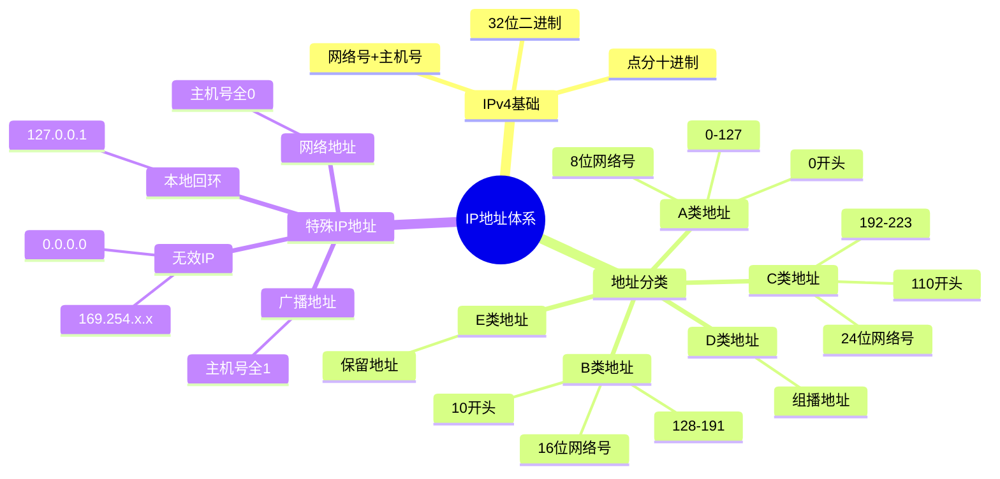
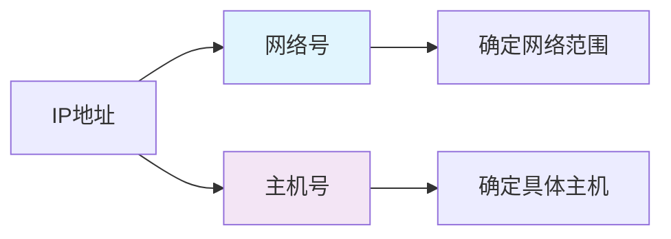
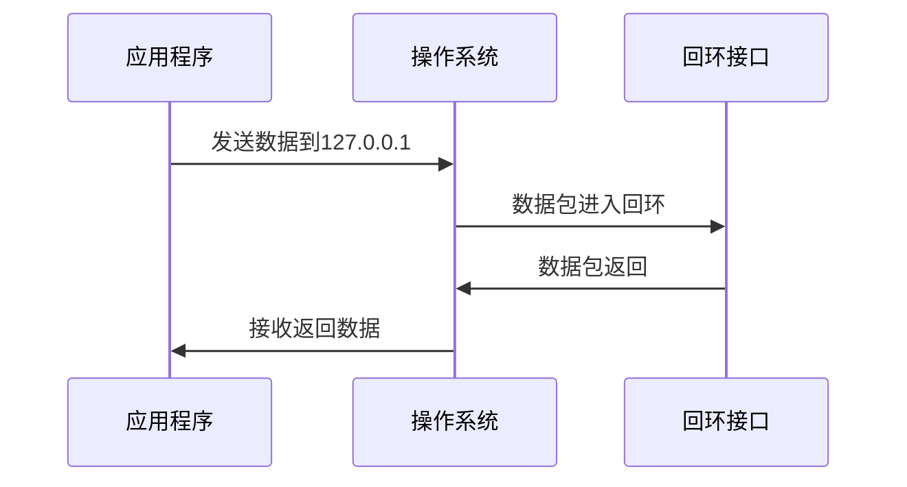
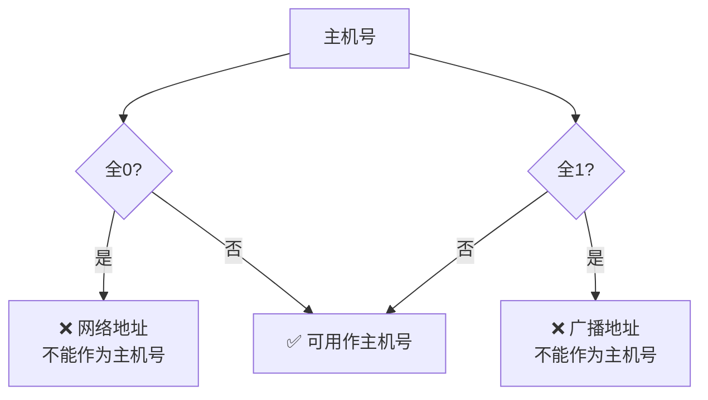

# IP地址分类与特殊IP地址

> **课程来源**: 网课-软考 5.4.2 IP地址分类与特殊的IP地址  
> **知识点**: IPv4地址分类、特殊IP地址、网络号与主机号  
> **考试重点**: ⭐⭐⭐⭐⭐

## 📋 知识点概览



## 🌐 IPv4地址基础

### 📖 基本概念
- **全称**: Internet Protocol version 4
- **格式**: 点分十进制表示法
- **结构**: 32位二进制，分为4段，每段8位
- **组成**: 网络号 + 主机号

### 🔢 地址表示方法

#### 点分十进制格式

$$
\begin{aligned}
\textbf{IPV4: } \rightarrow & 192.168.0.1 \\
&\begin{cases}
192_{10}: &  \rightarrow 2^7+2^6 = 11000000_2  \\
168_{10}: & \rightarrow 2^7 + 2^5 + 2^3 = 10101000_2  \\
0_{10}: &  \rightarrow 00000000_2  \\
1_{10}: &  \rightarrow 2^0=00000001_2  
\end{cases}
\end{aligned}
$$

#### 二进制表示
```
32位二进制 = 4段 × 8位
每段取值范围: 0-255 (2^8-1)
```

### 🏗️ 网络号与主机号



**类比理解**: 
- 网络号 = 国家/省市 (大范围定位)
- 主机号 = 详细地址 (精确定位)

## 📊 IP地址分类详解

$$
\begin{aligned}
\textbf{IPV4: } \rightarrow & 192.168.0.1 \\
&\begin{cases}
192_{10}: &  \rightarrow 2^7+2^6 = 11000000_2  \\
168_{10}: & \rightarrow 2^7 + 2^5 + 2^3 = 10101000_2  \\
0_{10}: &  \rightarrow 00000000_2  \\
1_{10}: &  \rightarrow 2^0=00000001_2  
\end{cases}
\end{aligned}
$$


$$
\begin{array}{|c|}
\hline
\textbf{IPv4地址分类完整体系} \\
\hline
\begin{aligned}
&\textbf{设计原理：} \\
&\text{32位IP地址分成四段8位二进制数据 = 网络号 + 主机号} \\
&\text{网络地址：主机号全0(比如192.168.1.0/24表示整个192.168.1.0网络，是路由表中的网络标识)} \\
&\text{广播地址：主机号全1（比如192.168.1.255/24向192.168.1.0网络中所有主机发送消息，做网络广播通信,24表示有24位作为网络位，剩余8位是主机位）)} \\
&\text{本地回环地址：本机测试和开发)} \\
&\text{169.254.0.0：保留地址，用于DHCP（Dynamic Host Configuration Protocol）失效（Win）)} \\
&\text{0.0.0.0：保留地址，用于DHCP（Dynamic Host Configuration Protocol）失效（Linux）)} \\
&\text{设计目的：通过固定前几位实现层次化管理} \\
&\text{不同规模网络使用不同类别，提高路由效率：路由器可以根据前几位快速判断地址类别} \\
&\text{地址分配：网络规模越大，可分配网络数越少，每网络主机数越多} \\
\end{aligned} \\
\hline
\end{array}
$$

$$
\begin{array}{|c|c|c|c|c|}
\hline
\textbf{类别} & \textbf{二进制标识} & \textbf{第1段范围计算} & \textbf{网络号} & \textbf{可用主机数} \\
\hline
\begin{aligned}
\text{A类} \\
\text{大型网络}
\end{aligned} &
\begin{aligned}
0xxxxxxx
\end{aligned} &
\begin{aligned}
00000000_2 \sim 01111111_2 \\
= 0 \sim (2^6+...+2^0) \\
= 0 \sim 127
\end{aligned} &
\begin{aligned}
8\text{位（一段）} \\
2^7=128\text{个网络}
\end{aligned} &
\begin{aligned}
2^{24}-2 \\
= 16,777,214 \\
主机号全0表示网络地址，全1表示广播地址
\end{aligned} \\
\hline
\begin{aligned}
\text{B类} \\
\text{中型网络}
\end{aligned} &
\begin{aligned}
10xxxxxx
\end{aligned} &
\begin{aligned}
10000000_2 \sim 10111111_2 \\
= 2^7 \sim (2^7+2^5+...+2^0) \\
= 128 \sim 191
\end{aligned} &
\begin{aligned}
16\text{位（两段）} \\
2^{14}=16,384\text{个网络}
\end{aligned} &
\begin{aligned}
2^{16}-2 \\
= 65,534
\end{aligned} \\
\hline
\begin{aligned}
\text{C类} \\
\text{小型网络}
\end{aligned} &
\begin{aligned}
110xxxxx
\end{aligned} &
\begin{aligned}
11000000_2 \sim 11011111_2 \\
= (2^7+2^6) \sim (2^7+2^6+2^4+...+2^0) \\
= 192 \sim 223
\end{aligned} &
\begin{aligned}
24\text{位（三段）} \\
2^{21}=2,097,152\text{个网络}
\end{aligned} &
\begin{aligned}
2^{8}-2 \\
= 254
\end{aligned} \\
\hline
\begin{aligned}
\text{D类} \\
\text{组播}
\end{aligned} &
\begin{aligned}
1110xxxx
\end{aligned} &
\begin{aligned}
11100000_2 \sim 11101111_2 \\
= 224 \sim 239
\end{aligned} &
\begin{aligned}
\text{组播地址} \\
\text{无网络号概念}
\end{aligned} &
\begin{aligned}
\text{不适用}
\end{aligned} \\
\hline
\begin{aligned}
\text{E类} \\
\text{保留}
\end{aligned} &
\begin{aligned}
1111xxxx
\end{aligned} &
\begin{aligned}
11110000_2 \sim 11111111_2 \\
= 240 \sim 255
\end{aligned} &
\begin{aligned}
\text{保留地址} \\
\text{实验用途}
\end{aligned} &
\begin{aligned}
\text{不适用}
\end{aligned} \\
\hline
\end{array}
$$

## 🔍 特殊IP地址详解 ⭐⭐⭐⭐⭐

### 1️⃣ 本地回环地址

```bash
地址: 127.0.0.1
别名: localhost
用途: 本机测试和开发
```

#### 应用场景
- **软件开发**: 本地测试服务器功能
- **网络测试**: 验证TCP/IP协议栈
- **故障诊断**: 测试本机网络功能

#### 工作原理


### 2️⃣ 网络地址 (主机号全0)

```bash
示例: 192.168.1.0/24
含义: 表示整个192.168.1.0网络
用途: 路由表中的网络标识
```

### 3️⃣ 广播地址 (主机号全1)

```bash
示例: 192.168.1.255/24  
含义: 向192.168.1.0网络中所有主机发送
用途: 网络广播通信
```

### 4️⃣ 无效IP地址 ⭐⭐⭐⭐⭐

#### DHCP失效地址
| 操作系统 | 无效IP地址 | 说明 |
|----------|------------|------|
| **Windows** | 169.254.x.x | DHCP服务器无响应时分配 |
| **Linux/Unix** | 0.0.0.0 | DHCP服务器失效时配置 |

#### 特点
- ✅ 系统显示有IP地址
- ❌ 无法进行网络通信
- ❌ 无法访问互联网

## 💡 主机号特殊规则 ⭐⭐⭐⭐⭐

### 🚫 禁用规则


### 📊 主机数量计算公式
```latex
可用主机数 = 2^{主机号位数} - 2
```

**示例计算**:
- A类: 2^24 - 2 = 16,777,214台
- B类: 2^16 - 2 = 65,534台  
- C类: 2^8 - 2 = 254台

## 📝 考试真题解析

### 🎯 本地回环地址题
**题目**: 在一台安装好TCP/IP协议的计算机上，网络连接不可用。为了测试网络程序，通常会给自己发送数据包，这个目的主机地址是？

**答案**: `127.0.0.1`

**解析**:
- A. `0.0.0.0` - Linux系统DHCP失效地址
- B. `127.0.0.1` - ✅ 本地回环地址
- C. `192.168.1.1` - 普通私有IP地址
- D. `192.168.1.0/24` - 网络地址表示法

### 🎯 地址分类题
**题目**: IP地址192.168.1.100属于哪类地址？

**答案**: C类地址

**解析**:
- 第一段: 192
- 范围判断: 192-223 → C类地址
- 网络号: 24位 (前3段)
- 主机号: 8位 (第4段)

## 🧠 记忆技巧

### 📞 地址分类记忆口诀
```
A类0开头，0到127，
B类10开，128到191。
C类110开，192到223，
D类组播，E类保留记心中。
```

### 🔢 网络号位数记忆
```
A类8位一段网络号，
B类16位两段要记牢。
C类24位三段全，
主机号位数32减。
```

### 🚫 特殊地址记忆
```
127回环本地测，
全0网络全1播。
169.254 Windows坏，
0.0.0.0 Linux败。
```

## ⚡ 快速复习要点

### 🔥 必考知识点
1. **地址分类**: A(0-127)、B(128-191)、C(192-223)
2. **网络号位数**: A类8位、B类16位、C类24位
3. **本地回环**: 127.0.0.1用于本机测试
4. **无效IP**: 169.254.x.x (Windows)、0.0.0.0 (Linux)
5. **主机号规则**: 全0全1不能作为主机号

### 📊 考试重点对比
| 项目 | A类 | B类 | C类 |
|------|-----|-----|-----|
| 第1段范围 | 0-127 | 128-191 | 192-223 |
| 网络号位数 | 8位 | 16位 | 24位 |
| 主机号位数 | 24位 | 16位 | 8位 |
| 可用主机数 | 16,777,214 | 65,534 | 254 |

## 🎯 学习建议

1. **重点掌握**: A、B、C三类地址的特征和范围
2. **熟记**: 127.0.0.1本地回环地址的作用
3. **理解**: 网络号和主机号的划分原理
4. **练习**: 给定IP地址判断类别和计算主机数
5. **应用**: 结合子网划分知识综合运用

---

> **学习提示**: IP地址分类是网络基础中的核心概念，为后续子网划分、路由等知识打下基础。重点理解网络号和主机号的作用，熟练掌握各类地址的特征。
