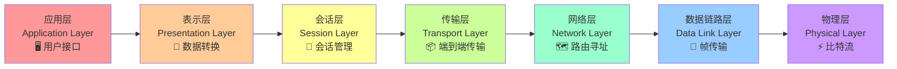
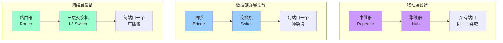
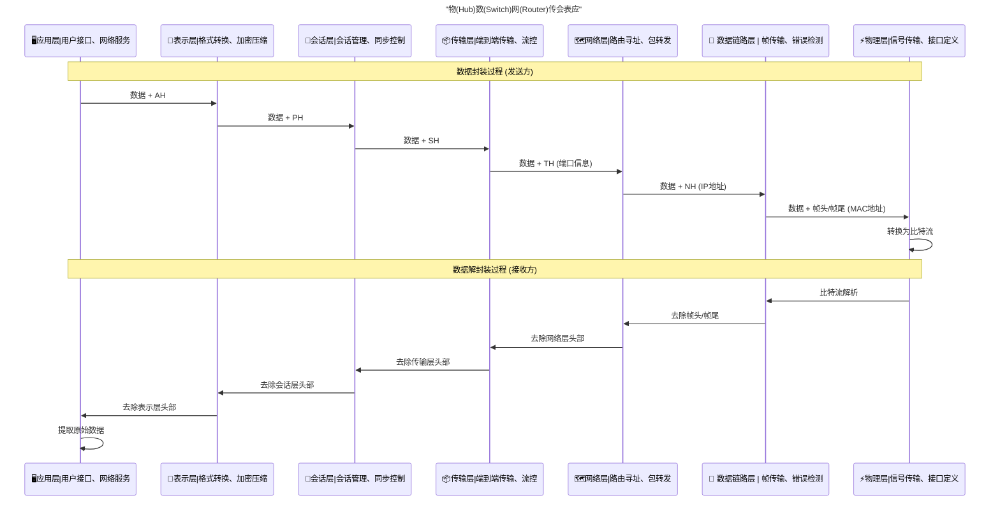
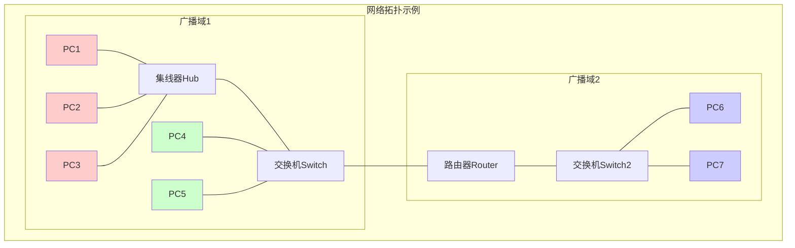
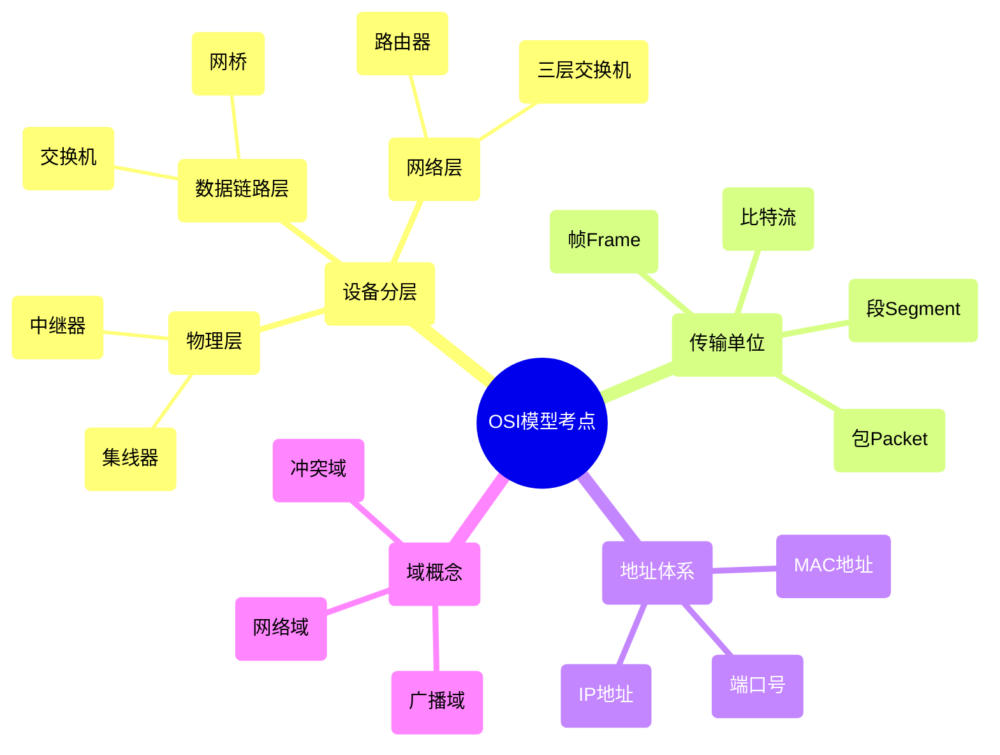
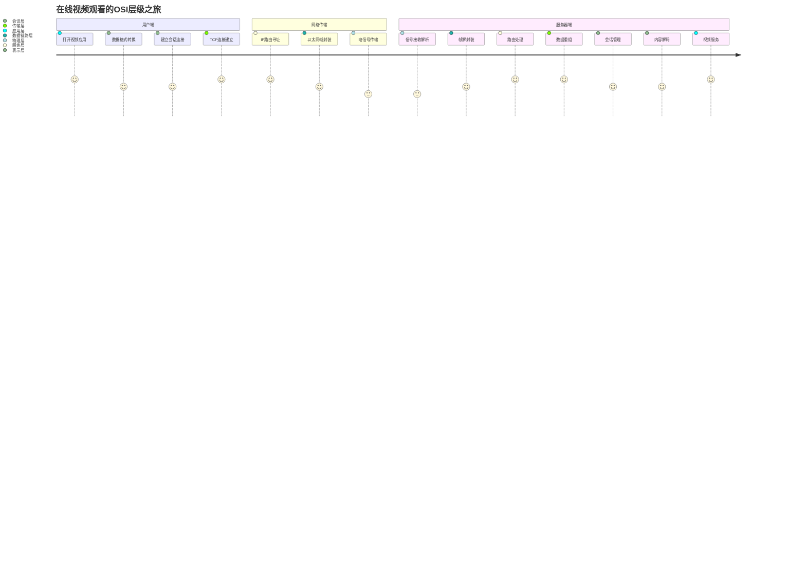

# OSI七层模型详解 📡

## 🎯 核心概念

OSI（Open System Interconnection）七层模型是网络通信的理论基础，通过分层解耦实现复杂网络系统的模块化设计。

$$
\begin{align}
&\textbf{分层设计原理} \\
&\text{高层} \xrightarrow{\text{解耦}} \text{中间层} \xrightarrow{\text{解耦}} \text{低层} \\
&\text{应用需求} \quad \longleftrightarrow \quad \text{物理传输}
\end{align}
$$

## 🏗️ 七层架构可视化

## 📊 各层功能矩阵

| 层次 | 传输单位 | 核心功能 | 关键设备 | 地址类型 | 协议示例 |
|------|----------|----------|----------|----------|----------|
| 🖥️ **应用层** | 数据 | 用户接口、网络服务 | - | - | HTTP, FTP, SMTP |
| 🔄 **表示层** | 数据 | 格式转换、加密压缩 | - | - | SSL/TLS, JPEG |
| 🔗 **会话层** | 数据 | 会话管理、同步控制 | - | - | NetBIOS, RPC |
| 📦 **传输层** | 段(Segment) | 端到端传输、流控 | - | 端口号 | TCP, UDP |
| 🗺️ **网络层** | 包(Packet) | 路由寻址、包转发 | 路由器 | IP地址 | IP, ICMP |
| 🔗 **数据链路层** | 帧(Frame) | 帧传输、错误检测 | 交换机 | MAC地址 | Ethernet, WiFi |
| ⚡ **物理层** | 比特流 | 信号传输、接口定义 | 集线器 | - | 电气信号 |

## 🔧 网络设备深度解析

### 🎯 设备特性对比

$$
\begin{align}
&\textbf{冲突域与广播域分析} \\\\
&\text{集线器：} \begin{cases}
\text{冲突域} = 1 \text{（所有端口共享）} \\
\text{广播域} = 1
\end{cases} \\\\
&\text{交换机：} \begin{cases}
\text{冲突域} = n \text{（n个端口）} \\
\text{广播域} = 1
\end{cases} \\\\
&\text{路由器：} \begin{cases}
\text{冲突域} = n \text{（n个端口）} \\
\text{广播域} = n \text{（n个端口）}
\end{cases}
\end{align}
$$

## 📡 数据传输流程可视化

### 🔍 头部缩写详解

$$
\begin{align}
&\textbf{OSI模型各层头部标识完整说明：} \\\\
&\text{AH} = \text{Application Header（应用层头部）} \\
&\text{PH} = \text{Presentation Header（表示层头部）} \\
&\text{SH} = \text{Session Header（会话层头部）} \\
&\text{TH} = \text{Transport Header（传输层头部）} \\
&\text{NH} = \text{Network Header（网络层头部）} \\
&\text{DH} = \text{Data Header（数据帧头部）} \\
&\text{DT} = \text{Data Trailer（数据帧尾部）}
\end{align}
$$

### 📦 数据包结构演进

$$
\begin{align}
&\textbf{封装过程数学表示：} \\\\
&\text{原始数据：} D \\
&\text{应用层：} D + AH \\
&\text{表示层：} D + AH + PH \\
&\text{会话层：} D + AH + PH + SH \\
&\text{传输层：} D + AH + PH + SH + TH \\
&\text{网络层：} D + AH + PH + SH + TH + NH \\
&\text{数据链路层：} DH + D + AH + PH + SH + TH + NH + DT \\
&\text{物理层：} \text{Binary}(DH + D + \sum_{\text{Headers}} + DT)
\end{align}
$$

## 🌐 网络拓扑与域概念

### 📊 域隔离效果对比

| 设备类型 | 冲突域数量 | 广播域数量 | 隔离效果 | 应用场景 |
|----------|------------|------------|----------|----------|
| 🔌 **集线器** | 1 | 1 | ❌ 无隔离 | 已淘汰 |
| 🔄 **交换机** | n个端口 | 1 | ⚡ 冲突域隔离 | 局域网核心 |
| 🗺️ **路由器** | n个端口 | n个端口 | 🛡️ 完全隔离 | 网络互联 |

$$
\begin{align}
&\textbf{网络性能优化公式：} \\\\
&\text{网络效率} = \frac{\text{有效数据传输时间}}{\text{总传输时间}} \\\\
&\text{冲突概率} = 1 - \left(1 - \frac{1}{n}\right)^k \\
&\text{其中：} n = \text{时间槽数}, k = \text{活跃节点数}
\end{align}
$$

## 🎯 软考重点知识图谱

### 📝 高频考题模式

| 考题类型 | 知识点 | 答题技巧 | 分值权重 |
|----------|--------|----------|----------|
| 🔧 **设备功能** | 各层设备特点 | 记住分层对应关系 | ⭐⭐⭐⭐⭐ |
| 📦 **数据单位** | 传输单位名称 | 从下往上：比特→帧→包→段 | ⭐⭐⭐⭐ |
| 🌐 **域概念** | 冲突域/广播域 | 画图分析网络拓扑 | ⭐⭐⭐ |
| 📍 **地址类型** | MAC vs IP | MAC物理，IP逻辑 | ⭐⭐⭐ |

### 🧠 记忆口诀

$$
\begin{align}
&\textbf{七层模型记忆法：} \\
&\text{物数网传会表应} \\
&\text{All People Seem To Need Data Processing} \\\\
&\textbf{设备分层记忆：} \\
&\text{物理层：集线器（Hub）} \\
&\text{链路层：交换机（Switch）} \\
&\text{网络层：路由器（Router）} \\\\
&\textbf{传输单位记忆：} \\
&\text{比特流 → 帧 → 包 → 段}
\end{align}
$$

## 🚀 实际应用场景

### 🏗️ 网络架构双子网模型

$$
\begin{align}
&\textbf{网络系统 = 资源子网 + 通信子网} \\\\
&\text{资源子网：} \begin{cases}
\text{用户终端设备} \\
\text{服务器系统} \\
\text{应用程序}
\end{cases} \\\\
&\text{通信子网：} \begin{cases}
\text{路由器网络} \\
\text{交换机设备} \\
\text{传输介质}
\end{cases}
\end{align}
$$

## 🎓 学习总结与提升

### 核心掌握要点
- [x] **分层架构**：理解七层模型的设计思想
- [x] **设备映射**：掌握各层对应的网络设备
- [x] **数据流转**：理解封装/解封装过程
- [x] **域概念**：区分冲突域和广播域
- [x] **考试技巧**：熟练应对软考题型

### 🔄 与TCP/IP模型对比

| OSI七层模型 | TCP/IP四层模型 | 实际应用 |
|-------------|----------------|----------|
| 应用层+表示层+会话层 | 应用层 | HTTP, FTP, SMTP |
| 传输层 | 传输层 | TCP, UDP |
| 网络层 | 网络层 | IP, ICMP |
| 数据链路层+物理层 | 网络接口层 | Ethernet, WiFi |

> 💡 **学习建议**：OSI模型提供理论框架，TCP/IP模型指导实际实现。两者结合学习，理论与实践并重。
