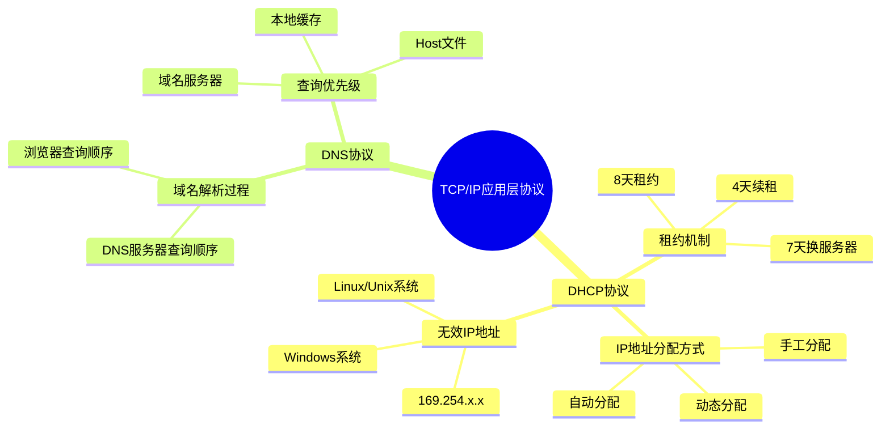
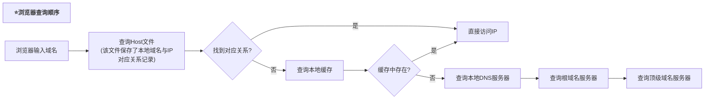
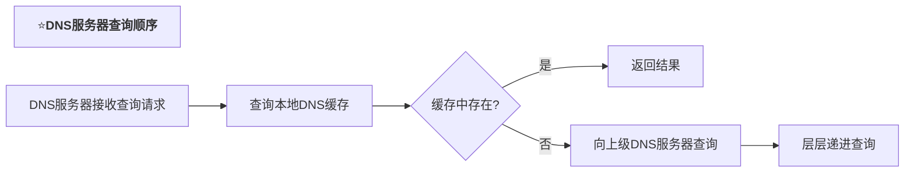

# TCP/IP协议应用层提升

> **课程来源**: 网课-软考 5.2.4 协议应用提升  
> **知识点**: DHCP协议、DNS协议的深入理解  
> **考试重点**: ⭐⭐⭐⭐

## 📋 知识点概览



## 🌐 DHCP协议详解

### 📖 基本概念
- **全称**: Dynamic Host Configuration Protocol (动态主机配置协议)
- **功能**: IP地址动态分配协议
- **架构**: 基于C/S (客户机/服务器) 模式

### 🔧 IP地址分配方式

#### 1️⃣ 手工分配固定IP地址
- **特点**: 管理员手动配置
- **适用**: 服务器等需要固定IP的设备

#### 2️⃣ 动态分配 ⭐⭐⭐
- **特点**: 自动获取IP地址
- **租约时间**: 8天
- **续租机制**: 
  - 租约过半(4天)时自动申请续租
  - 续租成功可继续使用同一IP
  - 超过87.5%(7天)未联系上服务器则换服务器

#### 3️⃣ 自动分配
- **特点**: 永久分配IP地址
- **使用**: 一旦分配即永久使用

### ⚠️ 无效IP地址 ⭐⭐⭐⭐

当DHCP服务器无响应时，系统会分配无效IP：

| 操作系统 | 无效IP地址段 | 现象 |
|---------|-------------|------|
| Windows | 169.254.x.x | 有IP显示但无法上网 |
| Linux/Unix | 169.254.x.x | 网络连接正常但无法通信 |

> **考试要点**: 169.254.0.0网段是DHCP无响应时的无效IP地址

## 🔍 DNS协议详解

### 📖 基本概念
- **全称**: Domain Name System (域名系统)
- **功能**: 域名与IP地址的转换服务

### 🔄 域名解析查询顺序

#### 浏览器查询顺序 ⭐⭐⭐⭐


#### DNS服务器查询顺序 ⭐⭐⭐⭐


### 📍 Host文件位置
- **Windows**: `C:\Windows\System32\drivers\etc\hosts`
- **功能**: 本地域名与IP对应关系记录

## 📝 考试真题解析

### 🎯 DHCP考题
**题目**: 采用DHCP动态分配IP，如果某主机开机后没有得到DHCP服务器响应，那么它所获取的IP地址属于哪个网络？

**答案**: `169.254.0.0/16` 网络

**解析**: 
- DHCP服务器无响应时分配的无效IP
- 该IP段无法进行正常网络通信
- 虽然显示有IP地址，但实际无法联网

### 🎯 DNS考题
**题目**: 在浏览器地址栏输入正确网址后，本地主机首先在哪里查询？

**答案**: 本机Host文件

**关键区别**:
- **浏览器查询**: 先查Host文件
- **DNS服务器查询**: 先查本地DNS缓存

## 💡 记忆技巧

### 🧠 DHCP记忆口诀
```
八天租约四天续，
七天换服务器路。
169.254无效段，
有IP不能把网上。
```

### 🧠 DNS查询记忆
```
浏览器查询：Host → 缓存 → 服务器
DNS服务器：缓存 → 上级 → 递进查
```

## ⚡ 快速复习要点

### 🔥 高频考点
1. **DHCP无效IP**: 169.254.x.x
2. **DNS查询顺序**: 浏览器vs服务器的区别
3. **DHCP租约机制**: 8天租约，4天续租，7天换服务器

### 📊 考试占比
- **DHCP协议**: ⭐⭐⭐ (中等重要)
- **DNS协议**: ⭐⭐⭐⭐ (高度重要)
- **查询顺序**: ⭐⭐⭐⭐⭐ (必考点)

## 🎯 练习建议

1. **重点掌握**: DNS查询顺序的区别
2. **熟记**: DHCP无效IP地址段
3. **理解**: 租约机制的时间节点
4. **注意**: 题干中"浏览器"vs"DNS服务器"的区别

---

> **学习提示**: 这部分内容在TCP/IP协议族中占比不大，但考察时往往涉及细节区别，需要仔细理解并记忆关键数字和顺序。
