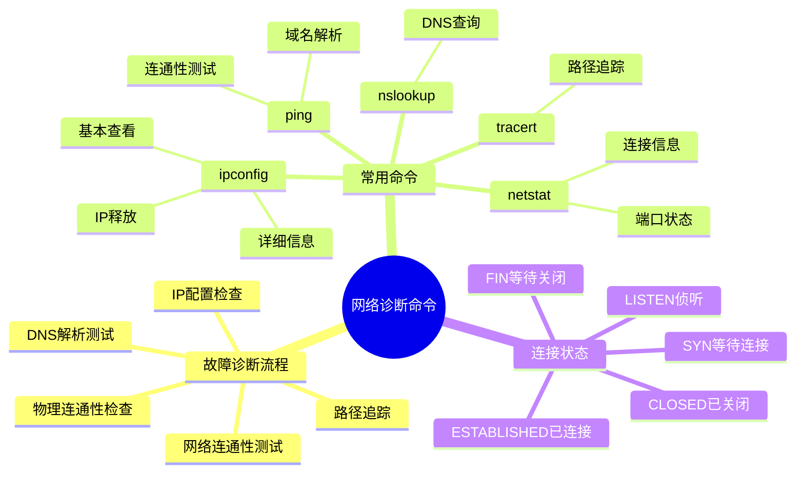
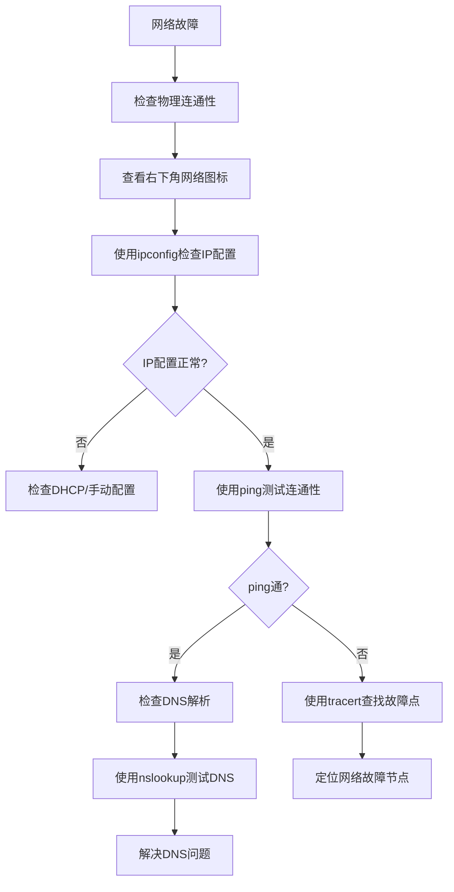
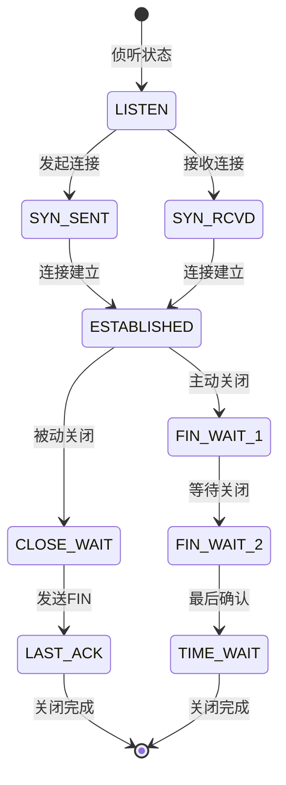

# 网络诊断命令详解

> **课程来源**: 网课-软考 5.3 网络诊断命令  
> **知识点**: 网络故障诊断、常用网络命令  
> **考试重点**: ⭐⭐⭐⭐⭐

## 📋 知识点概览



## 🔧 网络故障诊断流程

### 📊 标准诊断步骤


## 💻 核心网络诊断命令

### 1️⃣ ipconfig - IP配置查看 ⭐⭐⭐⭐⭐

#### 基本语法
```bash
# Windows系统
ipconfig                    # 显示基本IP配置
ipconfig /all              # 显示详细配置信息
ipconfig /release          # 释放IP地址
ipconfig /renew            # 重新获取IP地址

# Linux系统 (拼写不同)
ifconfig                   # 对应ipconfig
```

#### 显示信息
| 基本显示 | 详细显示(/all) |
|---------|---------------|
| IP地址 | IP地址 |
| MAC地址 | MAC地址 |
| 网关地址 | 网关地址 |
| - | DHCP服务器 |
| - | DNS服务器 |
| - | 租约信息 |

### 2️⃣ ping - 连通性测试 ⭐⭐⭐⭐⭐

#### 功能说明
- **作用**: 测试点与点之间的网络连通性
- **原理**: 发送ICMP回显请求包
- **用法**: `ping www.baidu.com` 或 `ping IP地址`

#### 结果分析
```bash
# 正常响应
Reply from 14.215.177.39: bytes=32 time=15ms TTL=55

# 超时响应  
Request timed out.

# 域名解析失败
Ping request could not find host www.example.com
```

### 3️⃣ nslookup - DNS查询 ⭐⭐⭐⭐

#### 使用场景
- ping通但网页打不开 → 可能是DNS问题
- 查询域名对应的IP地址
- 验证DNS服务器工作状态

#### 基本用法
```bash
nslookup www.baidu.com     # 查询域名对应IP
nslookup IP地址            # 反向查询域名
```

### 4️⃣ tracert - 路径追踪 ⭐⭐⭐⭐

#### 功能特点
- **Windows**: `tracert`
- **Linux**: `traceroute` (拼写不同)
- **作用**: 显示数据包到达目标的完整路径
- **信息**: 每个路由节点的响应时间或超时状态

#### 故障定位
```bash
tracert www.baidu.com
# 显示每一跳的路由信息
# 超时显示: * * *
# 正常显示: 路由器IP + 响应时间
```

### 5️⃣ netstat - 网络状态查看 ⭐⭐⭐⭐

#### 主要功能
- 显示网络连接状态
- 查看开放端口信息
- 显示路由表信息
- 查看网络接口统计

#### 常用参数
```bash
netstat -a        # 显示所有连接
netstat -n        # 以数字形式显示
netstat -p        # 显示进程信息
netstat -r        # 显示路由表
```

## 🔄 TCP连接状态详解 ⭐⭐⭐⭐

### 连接状态分类

#### 🎯 状态归类记忆法


#### 📊 状态分类表
| 状态类别 | 具体状态 | 含义 |
|---------|---------|------|
| **侦听状态** | LISTEN | 等待连接请求 |
| **等待连接** | SYN_SENT | 已发送连接请求 |
| | SYN_RCVD | 已接收连接请求 |
| **已连接** | ESTABLISHED | 正常数据传输 |
| **等待关闭** | FIN_WAIT_1 | 主动关闭等待 |
| | FIN_WAIT_2 | 等待对方关闭 |
| | CLOSE_WAIT | 被动关闭等待 |
| | LAST_ACK | 等待最后确认 |
| | TIME_WAIT | 等待2MSL |
| **已关闭** | CLOSED | 连接完全关闭 |

### 💡 记忆技巧
- **SYN开头** = 等待连接建立
- **ESTABLISHED** = 唯一的正常连接状态  
- **FIN开头** = 等待连接关闭
- **CLOSED** = 真正的关闭状态

## 📝 考试真题解析

### 🎯 命令应用题
**题目1**: 在Windows操作系统中，要获取某个网络开放端口所对应的应用程序信息，可以使用什么命令？

**答案**: `netstat`

**解析**: 
- netstat专门用于查看端口和连接信息
- ipconfig查看IP配置
- tracert查看路由路径  
- nslookup查询DNS状态

### 🎯 连通性测试题
**题目2**: 测试网络连通性通常采用什么命令？

**答案**: `ping` 或 `tracert`

**解析**:
- ping: 直接测试连通性
- tracert: 查看路由路径，也能测试连通性
- netstat: 查看端口状态
- msconfig/cmd: 非网络诊断命令

### 🎯 IP释放题
**题目3**: 使用哪个命令可以释放当前主机自动获取的IP地址？

**答案**: `ipconfig /release`

**解析**:
- `/release`: 释放IP地址
- `/all`: 查看详细配置
- 其他选项为干扰项

## 🧠 记忆口诀

### 📞 诊断流程口诀
```
物理先查右下角，
IP配置用ipconfig。
连通测试ping命令，
DNS问题nslookup。
路径追踪tracert好，
端口状态netstat找。
```

### 🔄 连接状态口诀  
```
LISTEN侦听等连接，
SYN开头等建立。
ESTABLISHED是正常，
FIN开头等关闭。
CLOSED才是真结束，
其他都在等待中。
```

## ⚡ 快速复习要点

### 🔥 高频考点
1. **ipconfig命令**: `/all`详细信息，`/release`释放IP
2. **ping命令**: 连通性测试的首选
3. **netstat命令**: 端口和连接状态查看
4. **连接状态**: ESTABLISHED是唯一正常连接状态

### 📊 命令对比表
| 命令 | Windows | Linux | 主要功能 |
|------|---------|-------|----------|
| IP配置 | ipconfig | ifconfig | 查看/配置IP |
| 路径追踪 | tracert | traceroute | 追踪路由路径 |
| 连通测试 | ping | ping | 测试连通性 |
| DNS查询 | nslookup | nslookup | 域名解析 |
| 网络状态 | netstat | netstat | 端口/连接状态 |

## 🎯 实践建议

1. **动手练习**: 在命令行中实际执行这些命令
2. **故障模拟**: 断网后按流程诊断网络问题  
3. **状态观察**: 使用netstat观察不同应用的连接状态
4. **系统差异**: 注意Windows和Linux命令的拼写差异

---

> **学习提示**: 网络诊断命令是实用性很强的知识点，建议结合实际操作加深理解。考试中主要考察命令的功能和使用场景，重点掌握每个命令的核心作用。
