# 软考备考笔记：CISC 与 RISC

## 一、引言

在计算机体系结构中，指令集（Instruction Set Architecture, ISA）是硬件与软件之间的桥梁。CISC（Complex Instruction Set Computer，复杂指令集计算机）和RISC（Reduced Instruction Set Computer，精简指令集计算机）是指令集设计的两种主要发展方向，在软考中是重要的考点。理解它们的区别对于掌握计算机组成原理至关重要。

## 二、核心概念与关系图

以下Mermaid图表展示了CISC与RISC的核心概念及其在计算机指令体系中的地位和主要特点。

```mermaid
graph TD
    ISA["<strong>计算机指令体系<br/>Computer Instruction Set Architecture (ISA)</strong>"]

    subgraph "指令集设计方向<br/>Instruction Set Design Directions"
        direction LR
        CISC["CISC<br/>Complex Instruction Set Computer<br/>(复杂指令集计算机)"]
        RISC["RISC<br/>Reduced Instruction Set Computer<br/>(精简指令集计算机)"]
    end

    ISA --- 方向 ---

    CISC --> |主要特点| CISC_F1["指令数量多<br/>More Instructions"]
    CISC --> CISC_F2["指令功能强大<br/>Powerful Instructions"]
    CISC --> CISC_F3["指令长度变长<br/>Variable-length Instruction Format"]
    CISC --> CISC_F4["寻址方式复杂多样<br/>Complex & Diverse Addressing Modes"]
    CISC --> CISC_F5["微程序控制<br/>Microprogram Control"]
    CISC --> CISC_F6["指令执行周期长<br/>Long Instruction Execution Cycle"]
    CISC --> CISC_F7["研制周期长<br/>Long Development Cycle"]

    RISC --> |主要特点| RISC_F1["指令数量少<br/>Fewer Instructions"]
    RISC --> RISC_F2["指令功能精简<br/>Simplified Instructions"]
    RISC --> RISC_F3["指令长度定长<br/>Fixed-length Instruction Format"]
    RISC --> RISC_F4["寻址方式少且简单<br/>Fewer & Simpler Addressing Modes"]
    RISC --> RISC_F5["硬布线逻辑控制<br/>Hardwired Logic Control"]
    RISC --> RISC_F6["单周期指令执行<br/>Single-cycle Instruction Execution"]
    RISC --> RISC_F7["通用寄存器多<br/>Many General-purpose Registers"]
    RISC --> RISC_F8["适合流水线技术<br/>Suitable for Pipelining"]
    RISC --> RISC_F9["利于优化编译<br/>Conducive to Optimized Compilation"]

    style ISA fill:#FFFACD,stroke:#BDB76B,stroke-width:2px,color:#556B2F
    style CISC fill:#ADD8E6,stroke:#4682B4,stroke-width:2px,color:#000080
    style RISC fill:#ADD8E6,stroke:#4682B4,stroke-width:2px,color:#000080
    style CISC_F1 fill:#F0F8FF,stroke:#B0C4DE,stroke-width:1px,color:#2F4F4F
    style CISC_F2 fill:#F0F8FF,stroke:#B0C4DE,stroke-width:1px,color:#2F4F4F
    style CISC_F3 fill:#F0F8FF,stroke:#B0C4DE,stroke-width:1px,color:#2F4F4F
    style CISC_F4 fill:#F0F8FF,stroke:#B0C4DE,stroke-width:1px,color:#2F4F4F
    style CISC_F5 fill:#F0F8FF,stroke:#B0C4DE,stroke-width:1px,color:#2F4F4F
    style CISC_F6 fill:#F0F8FF,stroke:#B0C4DE,stroke-width:1px,color:#2F4F4F
    style CISC_F7 fill:#F0F8FF,stroke:#B0C4DE,stroke-width:1px,color:#2F4F4F
    style RISC_F1 fill:#F0F8FF,stroke:#B0C4DE,stroke-width:1px,color:#2F4F4F
    style RISC_F2 fill:#F0F8FF,stroke:#B0C4DE,stroke-width:1px,color:#2F4F4F
    style RISC_F3 fill:#F0F8FF,stroke:#B0C4DE,stroke-width:1px,color:#2F4F4F
    style RISC_F4 fill:#F0F8FF,stroke:#B0C4DE,stroke-width:1px,color:#2F4F4F
    style RISC_F5 fill:#F0F8FF,stroke:#B0C4DE,stroke-width:1px,color:#2F4F4F
    style RISC_F6 fill:#F0F8FF,stroke:#B0C4DE,stroke-width:1px,color:#2F4F4F
    style RISC_F7 fill:#F0F8FF,stroke:#B0C4DE,stroke-width:1px,color:#2F4F4F
    style RISC_F8 fill:#F0F8FF,stroke:#B0C4DE,stroke-width:1px,color:#2F4F4F
    style RISC_F9 fill:#F0F8FF,stroke:#B0C4DE,stroke-width:1px,color:#2F4F4F
```

## 三、CISC 与 RISC 详细对比

下表详细对比了CISC与RISC在各个关键特性上的差异，以便更好地理解和区分两者。

| 特性维度             | CISC (复杂指令集计算机)                               | RISC (精简指令集计算机)                               | 场景描述                                                                                                        |
| :------------------- | :---------------------------------------------------- | :---------------------------------------------------- | :---------------------------------------------------------------------------------------------------------------- |
| **指令数量**         | **多** (一个功能一条指令)                             | **少** (用有限指令组合实现新功能)                     | CISC 像一个包含各种专用工具的巨大工具箱，而 RISC 像一个拥有少数万能工具的精简工具箱。                         |
| **指令功能**         | **强大** (一条指令可完成复杂操作)                     | **精简** (指令功能单一，基本操作为主)                 | CISC 一条指令搞定多步，RISC 多条简单指令串联。                                                                  |
| **指令格式**         | **变长格式** (指令频率差别大)                         | **定长格式** (指令频率接近)                           | 变长指令像各种长度的乐高积木，定长指令像统一长度的积木，方便排列组合。                                          |
| **指令周期**         | **周期长** (多周期指令)                               | **单周期** (绝大部分为单周期指令)                     | CISC 一条指令可能需要多次循环完成，RISC 一条指令基本一次搞定。                                                  |
| **寻址方式**         | **复杂多样** (支持多种寻址方式)                       | **少且简单** (多为寄存器寻址)                         | CISC 像有很多种寻宝图，RISC 只有几种固定的寻宝方式。                                                            |
| **控制方式**         | **微程序控制** (一条指令对应一个微程序)               | **硬布线逻辑控制** (直接由电路实现)                   | CISC 像通过"翻译官"（微程序）来理解指令，RISC 像指令直接通过"线路"执行。                                        |
| **通用寄存器**       | **少**                                                | **多** (通过增加通用寄存器减少访存次数)               | RISC 像有更多的临时存储空间（寄存器），减少去仓库（内存）拿东西的次数。                                          |
| **对高级语言支持**   | **较弱** (编译器难以优化)                             | **较好** (利于优化编译，有效支持高级程序语言)         | RISC 更适合编译器发挥，能将高级语言代码更好地转换为机器码。                                                     |
| **流水线支持**       | **较差** (指令周期长、格式复杂)                       | **好** (指令定长、单周期，适合流水线并行执行)         | RISC 像生产线上的标准化产品，更容易进行流水线作业。                                                             |
| **研制周期**         | **长**                                                | **短**                                                | CISC 需要设计更多复杂的指令，开发周期自然更长。                                                                 |
| **侧重点**           | **硬件实现复杂指令** (通过软件实现功能)             | **软件实现复杂功能** (通过硬件提高执行速度)           | CISC 追求硬件层面的"大而全"，RISC 追求硬件层面的"快而精"，将复杂性推给编译器。                                  |

## 四、软考考点提示

在软件设计师考试中，CISC与RISC的考查主要集中在以下几个方面：

1.  **概念区分**：要求考生能够根据描述判断是CISC还是RISC的特点。
2.  **特点对比**：掌握两者在指令数量、格式、寻址方式、控制方式、通用寄存器数量等方面的核心差异。
3.  **单项选择题**：常以选择题形式出现，例如：
    *   "以下关于RISC精简指令系统计算机技术的叙述中，错误的是谁？"（常见考法：混淆两者特点）
    *   正确选项通常涉及：指令长度固定、指令种类少、增加寄存器数目以减少访存次数、硬布线电路实现指令解码。
    *   错误选项通常涉及：指令功能强大、寻址方式复杂多样（这些是CISC的特点）。
4.  **易混淆点**：特别注意"复杂指令集"和"精简指令集"的简称（CISC和RISC），避免混淆。

**总结**：软考中关于CISC与RISC的考查点相对集中且固定，理解并记忆上述对比表格是得分的关键。 