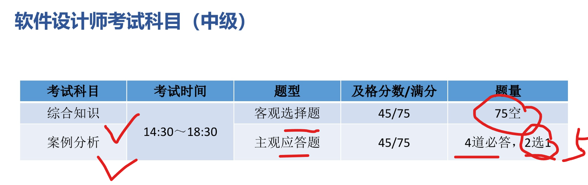
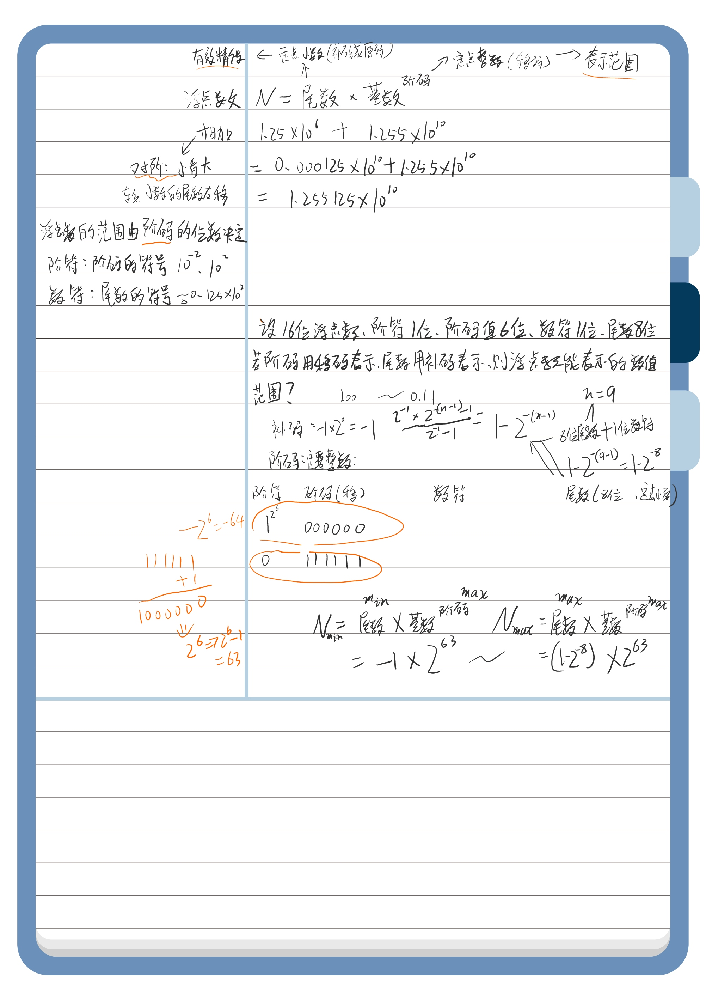

# 2025年5月真题

## Linux外部设备，以文件形式存储，存放在哪个路径？


| 目录路径        | 中文名称             | 英文全称/含义                               | 主要作用                                                     |
|---------------|----------------------|---------------------------------------------|--------------------------------------------------------------|
| `/`    | 根目录               | /                                      | 整个文件系统的起点                                             |
| `/root` | 系统管理员目录      | Root                                        | 系统管理员目录                                      |
| `/bin`        | 用户二进制文件       | User Binaries                               | 基本用户命令 (如 ls, cp)                                     |
| `/sbin`       | 系统二进制文件       | System Binaries                             | 基本系统管理命令 (如 ifconfig, fdisk)                        |
| **`/etc`**    | 配置文件             | Etcetera / Editable Text Configurations     | 系统配置文件 (如 passwd, fstab)                              |
| **`/dev`**    | 设备文件             | Device files                                | 外部设备（硬盘、u盘、USB、光驱等）会被抽象为设备文件,这些设备文件提供与硬件交互的接口 |
| `/proc`       | 进程信息             | Process information                         | 内核与进程信息的虚拟文件系统                                   |
| **`/var`**    | 可变文件             | Variable files                              | 经常变化扩充的文件 (如日志 /var/log, 邮件 /var/mail)           |
| `/tmp`        | 临时文件             | Temporary files                             | 临时文件 (通常重启后清空)                                    |
| `/usr`        | 用户程序             | Unix System Resources / User Shared Resources | 用户安装的程序和数据 (最大的目录之一)                          |
| `/usr/bin`    | 非必要用户命令       | User Binaries                               | 大部分用户命令                                                 |
| `/usr/sbin`   | 非必要系统命令       | System Binaries                             | 非必要的系统管理命令                                         |
| `/usr/local`  | 本地安装             | Local                                       | 本地管理员安装的软件 (通常有 bin, lib, share 子目录)         |
| `/usr/share`  | 共享数据             | Share                                       | 体系结构无关的共享数据 (如文档、图标)                        |
| `/usr/lib`    | 用户库文件           | Libraries                                   | /usr/bin 和 /usr/sbin 中程序所需的共享库                     |
| `/home`       | 用户目录         | Home                                        | 用户个人目录 (如 /home/username)                             |
| `/boot`       | 启动文件             | Boot loader files                           | 系统启动相关文件 (如内核 vmlinuz, GRUB)                      |
| `/lib`        | 核心共享库           | Libraries                                   | /bin和/sbin中程序所需的共享库 (如 ld.so, libc.so.*)          |
| `/opt`        | 可选应用             | Optional                                    | 第三方可选应用程序包 (如 Google Chrome)                      |
| `/mnt`        | 挂载点               | Mount                                       | 临时文件系统挂载点 (管理员手动挂载)                          |
| `/media`      | 可移动媒体           | Media                                       | 可移动设备挂载点 (如U盘, CD-ROM)                             |
| `/srv`        | 服务数据             | Service                                     | 系统提供的服务数据 (如 /srv/ftp, /srv/www)                   |

## 某系统有6个并发进程竞争资源R，每个进程都需要3个R，保证系统不会发生死锁，R的最小值为？

$$
\begin{array}{l}
\text{为了保证系统不发生死锁，最坏的情况是每个进程都已经获得了 k-1 个资源，} \\
\text{并且都在等待最后一个资源。此时，只要再多一个资源，就能满足至少一个进程，} \\
\text{使其执行完毕并释放资源，从而避免死锁。} \\
\\
\textbf{符号定义：} \\
\quad \begin{array}{ll}
N & \text{：并发进程的数量} \\
K & \text{：每个进程需要某种资源的最大数量} \\
R_{\text{min}} & \text{：保证不发生死锁的最小资源数} \\
\end{array} \\
\\
\textbf{计算公式：} \\
\quad R_{\text{min}} = N \times (K - 1) + 1 \\
\\
\hline \\
\textbf{例题：} \\
\text{某系统有6个并发进程竞争资源R，每个进程都需要3个R，} \\
\text{保证系统不会发生死锁，R的最小值为？} \\
\\
\textbf{解：} \\
\quad \begin{array}{lcl}
N &=& 6 \\
K &=& 3 \\
R_{\text{min}} &=& N \times (K - 1) + 1 \\
        &=& 6 \times (3 - 1) + 1 \\
        &=& 6 \times 2 + 1 \\
        &=& 12 + 1 \\
        &=& 13 \\
\end{array} \\
\\
\textbf{解释：} \\
\text{如果只有12个资源R，可能出现6个进程各获得2个资源（共用12个），} \\
\text{此时每个进程都还需1个资源才能执行。由于无剩余资源，将发生死锁。} \\
\text{若有13个资源R，在每个进程获得2个资源后（共用12个），还剩1个资源。} \\
\text{此资源可分配给任一进程，使其完成并释放资源，} \\
\text{从而其他进程也能相继完成。} \\
\end{array}
$$

## 数据库事务特性ACID


# 软考笔记-软考中级-软件设计师



## 计算机系统基础知识


* 计算机的基本硬件系统（冯诺依曼结构）的五大部件：**运算器、控制器、存储器、输入设备和输出设备**。
* **中央处理单元(CPU)**：运算器 + 控制器 + 寄存器 + **内部**总线（CPU内部连接各寄存器及运算器之间的总线，而非系统总线）
* **存储器**：计算机系统中的记忆设备，分为内部存储器（速快容小，临时存储）和外部存储器（长期存储）。
* 外部设备（外设): **输入设备**（输入原始数据和各种命令）和**输出设备**（输出处理结果）
* 运算器：执行算数运算（加减乘除）和执行逻辑运算并逻辑测试（与或非）：
  * 算数逻辑单元ALU：对数据的算数和逻辑运算
  * 累加寄存器AC：为ALU提供工作区，暂存运算结果
  * 数据缓冲寄存器DR：CPU和内存、外设间数据传送的中转站，用于缓冲速度上的差异性，如对内存读写时，用DR暂存有内存读写的指令或数据字
  * 状态条件寄存器PSW：保存算数/逻辑运算结果的状态，分状态标志和控制标志，如运算结果进位标志、溢出标志、中断标志
* 控制器：
  * 指令寄存器IR：保存当前执行指令的代码
  * 程序计数器PC：指向下一条指令的地址
  * 地址寄存器AR:  存放CPU访问的内存单元地址
  * 指令译码器：对指令译码
* 
* 


## 二进制按位权展开表示

$$
二进制的10.00=1 \times 2^1 +  0 \times 2^0 + 0 \times 2^{-1} + 0 \times 2^{-2}
$$

## 十进制转R进制使用除基取余法


## 十进制转二进制使用减法

$$
\begin{matrix}
2^0 = & 1 \\
2^1 = & 2 \\
2^2 = & 4 \\
2^3 = & 8 \\
2^4 = & 16 \\
2^5 = & 32 \\
2^6 = & 64 \\
2^7 = & 128 \\
2^8 = & 256 \\
2^9 = & 512 \\
2^{10} = & 1024 
\end{matrix}
\begin{matrix}
& {小于且离 10 最近的乘幂为 2^3 = 8  }\\
& {10 - 2^3 = 2} \\
& {小于且离  2  最近的乘幂为  2^1 = 2 }\\
& {2 - 2^1 = 0 \quad (结束)} 
\\
& 位号：3 & 2 & 1 & 0 \\
& 取值：1 & 0 & 1 & 0 \\
& 结果：10 的二进制=(1010)_2  
\end{matrix}
$$

## 二进制与八进制互转

**二进制转八进制 (三位分组，421法)：**
1位八进制数可以表示从 0 到 7 的数字，而 3位二进制数正好也能表示从 0 到 7 的值（共8种组合），所以我们可以将每 3位二进制数转换为 1位八进制数。**位权是 2<sup>2</sup>, 2<sup>1</sup>, 2<sup>0</sup>，也就是 4, 2, 1**。所以，每一组3位二进制数转换为八进制数码时，是基于"4-2-1"的位权相加得到的。

八进制数码与二进制对应关系：

| 八进制 | 3位二进制 (421) |
| :----: | :-------------: |
|   0    |       000       |
|   1    |       001       |
|   2    |       010       |
|   3    |       011       |
|   4    |       100       |
|   5    |       101       |
|   6    |       110       |
|   7    |       111       |

$$
\begin{array}{lll}
{\text{示例：将二进制数 } (1101011.1011)_2 \text{ 转换为八进制数。}} \\
\hline
\text{1. 整数部分处理:} & (1101011)_2 \\
 & \text{从右向左分组:} & 1 \quad 101 \quad 011 \\
 & \text{补0后分组:} & \mathbf{001} \quad \mathbf{101} \quad \mathbf{011} \\
 & \text{对应八进制:} & \downarrow \quad \downarrow \quad \downarrow \\
 & & {(0×4 + 0×2 + 1×1) = 1₈} \quad { (1×4 + 0×2 + 1×1) = 5₈} \quad {(0×4 + 1×2 + 1×1) = 3₈} \\
 & \text{整数部分结果:} & (153)_8 \\
\hline
\text{2. 小数部分处理:} & (.1011)_2 \\
 & \text{从左向右分组:} & 101 \quad 1 \\
 & \text{补0后分组:} & \mathbf{101} \quad \mathbf{100} \\
 & \text{对应八进制:} & \downarrow \quad \downarrow \\
 & & 5 \quad 4 \\
 & \text{小数部分结果:} & (.54)_8 \\
\hline
\text{3. 合并结果:} & (153.54)_8
\end{array}
$$

**八进制转二进制 (一位拆三位)：**
规则：将八进制数的每一位直接用其对应的3位二进制数替换。整数部分高位的0通常可以省略（除非单独一位0），小数部分末尾的0也可以省略。

$$
\begin{array}{lll}
{\text{示例：将八进制数 } (153.54)_8 \text{ 转换为二进制数。}} \\
\hline
\text{1. 整数部分处理:} & (153)_8 \\
   & \text{每位八进制转3位二进制:} & 1 & 5 & 3 \\
   & & \downarrow & \downarrow & \downarrow \\
   & & 001 & 101 & 011 \\
   & \text{合并并去除前导0:} & (001101011)_2 \rightarrow (1101011)_2 \\
\hline
\text{2. 小数部分处理:} & (.54)_8 \\
   & \text{每位八进制转3位二进制:} & 5 & 4 \\
   & & \downarrow & \downarrow \\
   & & 101 & 100 \\
   & \text{合并并去除末尾0 (如有必要):} & (.101100)_2 \rightarrow (.1011)_2 \\
\hline
\text{3. 最终合并结果:} & (1101011.1011)_2
\end{array}
$$

## 二进制与十六进制互转

**二进制转十六进制 (四位分组，8421法)：**
1位十六进制数可以表示从 0 到 15 的数字（0-9, A-F），而 4位二进制数正好也能表示从 0 到 15 的值（共16种组合），所以我们可以将每 4位二进制数转换为 1位十六进制数。**位权是 2<sup>3</sup>, 2<sup>2</sup>, 2<sup>1</sup>, 2<sup>0</sup>，也就是 8, 4, 2, 1**。所以，每一组4位二进制数转换为十六进制数码时，是基于"8-4-2-1"的位权相加得到的。

**十六进制数码与二进制对应关系：**

| 十六进制 | 等效十进制 | 4位二进制 (8421) |
| :------: | :--------: | :----------------: |
|    0     |     0      |        0000        |
|    1     |     1      |        0001        |
|    2     |     2      |        0010        |
|    3     |     3      |        0011        |
|    4     |     4      |        0100        |
|    5     |     5      |        0101        |
|    6     |     6      |        0110        |
|    7     |     7      |        0111        |
|    8     |     8      |        1000        |
|    9     |     9      |        1001        |
|    A     |     10     |        1010        |
|    B     |     11     |        1011        |
|    C     |     12     |        1100        |
|    D     |     13     |        1101        |
|    E     |     14     |        1110        |
|    F     |     15     |        1111        |

$$
\begin{array}{lll}
{\text{示例：将二进制数 } (1101011.101101)_2 \text{ 转换为十六进制数。}} \\
\hline
\text{1. 整数部分处理:} & (1101011)_2 \\
   & \text{从右向左分组 (每4位):} & 110 \quad 1011 \\
   & \text{补0后分组:} & \mathbf{0110} \quad \mathbf{1011} \\
   & \text{对应十六进制:} & \downarrow \qquad \downarrow \\
   & & (0\cdot8+1\cdot4+1\cdot2+0\cdot1)=6_16\quad (1\cdot8+0\cdot4+1\cdot2+1\cdot1)=B_16 \\
   & \text{整数部分结果:} & (6B)_16 \\
\hline
\text{2. 小数部分处理:} & (.101101)_2 \\
   & \text{从左向右分组 (每4位):} & 1011 \quad 01 \\
   & \text{补0后分组:} & \mathbf{1011} \quad \mathbf{0100} \\
   & \text{对应十六进制:} & \downarrow \qquad \downarrow \\
   & & (1\cdot8+0\cdot4+1\cdot2+1\cdot1)=B_16\quad (0\cdot8+1\cdot4+0\cdot2+0\cdot1)=4_16 \\
   & \text{小数部分结果:} & (.B4)_16 \\
\hline
\text{3. 合并结果:} & (6B.B4)_16
\end{array}
$$

**十六进制转二进制 (一位拆四位)：**
规则：将十六进制数的每一位直接用其对应的4位二进制数替换。整数部分高位的0通常可以省略（除非单独一位0），小数部分末尾的0也可以省略。

$$
\begin{array}{lll}
{\text{示例：将十六进制数 } (6B.B4)_16\text{ 转换为二进制数。}} \\
\hline
\text{1. 整数部分处理:} & (6B)_16\\
   & \text{每位十六进制转4位二进制:} & 6 & B \\
   & & \downarrow & \downarrow \\
   & & 0110 & 1011 \\
   & \text{合并并去除前导0:} & (01101011)_2 \rightarrow (1101011)_2 \\
\hline
\text{2. 小数部分处理:} & (.B4)_16\\
   & \text{每位十六进制转4位二进制:} & B & 4 \\
   & & \downarrow & \downarrow \\
   & & 1011 & 0100 \\
   & \text{合并并去除末尾0 (如有必要):} & (.101100)_2 \rightarrow (.1011)_2 \\
\hline
\text{3. 最终合并结果:} & (1101011.1011)_2
\end{array}
$$

## 八进制与十六进制互转 (以二进制为桥梁)

**八进制转十六进制：**
规则：先将每一位八进制数转换为3位二进制数，然后将得到的完整二进制串重新按4位一组进行划分（从小数点开始，分别向左、向右，不足4位则补0），最后将每4位二进制数转换为对应的十六进制数。

$$
\begin{array}{lll}
{\text{示例：将八进制数 } (153.54)_8 \text{ 转换为十六进制数。}} \\
\hline
\text{1. 八进制转二进制 (一位拆三位):} \\
   & (153.54)_8 \\
   & \text{整数部分: } 1 \rightarrow 001, \quad 5 \rightarrow 101, \quad 3 \rightarrow 011 & \Rightarrow (001101011)_2 \\
   & \text{小数部分: } 5 \rightarrow 101, \quad 4 \rightarrow 100 & \Rightarrow (.101100)_2 \\
   & \text{合并二进制: } (001101011.101100)_2 \\
\hline
\text{2. 二进制重新分组 (四位一组):} \\
   & \text{整数部分 (从右向左): } 001101011 \rightarrow 0110 \quad 1011 & \text{(补前导0后为 0110 1011)} \\
   & \text{小数部分 (从左向右): } 101100 \rightarrow 1011 \quad 00 & \text{(补末尾0后为 1011 0000)} \\
   & \text{分组后二进制: } (\mathbf{0110} \quad \mathbf{1011} . \mathbf{1011} \quad \mathbf{0000})_2 \\
\hline
\text{3. 二进制转十六进制 (四位转一位):} \\
   & 0110_2 \rightarrow 6_16\\
   & 1011_2 \rightarrow B_16\\
   & 1011_2 \rightarrow B_16\\
   & 0000_2 \rightarrow 0_16\\
   & \text{合并结果 (去除小数末尾的0): } (6B.B0)_16\rightarrow (6B.B)_16\\
\hline
\text{最终结果:} & (153.54)_8 = (6B.B)_16
\end{array}
$$

**十六进制转八进制：**
规则：先将每一位十六进制数转换为4位二进制数，然后将得到的完整二进制串重新按3位一组进行划分（从小数点开始，分别向左、向右，不足3位则补0），最后将每3位二进制数转换为对应的八进制数。

$$
\begin{array}{lll}
{\text{示例：将十六进制数 } (6B.B)_16\text{ 转换为八进制数。}} \\
\hline
\text{1. 十六进制转二进制 (一位拆四位):} \\
   & (6B.B)_16\\
   & \text{整数部分: } 6 \rightarrow 0110, \quad B \rightarrow 1011 & \Rightarrow (01101011)_2 \\
   & \text{小数部分: } B \rightarrow 1011 & \Rightarrow (.1011)_2 \\
   & \text{合并二进制: } (01101011.1011)_2 \\
\hline
\text{2. 二进制重新分组 (三位一组):} \\
   & \text{整数部分 (从右向左): } 01101011 \rightarrow 001 \quad 101 \quad 011 & \text{(补前导0后为 001 101 011)} \\
   & \text{小数部分 (从左向右): } 1011 \rightarrow 101 \quad 1 & \text{(补末尾0后为 101 100)} \\
   & \text{分组后二进制: } (\mathbf{001} \quad \mathbf{101} \quad \mathbf{011} . \mathbf{101} \quad \mathbf{100})_2 \\
\hline
\text{3. 二进制转八进制 (三位转一位):} \\
   & 001_2 \rightarrow 1_8 \\
   & 101_2 \rightarrow 5_8 \\
   & 011_2 \rightarrow 3_8 \\
   & 101_2 \rightarrow 5_8 \\
   & 100_2 \rightarrow 4_8 \\
   & \text{合并结果: } (153.54)_8 \\
\hline
\text{最终结果:} & (6B.B)_16= (153.54)_8
\end{array}
$$

## 计算机中的运算采用的是补码


> *   原码、反码：$+0$ 和 $-0$ 两种表示。
> *   补码、移码：$0$ 只有一种表示。
> *   原码和反码由于存在 $+0$ 和 $-0$，实际能表示的数值个数比 $2^N$ 少一个。
> *   补码通过"人为规定"，将 $-0$ 的编码 ($100...0$ 在原码中是 $-0$) 用来表示多一个负数 ($-2^{N-1}$)，从而实现了 $2^N$ 个唯一数值的表示。
> *   移码的范围取决于偏置值的选择，但其能表示的真值数量和补码一致。


计算机取值是固定8位字长：

| 码制 (详细说明)                                                                                                                                                                                                                                                           | 整数范围                      | 定点小数范围                                  | 数值个数    | 零的表示        | `+1` (示例, n=8) | `-1` (示例, n=8) | `1 + (-1)` <br/> (二进制, n=8) | `1 + (-1)` <br/> (真值, n=8) |
| :---------------------------------------------------------------------------------------------------------------------------------------------------------------------------------------------------------------------------------------------------------------------- | :---------------------------- | :-------------------------------------------- | :---------- | :-------------- | :--------------- | :--------------- | :-------------------------- | :-------------------------- |
| **原码 (Sign-Magnitude)**<br/>符号位加上数值的绝对值的二进制表示。零的表示不唯一：有 `+0` (`00000000`) 和 `-0` (`10000000`)。                                                                                                                                                                                     | $$[-(2^{N-1}-1), 2^{N-1}-1]$$ | $$[-(1-2^{-(N-1)}), 1-2^{-(N-1)}]$$   | $$2^N - 1$$ | `+0`, `-0`      | `00000001`       | `10000001`       | `10000010`                  | -2                          |
| **反码 (One's Complement)**<br/>正数: 同原码<br/>负数: 原码数值位取反<br/>+0: `00000000`<br/>-0: `11111111`                                                                                                                                                                                                                                                                            | $$[-(2^{N-1}-1), 2^{N-1}-1]$$ | $$[-(1-2^{-(N-1)}), 1-2^{-(N-1)}]$$   | $$2^N - 1$$ | `+0`, `-0`      | `00000001`       | `11111110`       | `11111111`                  | -0                          |
| **补码 (Two's Complement)**<br/><strong>定义:</strong><br/>正数: 同原反码<br/>负数: 反码末位+1<br/>零表示:唯一 `00000000`<br/>简化了硬件设计。加法和减法可以用相同的电路实现（减法通过加负数的补码）<br/>补码比原码/反码能多表示一个最小负数                                                                                                                                                                                          | $$[-2^{N-1}, 2^{N-1}-1]$$<br/>假设字长为3，则<br/>最小负数：100<br/>最大负数：111<br/>最大正数：011 | $$[-1, 1-2^{-(N-1)}]$$                   | $$2^N$$     | `+0` (唯一)     | `00000001`       | `11111111`       | `00000000`                  | 0                           |
| **移码 (Excess/Biased)**<br/>补码符号位取反, 其余不变<br/>零的表示通常不唯一，取决于偏置值                                                                                                                                                                                                                                        | $$[-2^{N-1}, 2^{N-1}-1]$$ | $$[-1, 1-2^{-(N-1)}]$$                 | $$2^N$$     | 唯一 (取决于偏置) | `10000001`       | `01111111`       | `00000000`                  | -128 (偏置值 $2^{N-1}$)     |

> 原码不使用负权重的计算方式，是因为它的定义就是将符号和数值分开表示，追求的是表示上的直观性。而负权重计算是补码为了实现算术运算的便捷性而采用的特定编码规则。
>
> * 原码的定义：直接和直观
>   "符号-数值"分离：原码的设计思路非常直观，它将一个数的符号和其绝对值（大小）分开处理。
>   符号位：最高位专门用来表示正负（0为正，1为负）。它就是一个纯粹的"标志"，告诉我们这个数是正还是负。
>   数值位：剩下的 n-1 位表示这个数的绝对值，按照标准的无符号二进制数来解读。
>   计算方式：因此，解读一个原码表示的数，就是先看符号位确定正负，然后将数值位直接转换为十进制得到其绝对值。例如，3位原码 111，符号位 1 表示负，数值位 11 表示 $2^1+2^0 = 3$，所以整个数是 -3。
> * 补码的定义：为算术运算优化
>   统一的加法规则：补码的设计目标之一是让加法和减法（通过加负数的补码）可以用一套相同的硬件逻辑来实现，并且符号位也参与运算。
>   负权重的引入：为了实现这个目标，补码采用了一种特殊的编码方式。其中，最高位（符号位）被赋予了一个负的权重（即 $-2^{n-1}$），而其余各位仍然是正权重。
>   结果：这种负权重的计算方式使得补码可以直接进行二进制加法，得到正确的结果，无需像原码那样先判断符号再决定是做加法还是减法。例如，3位补码 111，其值为 $-1 \times 2^2 + 1 \times 2^1 + 1 \times 2^0 = -4 + 2 + 1 = -1$。

$$
等比求和公式:S_k = \frac{a_1(q^k - 1)}{q - 1}
$$


## 例题：采用n位补码（包含一个符号位）表示数据，可以直接表示的数值？

**核心概念与推导：**

补码（Two's Complement）是一种在计算机中表示有符号整数的常用方法。对于一个n位的二进制数，如果采用补码表示：

1.  **符号位：** 最高位（最左边的一位）为符号位。
    *   `0` 代表正数或零。
    *   `1` 代表负数。

2.  **数值位：** 剩下的 `n-1` 位用于表示数值的大小。

3.  **正数及零的表示：**
    *   当符号位为 `0` 时，其表示的数值与原码和反码相同。
    *   最小值为 `0`，表示为 `000...0` (n个0)。
    * 最大值为当 `n-1` 个数值位全为 `1` 时，即 `011...1`。其值为 $2^{n-1} - 1$。
    
      > 二进制转十进制： 一个由 k 个 1 组成的二进制数，其值为： $1 \cdot 2^{k-1} + 1 \cdot 2^{k-2} + \dots + 1 \cdot 2^1 + 1 \cdot 2^0$ 这是一个等比数列求和，首项 $a_1 = 2^0 = 1$，公比 $q = 2$，项数 $k$。 根据等比数列求和公式 $S_k = \frac{a_1(q^k - 1)}{q - 1}$： $S_k = \frac{1 \cdot (2^k - 1)}{2 - 1} = 2^k - 1$
      > 数值位有 n-1 位，并且这 n-1 位全为 1。 所以，这里的 k 相当于 n-1。 将 $k = n-1$ 代入上面的公式 $2^k - 1$，我们得到这些数值位所代表的值为： $2^{(n-1)} - 1$
      > 因此，当n位补码的符号位为 0，且剩下的 n-1 个数值位全为 1 时（即二进制形式为 011...1），其表示的十进制值为 $2^{n-1} - 1$。这就是n位补码能表示的最大正数。
    * 例如，对于8位补码 (n=8)，最大正数为 `01111111`，即 $2^{8-1} - 1 = 2^7 - 1 = 128 - 1 = 127$。
    
4.  **负数的表示：**
    *   当符号位为 `1` 时，表示负数。
    *   负数的补码定义为其绝对值的原码各位取反（得到反码），然后在末位加1。
    *   **最小负数（绝对值最大）：** 其补码表示为 `100...0` (一个1后跟n-1个0)。这个值是  $-2^{n-1}$。
        *   例如，对于8位补码 (n=8)，最小负数是  $-128$，表示为 `10000000`。
        *   **常见误区与辨析：为什么最小负数不是 `111...1`？**
            初学者可能会直观地认为，既然符号位为1表示负数，那么数值位全为1（如 `111...1`）应该代表绝对值最大的负数，即最小负数。这种想法更符合原码的逻辑。
            但在补码中，情况不同。我们以3位字长为例来说明：
            *   **补码计算规则 (n=3)：** 值 = $-b_2 \cdot 2^2 + b_1 \cdot 2^1 + b_0 \cdot 2^0 = -4b_2 + 2b_1 + b_0$
            *   **对于 `111` (3位补码)：**
                值 =  $-1 \cdot 4 + 1 \cdot 2 + 1 \cdot 1 = -4 + 2 + 1 = -1$。
            *   **对于 `100` (3位补码)：**
                值 =  $-1 \cdot 4 + 0 \cdot 2 + 0 \cdot 1 = -4 + 0 + 0 = -4$。
                显然，-4 比 -1 更小，所以 `100` (其值为 $-2^{3-1}$) 才是3位补码的最小负数。
                **核心原因：** 在补码中，最高位（符号位）具有负权 ($-2^{n-1}$)，其余位具有正权。要得到最小的负数（即绝对值最大的负数），我们需要这个大的负权起作用（最高位为1），并让其余位的正权贡献最小化（即其余所有数值位为0）。如果其余数值位也为1（如 `111...1` 的情况），它们贡献的正值会"抵消"一部分最高位的负值，使得最终结果更接近0（例如得到-1），而不是变得更小（更负）。

      > **推导过程：**
      >
      > **方法一：通过补码的定义（针对负数）**
      >
      > 对于一个负数 $X$，其 n 位补码的定义是 $2^n - |X|$（在模 $2^n$ 的意义下）。
      > 我们给定的补码是 `100...0`。如果我们将这个二进制串看作一个无符号整数，它的值是 $1 \times 2^{n-1} + 0 \times 2^{n-2} + \dots + 0 \times 2^0 = 2^{n-1}$。
      >
      > 设 `100...0` 所代表的负数值为 $V$.
      > 根据定义，这个补码表示 $2^n - |V|$。
      > 所以，我们有：
      > $2^{n-1} = 2^n - |V|$
      >
      > 现在解出 $|V|$：
      > $|V| = 2^n - 2^{n-1}$
      > $|V| = (2 \times 2^{n-1}) - 2^{n-1}$
      > $|V| = (2-1) \times 2^{n-1}$
      > $|V| = 2^{n-1}$
      >
      > 因为符号位（最高位）是 `1`，所以 $V$ 是一个负数。
      > 因此，$V = -|V| = -2^{n-1}$。
      >
      > **方法二：通过补码的加权求和规则**
      >
      > 一个 n 位的二进制补码 $b_{n-1}b_{n-2}...b_1b_0$（其中 $b_{n-1}$ 是符号位）可以直接按权展开求和，其值为：
      > 数值 = $(-b_{n-1} \times 2^{n-1}) + (b_{n-2} \times 2^{n-2}) + \dots + (b_1 \times 2^1) + (b_0 \times 2^0)$
      >
      > 对于补码 `100...0`：
      > *   $b_{n-1} = 1$ (符号位)
      > *   $b_{n-2} = 0$
      > *   ...
      > *   $b_0 = 0$
      >
      > 将这些值代入加权求和公式：
      > 数值 = $(-1 \times 2^{n-1}) + (0 \times 2^{n-2}) + (0 \times 2^{n-3}) + \dots + (0 \times 2^1) + (0 \times 2^0)$
      > 数值 = $-2^{n-1} + 0 + 0 + \dots + 0 + 0$
      > 数值 = $-2^{n-1}$
      >
      > **结论：**
      > 两种方法都表明，n 位补码 `100...0` 表示的十进制数值是 $-2^{n-1}$。这是 n 位补码能够表示的最小负数（即绝对值最大的负数）
      
        *   这是补码表示的一个特点，负数范围比正数范围多一个最小负数$$-2^{n-1}$$。
        *   例如，对于8位补码 (n=8)，最小负数为 `10000000`，即 $-2^{8-1} = -2^7 = -128$。
    *   **最大负数（绝对值最小）：** 其补码表示为 `111...1` (n个1)。这个值是 $-1$。
    
      > **推导过程：**
      >
      > **方法一：通过补码的定义（针对负数）**
      >
      > 对于一个负数 $X$，其 n 位补码的定义是 $2^n - |X|$（在模 $2^n$ 的意义下）。
      > 我们给定的补码是 `111...1` (n个1)。如果我们将这个二进制串看作一个无符号整数，它的值是 $2^0 + 2^1 + \dots + 2^{n-1} = 2^n - 1$。
      >
      > 设 `111...1` 所代表的负数值为 $V$.
      > 根据定义，这个补码表示 $2^n - |V|$。
      > 所以，我们将无符号整数的值与补码的定义式等同起来：
      > $2^n - 1 = 2^n - |V|$
      >
      > 现在解出 $|V|$：
      > 从上式两边同时减去 $2^n$：
      > $-1 = -|V|$
      > 所以， $|V| = 1$。
      >
      > 因为符号位（最高位 $b_{n-1}$）是 `1`，所以 $V$ 是一个负数。
      > 因此，$V = -|V| = -1$。
      >
      > **方法二：通过补码的加权求和规则**
      >
      > 一个 n 位的二进制补码 $b_{n-1}b_{n-2}...b_1b_0$（其中 $b_{n-1}$ 是符号位）可以直接按权展开求和，其值为：
      > 数值 = $(-b_{n-1} \times 2^{n-1}) + (b_{n-2} \times 2^{n-2}) + \dots + (b_1 \times 2^1) + (b_0 \times 2^0)$
      >
      > 对于补码 `111...1`：
      > *   $b_{n-1} = 1$ (符号位)
      > *   $b_{n-2} = 1$
      > *   ...
      > *   $b_0 = 1$
      >
      > 将这些值代入加权求和公式：
      > 数值 = $(-1 \times 2^{n-1}) + (1 \times 2^{n-2}) + (1 \times 2^{n-3}) + \dots + (1 \times 2^1) + (1 \times 2^0)$
      > 数值 = $-2^{n-1} + (2^{n-2} + 2^{n-3} + \dots + 2^1 + 2^0)$
      >
      > 我们知道括号中的部分 $(2^{n-2} + 2^{n-3} + \dots + 2^1 + 2^0)$ 是一个等比数列的和，其项数为 $n-1$ (从 $2^0$到 $2^{n-2}$)，首项为 $2^0=1$，公比为 $2$。
      > 这个和等于 $2^{(n-1)} - 1$。
      >
      > 所以，代入回去：
      > 数值 = $-2^{n-1} + (2^{n-1} - 1)$
      > 数值 = $-2^{n-1} + 2^{n-1} - 1$
      > 数值 = $-1$
      >
      > **结论：**
      > 两种方法都表明，n 位补码 `111...1` 表示的十进制数值是 $-1$。这是 n 位补码能够表示的最大负数（即绝对值最小的负数）。
        *   例如，对于8位补码 (n=8)，`-1` 表示为 `11111111`。
    
5.  **总体表示范围：**
    综合正数、零和负数的表示，n位补码（包含一个符号位）可以直接表示的数值范围是：
    **$[ -2^{n-1}, 2^{n-1} - 1 ]$**

**示例（以 n=4 位补码为例）：**
*   $n=4$, $n-1=3$
*   最小负数$$-2^{4-1} = -2^3 = -8$$ (补码 `1000`)
*   最大正数$$2^{4-1} - 1 = 2^3 - 1 = 8 - 1 = 7$$ (补码 `0111`)
*   零：`0` (补码 `0000`)
*   范围$$[-8, 7]$$

**记忆要点：**

*   n位补码比n位原码和反码能多表示一个最小的负数 ($-2^{n-1}$)。

      > **详细解释：**
      >
      > **核心原因：零的表示方式不同**
      >
      > 1.  **原码 (Sign-Magnitude) 和 反码 (One's Complement)：**
      >     *   在这两种表示法中，**零都有两种表示形式**：
      >         *   **原码：** `+0` 表示为 `000...0`，`-0` 表示为 `100...0`。
      >         *   **反码：** `+0` 表示为 `000...0`，`-0` 表示为 `111...1` (全1)。
      >     *   因为零有两种表示，这实际上"浪费"了一个编码。对于n位二进制数，总共有 $2^n$ 种不同的编码组合。如果零占用了两种，那么能表示的非零数值就会少一个。
      >     *   **表示范围：** 因此，它们能表示的数值范围都是对称的，通常是 $[-(2^{n-1}-1), 2^{n-1}-1]$。
      >         *   例如，对于8位原码/反码，范围是 $[-127, 127]$。
      >         *   最小的负数（绝对值最大的）是 $-(2^{n-1}-1)$。
      >2.  **补码 (Two's Complement)：**
      >     *   在 补码 表示法中，由于零的表示是唯一的 (000...0)，原先用于表示 -0 的那个编码 100...0 被赋予了一个全新的、非零的数值含义。这个新的含义就是：表示数值 $-2^{n-1}$
      >     *   扩展了负数范围： 通过将 100...0 这个编码模式从表示 -0 转变为表示 $-2^{n-1}$，补码能够比原码和反码多表示一个负数。原码和反码的最小负数是 $-(2^{n-1}-1)$，而补码的最小负数是 $-2^{n-1}$，后者比前者更小（更负）。
      >     *   因此它能表示的**最小负数**比原码和反码更小（例如，8位补码能表示-128，而8位原码/反码只能表示到-127）。
      >     *   因此它表示的**不同整数的总个数**比原码和反码多一个 $-2^{n-1}$最小的负数（$$2^n$$个 vs $$2^n-1$$ 个）。
      > 
      > **总结与对比：**
      > 
      > | 特性         | 原码 (Sign-Magnitude)      | 反码 (One's Complement)    | 补码 (Two's Complement)      |
      >| :----------- | :------------------------- | :------------------------- | :--------------------------- |
      > | **零的表示** | `00...0` (+0)<br>`10...0` (-0) | `00...0` (+0)<br>`11...1` (-0) | `00...0` (唯一)              |
      >| **编码 `10...0`** | `-0`                       | $-(2^{n-1}-1)$             | $-2^{n-1}$                   |
      > | **最小负数** | $-(2^{n-1}-1)$             | $-(2^{n-1}-1)$             | $-2^{n-1}$                   |
      > | **最大正数** | $2^{n-1}-1$                | $2^{n-1}-1$                | $2^{n-1}-1$                  |
      > | **总范围**   | $[-(2^{n-1}-1), 2^{n-1}-1]$ | $[-(2^{n-1}-1), 2^{n-1}-1]$ | $[-2^{n-1}, 2^{n-1}-1]$      |
      > 
    
* 零的表示是唯一的 (`00...0`)。

* 正数范围$$[0, 2^{n-1}-1]$$

*   负数范围$$[-2^{n-1}, -1]$$

## 例题：如果2X的补码是90H，那么X的真值是？


如题目中 $2X$ 的补码是 $90H$：

1.  $90H$ → 二进制 $10010000_2$ (这是 $2X$ 的补码)。
2.  判断符号：最高位为1，是负数。
3.  求 $2X$ 的原码：
    *   补码 $10010000_2$
    *   减1 (得到反码)：$10010000_2 - 1 = 10001111_2$ (这是 $2X$ 的反码)
    *   符号位不变，数值位取反 (得到原码)：$1$ (符号) $1110000_2$ (数值位 $0001111_2$ 取反) → $11110000_2$ (这是 $2X$ 的原码)。
4.  $2X$ 的原码 $1(符号)1110000_2$ 表示十进制 $- (64+32+16) = -112$。
5.  所以 $X = -112 / 2 = -56$。

## 浮点数



## 逻辑运算 (Logical Operations)

| 逻辑运算符 | 符号 (Symbol) | 含义 (Meaning)                                       | 场景 (Scenario)                                  |
| :--------- | :------------ | :--------------------------------------------------- | :----------------------------------------------- |
| 逻辑与     | AND / `&&`/`*` | 连接的两个条件**同时为真**时，结果才为真；只要有一个为假，结果就为假。 | 类似于电路中的**串联**，任何一处断开（为假），整个电路就不通（为假）。 |
| 逻辑或     | OR / `||`/`+` | 连接的两个条件**只要有一个为真**，结果就为真；只有两者同时为假时，结果才为假。 | 类似于电路中的**并联**，只要有一条线路是通路（为真），整个系统就是通路（为真）。 |
| 逻辑非     | NOT / `!`     | 取反操作，真变假，假变真。                                 | 对单一条件的否定判断。                               |
| 逻辑异或   | XOR / `^ `/ `⊕` | 当两个输入不同时输出为真，否则为假。                     | 密码学、错误检测、数字电路设计。                     |

1.  **括号 `()`**：优先级最高，任何在括号内的表达式会优先计算。
2.  **逻辑非 `!`**：高于所有算术运算符。
3.  **算术运算符**：先乘除取模 `* / %`，后加减 `+ -`。
4.  **关系运算符**：先大于小于 `> < >= <=`，后等于不等于 `== !=`。
5.  **逻辑运算符**：先逻辑与 `&&、+`，后逻辑或 `||、*`。
6.  **赋值运算符 `=`**：优先级最低，最后执行。

## 例题：判断字长为16位的整数 A，第四位（从右向左数）是否全为零？

*   **背景知识**：16进制数 `F` 转换为二进制是 `1111`。位操作通常从右向左计数，最低位为第0位。
*   **分析**：我们需要判断 A 的第4位（从右数，假设从0开始编号，即第3位）是否为0。一个常用的方法是使用逻辑与操作符，将 A 与一个只有目标位为1，其余位为0的掩码进行逻辑与操作。如果结果为0，则说明 A 的目标位为0。
*   **选项分析**

$$
\begin{array}{|c|l|l|} 
\hline
\textbf{选项} & \textbf{表达式} & \textbf{分析与结论} \\ 
\hline
\text{A} & A \& \text{0x000F} == 0 & 
\begin{array}{l} 
\text{检查 A 的最低四位 (Mask: } (000F)_16= (1111)_2 \text{) 是否全为 0。} \\ 
\text{若低四位为 } (0000)_2 \text{, 则 } (0000)_2 \& (1111)_2 = (0000)_2 \rightarrow 0 \text{。} \\ 
\textbf{结论：正确} 
\end{array} \\ 
\hline
\text{B} & A \| \text{0x000F} == \text{0x000F} & 
\begin{array}{l} 
\text{无论 A 的低四位是 } (0000)_2 \text{ 还是 } (0010)_2 \text{, 与 } (1111)_2 \text{ 或运算结果均为 } (1111)_2 \text{。} \\ 
\text{无法判断低四位是否全为 0。} \\ 
\textbf{结论：错误} 
\end{array} \\ 
\hline
\text{C} & A \oplus \text{0x000F} == 0 & 
\begin{array}{l} 
\text{异或 (XOR) 操作。仅当 A 的低四位为 } (1111)_2 \text{ 时, 结果才为 0。} \\ 
\text{此为判断低四位是否全为 1。} \\ 
\textbf{结论：错误} 
\end{array} \\ 
\hline
\text{D} & A \& \text{0x000F} == \text{0x000F} & 
\begin{array}{l} 
\text{与 (AND) 操作。仅当 A 的低四位为 } (1111)_2 \text{ 时, 结果才为 } (1111)_2 \text{。} \\ 
\text{此为判断低四位是否全为 1。} \\ 
\textbf{结论：错误} 
\end{array} \\ 
\hline
\end{array}
$$


## 例题：布尔表达式的短路求值

**题目**：对布尔表达式进行短路求值是指，无须对表达式中所有操作数或运算符进行计算就可确定表达式的值。对于表达式 `a or ((c < d) and b)`，当（ ）时可进行短路计算。

**核心概念：短路求值 (Short-circuit Evaluation)**

*   **逻辑或 `(OR / ||)`**：在表达式 `X or Y` 中，如果 `X` 为 `true`，则整个表达式的结果必定为 `true`，无需再计算 `Y`。
*   **逻辑与 `(AND / &&)`**：在表达式 `X and Y` 中，如果 `X` 为 `false`，则整个表达式的结果必定为 `false`，无需再计算 `Y`。

**题目分析**：

给定的表达式为 `a or ((c < d) and b)`，其顶层是一个逻辑 **`or`** 运算。根据 `or` 的短路规则，只要左侧的操作数 `a` 为 `true`，整个表达式的值就确定为 `true`，右侧的复杂表达式 `((c < d) and b)` 将被完全跳过，不进行任何计算。这就实现了短路求值。

**选项分析**

$$
\begin{array}{|c|l|l|} 
\hline
\textbf{选项} & \textbf{条件} & \textbf{分析与结论} \\ 
\hline
\text{A} & d \text{ 为 true} & \text{d 在表达式右侧深层嵌套，其值无法直接决定是否短路。} \\ 
\hline
\text{B} & a \text{ 为 true} & 
    \begin{array}{l} 
    \text{当 a 为 true 时，根据 or 运算的短路规则，} \\ 
    \text{整个表达式结果直接为 true，右侧部分被跳过。} \\ 
    \textbf{结论：正确} 
    \end{array} \\ 
\hline
\text{C} & b \text{ 为 true} & \text{b 在表达式右侧，只有当 a 为 false 时才会被求值。} \\ 
\hline
\text{D} & c \text{ 为 true} & \text{c 在表达式右侧深层嵌套，其值无法直接决定是否短路。} \\ 
\hline
\end{array}
$$

## 校验码：奇偶校验 (Parity Check)

*   **校验码 (Check Code)**: 在原始数据（信息位）的基础上，通过特定算法增加一些冗余信息（校验位），用于在数据传输或存储后检测内容是否发生错误。其核心思想是**增加冗余度**。
* **码距 (Hamming Distance)**: 指在一个编码系统中，任意两个合法“码字”之间，对应位上二进制数值不同的最小位数。

  ```
  用4位二进制表示$2^4=16$种状态，则有16个不同的码字：
  0000
  0001
  =>码距为1
  0010
  ...
  1111
  ```

  码距越大，检错和纠错能力越强。奇偶校验通过增加1位校验位，将码距从1提升到2。

奇偶校验是一种简单、易于实现的检错码。它通过添加一个校验位，使得整个码字（信息位 + 校验位）中“1”的个数满足特定的奇偶性要求。

*   **奇校验 (Odd Parity)**: 确保整个码字中“1”的个数为**奇数**。
*   **偶校验 (Even Parity)**: 确保整个码字中“1”的个数为**偶数**。

假设原始信息位为 `1011001`，我们来计算其奇校验和偶校验的校验位。

$$
\begin{array}{|l|l|l|}
\hline
\textbf{校验类型} & \textbf{计算过程} & \textbf{最终码字 (校验位在后)} \\ 
\hline
\textbf{奇校验} & 
    \begin{array}{l} 
    \text{信息位: } 1011001 \\ 
    \text{“1”的个数: 4 (偶数)} \\ 
    \text{为使总数为奇数，需添加校验位: } \textbf{1}
    \end{array} & 
    1011001\textbf{1} \\ 
\hline
\textbf{偶校验} & 
    \begin{array}{l} 
    \text{信息位: } 1011001 \\ 
    \text{“1”的个数: 4 (偶数)} \\ 
    \text{为使总数为偶数，需添加校验位: } \textbf{0}
    \end{array} & 
    1011001\textbf{0} \\ 
\hline
\end{array}
$$

| 特性             | 描述                                                               |
| ---------------- | ------------------------------------------------------------------ |
| **检错能力**     | 能够检测出**任意奇数位**（如1、3、5位）的错误。                   |
| **检错盲区**     | **无法检测**出**任意偶数位**（如2、4、6位）的错误。这是因为偶数个位的翻转不会改变码字中“1”的整体奇偶性。 |
| **纠错能力**     | **完全不具备纠错能力**。它只能发现“出错了”，但无法确定是哪一位错了。 |

## 例题：奇数个数据位出错，则可检测出该错误但无法纠错

A. 若所有奇数位出错
B. 若所有偶数位出错
**C. 奇数个数据位出错，则可检测出该错误但无法纠错**
D. 若有偶数个数据位出错

**分析**：

$$
\begin{array}{|c|l|l|} 
\hline
\textbf{选项} & \textbf{内容} & \textbf{分析与结论} \\ 
\hline
\text{A, B} & \text{奇数/偶数位出错} & 
    \begin{array}{l} 
    \text{奇偶校验关心的是出错位的【个数】，而非出错位的【位置】。} \\ 
    \text{无论是奇数位还是偶数位出错，都无法直接判断检错结果。} \\ 
    \textbf{结论：错误}
    \end{array} \\ 
\hline
\text{C} & \text{奇数个数据位出错} & 
    \begin{array}{l} 
    \text{当有奇数个位发生翻转（0变1或1变0）时，} \\ 
    \text{码字中“1”的个数的奇偶性必然会改变，从而破坏原有的校验规则。} \\ 
    \text{因此，奇偶校验能够可靠地检测出奇数个位的错误。无法检测出任意偶数位（如2、4、6位）的错误。这是因为偶数个位的翻转不会改变码字中“1”的整体奇偶性。} \\ 
    \textbf{结论：正确}
    \end{array} \\ 
\hline
\text{D} & \text{偶数个数据位出错} & 
    \begin{array}{l} 
    \text{当有偶数个位发生翻转时，变化的“1”和“0”会相互抵消，} \\ 
    \text{导致码字整体的奇偶性不变，校验机制失效，无法发现错误。} \\ 
    \textbf{结论：错误}
    \end{array} \\ 
\hline
\end{array}
$$

奇偶校验的有效性，完全依赖于**整个码字中“1”的个数是奇数还是偶数**。如果这个奇偶性被破坏，我们就能发现错误。

我们以**偶校验**为例，并使用一个7位的信息 1011001

| 步骤                  | 正常情况 (无错误)                                            | 奇数位错误 (1位出错)                                | 偶数位错误 (2位出错)                                |
| :-------------------- | :----------------------------------------------------------- | :-------------------------------------------------- | :-------------------------------------------------- |
| **1. 发送端编码**     | 信息: `1011001`“1”的个数: 4 (偶数)为满足偶校验，校验位为 **0**发送码字: `1011001**0**` | (同左)                                              | (同左)                                              |
| **2. 传输中发生错误** | -                                                            | 第1位 `1` 翻转为 `0`错误码字: `**0**0110010`        | 第1、2位翻转 (`10` -> `01`)错误码字: `**01**110010` |
| **3. 接收端校验**     | 接收码字: `10110010`“1”的个数: 4 (偶数)                      | 接收码字: `00110010`“1”的个数: **3 (奇数)**         | 接收码字: `01110010`“1”的个数: **4 (偶数)**         |
| **4. 结论**           | 奇偶性**符合**约定 (偶数)✅ **数据正确**                      | 奇偶性**不符合**约定 (应为偶数)❌ **成功检测到错误** | 奇偶性**符合**约定 (偶数)⚠️ **未能检测到错误**       |

* 奇数个错误：每翻转1位，码字中“1”的个数要么+1，要么-1，这必然会改变原有的奇偶性（奇数变偶数，偶数变奇数）。所以，校验机制总能发现它

* 偶数个错误：当发生2位错误时，有三种可能：

  1. 两个 0 变成 1：1 的总数 +2。

  2. 两个 1 变成 0：1 的总数 -2。

  3. 一个 0 变 1，一个 1 变 0：1 的总数不变 (+1 再 -1)。

     无论哪种情况，1 的总数变化量都是一个偶数（+2, -2, 0）。一个数（无论奇偶）加上或减去一个偶数，其本身的奇偶性是不会改变的。

因此，在上面的例子中，当2位出错后，接收端计算后发现“1”的个数仍然是偶数，就错误地认为数据是正确的，这就是**奇偶校验无法检测出偶数位错误**的原因。
因此，在上面的例子中，当2位出错后，接收端计算后发现"1"的个数仍然是偶数，就错误地认为数据是正确的，这就是**奇偶校验无法检测出偶数位错误**的原因。

## CRC循环冗余校验码

使用**模二除法**进行计算


## 海明校验码 (Hamming Code)


* 可检错可纠错
* 利用**奇偶性**检错和纠错
* 通过扩大码距实现检错纠错，所以通常**码距大于1**。

## 海明校验位 (R)的求取

$$
2^R \geq M + R + 1
$$

*   `R`：海明校验位的个数（即需要增加的冗余位数）。
*   `M`：信息位的个数（即原始数据的位数）。
*   通过代入 `M` 的值，找到满足不等式的最小 `R` 值。
*   通过"分组奇偶校验"实现检错纠错。
*   校验位和信息位是相互掺杂在一起的，而不是简单地拼接在末尾。
*   海明校验位通常放置在 \(2^R) （即 $(2^0, 2^1, 2^2, \dots)$的位置上，也就是第 1、2、4、8、16… 位。
*   其他非 \(2^R\) 的位置则放置信息位。

$$
\textbf{示例}：
\begin{array}{l}
\textbf{当信息位 } M = 16 \textbf{ 时：} \\
\quad \text{公式: } 2^R \ge M + R + 1 \\
\quad \text{若 } R = 4 \text{: } 2^4 = 16 \\
\quad \quad M + R + 1 = 16 + 4 + 1 = 21 \\
\quad \quad 16 < 21 \quad (\text{不满足}) \\
\quad \text{若 } R = 5 \text{: } 2^5 = 32 \\
\quad \quad M + R + 1 = 16 + 5 + 1 = 22 \\
\quad \quad 32 \ge 22 \quad (\text{满足}) \\
\quad \text{结论：当信息位为16位时，至少需要增加 } 5 \text{ 个海明校验位。} \\
\end{array}
$$


## 例题：海明码校验
$$
\begin{array}{l}
\text{海明码是一种纠错码，其方法是为需要校验的数据位增加若干校验位，} \\
\text{使得校验位的值决定于某些被校验位的数据，当被校验数据出错时，} \\
\text{可根据校验位的变化找到出错位，从而纠正错误。} \\
\\
\textbf{1. 对于 } 32 \textbf{ 位的数据，至少需要增加（ } 6 \textbf{ ）个校验位才能构成海明码。}\\
\textbf{当信息位 } M = 32 \textbf{ 时：} \\
\quad \text{公式: } 2^R \ge M + R + 1 \\
\quad \text{若 } R = 5 \text{: } 2^5 = 32 \\
\quad \quad M + R + 1 = 32 + 5 + 1 = 38 \\
\quad \quad 32 < 38 \quad (\text{不满足}) \\
\quad \text{若 } R = 6 \text{: } 2^6 = 64 \\
\quad \quad M + R + 1 = 32 + 6 + 1 = 39 \\
\quad \quad 64 \ge 39 \quad (\text{满足}) \\
\quad \text{结论：当信息位为32位时，至少需要增加 } 6 \text{ 个海明校验位。}
\\
\textbf{2. 以10位数据为例，其海明码表示为：}\\
\quad D_9D_8D_7D_6D_5D_4P_4D_3D_2D_1P_3D_0P_2P_1 \\
\quad \text{其中 } D_i \text{ (} 0 \le i \le 9 \text{) 表示数据位，} P_j \text{ (} 1 \le j \le 4 \text{) 表示校验位。} \\
\quad \text{数据位 } D_9 \text{ （从右至左 } D_9 \text{ 的位序为 } 14 \text{，即等于 } 8+4+2 \text{）由第8位的 } P_4 \text{、第4位的 } P_3 \text{ 和第2位的 } P_2 \text{ 进行校验。}\\
\quad \text{数据位 } D_5 \text{ 由（ } P_4 \text{、} P_2 \text{ ）进行校验。}\\
\quad \quad \textbf{解析：找规律} \\
\quad \quad \text{首先确定 } D_5 \text{ 的位序。根据给出的码字序列，} D_5 \text{ 从右向左的位序是 } 10 \text{。} \\
\quad \quad \text{将 } 10 \text{ 分解为 } 2 \text{ 的幂次之和：} \\
\quad \quad 10 = 8 + 2 \\
\quad \quad \text{这意味着 } D_5 \text{ 将由位序为 } 8 \text{ 的校验位 } P_4 \text{ 和位序为 } 2 \text{ 的校验位 } P_2 \text{ 进行校验。}
\end{array}
$$

## 校验码对比

| 校验方式   | 检错能力         | 纠错能力 | 校验位数量              | 放置方式           | 特点               |
| :--------- | :--------------- | :------- | :---------------------- | :----------------- | :----------------- |
| 奇偶校验   | 只能检测**奇数位**错误 | 不可纠错 | 1位                     | 拼接在头部或尾部     | 奇校验 (Odd Parity): 确保整个码字中“1”的个数为奇数。 <br/>偶校验 (Even Parity): 确保整个码字中“1”的个数为偶数。 |
| CRC校验    | 可检测多种错误   | 不可纠错 | 由生成多项式决定        | 拼接在信息位尾部   | **模二除法**求余数，拼接作为校验位 |
| 海明校验码 | 可检错           | 可纠错   | $2^R \geq M + R + 1$ | 相互掺杂 | 分组奇偶校验 |

## CPU组成（运算器与控制器）


---


| 模块                           | 子部件         | 英文全称 (缩写)             | 主要功能                                          |
| ------------------------------ | -------------- | --------------------------- | ------------------------------------------------- |
| **运算器**<br/>Arithmetic Unit | 算术逻辑单元   | Arithmetic Logic Unit (ALU) | 负责数据的算术运算与逻辑运算                      |
|                                | 累加寄存器     | Accumulator Register (AC)   | 通用寄存器，为 ALU 提供工作区，暂存数据           |
|                                | 数据缓冲寄存器 | Data Register (DR)          | 写内存时暂存指令或数据                            |
|                                | 状态条件寄存器 | Program Status Word (PSW)   | 存放状态标志与控制标志<br/>(*部分教材归入控制器*) |
| **控制器**<br/>Control Unit    | 程序计数器     | Program Counter (PC)        | **存储下一条即将执行指令的地址**                  |
|                                | 指令寄存器     | Instruction Register (IR)   | 存储**当前**将执行的指令                          |
|                                | 指令译码器     | Instruction Decoder (ID)    | 对指令中操作码段进行分析解释                      |
|                                | 时序部件       | Timing & Control Unit       | 提供时序控制信号                                  |

**真题：**计算机中提供指令地址的程序计数器PC在**控制器**中。

**真题：**CPU执行算数运算或者逻辑运算时，常将源操作数和结果暂存在**累加器AC**中。

---

> 把 **CPU** 想象成<strong>公司</strong>：
> - **ALU = 生产部门**，负责“加工”数据产品；
> - **寄存器组 = 仓库**，短期存放原料和半成品；
> - **控制器 = 调度中心**，根据“生产计划”（指令）下达各类调度指令；
> - **总线 = 传送带**，负责各部门之间物料流转。

---


## 寻址方式（Addressing Modes）

**真题：**在机器指令的地址字段中，直接指出操作数本身的寻址方式称为**立即寻址**

> 把 **寻址方式** 想象成 **找书**：
> - 立即寻址 = 直接拿到书 (书=数据)。
> - 直接寻址 = 得到书架号，去书架取书。
> - 间接寻址 = 得到卡片箱号→卡片上写书架号→再去书架取书 (两跳)。
> - 寄存器寻址 = 手里拿着小篮子(寄存器)装书。
> - 寄存器间接 = 篮子里放着书架号，再去取书。
> - 隐含寻址 = 默认口袋(AC)里的书。

---


---


---


## CISC与RISC指令集体系

* RISC：指令长度定长格式、寻址方式较少，主要以多**寄存器寻址**为主、增加寄存器数目以减少访存次数、硬布线实现指令解码
* CIS：指令长度变长格式、多寻址、**微程序**控制


| 特点 (Feature)                                               | CISC (复杂指令集计算机) Complex Instruction Set Computer     | RISC (精简指令集计算机) Reduced Instruction Set Computer     |
| :----------------------------------------------------------- | :----------------------------------------------------------- | :----------------------------------------------------------- |
|                                                              | 想象一个**"万能工具箱"**。这个工具箱里有各种各样为特定复杂任务量身定制的"专业工具"（复杂指令），比如一个可以自动完成"钻孔、拧螺丝、涂漆"整个过程的"多功能一体机"。当有新任务时，就直接往工具箱里添加一个新工具。因此，工具种类繁多，但有些工具可能很少用到，有些则非常频繁。工具的使用方式（寻址方式）也多种多样。 | 想象一个**"乐高积木盒"**。这个盒子只有少数几种"基本积木"（精简指令），比如"连接"、"旋转"、"移除"等。虽然积木种类少，但通过巧妙地组合这些基本积木，可以搭建出各种各样复杂的模型（实现复杂功能）。所有的积木都大小一致（定长指令），并且组装起来非常迅速（单周期执行）。由于积木数量有限，每种积木都会被频繁地重复使用。 |
| **指令数量**<br/>Instruction Count                           | 较多，通常为数百条<br/>(A large number, usually hundreds)    | 较少，通常为几十条<br/>(A small number, usually dozens)      |
| **指令复杂度**<br/>Instruction Complexity                    | 复杂，一条指令可完成多步操作<br/>(Complex, one instruction can perform multiple operations) | 精简，一条指令通常只完成一个基本操作<br/>(Simple, one instruction usually performs one basic operation) |
| **指令长度格式**<br/>Instruction Length Format               | 变长格式 (Variable-length format)                            | **定长**格式 (Fixed-length format)                           |
| **寻址方式**<br/>Addressing Modes                            | 多种寻址方式，复杂多样<br/>(Multiple and complex addressing modes) | 较少，主要以多**寄存器寻址**为主<br/>(Fewer, primarily register-to-register addressing) |
| **通用寄存器数量**<br/>General-Purpose Registers             | 较少<br/>(Fewer)                                             | 较多，增加通用寄存器以减少访存次数<br/>(More, increased to reduce memory access) |
| **执行控制方式**<br/>Execution Control                       | 以**微程序**控制为主 (Microprogram control)                  | 以**硬布线**逻辑控制为主 (Hardwired logic control)           |
| **编译优化与高级语言支持**<br/>Compiler Optimization & HLL Support | 优化编译较困难，支持高级程序语言不如RISC<br/>(Harder for compiler optimization, less HLL support than RISC) | 更易于优化编译，有效支持高级程序语言<br/>(Easier for compiler optimization, effective HLL support) |
| **流水线执行**<br/>Pipelining Suitability                    | 适合采用流水线技术<br/>(Suitable for pipelining)             | **更**适合采用流水线技术<br/>(More suitable for pipelining)  |

## 流水线技术| Pipeline Technology

流水线方式下可以同时（**准并行**）执行多条指令

---


$$
\begin{aligned}
& \textbf{题目} \\
& \quad \text{一条指令的执行过程可分解为取指、分析和执行三步，} \\
& \quad \text{在取指时间 } t_{\text{取指}}=3\Delta t\text{、分析时间 } t_{\text{分析}}=2\Delta t\text{、} \\
& \quad \text{执行时间 } t_{\text{执行}}=4\Delta t \text{ 的情况下，} \\
& \quad \text{求 10 条指令的串行与流水线执行时间。} \\
\\
& \textbf{解题过程} \\
& \text{1. 串行执行时间 } (T_{\text{serial}}) \\
& \quad T_{\text{serial}} = 10 \times (3\Delta t + 2\Delta t + 4\Delta t) = \boxed{90\Delta t} \\
\\
& \text{2. 流水线周期 (Pipeline Cycle, t)} \\
& \quad \text{定义：执行时间最长的一段} \\
& \quad t = \max\{t_1, t_2, \dots, t_k\} \\
& \qquad  = \max\{3\Delta t, 2\Delta t, 4\Delta t\} = \boxed{4\Delta t} \\
\\
& \text{3. 流水线执行时间 } (T_{\text{pipe}}) \\
& \quad \text{思路：(首条指令用时)} + (\text{剩余 n-1 条指令用时}) \\
& \quad k=3, n=10, t=4\Delta t \\
& \quad \text{使用理论公式：}\\
& \quad T_{\text{pipe}} = \left( \sum_{i=1}^{k} t_i \right) + (n-1)t \\
& \qquad\quad = (9\Delta t) + (10-1) \times 4\Delta t \\
& \qquad\quad = 9\Delta t + 36\Delta t = \boxed{45\Delta t} \\
\\
& \quad \text{使用实践公式：} \\
& \quad T_{\text{pipe}}' = k \cdot t + (n-1)t \\
& \qquad\quad = (k+n-1)t \\
& \qquad\quad = (3+10-1) \times 4\Delta t \\
& \qquad\quad = 12 \times 4\Delta t = 48\Delta t \\
\\
& \text{4. 计算 10 条指令的吞吐率 } (\text{TP}) \\
& \quad \text{TP} = \frac{\text{指令数 } n}{T_{\text{pipe}}} \\
& \qquad = \frac{10}{45\Delta t} = \boxed{\frac{2}{9\Delta t}} \\
\\
& \text{5. 计算最大吞吐率 } \quad TP_{\text{max}}= \lim_{n \to \infty} \frac{n}{(k+n-1)t}= \frac{1}{t} = \boxed{\frac{1}{4\Delta t}}   \\
& \quad \text{当 } n \to \infty \text{ 时，吞吐率达到最大值，等于周期的倒数。} \\
\\
& \text{6. 流水线方式**不可提高单条**指令的执行速度：} \\
& \quad \text{串行和流水线方式的执行时间都是为3+2+4+(1-1)x4}
\end{aligned}
$$

---


---


## 关键性能指标 | Key Metrics

$$
\begin{array}{|l|l|l|}
\hline
\textbf{指标 Metric} & \textbf{公式 Formula} & \textbf{说明 Description}\\
\hline
\text{加速比}Speed\;Up~(S) & S = \dfrac{T_{串行}}{T_{流水}} & 越大越好/Greater is better \\
\hline
\text{吞吐率}Throughput~(TP) & TP = \dfrac{n}{T_{总}} = \dfrac{1}{T_{周期}} & 单位时间完成指令数 \\
\hline
\text{效率}Efficiency~(E) & E = \dfrac{S}{k} & k = 阶段数 / Stage count \\
\hline
\text{理想加速比} & S_{ideal}=k & 无冲突、无限缓存假设 \\
\hline
\end{array}
$$


## 存储系统

## 层次化存储

## Cache

## 主存编址计算

## 输入输出技术

## 总线

## 可靠性

## 性能指标
