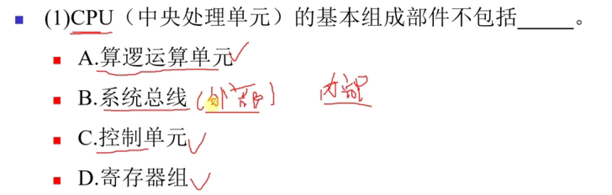

# 软考笔记-软考中级-软件设计师

## 计算机系统基础知识

* 计算机的基本硬件系统（冯诺依曼结构）的五大部件：**运算器、控制器、存储器、输入设备和输出设备**。
* **中央处理单元(CPU)**：运算器 + 控制器 + 寄存器 + **内部**总线（CPU内部连接各寄存器及运算器之间的总线，而非系统总线）
* **存储器**：计算机系统中的记忆设备，分为内部存储器（速快容小，临时存储）和外部存储器（长期存储）。
* 外部设备（外设）: **输入设备**（输入原始数据和各种命令）和**输出设备**（输出处理结果）
* 运算器：执行算数运算（加减乘除）和执行逻辑运算并逻辑测试（与或非）：
  * 算数逻辑单元ALU：对数据的算数和逻辑运算
  * 累加寄存器AC：为ALU提供工作区，暂存运算结果
  * 数据缓冲寄存器DR：CPU和内存、外设间数据传送的中转站，用于缓冲速度上的差异性，如对内存读写时，用DR暂存有内存读写的指令或数据字
  * 状态条件寄存器PSW：保存算数/逻辑运算结果的状态，分状态标志和控制标志，如运算结果进位标志、溢出标志、中断标志
* 控制器：
  * 指令寄存器IR：保存当前执行指令的代码
  * 程序计数器PC：指向下一条指令的地址
  * 地址寄存器AR:  存放CPU访问的内存单元地址
  * 指令译码器：对指令译码
* 
* 

## 二进制按位权展开表示

$$
二进制的10.00=1 \times 2^1 +  0 \times 2^0 + 0 \times 2^{-1} + 0 \times 2^{-2}
$$

## 十进制转R进制使用除基取余法

## 十进制转二进制使用减法

$$
\begin{matrix}
2^0 = & 1 \\
2^1 = & 2 \\
2^2 = & 4 \\
2^3 = & 8 \\
2^4 = & 16 \\
2^5 = & 32 \\
2^6 = & 64 \\
2^7 = & 128 \\
2^8 = & 256 \\
2^9 = & 512 \\
2^{10} = & 1024 
\end{matrix}

\begin{matrix}
& {小于且离 10 最近的乘幂为 2^3 = 8  }\\
& {10 - 2^3 = 2} \\
& {小于且离  2  最近的乘幂为  2^1 = 2 }\\
& {2 - 2^1 = 0 \quad (结束)} 
\\[1em]
& 位号：3 & 2 & 1 & 0 \\
& 取值：1 & 0 & 1 & 0 \\
& 结果：10 的二进制=(1010)_2  
\end{matrix}
$$

## 二进制与八进制互转

**二进制转八进制 (三位分组，421法)：**
1位八进制数可以表示从 0 到 7 的数字，而 3位二进制数正好也能表示从 0 到 7 的值（共8种组合），所以我们可以将每 3位二进制数转换为 1位八进制数。**位权是 22, 21, 20，也就是 4, 2, 1**。所以，每一组3位二进制数转换为八进制数码时，是基于“4-2-1”的位权相加得到的。

八进制数码与二进制对应关系：

| 八进制 | 3位二进制 (421) |
| :----: | :-------------: |
|   0    |       000       |
|   1    |       001       |
|   2    |       010       |
|   3    |       011       |
|   4    |       100       |
|   5    |       101       |
|   6    |       110       |
|   7    |       111       |

$$
\begin{array}{lll}
{\text{示例：将二进制数 } (1101011.1011)_2 \text{ 转换为八进制数。}} \\
\hline
\text{1. 整数部分处理:} & (1101011)_2 \\
 & \text{从右向左分组:} & 1 \quad 101 \quad 011 \\
 & \text{补0后分组:} & \mathbf{001} \quad \mathbf{101} \quad \mathbf{011} \\
 & \text{对应八进制:} & \downarrow \quad \downarrow \quad \downarrow \\
 & & {(0×4 + 0×2 + 1×1) = 1₈} \quad { (1×4 + 0×2 + 1×1) = 5₈} \quad {(0×4 + 1×2 + 1×1) = 3₈} \\
 & \text{整数部分结果:} & (153)_8 \\
\hline
\text{2. 小数部分处理:} & (.1011)_2 \\
 & \text{从左向右分组:} & 101 \quad 1 \\
 & \text{补0后分组:} & \mathbf{101} \quad \mathbf{100} \\
 & \text{对应八进制:} & \downarrow \quad \downarrow \\
 & & 5 \quad 4 \\
 & \text{小数部分结果:} & (.54)_8 \\
\hline
\text{3. 合并结果:} & (153.54)_8
\end{array}
$$

**八进制转二进制 (一位拆三位)：**
规则：将八进制数的每一位直接用其对应的3位二进制数替换。整数部分高位的0通常可以省略（除非单独一位0），小数部分末尾的0也可以省略。

$$
\begin{array}{lll}
{\text{示例：将八进制数 } (153.54)_8 \text{ 转换为二进制数。}} \\
\hline
\text{1. 整数部分处理:} & (153)_8 \\
   & \text{每位八进制转3位二进制:} & 1 & 5 & 3 \\
   & & \downarrow & \downarrow & \downarrow \\
   & & 001 & 101 & 011 \\
   & \text{合并并去除前导0:} & (001101011)_2 \rightarrow (1101011)_2 \\
\hline
\text{2. 小数部分处理:} & (.54)_8 \\
   & \text{每位八进制转3位二进制:} & 5 & 4 \\
   & & \downarrow & \downarrow \\
   & & 101 & 100 \\
   & \text{合并并去除末尾0 (如有必要):} & (.101100)_2 \rightarrow (.1011)_2 \\
\hline
\text{3. 最终合并结果:} & (1101011.1011)_2
\end{array}
$$

## 二进制与十六进制互转

**二进制转十六进制 (四位分组，8421法)：**
1位十六进制数可以表示从 0 到 15 的数字（0-9, A-F），而 4位二进制数正好也能表示从 0 到 15 的值（共16种组合），所以我们可以将每 4位二进制数转换为 1位十六进制数。**位权是 23, 22, 21, 20，也就是 8, 4, 2, 1**。所以，每一组4位二进制数转换为十六进制数码时，是基于“8-4-2-1”的位权相加得到的。

**十六进制数码与二进制对应关系：**

| 十六进制 | 等效十进制 | 4位二进制 (8421) |
| :------: | :--------: | :----------------: |
|    0     |     0      |        0000        |
|    1     |     1      |        0001        |
|    2     |     2      |        0010        |
|    3     |     3      |        0011        |
|    4     |     4      |        0100        |
|    5     |     5      |        0101        |
|    6     |     6      |        0110        |
|    7     |     7      |        0111        |
|    8     |     8      |        1000        |
|    9     |     9      |        1001        |
|    A     |     10     |        1010        |
|    B     |     11     |        1011        |
|    C     |     12     |        1100        |
|    D     |     13     |        1101        |
|    E     |     14     |        1110        |
|    F     |     15     |        1111        |

$$
\begin{array}{lll}
{\text{示例：将二进制数 } (1101011.101101)_2 \text{ 转换为十六进制数。}} \\
\hline
\text{1. 整数部分处理:} & (1101011)_2 \\
   & \text{从右向左分组 (每4位):} & 110 \quad 1011 \\
   & \text{补0后分组:} & \mathbf{0110} \quad \mathbf{1011} \\
   & \text{对应十六进制:} & \downarrow \qquad \downarrow \\
   & & (0\cdot8+1\cdot4+1\cdot2+0\cdot1)=6_{16} \quad (1\cdot8+0\cdot4+1\cdot2+1\cdot1)=B_{16} \\
   & \text{整数部分结果:} & (6B)_{16} \\
\hline
\text{2. 小数部分处理:} & (.101101)_2 \\
   & \text{从左向右分组 (每4位):} & 1011 \quad 01 \\
   & \text{补0后分组:} & \mathbf{1011} \quad \mathbf{0100} \\
   & \text{对应十六进制:} & \downarrow \qquad \downarrow \\
   & & (1\cdot8+0\cdot4+1\cdot2+1\cdot1)=B_{16} \quad (0\cdot8+1\cdot4+0\cdot2+0\cdot1)=4_{16} \\
   & \text{小数部分结果:} & (.B4)_{16} \\
\hline
\text{3. 合并结果:} & (6B.B4)_{16}
\end{array}
$$

**十六进制转二进制 (一位拆四位)：**
规则：将十六进制数的每一位直接用其对应的4位二进制数替换。整数部分高位的0通常可以省略（除非单独一位0），小数部分末尾的0也可以省略。
$$
\begin{array}{lll}
{\text{示例：将十六进制数 } (6B.B4)_{16} \text{ 转换为二进制数。}} \\
\hline
\text{1. 整数部分处理:} & (6B)_{16} \\
   & \text{每位十六进制转4位二进制:} & 6 & B \\
   & & \downarrow & \downarrow \\
   & & 0110 & 1011 \\
   & \text{合并并去除前导0:} & (01101011)_2 \rightarrow (1101011)_2 \\
\hline
\text{2. 小数部分处理:} & (.B4)_{16} \\
   & \text{每位十六进制转4位二进制:} & B & 4 \\
   & & \downarrow & \downarrow \\
   & & 1011 & 0100 \\
   & \text{合并并去除末尾0 (如有必要):} & (.10110100)_2 \rightarrow (.101101)_2 \\
\hline
\text{3. 最终合并结果:} & (1101011.101101)_2
\end{array}
$$

## 八进制与十六进制互转 (以二进制为桥梁)

**八进制转十六进制：**
规则：先将每一位八进制数转换为3位二进制数，然后将得到的完整二进制串重新按4位一组进行划分（从小数点开始，分别向左、向右，不足4位则补0），最后将每4位二进制数转换为对应的十六进制数。

$$
\begin{array}{lll}
{\text{示例：将八进制数 } (153.54)_8 \text{ 转换为十六进制数。}} \\
\hline
\text{1. 八进制转二进制 (一位拆三位):} \\
   & (153.54)_8 \\
   & \text{整数部分: } 1 \rightarrow 001, \quad 5 \rightarrow 101, \quad 3 \rightarrow 011 & \Rightarrow (001101011)_2 \\
   & \text{小数部分: } 5 \rightarrow 101, \quad 4 \rightarrow 100 & \Rightarrow (.101100)_2 \\
   & \text{合并二进制: } (001101011.101100)_2 \\
\hline
\text{2. 二进制重新分组 (四位一组):} \\
   & \text{整数部分 (从右向左): } 001101011 \rightarrow 0110 \quad 1011 & \text{(补前导0后为 0110 1011)} \\
   & \text{小数部分 (从左向右): } 101100 \rightarrow 1011 \quad 00 & \text{(补末尾0后为 1011 0000)} \\
   & \text{分组后二进制: } (\mathbf{0110} \quad \mathbf{1011} . \mathbf{1011} \quad \mathbf{0000})_2 \\
\hline
\text{3. 二进制转十六进制 (四位转一位):} \\
   & 0110_2 \rightarrow 6_{16} \\
   & 1011_2 \rightarrow B_{16} \\
   & 1011_2 \rightarrow B_{16} \\
   & 0000_2 \rightarrow 0_{16} \\
   & \text{合并结果 (去除小数末尾的0): } (6B.B0)_{16} \rightarrow (6B.B)_{16} \\
\hline
\text{最终结果:} & (153.54)_8 = (6B.B)_{16}
\end{array}
$$

**十六进制转八进制：**
规则：先将每一位十六进制数转换为4位二进制数，然后将得到的完整二进制串重新按3位一组进行划分（从小数点开始，分别向左、向右，不足3位则补0），最后将每3位二进制数转换为对应的八进制数。

$$
\begin{array}{lll}
{\text{示例：将十六进制数 } (6B.B)_{16} \text{ 转换为八进制数。}} \\
\hline
\text{1. 十六进制转二进制 (一位拆四位):} \\
   & (6B.B)_{16} \\
   & \text{整数部分: } 6 \rightarrow 0110, \quad B \rightarrow 1011 & \Rightarrow (01101011)_2 \\
   & \text{小数部分: } B \rightarrow 1011 & \Rightarrow (.1011)_2 \\
   & \text{合并二进制: } (01101011.1011)_2 \\
\hline
\text{2. 二进制重新分组 (三位一组):} \\
   & \text{整数部分 (从右向左): } 01101011 \rightarrow 001 \quad 101 \quad 011 & \text{(补前导0后为 001 101 011)} \\
   & \text{小数部分 (从左向右): } 1011 \rightarrow 101 \quad 1 & \text{(补末尾0后为 101 100)} \\
   & \text{分组后二进制: } (\mathbf{001} \quad \mathbf{101} \quad \mathbf{011} . \mathbf{101} \quad \mathbf{100})_2 \\
\hline
\text{3. 二进制转八进制 (三位转一位):} \\
   & 001_2 \rightarrow 1_8 \\
   & 101_2 \rightarrow 5_8 \\
   & 011_2 \rightarrow 3_8 \\
   & 101_2 \rightarrow 5_8 \\
   & 100_2 \rightarrow 4_8 \\
   & \text{合并结果: } (153.54)_8 \\
\hline
\text{最终结果:} & (6B.B)_{16} = (153.54)_8
\end{array}
$$

# 2025年5月真题

## Linux外部设备，以文件形式存储，存放在哪个路径？

| 目录路径        | 中文名称             | 英文全称/含义                               | 主要作用                                                     |
|---------------|----------------------|---------------------------------------------|--------------------------------------------------------------|
| `/`    | 根目录               | /                                      | 整个文件系统的起点                                             |
| `/root` | 系统管理员目录      | Root                                        | 系统管理员目录                                      |
| `/bin`        | 用户二进制文件       | User Binaries                               | 基本用户命令 (如 ls, cp)                                     |
| `/sbin`       | 系统二进制文件       | System Binaries                             | 基本系统管理命令 (如 ifconfig, fdisk)                        |
| **`/etc`**    | 配置文件             | Etcetera / Editable Text Configurations     | 系统配置文件 (如 passwd, fstab)                              |
| **`/dev`**    | 设备文件             | Device files                                | 外部设备（硬盘、u盘、USB、光驱等）会被抽象为设备文件,这些设备文件提供与硬件交互的接口 |
| `/proc`       | 进程信息             | Process information                         | 内核与进程信息的虚拟文件系统                                   |
| **`/var`**    | 可变文件             | Variable files                              | 经常变化扩充的文件 (如日志 /var/log, 邮件 /var/mail)           |
| `/tmp`        | 临时文件             | Temporary files                             | 临时文件 (通常重启后清空)                                    |
| `/usr`        | 用户程序             | Unix System Resources / User Shared Resources | 用户安装的程序和数据 (最大的目录之一)                          |
| `/usr/bin`    | 非必要用户命令       | User Binaries                               | 大部分用户命令                                                 |
| `/usr/sbin`   | 非必要系统命令       | System Binaries                             | 非必要的系统管理命令                                         |
| `/usr/local`  | 本地安装             | Local                                       | 本地管理员安装的软件 (通常有 bin, lib, share 子目录)         |
| `/usr/share`  | 共享数据             | Share                                       | 体系结构无关的共享数据 (如文档、图标)                        |
| `/usr/lib`    | 用户库文件           | Libraries                                   | /usr/bin 和 /usr/sbin 中程序所需的共享库                     |
| `/home`       | 用户目录         | Home                                        | 用户个人目录 (如 /home/username)                             |
| `/boot`       | 启动文件             | Boot loader files                           | 系统启动相关文件 (如内核 vmlinuz, GRUB)                      |
| `/lib`        | 核心共享库           | Libraries                                   | /bin和/sbin中程序所需的共享库 (如 ld.so, libc.so.*)          |
| `/opt`        | 可选应用             | Optional                                    | 第三方可选应用程序包 (如 Google Chrome)                      |
| `/mnt`        | 挂载点               | Mount                                       | 临时文件系统挂载点 (管理员手动挂载)                          |
| `/media`      | 可移动媒体           | Media                                       | 可移动设备挂载点 (如U盘, CD-ROM)                             |
| `/srv`        | 服务数据             | Service                                     | 系统提供的服务数据 (如 /srv/ftp, /srv/www)                   |

## 某系统有6个并发进程竞争资源R，每个进程都需要3个R，保证系统不会发生死锁，R的最小值为？

$$
\begin{array}{l}
\text{为了保证系统不发生死锁，最坏的情况是每个进程都已经获得了 k-1 个资源，} \\
\text{并且都在等待最后一个资源。此时，只要再多一个资源，就能满足至少一个进程，} \\
\text{使其执行完毕并释放资源，从而避免死锁。} \\
\\
\textbf{符号定义：} \\
\quad \begin{array}{ll}
N & \text{：并发进程的数量} \\
K & \text{：每个进程需要某种资源的最大数量} \\
R_{\text{min}} & \text{：保证不发生死锁的最小资源数} \\
\end{array} \\
\\
\textbf{计算公式：} \\
\quad R_{\text{min}} = N \times (K - 1) + 1 \\
\\
\hline \\
\textbf{例题：} \\
\text{某系统有6个并发进程竞争资源R，每个进程都需要3个R，} \\
\text{保证系统不会发生死锁，R的最小值为？} \\
\\
\textbf{解：} \\
\quad \begin{array}{lcl}
N &=& 6 \\
K &=& 3 \\
R_{\text{min}} &=& N \times (K - 1) + 1 \\
        &=& 6 \times (3 - 1) + 1 \\
        &=& 6 \times 2 + 1 \\
        &=& 12 + 1 \\
        &=& 13 \\
\end{array} \\
\\
\textbf{解释：} \\
\text{如果只有12个资源R，可能出现6个进程各获得2个资源（共用12个），} \\
\text{此时每个进程都还需1个资源才能执行。由于无剩余资源，将发生死锁。} \\
\text{若有13个资源R，在每个进程获得2个资源后（共用12个），还剩1个资源。} \\
\text{此资源可分配给任一进程，使其完成并释放资源，} \\
\text{从而其他进程也能相继完成。} \\
\end{array}
$$
