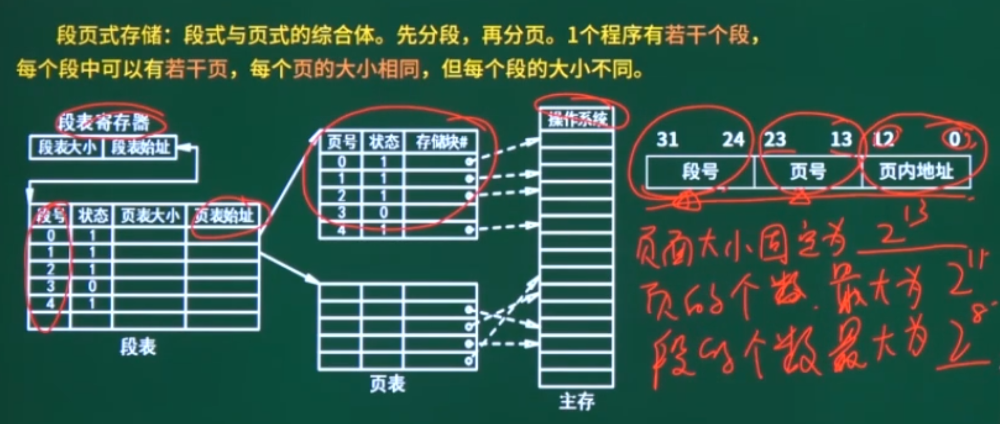

# 软考笔记-软考中级-软件设计师


## Linux外部设备，以文件形式存储，存放在哪个路径？


| 目录路径        | 中文名称             | 英文全称/含义                               | 主要作用                                                     |
|---------------|----------------------|---------------------------------------------|--------------------------------------------------------------|
| `/`    | 根目录               | /                                      | 整个文件系统的起点                                             |
| `/root` | 系统管理员目录      | Root                                        | 系统管理员目录                                      |
| `/bin`        | 用户二进制文件       | User Binaries                               | 基本用户命令 (如 ls, cp)                                     |
| `/sbin`       | 系统二进制文件       | System Binaries                             | 基本系统管理命令 (如 ifconfig, fdisk)                        |
| **`/etc`**    | 配置文件             | Etcetera / Editable Text Configurations     | 系统配置文件 (如 passwd, fstab)                              |
| **`/dev`**    | 设备文件             | Device files                                | 外部设备（硬盘、u盘、USB、光驱等）会被抽象为设备文件,这些设备文件提供与硬件交互的接口 |
| `/proc`       | 进程信息             | Process information                         | 内核与进程信息的虚拟文件系统                                   |
| **`/var`**    | 可变文件             | Variable files                              | 经常变化扩充的文件 (如日志 /var/log, 邮件 /var/mail)           |
| `/tmp`        | 临时文件             | Temporary files                             | 临时文件 (通常重启后清空)                                    |
| `/usr`        | 用户程序             | Unix System Resources / User Shared Resources | 用户安装的程序和数据 (最大的目录之一)                          |
| `/usr/bin`    | 非必要用户命令       | User Binaries                               | 大部分用户命令                                                 |
| `/usr/sbin`   | 非必要系统命令       | System Binaries                             | 非必要的系统管理命令                                         |
| `/usr/local`  | 本地安装             | Local                                       | 本地管理员安装的软件 (通常有 bin, lib, share 子目录)         |
| `/usr/share`  | 共享数据             | Share                                       | 体系结构无关的共享数据 (如文档、图标)                        |
| `/usr/lib`    | 用户库文件           | Libraries                                   | /usr/bin 和 /usr/sbin 中程序所需的共享库                     |
| `/home`       | 用户目录         | Home                                        | 用户个人目录 (如 /home/username)                             |
| `/boot`       | 启动文件             | Boot loader files                           | 系统启动相关文件 (如内核 vmlinuz, GRUB)                      |
| `/lib`        | 核心共享库           | Libraries                                   | /bin和/sbin中程序所需的共享库 (如 ld.so, libc.so.*)          |
| `/opt`        | 可选应用             | Optional                                    | 第三方可选应用程序包 (如 Google Chrome)                      |
| `/mnt`        | 挂载点               | Mount                                       | 临时文件系统挂载点 (管理员手动挂载)                          |
| `/media`      | 可移动媒体           | Media                                       | 可移动设备挂载点 (如U盘, CD-ROM)                             |
| `/srv`        | 服务数据             | Service                                     | 系统提供的服务数据 (如 /srv/ftp, /srv/www)                   |


## 数据库事务特性ACID


## 数据库事务并发

| 问题              | 特点                                                         | 记忆关键词                       |
| ----------------- | ------------------------------------------------------------ | -------------------------------- |
| 丢失更新/丢失修改 | 读到同一个数据后多次写回导致前面的写被覆盖。写被其他事务覆盖 | 读同写盖                         |
| 不可重复读        | 验算前被其他事务修改，导致验算不对                           | 验算                             |
| 脏读              | 读到其他事务rollback前的中间的无效脏数据                     | 读到无效（被rollback）的中间数据 |


## 封锁协议

| 名称                   | 特点                                                         | 记忆   |
| ---------------------- | ------------------------------------------------------------ | ------ |
| S锁/读锁/共享锁        | 若事务T对数据对象A加上S锁，其他事务只能再加S锁，不能对A再加其他锁 | SS锁   |
| X锁/写锁/独占锁/排他锁 | 若事务T对数据对象A加上X锁，其他事务不能对A再加任何锁         | 独占锁 |

## 计算机系统基础知识


* 计算机的基本硬件系统（冯诺依曼结构）的五大部件：**运算器、控制器、存储器、输入设备和输出设备**。
* **中央处理单元(CPU)**：运算器 + 控制器 + 寄存器 + **内部**总线（CPU内部连接各寄存器及运算器之间的总线，而非系统总线）
* **存储器**：计算机系统中的记忆设备，分为内部存储器（速快容小，临时存储）和外部存储器（长期存储）。
* 外部设备（外设): **输入设备**（输入原始数据和各种命令）和**输出设备**（输出处理结果）
* 运算器：执行算数运算（加减乘除）和执行逻辑运算并逻辑测试（与或非）：
  * 算数逻辑单元ALU：对数据的算数和逻辑运算
  * 累加寄存器AC：为ALU提供工作区，暂存运算结果
  * 数据缓冲寄存器DR：CPU和内存、外设间数据传送的中转站，用于缓冲速度上的差异性，如对内存读写时，用DR暂存有内存读写的指令或数据字
  * 状态条件寄存器PSW：保存算数/逻辑运算结果的状态，分状态标志和控制标志，如运算结果进位标志、溢出标志、中断标志
* 控制器：
  * 指令寄存器IR：保存当前执行指令的代码
  * 程序计数器PC：指向下一条指令的地址
  * 地址寄存器AR:  存放CPU访问的内存单元地址
  * 指令译码器：对指令译码
* 
* 


## 二进制按位权展开表示

$$
二进制的10.00=1 \times 2^1 +  0 \times 2^0 + 0 \times 2^{-1} + 0 \times 2^{-2}
$$

## 十进制转R进制使用除基取余法


## 十进制转二进制使用减法

$$
\begin{matrix}
2^0 = & 1 \\
2^1 = & 2 \\
2^2 = & 4 \\
2^3 = & 8 \\
2^4 = & 16 \\
2^5 = & 32 \\
2^6 = & 64 \\
2^7 = & 128 \\
2^8 = & 256 \\
2^9 = & 512 \\
2^{10} = & 1024 
\end{matrix}
\begin{matrix}
& {小于且离 10 最近的乘幂为 2^3 = 8  }\\
& {10 - 2^3 = 2} \\
& {小于且离  2  最近的乘幂为  2^1 = 2 }\\
& {2 - 2^1 = 0 \quad (结束)} 
\\
& 位号：3 & 2 & 1 & 0 \\
& 取值：1 & 0 & 1 & 0 \\
& 结果：10 的二进制=(1010)_2  
\end{matrix}
$$

## 二进制与八进制互转

**二进制转八进制 (三位分组，421法)：**
1位八进制数可以表示从 0 到 7 的数字，而 3位二进制数正好也能表示从 0 到 7 的值（共8种组合），所以我们可以将每 3位二进制数转换为 1位八进制数。**位权是 2<sup>2</sup>, 2<sup>1</sup>, 2<sup>0</sup>，也就是 4, 2, 1**。所以，每一组3位二进制数转换为八进制数码时，是基于"4-2-1"的位权相加得到的。

八进制数码与二进制对应关系：

| 八进制 | 3位二进制 (421) |
| :----: | :-------------: |
|   0    |       000       |
|   1    |       001       |
|   2    |       010       |
|   3    |       011       |
|   4    |       100       |
|   5    |       101       |
|   6    |       110       |
|   7    |       111       |

$$
\begin{array}{lll}
{\text{示例：将二进制数 } (1101011.1011)_2 \text{ 转换为八进制数。}} \\
\hline
\text{1. 整数部分处理:} & (1101011)_2 \\
 & \text{从右向左分组:} & 1 \quad 101 \quad 011 \\
 & \text{补0后分组:} & \mathbf{001} \quad \mathbf{101} \quad \mathbf{011} \\
 & \text{对应八进制:} & \downarrow \quad \downarrow \quad \downarrow \\
 & & {(0×4 + 0×2 + 1×1) = 1₈} \quad { (1×4 + 0×2 + 1×1) = 5₈} \quad {(0×4 + 1×2 + 1×1) = 3₈} \\
 & \text{整数部分结果:} & (153)_8 \\
\hline
\text{2. 小数部分处理:} & (.1011)_2 \\
 & \text{从左向右分组:} & 101 \quad 1 \\
 & \text{补0后分组:} & \mathbf{101} \quad \mathbf{100} \\
 & \text{对应八进制:} & \downarrow \quad \downarrow \\
 & & 5 \quad 4 \\
 & \text{小数部分结果:} & (.54)_8 \\
\hline
\text{3. 合并结果:} & (153.54)_8
\end{array}
$$

**八进制转二进制 (一位拆三位)：**
规则：将八进制数的每一位直接用其对应的3位二进制数替换。整数部分高位的0通常可以省略（除非单独一位0），小数部分末尾的0也可以省略。

$$
\begin{array}{lll}
{\text{示例：将八进制数 } (153.54)_8 \text{ 转换为二进制数。}} \\
\hline
\text{1. 整数部分处理:} & (153)_8 \\
   & \text{每位八进制转3位二进制:} & 1 & 5 & 3 \\
   & & \downarrow & \downarrow & \downarrow \\
   & & 001 & 101 & 011 \\
   & \text{合并并去除前导0:} & (001101011)_2 \rightarrow (1101011)_2 \\
\hline
\text{2. 小数部分处理:} & (.54)_8 \\
   & \text{每位八进制转3位二进制:} & 5 & 4 \\
   & & \downarrow & \downarrow \\
   & & 101 & 100 \\
   & \text{合并并去除末尾0 (如有必要):} & (.101100)_2 \rightarrow (.1011)_2 \\
\hline
\text{3. 最终合并结果:} & (1101011.1011)_2
\end{array}
$$

## 二进制与十六进制互转

**二进制转十六进制 (四位分组，8421法)：**
1位十六进制数可以表示从 0 到 15 的数字（0-9, A-F），而 4位二进制数正好也能表示从 0 到 15 的值（共16种组合），所以我们可以将每 4位二进制数转换为 1位十六进制数。**位权是 2<sup>3</sup>, 2<sup>2</sup>, 2<sup>1</sup>, 2<sup>0</sup>，也就是 8, 4, 2, 1**。所以，每一组4位二进制数转换为十六进制数码时，是基于"8-4-2-1"的位权相加得到的。

**十六进制数码与二进制对应关系：**

| 十六进制 | 等效十进制 | 4位二进制 (8421) |
| :------: | :--------: | :----------------: |
|    0     |     0      |        0000        |
|    1     |     1      |        0001        |
|    2     |     2      |        0010        |
|    3     |     3      |        0011        |
|    4     |     4      |        0100        |
|    5     |     5      |        0101        |
|    6     |     6      |        0110        |
|    7     |     7      |        0111        |
|    8     |     8      |        1000        |
|    9     |     9      |        1001        |
|    A     |     10     |        1010        |
|    B     |     11     |        1011        |
|    C     |     12     |        1100        |
|    D     |     13     |        1101        |
|    E     |     14     |        1110        |
|    F     |     15     |        1111        |

$$
\begin{array}{lll}
{\text{示例：将二进制数 } (1101011.101101)_2 \text{ 转换为十六进制数。}} \\
\hline
\text{1. 整数部分处理:} & (1101011)_2 \\
   & \text{从右向左分组 (每4位):} & 110 \quad 1011 \\
   & \text{补0后分组:} & \mathbf{0110} \quad \mathbf{1011} \\
   & \text{对应十六进制:} & \downarrow \qquad \downarrow \\
   & & (0\cdot8+1\cdot4+1\cdot2+0\cdot1)=6_16\quad (1\cdot8+0\cdot4+1\cdot2+1\cdot1)=B_16 \\
   & \text{整数部分结果:} & (6B)_16 \\
\hline
\text{2. 小数部分处理:} & (.101101)_2 \\
   & \text{从左向右分组 (每4位):} & 1011 \quad 01 \\
   & \text{补0后分组:} & \mathbf{1011} \quad \mathbf{0100} \\
   & \text{对应十六进制:} & \downarrow \qquad \downarrow \\
   & & (1\cdot8+0\cdot4+1\cdot2+1\cdot1)=B_16\quad (0\cdot8+1\cdot4+0\cdot2+0\cdot1)=4_16 \\
   & \text{小数部分结果:} & (.B4)_16 \\
\hline
\text{3. 合并结果:} & (6B.B4)_16
\end{array}
$$

**十六进制转二进制 (一位拆四位)：**
规则：将十六进制数的每一位直接用其对应的4位二进制数替换。整数部分高位的0通常可以省略（除非单独一位0），小数部分末尾的0也可以省略。

---

$$
\begin{array}{lll}
{\text{示例：将十六进制数 } (6B.B4)_16\text{ 转换为二进制数。}} \\
\hline
\text{1. 整数部分处理:} & (6B)_16\\
   & \text{每位十六进制转4位二进制:} & 6 & B \\
   & & \downarrow & \downarrow \\
   & & 0110 & 1011 \\
   & \text{合并并去除前导0:} & (01101011)_2 \rightarrow (1101011)_2 \\
\hline
\text{2. 小数部分处理:} & (.B4)_16\\
   & \text{每位十六进制转4位二进制:} & B & 4 \\
   & & \downarrow & \downarrow \\
   & & 1011 & 0100 \\
   & \text{合并并去除末尾0 (如有必要):} & (.101100)_2 \rightarrow (.1011)_2 \\
\hline
\text{3. 最终合并结果:} & (1101011.1011)_2
\end{array}
$$

## 八进制与十六进制互转 (以二进制为桥梁)

**八进制转十六进制：**
规则：先将每一位八进制数转换为3位二进制数，然后将得到的完整二进制串重新按4位一组进行划分（从小数点开始，分别向左、向右，不足4位则补0），最后将每4位二进制数转换为对应的十六进制数。

$$
\begin{array}{lll}
{\text{示例：将八进制数 } (153.54)_8 \text{ 转换为十六进制数。}} \\
\hline
\text{1. 八进制转二进制 (一位拆三位):} \\
   & (153.54)_8 \\
   & \text{整数部分: } 1 \rightarrow 001, \quad 5 \rightarrow 101, \quad 3 \rightarrow 011 & \Rightarrow (001101011)_2 \\
   & \text{小数部分: } 5 \rightarrow 101, \quad 4 \rightarrow 100 & \Rightarrow (.101100)_2 \\
   & \text{合并二进制: } (001101011.101100)_2 \\
\hline
\text{2. 二进制重新分组 (四位一组):} \\
   & \text{整数部分 (从右向左): } 001101011 \rightarrow 0110 \quad 1011 & \text{(补前导0后为 0110 1011)} \\
   & \text{小数部分 (从左向右): } 101100 \rightarrow 1011 \quad 00 & \text{(补末尾0后为 1011 0000)} \\
   & \text{分组后二进制: } (\mathbf{0110} \quad \mathbf{1011} . \mathbf{1011} \quad \mathbf{0000})_2 \\
\hline
\text{3. 二进制转十六进制 (四位转一位):} \\
   & 0110_2 \rightarrow 6_16\\
   & 1011_2 \rightarrow B_16\\
   & 1011_2 \rightarrow B_16\\
   & 0000_2 \rightarrow 0_16\\
   & \text{合并结果 (去除小数末尾的0): } (6B.B0)_16\rightarrow (6B.B)_16\\
\hline
\text{最终结果:} & (153.54)_8 = (6B.B)_16
\end{array}
$$

**十六进制转八进制：**
规则：先将每一位十六进制数转换为4位二进制数，然后将得到的完整二进制串重新按3位一组进行划分（从小数点开始，分别向左、向右，不足3位则补0），最后将每3位二进制数转换为对应的八进制数。

$$
\begin{array}{lll}
{\text{示例：将十六进制数 } (6B.B)_16\text{ 转换为八进制数。}} \\
\hline
\text{1. 十六进制转二进制 (一位拆四位):} \\
   & (6B.B)_16\\
   & \text{整数部分: } 6 \rightarrow 0110, \quad B \rightarrow 1011 & \Rightarrow (01101011)_2 \\
   & \text{小数部分: } B \rightarrow 1011 & \Rightarrow (.1011)_2 \\
   & \text{合并二进制: } (01101011.1011)_2 \\
\hline
\text{2. 二进制重新分组 (三位一组):} \\
   & \text{整数部分 (从右向左): } 01101011 \rightarrow 001 \quad 101 \quad 011 & \text{(补前导0后为 001 101 011)} \\
   & \text{小数部分 (从左向右): } 1011 \rightarrow 101 \quad 1 & \text{(补末尾0后为 101 100)} \\
   & \text{分组后二进制: } (\mathbf{001} \quad \mathbf{101} \quad \mathbf{011} . \mathbf{101} \quad \mathbf{100})_2 \\
\hline
\text{3. 二进制转八进制 (三位转一位):} \\
   & 001_2 \rightarrow 1_8 \\
   & 101_2 \rightarrow 5_8 \\
   & 011_2 \rightarrow 3_8 \\
   & 101_2 \rightarrow 5_8 \\
   & 100_2 \rightarrow 4_8 \\
   & \text{合并结果: } (153.54)_8 \\
\hline
\text{最终结果:} & (6B.B)_16= (153.54)_8
\end{array}
$$

## 计算机中的运算采用的是补码


> *   原码、反码：$+0$ 和 $-0$ 两种表示。
> *   补码、移码：$0$ 只有一种表示。
> *   原码和反码由于存在 $+0$ 和 $-0$，实际能表示的数值个数比 $2^N$ 少一个。
> *   补码通过"人为规定"，将 $-0$ 的编码 ($100...0$ 在原码中是 $-0$) 用来表示多一个负数 ($-2^{N-1}$)，从而实现了 $2^N$ 个唯一数值的表示。
> *   移码的范围取决于偏置值的选择，但其能表示的真值数量和补码一致。


计算机取值是固定8位字长：

| 码制 (详细说明)                                                                                                                                                                                                                                                           | 整数范围                      | 定点小数范围                                  | 数值个数    | 零的表示        | `+1` (示例, n=8) | `-1` (示例, n=8) | `1 + (-1)` <br/> (二进制, n=8) | `1 + (-1)` <br/> (真值, n=8) |
| :---------------------------------------------------------------------------------------------------------------------------------------------------------------------------------------------------------------------------------------------------------------------- | :---------------------------- | :-------------------------------------------- | :---------- | :-------------- | :--------------- | :--------------- | :-------------------------- | :-------------------------- |
| **原码 (Sign-Magnitude)**<br/>符号位加上数值的绝对值的二进制表示。零的表示不唯一：有 `+0` (`00000000`) 和 `-0` (`10000000`)。                                                                                                                                                                                     | $$[-(2^{N-1}-1), 2^{N-1}-1]$$ | $$[-(1-2^{-(N-1)}), 1-2^{-(N-1)}]$$   | $$2^N - 1$$ | `+0`, `-0`      | `00000001`       | `10000001`       | `10000010`                  | -2                          |
| **反码 (One's Complement)**<br/>正数: 同原码<br/>负数: 原码数值位取反<br/>+0: `00000000`<br/>-0: `11111111`                                                                                                                                                                                                                                                                            | $$[-(2^{N-1}-1), 2^{N-1}-1]$$ | $$[-(1-2^{-(N-1)}), 1-2^{-(N-1)}]$$   | $$2^N - 1$$ | `+0`, `-0`      | `00000001`       | `11111110`       | `11111111`                  | -0                          |
| **补码 (Two's Complement)**<br/><strong>定义:</strong><br/>正数: 同原反码<br/>负数: 反码末位+1<br/>零表示:唯一 `00000000`<br/>简化了硬件设计。加法和减法可以用相同的电路实现（减法通过加负数的补码）<br/>补码比原码/反码能多表示一个最小负数                                                                                                                                                                                          | $$[-2^{N-1}, 2^{N-1}-1]$$<br/>假设字长为3，则<br/>最小负数：100<br/>最大负数：111<br/>最大正数：011 | $$[-1, 1-2^{-(N-1)}]$$                   | $$2^N$$     | `+0` (唯一)     | `00000001`       | `11111111`       | `00000000`                  | 0                           |
| **移码 (Excess/Biased)**<br/>补码符号位取反, 其余不变<br/>零的表示通常不唯一，取决于偏置值                                                                                                                                                                                                                                        | $$[-2^{N-1}, 2^{N-1}-1]$$ | $$[-1, 1-2^{-(N-1)}]$$                 | $$2^N$$     | 唯一 (取决于偏置) | `10000001`       | `01111111`       | `00000000`                  | -128 (偏置值 $2^{N-1}$)     |

> 原码不使用负权重的计算方式，是因为它的定义就是将符号和数值分开表示，追求的是表示上的直观性。而负权重计算是补码为了实现算术运算的便捷性而采用的特定编码规则。
>
> * 原码的定义：直接和直观
>   "符号-数值"分离：原码的设计思路非常直观，它将一个数的符号和其绝对值（大小）分开处理。
>   符号位：最高位专门用来表示正负（0为正，1为负）。它就是一个纯粹的"标志"，告诉我们这个数是正还是负。
>   数值位：剩下的 n-1 位表示这个数的绝对值，按照标准的无符号二进制数来解读。
>   计算方式：因此，解读一个原码表示的数，就是先看符号位确定正负，然后将数值位直接转换为十进制得到其绝对值。例如，3位原码 111，符号位 1 表示负，数值位 11 表示 $2^1+2^0 = 3$，所以整个数是 -3。
> * 补码的定义：为算术运算优化
>   统一的加法规则：补码的设计目标之一是让加法和减法（通过加负数的补码）可以用一套相同的硬件逻辑来实现，并且符号位也参与运算。
>   负权重的引入：为了实现这个目标，补码采用了一种特殊的编码方式。其中，最高位（符号位）被赋予了一个负的权重（即 $-2^{n-1}$），而其余各位仍然是正权重。
>   结果：这种负权重的计算方式使得补码可以直接进行二进制加法，得到正确的结果，无需像原码那样先判断符号再决定是做加法还是减法。例如，3位补码 111，其值为 $-1 \times 2^2 + 1 \times 2^1 + 1 \times 2^0 = -4 + 2 + 1 = -1$。

$$
等比求和公式:S_k = \frac{a_1(q^k - 1)}{q - 1}
$$


## 例题：采用n位补码（包含一个符号位）表示数据，可以直接表示的数值？

**核心概念与推导：**

补码（Two's Complement）是一种在计算机中表示有符号整数的常用方法。对于一个n位的二进制数，如果采用补码表示：

1.  **符号位：** 最高位（最左边的一位）为符号位。
    *   `0` 代表正数或零。
    *   `1` 代表负数。

2.  **数值位：** 剩下的 `n-1` 位用于表示数值的大小。

3.  **正数及零的表示：**
    *   当符号位为 `0` 时，其表示的数值与原码和反码相同。
    *   最小值为 `0`，表示为 `000...0` (n个0)。
    * 最大值为当 `n-1` 个数值位全为 `1` 时，即 `011...1`。其值为 $2^{n-1} - 1$。
    
      > 二进制转十进制： 一个由 k 个 1 组成的二进制数，其值为： $1 \cdot 2^{k-1} + 1 \cdot 2^{k-2} + \dots + 1 \cdot 2^1 + 1 \cdot 2^0$ 这是一个等比数列求和，首项 $a_1 = 2^0 = 1$，公比 $q = 2$，项数 $k$。 根据等比数列求和公式 $S_k = \frac{a_1(q^k - 1)}{q - 1}$： $S_k = \frac{1 \cdot (2^k - 1)}{2 - 1} = 2^k - 1$
      > 数值位有 n-1 位，并且这 n-1 位全为 1。 所以，这里的 k 相当于 n-1。 将 $k = n-1$ 代入上面的公式 $2^k - 1$，我们得到这些数值位所代表的值为： $2^{(n-1)} - 1$
      > 因此，当n位补码的符号位为 0，且剩下的 n-1 个数值位全为 1 时（即二进制形式为 011...1），其表示的十进制值为 $2^{n-1} - 1$。这就是n位补码能表示的最大正数。
    * 例如，对于8位补码 (n=8)，最大正数为 `01111111`，即 $2^{8-1} - 1 = 2^7 - 1 = 128 - 1 = 127$。
    
4.  **负数的表示：**
    *   当符号位为 `1` 时，表示负数。
    *   负数的补码定义为其绝对值的原码各位取反（得到反码），然后在末位加1。
    *   **最小负数（绝对值最大）：** 其补码表示为 `100...0` (一个1后跟n-1个0)。这个值是  $-2^{n-1}$。
        *   例如，对于8位补码 (n=8)，最小负数是  $-128$，表示为 `10000000`。
        *   **常见误区与辨析：为什么最小负数不是 `111...1`？**
            初学者可能会直观地认为，既然符号位为1表示负数，那么数值位全为1（如 `111...1`）应该代表绝对值最大的负数，即最小负数。这种想法更符合原码的逻辑。
            但在补码中，情况不同。我们以3位字长为例来说明：
            *   **补码计算规则 (n=3)：** 值 = $-b_2 \cdot 2^2 + b_1 \cdot 2^1 + b_0 \cdot 2^0 = -4b_2 + 2b_1 + b_0$
            *   **对于 `111` (3位补码)：**
                值 =  $-1 \cdot 4 + 1 \cdot 2 + 1 \cdot 1 = -4 + 2 + 1 = -1$。
            *   **对于 `100` (3位补码)：**
                值 =  $-1 \cdot 4 + 0 \cdot 2 + 0 \cdot 1 = -4 + 0 + 0 = -4$。
                显然，-4 比 -1 更小，所以 `100` (其值为 $-2^{3-1}$) 才是3位补码的最小负数。
                **核心原因：** 在补码中，最高位（符号位）具有负权 ($-2^{n-1}$)，其余位具有正权。要得到最小的负数（即绝对值最大的负数），我们需要这个大的负权起作用（最高位为1），并让其余位的正权贡献最小化（即其余所有数值位为0）。如果其余数值位也为1（如 `111...1` 的情况），它们贡献的正值会"抵消"一部分最高位的负值，使得最终结果更接近0（例如得到-1），而不是变得更小（更负）。

      > **推导过程：**
      >
      > **方法一：通过补码的定义（针对负数）**
      >
      > 对于一个负数 $X$，其 n 位补码的定义是 $2^n - |X|$（在模 $2^n$ 的意义下）。
      > 我们给定的补码是 `100...0`。如果我们将这个二进制串看作一个无符号整数，它的值是 $1 \times 2^{n-1} + 0 \times 2^{n-2} + \dots + 0 \times 2^0 = 2^{n-1}$。
      >
      > 设 `100...0` 所代表的负数值为 $V$.
      > 根据定义，这个补码表示 $2^n - |V|$。
      > 所以，我们有：
      > $2^{n-1} = 2^n - |V|$
      >
      > 现在解出 $|V|$：
      > $|V| = 2^n - 2^{n-1}$
      > $|V| = (2 \times 2^{n-1}) - 2^{n-1}$
      > $|V| = (2-1) \times 2^{n-1}$
      > $|V| = 2^{n-1}$
      >
      > 因为符号位（最高位）是 `1`，所以 $V$ 是一个负数。
      > 因此，$V = -|V| = -2^{n-1}$。
      >
      > **方法二：通过补码的加权求和规则**
      >
      > 一个 n 位的二进制补码 $b_{n-1}b_{n-2}...b_1b_0$（其中 $b_{n-1}$ 是符号位）可以直接按权展开求和，其值为：
      > 数值 = $(-b_{n-1} \times 2^{n-1}) + (b_{n-2} \times 2^{n-2}) + \dots + (b_1 \times 2^1) + (b_0 \times 2^0)$
      >
      > 对于补码 `100...0`：
      > *   $b_{n-1} = 1$ (符号位)
      > *   $b_{n-2} = 0$
      > *   ...
      > *   $b_0 = 0$
      >
      > 将这些值代入加权求和公式：
      > 数值 = $(-1 \times 2^{n-1}) + (0 \times 2^{n-2}) + (0 \times 2^{n-3}) + \dots + (0 \times 2^1) + (0 \times 2^0)$
      > 数值 = $-2^{n-1} + 0 + 0 + \dots + 0 + 0$
      > 数值 = $-2^{n-1}$
      >
      > **结论：**
      > 两种方法都表明，n 位补码 `100...0` 表示的十进制数值是 $-2^{n-1}$。这是 n 位补码能够表示的最小负数（即绝对值最大的负数）
      
        *   这是补码表示的一个特点，负数范围比正数范围多一个最小负数$$-2^{n-1}$$。
        *   例如，对于8位补码 (n=8)，最小负数为 `10000000`，即 $-2^{8-1} = -2^7 = -128$。
    *   **最大负数（绝对值最小）：** 其补码表示为 `111...1` (n个1)。这个值是 $-1$。
    
      > **推导过程：**
      >
      > **方法一：通过补码的定义（针对负数）**
      >
      > 对于一个负数 $X$，其 n 位补码的定义是 $2^n - |X|$（在模 $2^n$ 的意义下）。
      > 我们给定的补码是 `111...1` (n个1)。如果我们将这个二进制串看作一个无符号整数，它的值是 $2^0 + 2^1 + \dots + 2^{n-1} = 2^n - 1$。
      >
      > 设 `111...1` 所代表的负数值为 $V$.
      > 根据定义，这个补码表示 $2^n - |V|$。
      > 所以，我们将无符号整数的值与补码的定义式等同起来：
      > $2^n - 1 = 2^n - |V|$
      >
      > 现在解出 $|V|$：
      > 从上式两边同时减去 $2^n$：
      > $-1 = -|V|$
      > 所以， $|V| = 1$。
      >
      > 因为符号位（最高位 $b_{n-1}$）是 `1`，所以 $V$ 是一个负数。
      > 因此，$V = -|V| = -1$。
      >
      > **方法二：通过补码的加权求和规则**
      >
      > 一个 n 位的二进制补码 $b_{n-1}b_{n-2}...b_1b_0$（其中 $b_{n-1}$ 是符号位）可以直接按权展开求和，其值为：
      > 数值 = $(-b_{n-1} \times 2^{n-1}) + (b_{n-2} \times 2^{n-2}) + \dots + (b_1 \times 2^1) + (b_0 \times 2^0)$
      >
      > 对于补码 `111...1`：
      > *   $b_{n-1} = 1$ (符号位)
      > *   $b_{n-2} = 1$
      > *   ...
      > *   $b_0 = 1$
      >
      > 将这些值代入加权求和公式：
      > 数值 = $(-1 \times 2^{n-1}) + (1 \times 2^{n-2}) + (1 \times 2^{n-3}) + \dots + (1 \times 2^1) + (1 \times 2^0)$
      > 数值 = $-2^{n-1} + (2^{n-2} + 2^{n-3} + \dots + 2^1 + 2^0)$
      >
      > 我们知道括号中的部分 $(2^{n-2} + 2^{n-3} + \dots + 2^1 + 2^0)$ 是一个等比数列的和，其项数为 $n-1$ (从 $2^0$到 $2^{n-2}$)，首项为 $2^0=1$，公比为 $2$。
      > 这个和等于 $2^{(n-1)} - 1$。
      >
      > 所以，代入回去：
      > 数值 = $-2^{n-1} + (2^{n-1} - 1)$
      > 数值 = $-2^{n-1} + 2^{n-1} - 1$
      > 数值 = $-1$
      >
      > **结论：**
      > 两种方法都表明，n 位补码 `111...1` 表示的十进制数值是 $-1$。这是 n 位补码能够表示的最大负数（即绝对值最小的负数）。
        *   例如，对于8位补码 (n=8)，`-1` 表示为 `11111111`。
    
5.  **总体表示范围：**
    综合正数、零和负数的表示，n位补码（包含一个符号位）可以直接表示的数值范围是：
    **$[ -2^{n-1}, 2^{n-1} - 1 ]$**

**示例（以 n=4 位补码为例）：**
*   $n=4$, $n-1=3$
*   最小负数 $-2^{4-1} = -2^3 = -8$ (补码 `1000`)
*   最大正数 $2^{4-1} - 1 = 2^3 - 1 = 8 - 1 = 7$ (补码 `0111`)
*   零：`0` (补码 `0000`)
*   范围 $[-8, 7]$

**记忆要点：**

*   n位补码比n位原码和反码能多表示一个最小的负数 ( $-2^{n-1}$ )。

      > **详细解释：**
      >
      > **核心原因：零的表示方式不同**
      >
      > 1.  **原码 (Sign-Magnitude) 和 反码 (One's Complement)：**
      >     *   在这两种表示法中，**零都有两种表示形式**：
      >         *   **原码：** `+0` 表示为 `000...0`，`-0` 表示为 `100...0`。
      >         *   **反码：** `+0` 表示为 `000...0`，`-0` 表示为 `111...1` (全1)。
      >     *   因为零有两种表示，这实际上"浪费"了一个编码。对于n位二进制数，总共有 $2^n$ 种不同的编码组合。如果零占用了两种，那么能表示的非零数值就会少一个。
      >     *   **表示范围：** 因此，它们能表示的数值范围都是对称的，通常是 $[-(2^{n-1}-1), 2^{n-1}-1]$。
      >         *   例如，对于8位原码/反码，范围是 $[-127, 127]$。
      >         *   最小的负数（绝对值最大的）是 $-(2^{n-1}-1)$。
      >2.  **补码 (Two's Complement)：**
      >     *   在 补码 表示法中，由于零的表示是唯一的 (000...0)，原先用于表示 -0 的那个编码 100...0 被赋予了一个全新的、非零的数值含义。这个新的含义就是：表示数值 $-2^{n-1}$
      >     *   扩展了负数范围： 通过将 100...0 这个编码模式从表示 -0 转变为表示 $-2^{n-1}$，补码能够比原码和反码多表示一个负数。原码和反码的最小负数是 $-(2^{n-1}-1)$，而补码的最小负数是 $-2^{n-1}$，后者比前者更小（更负）。
      >     *   因此它能表示的**最小负数**比原码和反码更小（例如，8位补码能表示-128，而8位原码/反码只能表示到-127）。
      >     *   因此它表示的**不同整数的总个数**比原码和反码多一个 $-2^{n-1}$最小的负数（ $2^n$ 个 vs  $2^n-1$ 个）。
      > 
      > **总结与对比：**
      > 
      > | 特性         | 原码 (Sign-Magnitude)      | 反码 (One's Complement)    | 补码 (Two's Complement)      |
      >| :----------- | :------------------------- | :------------------------- | :--------------------------- |
      > | **零的表示** | `00...0` (+0)<br>`10...0` (-0) | `00...0` (+0)<br>`11...1` (-0) | `00...0` (唯一)              |
      >| **编码 `10...0`** | `-0`                       | $-(2^{n-1}-1)$             | $-2^{n-1}$                   |
      > | **最小负数** | $-(2^{n-1}-1)$             | $-(2^{n-1}-1)$             | $-2^{n-1}$                   |
      > | **最大正数** | $2^{n-1}-1$                | $2^{n-1}-1$                | $2^{n-1}-1$                  |
      > | **总范围**   | $[-(2^{n-1}-1), 2^{n-1}-1]$ | $[-(2^{n-1}-1), 2^{n-1}-1]$ | $[-2^{n-1}, 2^{n-1}-1]$      |
      > 
    
* 零的表示是唯一的 (`00...0`)。

* 正数范围 $[0, 2^{n-1}-1]$

*   负数范围 $[-2^{n-1}, -1]$

## 例题：如果2X的补码是90H，那么X的真值是？


如题目中 $2X$ 的补码是 $90H$：

1.  $90H$ → 二进制 $10010000_2$ (这是 $2X$ 的补码)。
2.  判断符号：最高位为1，是负数。
3.  求 $2X$ 的原码：
    *   补码 $10010000_2$
    *   减1 (得到反码)：$10010000_2 - 1 = 10001111_2$ (这是 $2X$ 的反码)
    *   符号位不变，数值位取反 (得到原码)：1 (符号) $1110000_2$ (数值位 $0001111_2$ 取反) → $11110000_2$ (这是 $2X$ 的原码)。
4.  $2X$ 的原码 $1(符号)1110000_2$ 表示十进制 $- (64+32+16) = -112$。
5.  所以 $X = -112 / 2 = -56$。

## 浮点数


## 逻辑运算 (Logical Operations)

| 逻辑运算符 | 符号 (Symbol) | 含义 (Meaning)                                       | 场景 (Scenario)                                  |
| :--------- | :------------ | :--------------------------------------------------- | :----------------------------------------------- |
| 逻辑与     | AND / `&&`/`*` | 连接的两个条件**同时为真**时，结果才为真；只要有一个为假，结果就为假。 | 类似于电路中的**串联**，任何一处断开（为假），整个电路就不通（为假）。 |
| 逻辑或     | OR / `||`/`+` | 连接的两个条件**只要有一个为真**，结果就为真；只有两者同时为假时，结果才为假。 | 类似于电路中的**并联**，只要有一条线路是通路（为真），整个系统就是通路（为真）。 |
| 逻辑非     | NOT / `!`     | 取反操作，真变假，假变真。                                 | 对单一条件的否定判断。                               |
| 逻辑异或   | XOR / `^ `/ `⊕` | 当两个输入不同时输出为真，否则为假。                     | 密码学、错误检测、数字电路设计。                     |

1.  **括号 `()`**：优先级最高，任何在括号内的表达式会优先计算。
2.  **逻辑非 `!`**：高于所有算术运算符。
3.  **算术运算符**：先乘除取模 `* / %`，后加减 `+ -`。
4.  **关系运算符**：先大于小于 `> < >= <=`，后等于不等于 `== !=`。
5.  **逻辑运算符**：先逻辑与 `&&、+`，后逻辑或 `||、*`。
6.  **赋值运算符 `=`**：优先级最低，最后执行。

## 例题：判断字长为16位的整数 A，第四位（从右向左数）是否全为零？

*   **背景知识**：16进制数 `F` 转换为二进制是 `1111`。位操作通常从右向左计数，最低位为第0位。
*   **分析**：我们需要判断 A 的第4位（从右数，假设从0开始编号，即第3位）是否为0。一个常用的方法是使用逻辑与操作符，将 A 与一个只有目标位为1，其余位为0的掩码进行逻辑与操作。如果结果为0，则说明 A 的目标位为0。
*   **选项分析**

$$
\begin{array}{|c|l|l|} 
\hline
\textbf{选项} & \textbf{表达式} & \textbf{分析与结论} \\ 
\hline
\text{A} & A \& \text{0x000F} == 0 & 
\begin{array}{l} 
\text{检查 A 的最低四位 (Mask: } (000F)_16= (1111)_2 \text{) 是否全为 0。} \\ 
\text{若低四位为 } (0000)_2 \text{, 则 } (0000)_2 \& (1111)_2 = (0000)_2 \rightarrow 0 \text{。} \\ 
\textbf{结论：正确} 
\end{array} \\ 
\hline
\text{B} & A \| \text{0x000F} == \text{0x000F} & 
\begin{array}{l} 
\text{无论 A 的低四位是 } (0000)_2 \text{ 还是 } (0010)_2 \text{, 与 } (1111)_2 \text{ 或运算结果均为 } (1111)_2 \text{。} \\ 
\text{无法判断低四位是否全为 0。} \\ 
\textbf{结论：错误} 
\end{array} \\ 
\hline
\text{C} & A \oplus \text{0x000F} == 0 & 
\begin{array}{l} 
\text{异或 (XOR) 操作。仅当 A 的低四位为 } (1111)_2 \text{ 时, 结果才为 0。} \\ 
\text{此为判断低四位是否全为 1。} \\ 
\textbf{结论：错误} 
\end{array} \\ 
\hline
\text{D} & A \& \text{0x000F} == \text{0x000F} & 
\begin{array}{l} 
\text{与 (AND) 操作。仅当 A 的低四位为 } (1111)_2 \text{ 时, 结果才为 } (1111)_2 \text{。} \\ 
\text{此为判断低四位是否全为 1。} \\ 
\textbf{结论：错误} 
\end{array} \\ 
\hline
\end{array}
$$


## 例题：布尔表达式的短路求值

**题目**：对布尔表达式进行短路求值是指，无须对表达式中所有操作数或运算符进行计算就可确定表达式的值。对于表达式 `a or ((c < d) and b)`，当（ ）时可进行短路计算。

**核心概念：短路求值 (Short-circuit Evaluation)**

*   **逻辑或 `(OR / ||)`**：在表达式 `X or Y` 中，如果 `X` 为 `true`，则整个表达式的结果必定为 `true`，无需再计算 `Y`。
*   **逻辑与 `(AND / &&)`**：在表达式 `X and Y` 中，如果 `X` 为 `false`，则整个表达式的结果必定为 `false`，无需再计算 `Y`。

**题目分析**：

给定的表达式为 `a or ((c < d) and b)`，其顶层是一个逻辑 **`or`** 运算。根据 `or` 的短路规则，只要左侧的操作数 `a` 为 `true`，整个表达式的值就确定为 `true`，右侧的复杂表达式 `((c < d) and b)` 将被完全跳过，不进行任何计算。这就实现了短路求值。

**选项分析**

$$
\begin{array}{|c|l|l|} 
\hline
\textbf{选项} & \textbf{条件} & \textbf{分析与结论} \\ 
\hline
\text{A} & d \text{ 为 true} & \text{d 在表达式右侧深层嵌套，其值无法直接决定是否短路。} \\ 
\hline
\text{B} & a \text{ 为 true} & 
    \begin{array}{l} 
    \text{当 a 为 true 时，根据 or 运算的短路规则，} \\ 
    \text{整个表达式结果直接为 true，右侧部分被跳过。} \\ 
    \textbf{结论：正确} 
    \end{array} \\ 
\hline
\text{C} & b \text{ 为 true} & \text{b 在表达式右侧，只有当 a 为 false 时才会被求值。} \\ 
\hline
\text{D} & c \text{ 为 true} & \text{c 在表达式右侧深层嵌套，其值无法直接决定是否短路。} \\ 
\hline
\end{array}
$$

## 校验码：奇偶校验 (Parity Check)

*   **校验码 (Check Code)**: 在原始数据（信息位）的基础上，通过特定算法增加一些冗余信息（校验位），用于在数据传输或存储后检测内容是否发生错误。其核心思想是**增加冗余度**。
* **码距 (Hamming Distance)**: 指在一个编码系统中，任意两个合法“码字”之间，对应位上二进制数值不同的最小位数。

  ```
  用4位二进制表示$2^4=16$种状态，则有16个不同的码字：
  0000
  0001
  =>码距为1
  0010
  ...
  1111
  ```

  码距越大，检错和纠错能力越强。奇偶校验通过增加1位校验位，将码距从1提升到2。

奇偶校验是一种简单、易于实现的检错码。它通过添加一个校验位，使得整个码字（信息位 + 校验位）中“1”的个数满足特定的奇偶性要求。

*   **奇校验 (Odd Parity)**: 确保整个码字中“1”的个数为**奇数**。
*   **偶校验 (Even Parity)**: 确保整个码字中“1”的个数为**偶数**。

假设原始信息位为 `1011001`，我们来计算其奇校验和偶校验的校验位。

$$
\begin{array}{|l|l|l|}
\hline
\textbf{校验类型} & \textbf{计算过程} & \textbf{最终码字 (校验位在后)} \\ 
\hline
\textbf{奇校验} & 
    \begin{array}{l} 
    \text{信息位: } 1011001 \\ 
    \text{“1”的个数: 4 (偶数)} \\ 
    \text{为使总数为奇数，需添加校验位: } \textbf{1}
    \end{array} & 
    1011001\textbf{1} \\ 
\hline
\textbf{偶校验} & 
    \begin{array}{l} 
    \text{信息位: } 1011001 \\ 
    \text{“1”的个数: 4 (偶数)} \\ 
    \text{为使总数为偶数，需添加校验位: } \textbf{0}
    \end{array} & 
    1011001\textbf{0} \\ 
\hline
\end{array}
$$

| 特性             | 描述                                                               |
| ---------------- | ------------------------------------------------------------------ |
| **检错能力**     | 能够检测出**任意奇数位**（如1、3、5位）的错误。                   |
| **检错盲区**     | **无法检测**出**任意偶数位**（如2、4、6位）的错误。这是因为偶数个位的翻转不会改变码字中“1”的整体奇偶性。 |
| **纠错能力**     | **完全不具备纠错能力**。它只能发现“出错了”，但无法确定是哪一位错了。 |

## 例题：奇数个数据位出错，则可检测出该错误但无法纠错

A. 若所有奇数位出错
B. 若所有偶数位出错
**C. 奇数个数据位出错，则可检测出该错误但无法纠错**
D. 若有偶数个数据位出错

**分析**：

$$
\begin{array}{|c|l|l|} 
\hline
\textbf{选项} & \textbf{内容} & \textbf{分析与结论} \\ 
\hline
\text{A, B} & \text{奇数/偶数位出错} & 
    \begin{array}{l} 
    \text{奇偶校验关心的是出错位的【个数】，而非出错位的【位置】。} \\ 
    \text{无论是奇数位还是偶数位出错，都无法直接判断检错结果。} \\ 
    \textbf{结论：错误}
    \end{array} \\ 
\hline
\text{C} & \text{奇数个数据位出错} & 
    \begin{array}{l} 
    \text{当有奇数个位发生翻转（0变1或1变0）时，} \\ 
    \text{码字中“1”的个数的奇偶性必然会改变，从而破坏原有的校验规则。} \\ 
    \text{因此，奇偶校验能够可靠地检测出奇数个位的错误。无法检测出任意偶数位（如2、4、6位）的错误。这是因为偶数个位的翻转不会改变码字中“1”的整体奇偶性。} \\ 
    \textbf{结论：正确}
    \end{array} \\ 
\hline
\text{D} & \text{偶数个数据位出错} & 
    \begin{array}{l} 
    \text{当有偶数个位发生翻转时，变化的“1”和“0”会相互抵消，} \\ 
    \text{导致码字整体的奇偶性不变，校验机制失效，无法发现错误。} \\ 
    \textbf{结论：错误}
    \end{array} \\ 
\hline
\end{array}
$$

奇偶校验的有效性，完全依赖于**整个码字中“1”的个数是奇数还是偶数**。如果这个奇偶性被破坏，我们就能发现错误。

我们以**偶校验**为例，并使用一个7位的信息 1011001

| 步骤                  | 正常情况 (无错误)                                            | 奇数位错误 (1位出错)                                | 偶数位错误 (2位出错)                                |
| :-------------------- | :----------------------------------------------------------- | :-------------------------------------------------- | :-------------------------------------------------- |
| **1. 发送端编码**     | 信息: `1011001`“1”的个数: 4 (偶数)为满足偶校验，校验位为 **0**发送码字: `1011001**0**` | (同左)                                              | (同左)                                              |
| **2. 传输中发生错误** | -                                                            | 第1位 `1` 翻转为 `0`错误码字: `**0**0110010`        | 第1、2位翻转 (`10` -> `01`)错误码字: `**01**110010` |
| **3. 接收端校验**     | 接收码字: `10110010`“1”的个数: 4 (偶数)                      | 接收码字: `00110010`“1”的个数: **3 (奇数)**         | 接收码字: `01110010`“1”的个数: **4 (偶数)**         |
| **4. 结论**           | 奇偶性**符合**约定 (偶数)✅ **数据正确**                      | 奇偶性**不符合**约定 (应为偶数)❌ **成功检测到错误** | 奇偶性**符合**约定 (偶数)⚠️ **未能检测到错误**       |

* 奇数个错误：每翻转1位，码字中“1”的个数要么+1，要么-1，这必然会改变原有的奇偶性（奇数变偶数，偶数变奇数）。所以，校验机制总能发现它

* 偶数个错误：当发生2位错误时，有三种可能：

  1. 两个 0 变成 1：1 的总数 +2。

  2. 两个 1 变成 0：1 的总数 -2。

  3. 一个 0 变 1，一个 1 变 0：1 的总数不变 (+1 再 -1)。

     无论哪种情况，1 的总数变化量都是一个偶数（+2, -2, 0）。一个数（无论奇偶）加上或减去一个偶数，其本身的奇偶性是不会改变的。

因此，在上面的例子中，当2位出错后，接收端计算后发现“1”的个数仍然是偶数，就错误地认为数据是正确的，这就是**奇偶校验无法检测出偶数位错误**的原因。
因此，在上面的例子中，当2位出错后，接收端计算后发现"1"的个数仍然是偶数，就错误地认为数据是正确的，这就是**奇偶校验无法检测出偶数位错误**的原因。

## CRC循环冗余校验码

使用**模二除法**进行计算


## 海明校验码 (Hamming Code)


* 可检错可纠错
* 利用**奇偶性**检错和纠错
* 通过扩大码距实现检错纠错，所以通常**码距大于1**。

## 海明校验位 (R)的求取

$$
2^R \geq M + R + 1
$$

*   `R`：海明校验位的个数（即需要增加的冗余位数）。
*   `M`：信息位的个数（即原始数据的位数）。
*   通过代入 `M` 的值，找到满足不等式的最小 `R` 值。
*   通过"分组奇偶校验"实现检错纠错。
*   校验位和信息位是相互掺杂在一起的，而不是简单地拼接在末尾。
*   海明校验位通常放置在 \(2^R) （即 $(2^0, 2^1, 2^2, \dots)$的位置上，也就是第 1、2、4、8、16… 位。
*   其他非 \(2^R\) 的位置则放置信息位。

$$
\textbf{示例}：
\begin{array}{l}
\textbf{当信息位 } M = 16 \textbf{ 时：} \\
\quad \text{公式: } 2^R \ge M + R + 1 \\
\quad \text{若 } R = 4 \text{: } 2^4 = 16 \\
\quad \quad M + R + 1 = 16 + 4 + 1 = 21 \\
\quad \quad 16 < 21 \quad (\text{不满足}) \\
\quad \text{若 } R = 5 \text{: } 2^5 = 32 \\
\quad \quad M + R + 1 = 16 + 5 + 1 = 22 \\
\quad \quad 32 \ge 22 \quad (\text{满足}) \\
\quad \text{结论：当信息位为16位时，至少需要增加 } 5 \text{ 个海明校验位。} \\
\end{array}
$$


## 例题：海明码校验
$$
\begin{array}{l}
\text{海明码是一种纠错码，其方法是为需要校验的数据位增加若干校验位，} \\
\text{使得校验位的值决定于某些被校验位的数据，当被校验数据出错时，} \\
\text{可根据校验位的变化找到出错位，从而纠正错误。} \\
\\
\textbf{1. 对于 } 32 \textbf{ 位的数据，至少需要增加（ } 6 \textbf{ ）个校验位才能构成海明码。}\\
\textbf{当信息位 } M = 32 \textbf{ 时：} \\
\quad \text{公式: } 2^R \ge M + R + 1 \\
\quad \text{若 } R = 5 \text{: } 2^5 = 32 \\
\quad \quad M + R + 1 = 32 + 5 + 1 = 38 \\
\quad \quad 32 < 38 \quad (\text{不满足}) \\
\quad \text{若 } R = 6 \text{: } 2^6 = 64 \\
\quad \quad M + R + 1 = 32 + 6 + 1 = 39 \\
\quad \quad 64 \ge 39 \quad (\text{满足}) \\
\quad \text{结论：当信息位为32位时，至少需要增加 } 6 \text{ 个海明校验位。}
\\
\textbf{2. 以10位数据为例，其海明码表示为：}\\
\quad D_9D_8D_7D_6D_5D_4P_4D_3D_2D_1P_3D_0P_2P_1 \\
\quad \text{其中 } D_i \text{ (} 0 \le i \le 9 \text{) 表示数据位，} P_j \text{ (} 1 \le j \le 4 \text{) 表示校验位。} \\
\quad \text{数据位 } D_9 \text{ （从右至左 } D_9 \text{ 的位序为 } 14 \text{，即等于 } 8+4+2 \text{）由第8位的 } P_4 \text{、第4位的 } P_3 \text{ 和第2位的 } P_2 \text{ 进行校验。}\\
\quad \text{数据位 } D_5 \text{ 由（ } P_4 \text{、} P_2 \text{ ）进行校验。}\\
\quad \quad \textbf{解析：找规律} \\
\quad \quad \text{首先确定 } D_5 \text{ 的位序。根据给出的码字序列，} D_5 \text{ 从右向左的位序是 } 10 \text{。} \\
\quad \quad \text{将 } 10 \text{ 分解为 } 2 \text{ 的幂次之和：} \\
\quad \quad 10 = 8 + 2 \\
\quad \quad \text{这意味着 } D_5 \text{ 将由位序为 } 8 \text{ 的校验位 } P_4 \text{ 和位序为 } 2 \text{ 的校验位 } P_2 \text{ 进行校验。}
\end{array}
$$

## 校验码对比

| 校验方式   | 检错能力         | 纠错能力 | 校验位数量              | 放置方式           | 特点               |
| :--------- | :--------------- | :------- | :---------------------- | :----------------- | :----------------- |
| 奇偶校验   | 只能检测**奇数位**错误 | 不可纠错 | 1位                     | 拼接在头部或尾部     | 奇校验 (Odd Parity): 确保整个码字中“1”的个数为奇数。 <br/>偶校验 (Even Parity): 确保整个码字中“1”的个数为偶数。 |
| CRC校验    | 可检测多种错误   | 不可纠错 | 由生成多项式决定        | 拼接在信息位尾部   | **模二除法**求余数，拼接作为校验位 |
| 海明校验码 | 可检错           | 可纠错   | $2^R \geq M + R + 1$ | 相互掺杂 | 分组奇偶校验 |

## CPU组成（运算器与控制器）


---


| 模块                           | 子部件         | 英文全称 (缩写)             | 主要功能                                          |
| ------------------------------ | -------------- | --------------------------- | ------------------------------------------------- |
| **运算器**<br/>Arithmetic Unit | 算术逻辑单元   | Arithmetic Logic Unit (ALU) | 负责数据的算术运算与逻辑运算                      |
|                                | 累加寄存器     | Accumulator Register (AC)   | 通用寄存器，为 ALU 提供工作区，暂存数据           |
|                                | 数据缓冲寄存器 | Data Register (DR)          | 写内存时暂存指令或数据                            |
|                                | 状态条件寄存器 | Program Status Word (PSW)   | 存放状态标志与控制标志<br/>(*部分教材归入控制器*) |
| **控制器**<br/>Control Unit    | 程序计数器     | Program Counter (PC)        | **存储下一条即将执行指令的地址**                  |
|                                | 指令寄存器     | Instruction Register (IR)   | 存储**当前**将执行的指令                          |
|                                | 指令译码器     | Instruction Decoder (ID)    | 对指令中操作码段进行分析解释                      |
|                                | 时序部件       | Timing & Control Unit       | 提供时序控制信号                                  |

**真题：**计算机中提供指令地址的程序计数器PC在**控制器**中。

**真题：**CPU执行算数运算或者逻辑运算时，常将源操作数和结果暂存在**累加器AC**中。

---

> 把 **CPU** 想象成<strong>公司</strong>：
> - **ALU = 生产部门**，负责“加工”数据产品；
> - **寄存器组 = 仓库**，短期存放原料和半成品；
> - **控制器 = 调度中心**，根据“生产计划”（指令）下达各类调度指令；
> - **总线 = 传送带**，负责各部门之间物料流转。

---


## 寻址方式（Addressing Modes）

**真题：**在机器指令的地址字段中，直接指出操作数本身的寻址方式称为**立即寻址**

> 把 **寻址方式** 想象成 **找书**：
> - 立即寻址 = 直接拿到书 (书=数据)。
> - 直接寻址 = 得到书架号，去书架取书。
> - 间接寻址 = 得到卡片箱号→卡片上写书架号→再去书架取书 (两跳)。
> - 寄存器寻址 = 手里拿着小篮子(寄存器)装书。
> - 寄存器间接 = 篮子里放着书架号，再去取书。
> - 隐含寻址 = 默认口袋(AC)里的书。

---


---


---


## CISC与RISC指令集体系

* RISC：指令长度定长格式、寻址方式较少，主要以多**寄存器寻址**为主、增加寄存器数目以减少访存次数、硬布线实现指令解码
* CIS：指令长度变长格式、多寻址、**微程序**控制


| 特点 (Feature)                                               | CISC (复杂指令集计算机) Complex Instruction Set Computer     | RISC (精简指令集计算机) Reduced Instruction Set Computer     |
| :----------------------------------------------------------- | :----------------------------------------------------------- | :----------------------------------------------------------- |
|                                                              | 想象一个**"万能工具箱"**。这个工具箱里有各种各样为特定复杂任务量身定制的"专业工具"（复杂指令），比如一个可以自动完成"钻孔、拧螺丝、涂漆"整个过程的"多功能一体机"。当有新任务时，就直接往工具箱里添加一个新工具。因此，工具种类繁多，但有些工具可能很少用到，有些则非常频繁。工具的使用方式（寻址方式）也多种多样。 | 想象一个**"乐高积木盒"**。这个盒子只有少数几种"基本积木"（精简指令），比如"连接"、"旋转"、"移除"等。虽然积木种类少，但通过巧妙地组合这些基本积木，可以搭建出各种各样复杂的模型（实现复杂功能）。所有的积木都大小一致（定长指令），并且组装起来非常迅速（单周期执行）。由于积木数量有限，每种积木都会被频繁地重复使用。 |
| **指令数量**<br/>Instruction Count                           | 较多，通常为数百条<br/>(A large number, usually hundreds)    | 较少，通常为几十条<br/>(A small number, usually dozens)      |
| **指令复杂度**<br/>Instruction Complexity                    | 复杂，一条指令可完成多步操作<br/>(Complex, one instruction can perform multiple operations) | 精简，一条指令通常只完成一个基本操作<br/>(Simple, one instruction usually performs one basic operation) |
| **指令长度格式**<br/>Instruction Length Format               | 变长格式 (Variable-length format)                            | **定长**格式 (Fixed-length format)                           |
| **寻址方式**<br/>Addressing Modes                            | 多种寻址方式，复杂多样<br/>(Multiple and complex addressing modes) | 较少，主要以多**寄存器寻址**为主<br/>(Fewer, primarily register-to-register addressing) |
| **通用寄存器数量**<br/>General-Purpose Registers             | 较少<br/>(Fewer)                                             | 较多，增加通用寄存器以减少访存次数<br/>(More, increased to reduce memory access) |
| **执行控制方式**<br/>Execution Control                       | 以**微程序**控制为主 (Microprogram control)                  | 以**硬布线**逻辑控制为主 (Hardwired logic control)           |
| **编译优化与高级语言支持**<br/>Compiler Optimization & HLL Support | 优化编译较困难，支持高级程序语言不如RISC<br/>(Harder for compiler optimization, less HLL support than RISC) | 更易于优化编译，有效支持高级程序语言<br/>(Easier for compiler optimization, effective HLL support) |
| **流水线执行**<br/>Pipelining Suitability                    | 适合采用流水线技术<br/>(Suitable for pipelining)             | **更**适合采用流水线技术<br/>(More suitable for pipelining)  |

## 流水线技术| Pipeline Technology

流水线方式下可以同时（**准并行**）执行多条指令

---


$$
\begin{aligned}
& \textbf{题目} \\
& \quad \text{一条指令的执行过程可分解为取指、分析和执行三步，} \\
& \quad \text{在取指时间 } t_{\text{取指}}=3\Delta t\text{、分析时间 } t_{\text{分析}}=2\Delta t\text{、} \\
& \quad \text{执行时间 } t_{\text{执行}}=4\Delta t \text{ 的情况下，} \\
& \quad \text{求 10 条指令的串行与流水线执行时间。} \\
\\
& \textbf{解题过程} \\
& \text{1. 串行执行时间 } (T_{\text{serial}}) \\
& \quad T_{\text{serial}} = 10 \times (3\Delta t + 2\Delta t + 4\Delta t) = \boxed{90\Delta t} \\
\\
& \text{2. 流水线周期 (Pipeline Cycle, t)} \\
& \quad \text{定义：执行时间最长的一段} \\
& \quad t = \max\{t_1, t_2, \dots, t_k\} \\
& \qquad  = \max\{3\Delta t, 2\Delta t, 4\Delta t\} = \boxed{4\Delta t} \\
\\
& \text{3. 流水线执行时间 } (T_{\text{pipe}}) \\
& \quad \text{思路：(首条指令用时)} + (\text{剩余 n-1 条指令用时}) \\
& \quad k=3, n=10, t=4\Delta t \\
& \quad \text{使用理论公式：}\\
& \quad T_{\text{pipe}} = \left( \sum_{i=1}^{k} t_i \right) + (n-1)t \\
& \qquad\quad = (9\Delta t) + (10-1) \times 4\Delta t \\
& \qquad\quad = 9\Delta t + 36\Delta t = \boxed{45\Delta t} \\
\\
& \quad \text{使用实践公式：} \\
& \quad T_{\text{pipe}}' = k \cdot t + (n-1)t \\
& \qquad\quad = (k+n-1)t \\
& \qquad\quad = (3+10-1) \times 4\Delta t \\
& \qquad\quad = 12 \times 4\Delta t = 48\Delta t \\
\\
& \text{4. 计算 10 条指令的吞吐率 } (\text{TP}) \\
& \quad \text{TP} = \frac{\text{指令数 } n}{T_{\text{pipe}}} \\
& \qquad = \frac{10}{45\Delta t} = \boxed{\frac{2}{9\Delta t}} \\
\\
& \text{5. 计算最大吞吐率 } \quad TP_{\text{max}}= \lim_{n \to \infty} \frac{n}{(k+n-1)t}= \frac{1}{t} = \boxed{\frac{1}{4\Delta t}}   \\
& \quad \text{当 } n \to \infty \text{ 时，吞吐率达到最大值，等于周期的倒数。} \\
\\
& \text{6. 流水线方式**不可提高单条**指令的执行速度：} \\
& \quad \text{串行和流水线方式的执行时间都是为3+2+4+(1-1)x4}
\end{aligned}
$$

---


## 磁盘管理

$$
\begin{array}{l}
\textbf{题目与解析} \\
\hline \\
\begin{array}{l}
\text{读取磁盘数据的时间应包括以下三个部分：} \\
\text{(1) 找磁道的时间 (寻道时间)} \\
\text{(2) 找块(扇区)的时间，即旋转延迟时间} \\
\text{(3) 传输时间} \\\\
\text{某磁盘磁头从一个磁道移至另一个磁道需要10ms。文件在磁盘上非连续存放，} \\
\text{逻辑上相邻数据块的平均移动距离为10个磁道，每块的旋转延迟时间及传输时间} \\
\text{分别为100ms和2ms，则读取一个100块的文件需要 } \underline{\hspace{1cm}} \text{ ms时间。} \\\\
\text{A. 10200} \quad \text{B. 11000} \quad \text{C. 11200} \quad \text{D. 20200}
\end{array}
\\
\textbf{解题分析:} \\
\begin{array}{|c|c|l|}
\hline
\textbf{分析项} & \textbf{计算过程} & \textbf{结论与辨析} \\
\hline
\text{读取单个块的时间} & T_{block} = T_{seek} + T_{latency} + T_{transfer} & \begin{array}{l} \text{由于文件非连续存放，读取每一块都需要一次完整} \\ \text{的寻道、旋转和传输过程。} \end{array} \\
\hline
\text{平均寻道时间} & 10 \text{ (磁道)} \times 10 \text{ (ms/磁道)} = 100 \text{ ms} & \begin{array}{l} \text{逻辑上相邻块的平均移动距离是10个磁道，} \\ \text{因此每次寻道的平均时间是 100ms。} \end{array} \\
\hline
\text{旋转延迟时间} & 100 \text{ ms} & \text{题目已知，每块的旋转延迟时间为 100ms。} \\
\hline
\text{传输时间} & 2 \text{ ms} & \text{题目已知，每块的传输时间为 2ms。} \\
\hline
\text{总时间} & \begin{array}{l} T_{total} = \text{块数} \times T_{block} \\ = 100 \times (100 + 100 + 2) \\ = 100 \times 202 \\ = 20200 \text{ ms} \end{array} & \begin{array}{l} \text{将读取单块所需的各项时间相加，再乘以总块数100，} \\ \text{得到总读取时间。} \\ \textbf{因此，选项 D 正确。} \end{array} \\
\hline
\end{array}
\\
\textbf{最终结论:} \\
\text{读取一个100块的非连续文件需要 20200 ms。}
\end{array}
$$

---

$$
\begin{array}{l}
\textbf{例题讲解} \\
\hline \\
\begin{array}{l}
\text{假设磁盘块与缓冲区大小相同，每个盘块读入缓冲区的时间为15µs，} \\
\text{由缓冲区送至用户区的时间是5µs，在用户区内系统对每块数据的处理} \\
\text{时间为1µs，若用户需要将大小为10个磁盘块的Doc1文件逐块从磁盘} \\
\text{读入缓冲区，并送至用户区进行处理，那么采用单缓冲区需要花费的时间} \\
\text{为 ( D ) µs；采用双缓冲区需要花费的时间为 ( C ) µs。} \\\\
\text{A. 150} \quad \text{B. 151} \quad \text{C. 156} \quad \text{D. 201}
\end{array}
\\
\textbf{解题分析 (修正版):} \\
\begin{array}{|c|c|l|}
\hline
\textbf{分析项} & \textbf{计算与模型} & \textbf{结论与辨析} \\
\hline
\text{定义变量} & \begin{array}{l}
 T_i = \text{磁盘到缓冲区时间} = 15 \mu s \\
 T_m = \text{缓冲区到用户区时间} = 5 \mu s \\
 T_c = \text{用户区处理时间} = 1 \mu s \\
 N = \text{数据块总数} = 10
\end{array} & \text{明确各项操作耗时。} \\
\hline
\text{单缓冲区} & \begin{array}{l}
 \textbf{模型:} \text{ I/O操作与CPU处理形成部分重叠。} \\
 \text{处理第k块数据的CPU时间(}T_c\text{)可以和第k+1块} \\
 \text{数据的I/O时间(}T_i\text{)重叠。但由于只有一个缓冲区，} \\
 \text{第k+1块的}T_i\text{必须等待第k块的}T_m\text{完成。} \\
 \textbf{总时间} = (N-1) \times (T_i + T_m) + (T_i + T_m + T_c) \\
 \text{该公式表示前9个块的CPU处理时间被完全覆盖，} \\
 \text{总耗时是前9个块的I/O+传送时间，加上最后} \\
 \text{一个块的完整处理时间。} \\
 = (10-1) \times (15+5) + (15+5+1) \\
 = 9 \times 20 + 21 \\
 = 180 + 21 = 201 \mu s
\end{array} & \begin{array}{l}
 \text{总耗时 201 µs。} \\
 \text{对应选项 D。}
\end{array} \\
\hline
\text{双缓冲区} & \begin{array}{l}
 \textbf{模型:} \text{ I/O操作与CPU操作形成流水线并行。} \\
 \text{CPU总工作时间 } T_{cpu} = T_m + T_c = 5 + 1 = 6 \mu s \\
 \text{流水线瓶颈周期为 } \max(T_i, T_{cpu}) = \max(15, 6) = 15 \mu s \\
 \textbf{总时间} = (\text{填满第一个缓冲区}) + (N-1) \times (\text{流水线周期}) \\
 \qquad \qquad + (\text{处理最后一个缓冲区数据}) \\
 = T_i + (N-1) \times \max(T_i, T_{cpu}) + T_{cpu} \\
 = 15 + (10-1) \times 15 + 6 \\
 = 15 + 135 + 6 = 156 \mu s
\end{array} & \begin{array}{l}
 \text{总耗时 156 µs。} \\
 \text{对应选项 C。}
\end{array} \\
\hline
\end{array}
\\
\textbf{最终结论:} \\
\text{采用单缓冲区需要 201 µs，采用双缓冲区需要 156 µs。}
\end{array}
$$

---

$$
\begin{array}{l}
\textbf{例题讲解} \\
\hline \\
\begin{array}{l}
\text{假设磁盘臂位于15号柱面上，进程的请求序列如下表表示，如果采用} \\
\text{最短移臂调度算法 (SSTF)，那么系统的响应序列应为 ( B )。} \\
\end{array}
\\\\
\begin{array}{|c|c|c|c|}
\hline
\textbf{请求序列} & \textbf{柱面号} & \textbf{磁头号} & \textbf{扇区号} \\
\hline
\text{①} & 12 & 8 & 9 \\
\hline
\text{②} & 19 & 6 & 5 \\
\hline
\text{③} & 23 & 9 & 6 \\
\hline
\text{④} & 19 & 10 & 5 \\
\hline
\text{⑤} & 12 & 8 & 4 \\
\hline
\text{⑥} & 28 & 3 & 10 \\
\hline
\end{array}
\\\\
\begin{array}{ll}
\text{A. ①②③④⑤⑥} & \text{B. ⑤①②④③⑥} \\
\text{C. ②③④⑤①⑥} & \text{D. ④②③⑤①⑥} \\
\end{array}
\\
\textbf{解题分析 (SSTF 算法):} \\
\begin{array}{|c|c|c|c|l|}
\hline
\textbf{步骤} & \textbf{当前磁头位置} & \textbf{待处理请求 (柱面号)} & \textbf{计算与决策} & \textbf{服务序列} \\
\hline
\text{Start} & 15 & \text{\{①(12), ②(19), ③(23), ④(19), ⑤(12), ⑥(28)\}} & \text{初始位置在 15。} & \text{} \\
\hline
1 & 15 & \text{\{12, 19, 23, 28\}} & \begin{array}{l} \text{计算与各柱面距离：} \\ |15-12|=3 \\ |15-19|=4 \\ |15-23|=8 \\ |15-28|=13 \\ \text{选择最近的 12 号柱面。} \end{array} & \text{} \\
\hline
2 & 12 & \text{\{②(19), ③(23), ④(19), ⑥(28)\}} & \begin{array}{l} \text{处理 12 号柱面的所有请求：⑤, ①。} \\ \text{计算与剩余请求距离：} \\ |12-19|=7 \\ |12-23|=11 \\ |12-28|=16 \\ \text{选择最近的 19 号柱面。} \end{array} & \text{⑤, ①} \\
\hline
3 & 19 & \text{\{③(23), ⑥(28)\}} & \begin{array}{l} \text{处理 19 号柱面的所有请求：②, ④。} \\ \text{计算与剩余请求距离：} \\ |19-23|=4 \\ |19-28|=9 \\ \text{选择最近的 23 号柱面。} \end{array} & \text{⑤, ①, ②, ④} \\
\hline
4 & 23 & \text{\{⑥(28)\}} & \begin{array}{l} \text{处理 23 号柱面的请求：③。} \\ \text{计算与剩余请求距离：} \\ |23-28|=5 \\ \text{选择唯一的 28 号柱面。} \end{array} & \text{⑤, ①, ②, ④, ③} \\
\hline
5 & 28 & \text{\{\}} & \text{处理 28 号柱面的请求：⑥。} & \text{⑤, ①, ②, ④, ③, ⑥} \\
\hline
\end{array}
\\\\
\textbf{最终结论:} \text{应选择磁道（柱面）最短。 响应序列为 ⑤①②④③⑥，选择 B。}
\end{array}
$$

---


---

$$
\begin{array}{l}
\textbf{例题讲解} \\
\hline \\
\begin{array}{l}
\text{某磁盘每道被划分为 11 个物理块，每块存放 1 个逻辑记录。} \\
\text{逻辑记录 } R_0,R_1,\dots ,R_{10} \text{ 顺序存放在同一道上，如下表：} \\
\end{array}
\\\\[-6pt]
\begin{array}{|c|ccccccccccc|}
\hline
\textbf{物理块序号} & 1 & 2 & 3 & 4 & 5 & 6 & 7 & 8 & 9 & 10 & 11 \\
\hline
\textbf{逻辑记录}   & R_0 & R_1 & R_2 & R_3 & R_4 & R_5 & R_6 & R_7 & R_8 & R_9 & R_{10} \\
\hline
\end{array}
\\\\[-2pt]
\begin{array}{l}
\text{已知磁盘旋转周期 } T_{\text{rev}} = 33\,\text{ms},\; \text{磁头此刻位于 } R_0 \text{ 的起始处。} \\
\text{若采用单缓冲顺序处理，CPU 处理每条记录耗时 } T_p = 3\,\text{ms}。 \\
\text(1) 处理完 11 条记录所需的最长时间为   \underline ~~~~ 。 \\
\text(2) 若对记录进行“交错”优化存放，可使总时间最短为 (  \underline ~~~~  )。 \\
\end{array}
\\\\
\textbf{选项 (单位 ms):} \quad
\begin{array}{ll}
(21)\;A.~33 & B.~336 & C.~366 & D.~376 \\
(22)\;A.~33 & B.~66  & C.~86  & D.~93  \\
\end{array}
\\\\
\textbf{解题分析} \\
\begin{array}{|c|c|l|}
\hline
\textbf{情形} & \textbf{计算过程} & \textbf{结论} \\
\hline
\text{单缓冲} &
\begin{array}{l}
\text{★ 扇区间隔 } T_s = T_{\text{rev}} / 11 = 3\,\text{ms}. \\
\text{★ 读+处理一条记录需 } T_r + T_p = 3 + 3 = 6\,\text{ms}. \\
\text{★ CPU 忙 6\,ms 时，磁盘已转过 } 6/3 = 2 \text{ 个扇区，} \\
\quad\text{错过紧邻的下一条记录→必须再等一整圈。}\\
\text{★ 每处理完一条记录后需等待 } T_{\text{rev}} - 3 = 30\,\text{ms}. \\
\text{★ 总时间 } T_{\max} = \\
\quad T_r + T_p                                   % 读+处理 R0
\;+\; 10 \times (T_{\text{rev}} - T_s + T_r + T_p) \\
\quad = 6 + 10 \times (30 + 6) = 6 + 360 = 366\,\text{ms}.
\end{array}
& \text{最长 } 366\,\text{ms (选 C)} \\
\hline
\text{交错优化} &
\begin{array}{l}
\text{★ 重新排列记录，使每读完+处理 } 6\,\text{ms} \text{ 后，} \\
\quad\text{磁头正好到达下一条记录起始处 (2:1 交错)。} \\
\text{★ 每条记录无需额外等待，仅花 } 6\,\text{ms}. \\
\text{★ 总时间 } T_{\min} = 11 \times 6 - 3 \\
\quad (R_0 初始无读取延迟，仅算一次处理 3\,ms) \\
\quad = 66 - 3 = 63\,\text{ms}\approx  66\,\text{ms}. \\
\end{array}
& \text{最短 } 66\,\text{ms (选 B)} \\
\hline
\end{array}
\\\\
\textbf{答案:}\;
(21)\;C\;(366\,\text{ms}),\;
(22)\;B\;(66\,\text{ms}).
\end{array}
$$

## 层次化存储

* **局部性原理** 体现为：你一旦开始研究某个主题（如“计算机网络”），在接下来的一段时间里，你很可能会反复翻阅桌面上那几本网络相关的书（时间局部性，体现循环体结构，刚被访问的内容立即又被访问），并且会把它们旁边的其他章节也顺便看了（空间局部性，体现顺序结构，刚被访问的内容的临近的空间很快被访问）。
* 虚拟存储体系由**主存和辅存**两级存储器构成
* 三级存储体系由**cache和主存和辅存**构成
* 在微机系统中，BIOS（基本输入输出系统）保存在**主板上的ROM（Read-Only Memory只读存储器，掉电不丢失）**
* 主板上的**RAM**（Random-Access Memory随机存取存储器，掉电丢失）


## Cache

* 直接相联映像（电路简单，冲突率高），全相联映像相反（主存任意一块装入cache中任意位置，装满替换），组相联映像折中
* cache与主存间的地址映射由**硬件自动完成**
* cache的内容是主存部分内容的**拷贝**
* bache的命中率不随其容量增大而线性提高，而是越来越**平缓**
* cache位于主存与CPU之间，并不会扩大主存容量

---

$$
\begin{aligned}
t_a &= H \times t_c + (1-H) \times t_m \\
\\
\text{其中:} \\
t_a &= \text{系统平均访存时间 (Average Memory Access Time)} \\
H &= \text{Cache 的命中率 (Cache Hit Rate)} \\
t_c &= \text{Cache 的存取时间 (Cache Access Time)} \\
t_m &= \text{主存的存取时间 (Main Memory Access Time)} \\
(1-H) &= \text{失效率 / 未命中率 (Miss Rate)}
\end{aligned}
$$


---


## 主存编址计算


---

$$
\begin{aligned}
&\text{1. 问题描述 (Problem Description)} \\
&\quad \text{内存按字节编址，地址从 A0000H 到 CFFFFH。} \\
&\quad \text{若使用 64K x 8bit 的存储芯片，至少需要几片？} \\
\\
&\text{2. 解题步骤 (Solution Steps)} \\
&\quad \text{a. 计算总容量 (Calculate Total Capacity)} \\
&\qquad \text{地址单元数} &&= (\text{末地址} - \text{首地址} + 1) \\
& &&= \text{CFFFFH} - \text{A0000H} + 1 \\
& &&= \text{D0000H} - \text{A0000H} \\
& &&= 30000\text{H} \\
\\
&\qquad \text{总容量} &&= \text{地址单元数} \times \text{编址单位} \\
& &&= 30000\text{H} \times 1\text{B} \quad (\text{按字节编址, 1B = 8bit}) \\
& &&= (3 \times 16^4) \text{ B} \\
& &&= (3 \times 2^{16}) \text{ B} \\
\\
&\qquad \text{单位换算} &&= \frac{3 \times 2^{16} \text{ B}}{2^{10} \text{ B/KB}} = (3 \times 2^6) \text{ KB} = 192 \text{ KB} \\
\\
&\quad \text{b. 计算所需芯片数量 (Calculate Number of Chips)} \\
&\qquad \text{所需芯片数} &&= \frac{\text{总容量}}{\text{单个芯片容量}} \quad (\text{单个芯片容量} = 64\text{K} \times 8 \text{ bit} = 64\text{KB}) \\
& &&= \frac{192 \text{ KB}}{64 \text{ KB}} \\
& &&= 3 \text{ 片 (chips)}
\end{aligned}
$$

## 页式存储

* 把程序的 逻辑地址空间 和计算机的 物理内存 都分割成大小完全相等、固定不变的块。逻辑空间中的块我们称为 “页 (Page)”，而物理内存中的块称为 “页框 (Page Frame)”。最主要的目的就是解决 **外部碎片** 问题，并且允许一个程序的物理内存可以不是连续的

* 可以让不同进程的页表项指向同一个物理页框，非常方便地实现共享代码或数据
* 一个进程的最后一个页面通常装不满，这部分无法被利用的空间就成了内部碎片

> 我们可以把页式存储想象成 **查一本厚字典** 的过程：
>
> -   **整个程序** 就像是这本厚厚的字典。
> -   **逻辑地址** 就像是我们要查的某个具体的字，比如“页”。这个字的地址可以描述为“在拼音索引的 Y 部分，第 5 个字”。
> -   这里的 **“拼音索引 Y 部分”** 就相当于 **页号**，而 **“第 5 个字”** 就是 **页内偏移**。
> -   **页表 (Page Table)** 就相当于字典最前面的 **“拼音检字表”**。我们根据“Y”这个页号，在检字表里查到它对应的正文页码，比如说第 888 页。
> -   这个 **“888 页”** 就是 **物理页框号**。
> -   最后，我们翻到第 888 页，再数 5 个字，就精确地找到了“页”这个字。这个过程就完成了一次地址转换。
>
> 这个比喻的核心是，我们不需要知道所有正文页（物理内存）是如何乱序存放的，只需要通过一个有序的索引（页表），就能精确地找到我们需要的数据。

---


1.  **CPU 生成地址**：CPU 产生一个逻辑地址，它由 **页号 (P)** 和 **页内偏移 (d)** 两部分组成。

2.  **快表 (TLB) 查询**：为了加速，系统会先用 **页号** 去查询 **快表 (TLB)**，它是一个页表项的高速缓存。 
    -   如果 **命中 (Hit)**，就直接从 TLB 拿到对应的 **物理页框号**，这个过程非常快。
    -   如果 **未命中 (Miss)**，就需要执行下一步，去内存中查找完整的页表。

3.  **页表 (Page Table) 查询**：
    -   系统会访问 **页表寄存器 (PTR)**，它存放着当前进程页表在内存中的起始地址。
    -   通过 `页表起始地址 + 页号 * 页表项大小` 的公式，计算出目标页表项在内存中的位置，然后 **第一次访问内存**，读取这个页表项，从中得到 **物理页框号**。
    -   拿到页框号后，系统会将其更新到 TLB 中，方便下次快速访问。

4.  **形成物理地址**：将从 TLB 或页表中获取的 **物理页框号** 与原始的 **页内偏移** 拼接起来，就构成了最终的物理地址。

5.  **访问数据**：根据这个物理地址，进行 **第二次访问内存**，读取或写入真正需要的数据。

---


---


$$
\begin{array}{l}
\textbf{题目：} \\
\text{某操作系统采用分页存储管理方式，下图给出了进程A和进程B的页表结构。} \\
\text{如果物理页的大小为1K字节，那么进程A中逻辑地址为1024 (十进制)} \\
\text{的变量存放在 (I) 号物理内存页中。} \\
\text{假设进程A的逻辑页4与进程B的逻辑页5要共享物理页4，那么应该在进程A} \\
\text{页表的逻辑页4和进程B页表的逻辑页5对应的物理页处分别填 (II)。} \\
\\
\text{(I) \quad A. 8 \qquad B. 3 \qquad C. 5 \qquad D. 2} \\
\text{(II) \quad A. 4, 4 \qquad B. 4, 5 \qquad C. 5, 4 \qquad D. 5, 5} \\
\\
\hline \\
\\
\textbf{第一问解析：逻辑地址到物理页的转换} \\
\\
\text{1. } \textbf{核心公式：} \\
逻辑地址=页号+页内地址 \\
物理地址=页帧号+页内地址 \\
\\
\text{2. } \textbf{计算：} \\
\qquad \text{总容量(页面大小)} =存储单元个数 \times 编址内容= 1\text{K} = 2^{10} \times 1\text{ 字节} \\
\qquad \text{存储单元个数} = 2^{10}=1024 \qquad 即地址编号从0到1023,则需要10个二进制才能表示这些不同的地址编号 \\
\qquad \text{逻辑地址} = 1024 \qquad 转换为二进制是 \underbrace 1_{\text{页号}} \underbrace {00\ 0000\ 0000}_{\text{页内地址 (低10位)}} \quad 则1是页号，后面10个0是页内地址\\
\\
\text{3. } \textbf{查表：} \\
\qquad \text{根据计算，逻辑地址 1024 位于进程A的【逻辑页1】中。} \\
\qquad \text{查询“进程A页面”表，逻辑页1对应的物理页是【3】。} \\
\\
\textbf{第一问结论：B (3)} \\
\\
\hline \\
\\
\textbf{第二问解析：页面共享} \\
\\
\text{1. } \textbf{核心原理：} \text{页面共享是指不同进程的页表项指向【同一个】物理页。} \\
\\
\text{2. } \textbf{根据题意：} \\
\qquad \text{进程A的逻辑页4} \rightarrow \text{物理页4} \\
\qquad \text{进程B的逻辑页5} \rightarrow \text{物理页4} \\
\\
\text{3. } \textbf{填表：} \\
\qquad \text{在“进程A页面”表中，逻辑页4对应的物理页应填【4】。} \\
\qquad \text{在“进程B页面”表中，逻辑页5对应的物理页应填【4】。} \\
\\
\textbf{第二问结论：A (4, 4)} \\
\end{array}
$$

## 段式存储

$$
\begin{array}{l}
\textbf{例题} \\
\hline \\
\begin{array}{l}
\text{设某进程的段表如下所示，逻辑地址 } \underline{\hspace{1cm}} \text{ 可以转换为对应的物理地址。} \\\\
\textbf{已知段表 (Segment Table):} \\
\begin{array}{|c|c|c|}
\hline
\textbf{段号 (S)} & \textbf{基地址 (Base)} & \textbf{段长 (Length)} \\
\hline
0 & 1598 & 600 \\
1 & 486 & 50 \\
2 & 90 & 100 \\
3 & 1327 & 2988 \\
4 & 1952 & 960 \\
\hline
\end{array}
\\ \\
\textbf{选项:} \\
\text{A. (0, 1597)、(1, 30) 和 (3, 1390)} \\
\text{B. (0, 128)、(1, 30) 和 (3, 1390)} \\
\text{C. (0, 1597)、(2, 98) 和 (3, 1390)} \\
\text{D. (0, 128)、(2, 98) 和 (4, 1066)}
\end{array}
\\ 
\textbf{解题分析 (核心：段内偏移 d < 段长 L):} \\
\begin{array}{|c|c|c|l|}
\hline
\textbf{选项} & \textbf{待检查地址 (S, d)} & \textbf{检查 (d < L?)} & \textbf{分析与结论} \\
\hline
\text{A} & (0, 1597) & 1597 \not< 600 & \text{段 0 段长为 600，偏移 1597 越界。选项 A 错误。} \\
\hline
\text{B} & \begin{array}{l} (0, 128) \\ (1, 30) \\ (3, 1390) \end{array} & \begin{array}{l} 128 < 600 \\ 30 < 50 \\ 1390 < 2988 \end{array} & \begin{array}{l} \text{地址(0, 128)合法。} \\ \text{地址(1, 30)合法。} \\ \text{地址(3, 1390)合法。} \\ \textbf{选项 B 全部合法。} \end{array} \\
\hline
\text{C} & (0, 1597) & 1597 \not< 600 & \text{段 0 段长为 600，偏移 1597 越界。选项 C 错误。} \\
\hline
\text{D} & (4, 1066) & 1066 \not< 960 & \text{段 4 段长为 960，偏移 1066 越界。选项 D 错误。} \\
\hline
\end{array}
\\ 
\textbf{最终结论:} \\
\text{选项 B 中的所有逻辑地址均合法，可以成功转换为物理地址。}
\end{array}
$$


---


## 段页式存储

**逻辑地址** = `段号 (S)` + `页号 (P)` + `页内偏移 (d)`

---

$$
\begin{array}{l}
\textbf{例题讲解 II} \\
\hline \\
\begin{array}{l}
\text{假设段页式存储管理系统中的地址结构如下图所示，则系统 ( )。} \\\\
\textbf{逻辑地址结构 (32位):} \\
\begin{array}{|c|c|c|}
\hline
\text{31..24} & \text{23..13} & \text{12..0} \\
\hline
\text{段号 (8位)} & \text{页号 (11位)} & \text{页内地址 (13位)} \\
\hline
\end{array} \\\\
\textbf{选项:} \\
\text{A. 最多可有256个段，每个段的大小均为2048个页，页的大小为8K} \\
\text{B. 最多可有256个段，每个段最大允许有2048个页，页的大小为8K} \\
\text{C. 最多可有512个段，每个段的大小均为1024个页，页的大小为4K} \\
\text{D. 最多可有512个段，每个段最大允许有1024个页，页的大小为4K}
\end{array}
\textbf{解题分析:} \\
\begin{array}{|c|c|l|}
\hline
\textbf{分析项} & \textbf{计算过程} & \textbf{结论与辨析} \\
\hline
\text{最大段数} & 2^8 = 256 & \begin{array}{l} \text{段号占 8 位，所以系统最多支持 } 2^8 = 256 \text{ 个段。} \\ \text{立即排除选项 C 和 D。} \end{array} \\
\hline
\text{页大小} & 2^{13} \text{ B} = 8 \text{ KB} & \begin{array}{l} \text{页内地址占 13 位，所以页大小为 } 2^{13} = 2^{3}K \text{ 即 8K。} \\ \text{再次确认选项 C 和 D 错误。} \end{array} \\
\hline
\text{每段最大页数} & 2^{11} = 2048 & \begin{array}{l} \text{页号占 11 位，所以每个段最多可以映射到 } 2^{11} = 2048 \text{ 个页。} \\ \text{这是“最大允许”的数量，而非“固定”大小。} \end{array} \\
\hline
\text{选项辨析} & \text{A vs. B} & \begin{array}{l} \text{A选项说“大小均为”，这是错误的。段是逻辑单位，大小可变，} \\ \text{不一定用满所有可分配的页。} \\ \text{B选项说“最大允许有”，这准确描述了地址空间的上限。} \\ \textbf{因此，选项 B 正确。} \end{array} \\
\hline
\end{array}
\textbf{最终结论:} \\
\text{选项 B 是唯一完全正确的描述。}
\end{array}
$$

---



## 段式 vs 页式 vs 段页式

| 特性           | 页式存储 (Paging)   | 段式存储 (Segmentation)   | 段页式存储 (Segmented Paging)   |
| :------------- | :------------------ | :------------------------ | :------------------------------ |
| **划分单位**   | 物理块 (大小固定)   | 逻辑段 (功能独立)         | 逻辑段 + 物理块                 |
| **大小**       | **固定**            | **可变**                  | 段可变，页固定                  |
| **地址空间**   | **一维** (线性地址) | **二维** (段号, 段内偏移) | **三维** (段号, 页号, 页内偏移) |
| **内存碎片**   | **内部碎片**        | **外部碎片**              | **内部碎片** (最后一页)         |
| **共享与保护** | 不直观，较难实现    | **方便**，以逻辑单位进行  | **方便**，以逻辑单位进行        |
| **访存次数**   | **2次** (无快表)    | **2次** (无快表)          | **3次** (无快表)                |
| **核心目的**   | 提高内存利用率      | 满足程序逻辑需求          | 兼顾二者，取长补短              |

## 输入输出技术

* 常用的IO控制方式有无条件传送、中断、程序查询、DMA方式
* DMA不需要CPU执行程序指令来传送数据
* CPU是在**一个总线周期结束时**响应DMA请求的。DMA 控制器通过“周期窃取”或“周期挪用”的方式与 CPU 分时使用总线。CPU 在执行一条指令的过程中，会包含若干个总线周期（如取指、读写数据等）。CPU 会在每个总线周期的末尾检查是否有 DMA 请求，如果有，就将下一个总线周期的使用权交给 DMAC


---


---


## 总线

分时双工 (Time-sharing Duplex)

-   **共享 (Shared)**: 所有挂接在总线上的设备共享这条通路。
-   **分时 (Time-sharing)**: 在同一时刻，只允许一个设备发送信息，但可以有多个设备接收信息。
-   单总线结构设计简单但是性能不高

> **场景比喻**: 就像一个公司的会议室（总线），同一时间只允许一个人发言（发送），但所有参会人员（其他设备）都可以听（接收）。

---


## 可靠性

$$
\begin{array}{l}
\textbf{题目：} \\
\text{软件可靠性是指系统在给定的时间间隔内、在给定条件下无失效运行的概率。} \\
\text{若 MTTF(Mean Time To Failure,失败前时间) 和 MTTR 分别表示平均无故障时间和平均修复时间，} \\
\text{则下列哪个公式可用于计算软件可靠性？} \\
\\
\hline \\
\\
\begin{array}{|c|c|l|} 
\hline
\textbf{选项} & \textbf{公式} & \textbf{分析与结论} \\ 
\hline
\text{A} & \Large \frac{\text{MTTF}}{1 + \text{MTTF}} & 
    \begin{array}{l} 
    \text{该公式是 MTTF 的【单调递增】函数。} \\ 
    \text{当 MTTF (平均无故障时间) 增大时，表达式的值也随之增大，} \\
    \text{无限趋近于 1。这完全符合“无故障时间越长，系统越可靠”的逻辑。} \\ 
    \textbf{结论：正确}
    \end{array} \\ 
\hline
\text{B} & \Large \frac{1}{1 + \text{MTTF}} & 
    \begin{array}{l} 
    \text{该公式是 MTTF 的【单调递减】函数。} \\ 
    \text{当 MTTF 增大时，表达式的值反而减小。} \\
    \text{这描述的是“失效率”或“不可靠性”，与题目要求相反。} \\ 
    \textbf{结论：错误}
    \end{array} \\ 
\hline
\text{C} & \Large \frac{\text{MTTR}}{1 + \text{MTTR}} & 
    \begin{array}{l} 
    \text{该公式基于 MTTR (平均修复时间)。} \\ 
    \text{MTTR 主要用于衡量系统的【可维护性】或【可用性】，} \\
    \text{而非直接衡量“无故障”能力的【可靠性】，与题意不符。} \\ 
    \textbf{结论：错误}
    \end{array} \\ 
\hline
\text{D} & \Large \frac{1}{1 + \text{MTTR}} & 
    \begin{array}{l} 
    \text{该公式同样基于 MTTR，与可靠性的核心定义不符。} \\ 
    \text{它更像是对“不可维护性”或某种形式的“不可用性”的度量，} \\
    \text{与题目要求相去甚远。} \\ 
    \textbf{结论：错误}
    \end{array} \\ 
\hline
\end{array}
\end{array}
$$


---

$$
\begin{array}{l}
\textbf{题目：} \\
\text{某系统由3个部件构成，每个部件的千小时可靠度都为R，} \\
\text{该系统的千小时可靠度为 } (1-(1-R)^2)R, \text{则该系统的构成方式是 ( \quad )。} \\
\\
\text{A. 3个部件串联} \\
\text{B. 3个部件并联} \\
\text{C. 前两个部件并联后与第三个部件串联} \\
\text{D. 第一个部件与后两个部件并联构成的子系统串联} \\
\\
\hline \\
\\
\begin{array}{|c|c|l|} 
\hline
\textbf{选项} & \textbf{构成方式与公式} & \textbf{分析与结论} \\ 
\hline
\text{A} & 
    \begin{array}{c} \text{3个部件串联} \\ R_{sys} = R \times R \times R = R^3 \end{array} & 
    \begin{array}{l} 
    \text{公式与题干不符。} \\ 
    \textbf{结论：错误}
    \end{array} \\ 
\hline
\text{B} & 
    \begin{array}{c} \text{3个部件并联} \\ R_{sys} = 1 - (1-R)^3 \end{array} \\ & 
    \begin{array}{l} 
    \text{公式与题干不符。} \\ 
    \textbf{结论：错误}
    \end{array} \\ 
\hline
\text{C} & 
    \begin{array}{c} \text{前两个并联，再与第三个串联} \\ \text{即 (C₁ || C₂) --- C₃} \\ R_{sys} = [1 - (1-R)(1-R)] \times R \\ = (1-(1-R)^2)R \end{array} \\ & 
    \begin{array}{l} 
    \text{该公式的结构和计算结果与题干完全吻合。} \\ 
    \text{先计算前两个并联部分的可靠度 } (1-(1-R)^2), \\
    \text{再将其与第三个部件串联，乘以 R。} \\
    \textbf{结论：正确}
    \end{array} \\ 
\hline
\text{D} & 
    \begin{array}{c} \text{第一个与后两个的并联子系统串联} \\ \text{即 C₁ --- (C₂ || C₃)} \\ R_{sys} = R \times [1 - (1-R)(1-R)] \\ = R(1-(1-R)^2) \end{array} \\ & 
    \begin{array}{l} 
    \text{虽然由于乘法交换律，其【计算结果】与C选项相同，} \\ 
    \text{但其结构更自然地对应表达式 } R(1-(1-R)^2)\text{。} \\
    \text{题干给出的表达式 } (1-(1-R)^2)R \text{ 与C选项的描述顺序更匹配。} \\
    \textbf{结论：描述不如C选项精确}
    \end{array} \\ 
\hline
\end{array}
\end{array}
$$

---

```mermaid
graph LR
    subgraph "串联系统"
    spacer_top("各个部件可靠性的乘积<br/>R_串 = R₁ × R₂ × ... × Rₙ")
        subgraph " "
            direction LR
            Input["输入"] --> R1["部件1<br/>R₁"]
            R1 --> R2["部件2<br/>R₂"]
            R2 --> ...
            ... --> Rn["部件n<br/>Rₙ"]
            Rn --> Output["输出"]
        end
    end
    
```

---

```mermaid
graph TD
    subgraph "并联系统"
        spacer_top("1-所有部件都失效的概率<br/>R_并 = 1 - (1 - R₁) × (1 - R₂) × ... × (1 - Rₙ)") 
        subgraph " "
            Input["输入"] --> Fork
            Fork --> R1["部件1<br/>R₁"]
            Fork --> R2["部件2<br/>R₂"]
            R1 --> Join
            R2 --> Join
            Join --> Output["输出"]
        end
    end
```

---

```mermaid
graph LR
    subgraph "混合系统"
        spacer_top("将子系统作为一个整体和其他部件串联<br/>R_系统 = R₁ × [1 - (1 - R₂) × (1 - R₃)]") 
        subgraph " "
            direction LR
            Input["输入"] --> R1["部件1<br/>R₁"]
            subgraph "子系统 (并联)"
                R2["部件2<br/>R₂"]
                R3["部件3<br/>R₃"]
            end
            R1 --> R2
            R1 --> R3
            R2 --> Output["输出"]
            R3 --> Output
        end
    end
```


## 性能指标

$$
\begin{array}{l}
\textbf{推导：32位地址总线能够直接寻址的最大内存空间为4GB} \\
\text{地址总线的位数决定了CPU能够直接访问的内存单元数量。} \\
\text{如果地址总线有N位，那么它可以表示 } 2^N \text{个不同的地址。} \\
\text{每个地址通常对应一个字节 (Byte) 的存储空间。} \\
\\
\textbf{对于32位地址总线：} \\
\text{总的寻址能力为 } 2^{32} \text{ 字节。} \\
\text{我们知道：} \\
1 \text{ KB (Kilobyte)} = 2^{10} \text{ 字节} \\
1 \text{ MB (Megabyte)} = 2^{10} \text{ KB} = 2^{20} \text{ 字节} \\
1 \text{ GB (Gigabyte)} = 2^{10} \text{ MB} = 2^{30} \text{ 字节} \\
\\
\text{所以，} \\
2^{32} \text{ 字节} = 2^2 \times 2^{30} \text{ 字节} \\
\quad \quad \quad = 4 \times 1 \text{ GB} \\
\quad \quad \quad = 4 \text{ GB} \\
\end{array}
$$


---

| 指标 (Metric)                                                | 定义 (Definition)                                         | 公式 (Formula)                                 | 场景比喻 (Scenario Analogy)                                  | 注意事项 (Notes)                                             |
| :----------------------------------------------------------- | :-------------------------------------------------------- | :--------------------------------------------- | :----------------------------------------------------------- | :----------------------------------------------------------- |
| 字长<br/>Word Length                                         | 指CPU一次能并行处理的二进制数据的位数，位数越大性能越高。 |                                                | 就像工厂里的生产线，字长决定了一次能搬运的零件数量。32位字长就像一次搬32个零件，64位字长就像一次搬64个零件，显然64位效率更高。 | “32 位” 通常指 地址总线的位数（即 CPU 用于生成内存地址的二进制位数）。地址总线的宽度直接决定了 CPU 能访问的最大内存空间（即寻址空间），如32位对应4GB寻址空间。 |
| 主频 (Main Frequency)                                        | 指CPU内数字脉冲振荡器每秒钟发出的脉冲数。                 |                                                | 就像工厂里生产线的节拍。节拍越快（主频越高），单位时间内生产的产品就越多 | 单位是赫兹（Hz），常用GHz表示。主频越高，CPU在一秒内执行的操作次数越多，速度越快。 |
| 时钟周期 (Clock Cycle)                                       | 指完成一个时钟脉冲所需的时间，是主频的倒数。单位是秒（s） | $时钟周期 = \frac1{主频}$                      | 生产线完成一个节拍所需的时间。时间越短，节拍越快。           |                                                              |
| CPI 每条指令周期数**<br/>**Cycles Per Instruction            | 执行一条指令所需的平均时钟周期数。                        | $CPI = \frac{总时钟周期数}{指令总数}$          | 工人完成一道工序所需的平均工作步数。                         | CPI 值越小，执行效率越高。                                   |
| IPC 每周期指令数**<br/>**Instructions Per Cycle              | CPU在一个时钟周期内能够完成的指令条数。                   | $IPC = \frac{1}{CPI}$                          |                                                              | CPI 和 IPC 互为倒数，衡量CPU流水线效率。IPC 值越大，性能越强。 |
| MIPS每秒百万指令**<br/>**Millions of Instructions Per Second | CPU每秒钟能执行的指令数量，以百万条为单位。               | $MIPS = \frac{主频 (Hz)}{平均CPI \times 10^6}$ | 工厂里一条生产线每秒钟能生产的"百万个"零件。                 | K, M, G在时间/频率中为$10^3, 10^6, 10^9$，在存储容量中为$2^{10}, 2^{20}, 2^{30}$。 |
| MFLOPS每秒百万浮点运算**<br/>**Millions of Floating-point Operations Per Second | CPU每秒钟能执行的浮点运算次数，以百万次为单位。           |                                                | 特种工厂里，专门处理复杂、精细零件的生产线每秒能处理的"百万个"任务。 | 主要用于衡量科学计算等对浮点运算要求高的场景。               |

---


$$
\begin{array}{l}
\textbf{题目：} \\
\text{在软件质量属性当中，以下哪一个表示的是软件每分钟可以处理的请求？} \\
\text{A. 吞吐量} \\
\text{B. 响应时间} \\
\text{C. 负载} \\
\text{D. 容量} \\
\\
\hline \\
\textbf{解析：} \\
\text{本题考察对软件性能指标基本概念的理解。根据定义，\textbf{吞吐量}指单位时间内完成的任务总量，与"每分钟处理的请求"直接对应。} \\
\\
\begin{array}{|c|l|l|}
\hline
\textbf{选项} & \textbf{概念} & \textbf{分析与结论} \\
\hline
\text{A} & 吞吐量 (Throughput) & \begin{array}{l} \text{指单位时间内系统处理或完成的任务总量，与"每分钟处理的请求"相符。} \\ \textbf{结论：正确} \end{array} \\
\hline
\text{B} & 响应时间 (Response Time) & \begin{array}{l} \text{指从请求提交到收到第一个响应的时间间隔。衡量系统及时性。} \\ \textbf{结论：错误} \end{array} \\
\hline
\text{C} & 负载 (Load) & \begin{array}{l} \text{指系统所承受的工作量或同时处理的请求数量。} \\ \textbf{结论：错误} \end{array} \\
\hline
\text{D} & 容量 (Capacity) & \begin{array}{l} \\ \text{指系统能存储的最大数据量或处理的最大工作量。} \\ \textbf{结论：错误} \\ \end{array} \\
\hline
\end{array}
\end{array}
$$

---

$$
\begin{array}{l}
\textbf{题目：} \\
\text{某个计算机系统的CPU主频是2.8GHz。某个应用程序包括三类指令：A、B、C，} \\
\text{它们执行所需的平均CPI和所占的比例分别如下表所示：} \\
\\
\begin{array}{|c|c|c|}
\hline
\textbf{指令类型} & \textbf{所需CPI} & \textbf{所占比例} \\
\hline
\text{A} & 4 & 35\\% \\
\text{B} & 2 & 45\\% \\
\text{C} & 6 & 20\\% \\
\hline
\end{array} \\
\\
\text{执行该应用程序需要的平均CPI是多少？该计算机的运算速度用MIPS表示，大约是多少？} \\
\\
\hline \\
\textbf{解析：} \\
\text{本题考察平均CPI的加权平均计算以及MIPS的计算。需要注意单位转换。} \\
\\
\text{1. \textbf{计算平均CPI：}} \\
\text{平均CPI是各类指令CPI与其所占比例的乘积之和（加权平均）。} \\
平均CPI = (CPI_A \times 比例_A) + (CPI_B \times 比例_B) + (CPI_C \times 比例_C) \\
\text{代入数值：} \\
平均CPI = (4 \times 0.35) + (2 \times 0.45) + (6 \times 0.20) \\
平均CPI = 1.4 + 0.9 + 1.2 = 3.5 \\
\textbf{执行该应用程序需要的平均CPI为 3.5。} \\
\\
\text{2. \textbf{计算MIPS：}} \\
\text{MIPS（每秒百万指令）的计算公式为：} \\
MIPS = \frac{主频 (Hz)}{平均CPI \times 10^6} \\
\text{已知CPU主频为 2.8GHz，即 } 2.8 \times 10^9 \text{ Hz。} \\
注意K, M, G在时间/频率中为10^3, 10^6, 10^9，在存储容量中为2^{10}, 2^{20}, 2^{30}。 \\
MIPS = \frac{2.8 \times 10^9}{3.5 \times 10^6} \\
MIPS = \frac{2.8}{3.5} \times \frac{10^9}{10^6} \\
MIPS = 0.8 \times 10^3 \\
MIPS = 800 \\
\textbf{该计算机的运算速度用MIPS表示，大约是 800 MIPS。} \\
\\
\textbf{最终答案}：平均CPI为3.5，MIPS为800。
\end{array}
$$

---

## 操作系统

* 嵌入式操作系统能运行在不同的微处理平台上，能针对硬件变化进行结构与功能上的配置，体现了嵌入式操作系统的**可定制性**

```mermaid
graph TD
    subgraph SystemArchitecture ["<strong>计算机系统架构概览<br/>Computer System Architecture Overview</strong>"]
        direction LR
        A["<strong>应用软件<br/>Application Software (APP)</strong><br/><em>用户直接交互的工具</em>"]
        B["<strong>系统软件<br/>System Software (SS)</strong><br/><em>为应用软件提供公共服务</em><br/>比如数据库管理系统"]
        C["<strong>操作系统<br/>Operating System (OS)</strong><br/><em>应用软件与硬件之间、人机之间的接口</em><br/>管理系统的软硬件和数据资源，控制程序运行"<br/>管理进程、存储、文件、作业、设备]
        D["<strong>计算机硬件<br/>Computer Hardware (HW)</strong><br/><em>构成计算机的物理基础</em>"]
        A --> B
        B --> C
        C --> D
    end
```

---

| 分类               | 特点                                                         |
| :----------------- | :----------------------------------------------------------- |
| 批处理操作系统     | 单道批：一次一个作业入内存，作业由程序、数据、作业说明书组成。多道批：一次多个作业入内存，特点：多道、宏观上并行微观上串行。 |
| 分时操作系统       | 采用**时间片轮转**的方式为多个用户提供服务，每个用户感觉独占系统。特点：多路性、独立性、交互性和及时性。 |
| **实时操作系统**   | **实时控制系统和实时信息系统。交互能力要求不高，可靠性要求高 (规定时间内响应并处理)。** |
| 网络操作系统       | 方便有效共享网络资源，提供服务软件和有关协议的集合。主要的网络操作系统有：Unix、Linux和Windows Server系统。 |
| 分布式操作系统     | 任意两台计算机可以通过通信交换信息。是网络操作系统的更高级形式，具有透明性、可靠性和高性能等特性。 |
| 微机操作系统       | Windows: Microsoft开发的图形用户界面、多任务、多线程操作系统。Linux: 免费使用和自由传播的类Unix操作系统，多用户、多任务、多线程和多CPU的操作系统。 |
| **嵌入式操作系统** | **运行在智能芯片环境中。特点：微型化、可定制 (针对硬件变化配置)、实时性、可靠性、易移植性 (HAL和BSP支持)。** |

## 进程和线程

| 分类            | 概念 (Concept)                                               | 共享资源 (Shared Resources)                                  | 不共享资源 (Non-Shared Resources)                            | 场景/比喻 (Scenario/Analogy)                                 |
| :-------------- | :----------------------------------------------------------- | :----------------------------------------------------------- | :----------------------------------------------------------- | :----------------------------------------------------------- |
| 程序（program） | 程序是静态的概念，而进程是动态的，比如打开运行QQ后才会进入进程状态。进程可以有状态变迁和消亡 |                                                              |                                                              |                                                              |
| 进程 (Process)  | 进程是程序在一个数据集合上运行的过程(进程是程序的一次执行过程)，是资源调度和分配的基本单位，不会共享资源，可以包含多个线程。由程序块、进程控制块(PCB,进程的唯一标志，用**队列指针**来链接同一状态的进程，可通过指针个数来判断相应状态的进程数)和数据块组成 | 不共享资源                                                   | 不共享资源                                                   | 想象一个独立的工厂 (Factory)，它有自己的地皮、设备和原材料。工厂内的所有生产活动都由这个工厂独立负责，与其他工厂隔离。 |
| 线程 (Thread)   | 进程内部的更小执行单元 。进程切换的损耗成本高，所以在进程内部又细分出来线程 | 内存地址空间 (Memory Address Space)、代码 (Code)、数据 (Data)、文件 (Files) 等。 | 程序计数器 (Program Counter)、寄存器 (Registers) 和栈 (Stack)。 | 想象一个工厂 (进程) 内的流水线工人 (Thread)。多个工人在同一工厂内共享工厂的设备、原材料和工作区，但每个工人有自己的工具箱 (寄存器)、操作步骤 (程序计数器) 和正在处理的任务列表 (栈)。 |

---

* 就绪：一个进程获得除CPU外的一切所需资源
* 运行：获得CPU时间片，在CPU上运行,时间片一到又回到就绪态等CPU调度
* 阻塞：等待某个事件发生（请求、IO）而暂时停止运行,等待的事件发生后，重新回到就绪态等CPU调度
* 挂起：进程过多，主存资源不足，将进程放到磁盘兑换区暂时不参与调度

## PV操作

* PV操作可以实现资源的互斥使用
* PV是加解锁，会减少资源利用率，并且可能会发生死锁
* Semaphore信号量,S > 0表示有 S 个可用资源,S = 0表示没有可用资源,S < 0表示有 |S| 个进程正在等待该资源（即被阻塞的进程数)。场景示例：想象一个有3个停车位的停车场（共享资源）。初始时，信号量 S=3。每当一辆车驶入，S减1；每当一辆车驶出，S加1。如果S变为-1，意味着停车场已满，且有1辆车在等待。
* P(S)请求资源：当一辆车试图驶入停车场时，它会执行P操作。停车位数量减1。如果停车位数量变为负数（即没有空位且有车在等），这辆车就会被阻塞，在停车场入口排队等待。
* V(S)释放资源：当一辆车驶出停车场时，它会执行V操作。停车位数量加1。如果此时有车辆在入口排队等待（信号量S小于等于0），系统就会通知一辆等待的车辆，让它进入停车场。

---

```mermaid
graph TD
    subgraph P_OPERATION ["<strong>P操作<br/>P Operation</strong>"]
        direction LR
        P_START["S = S - 1"]
        P_START --> P_CHECK{ S < 0 }
        P_CHECK -- "是 (T)" --> P_BLOCK["阻塞进程<br/>Block Process"]
        P_CHECK -- "否 (F)" --> P_CONTINUE["继续执行<br/>Continue Execution"]
    end

    subgraph V_OPERATION ["<strong>V操作<br/>V Operation</strong>"]
        direction LR
        V_START["S = S + 1"]
        V_START --> V_CHECK{ S <= 0 }
        V_CHECK -- "是 (T)" --> V_WAKEUP["唤醒进程<br/>Wakeup Process"]
        V_CHECK -- "否 (F)" --> V_CONTINUE["继续执行<br/>Continue Execution"]
    end

    BLOCKED_QUEUE["阻塞进程队列<br/>Blocked Process Queue"]

    P_BLOCK --> BLOCKED_QUEUE
    V_WAKEUP --> BLOCKED_QUEUE
    BLOCKED_QUEUE --> V_WAKEUP

    style P_OPERATION fill:#F0F8FF,stroke:#B0C4DE,stroke-width:2px,color:#2F4F4F
    style V_OPERATION fill:#FFFACD,stroke:#BDB76B,stroke-width:2px,color:#556B2F
    style BLOCKED_QUEUE fill:#E6E6FA,stroke:#9370DB,stroke-width:2px,color:#4B0082

    style P_START fill:#ADD8E6,stroke:#4682B4,stroke-width:1px,color:#000080
    style P_CHECK fill:#B0E0E6,stroke:#5F9EA0,stroke-width:1px,color:#2F4F4F
    style P_BLOCK fill:#FFDAB9,stroke:#A0522D,stroke-width:1px,color:#A0522D
    style P_CONTINUE fill:#98FB98,stroke:#3CB371,stroke-width:1px,color:#2E8B57

    style V_START fill:#D8BFD8,stroke:#8A2BE2,stroke-width:1px,color:#4B0082
    style V_CHECK fill:#E6E6FA,stroke:#9370DB,stroke-width:1px,color:#4B0082
    style V_WAKEUP fill:#FAEBD7,stroke:#DEB887,stroke-width:1px,color:#A0522D
    style V_CONTINUE fill:#F0FFFF,stroke:#AFEEEE,stroke-width:1px,color:#2F4F4F
```


---

$$
\begin{array}{l}
\textbf{例题：}
\text{假设系统中n个进程共享3台扫描仪，并采用PV操作实现进程同步与互斥。}\\
\text{若系统信号量S的当前值为-1，进程P1、P2又分别执行了1次P (S) 操作，}\\
\text{那么信号量S的值应为 ( )。}
\\\\
\textbf{选项：}
\\ 
\quad \text{A. 3}
\\ 
\quad \text{B. -3}
\\ 
\quad \text{C. 1}
\\ 
\quad \text{D. -1}
\\\\
\textbf{解题分析：}
\\ 
\quad \text{1. 理解信号量S的初始值：} \\ 
\quad \quad \text{系统中有3台扫描仪，这意味着共享资源的数量为3。} \\ 
\quad \quad \text{信号量S通常用于表示可用资源的数量。当S > 0 时，表示有S个可用资源；} \\ 
\quad \quad \text{当S = 0 时，表示无可用资源；当S < 0 时，表示有}|S|\text{个进程正在等待资源。} \\ 
\quad \quad \text{题目中信号量S的当前值为-1，这表明此时有1个进程正在等待扫描仪资源，} \\ 
\quad \quad \text{且所有3台扫描仪都已被占用。} \\ 
\\ 
\quad \text{2. 理解P操作 (wait/请求资源操作)：} \\ 
\quad \quad \text{P操作会尝试获取一个资源。如果S > 0，则S减1 (S--)；} \\ 
\quad \quad \text{如果S $ \le $ 0，则S减1 (S--)，并且执行P操作的进程会被阻塞，进入等待队列。} \\ 
\\ 
\quad \text{3. 分析P1和P2执行P操作后的影响：} \\ 
\quad \quad \text{初始状态：S = -1} \\ 
\quad \quad \text{进程P1执行1次P(S)操作：} \\ 
\quad \quad \quad \text{由于S = -1 $ \le $ 0，P1会使S值减1，变为S = -1 - 1 = -2。} \\ 
\quad \quad \quad \text{同时，P1进程会被阻塞，进入等待队列。} \\ 
\quad \quad \text{此时系统信号量S的值为：-2} \\ 
\\ 
\quad \quad \text{进程P2执行1次P(S)操作：} \\ 
\quad \quad \quad \text{由于S = -2 $ \le $ 0，P2会使S值减1，变为S = -2 - 1 = -3。} \\ 
\quad \quad \quad \text{同时，P2进程会被阻塞，进入等待队列。} \\ 
\quad \quad \text{最终系统信号量S的值为：-3} \\ 
\\ 
\quad \text{4. 结论：} \\ 
\quad \quad \text{经过P1和P2分别执行1次P操作后，信号量S的值最终为-3。} \\ 
\quad \quad \text{这表示当前有3个进程正在等待扫描仪资源。} \\ 
\\ 
\textbf{正确答案：} \text{B}
\end{array}
$$

## 死锁资源数计算

> 注意审题是求【不发生】死锁，还是求【可能发生】死锁

$$
\begin{array}{l}
\text{某系统有6个并发进程竞争资源R，每个进程都需要3个R，保证系统不会发生死锁，R的最小值为？} \\
\text{为了保证系统不发生死锁，最坏的情况是每个进程都已经获得了 (i-1) 个资源，} \\
\text{并且都在等待最后一个资源。此时，只要再多一个资源，就能满足至少一个进程，} \\
\text{使其执行完毕并释放资源，从而避免死锁。} \\
\\
\textbf{符号定义：} \\
\quad \begin{array}{ll}
n & \text{：并发进程的数量} \\
i & \text{：每个进程需要某种资源的最大数量} \\
m & \text{：保证不发生死锁的最小资源数} \\
\end{array} \\
\\
\textbf{计算公式：} \\
\text{核心原理：系统【不发生】死锁的充分条件是 } n \times (i-1) + 1 \le m \\
\text{系统【可能发生】死锁的必要条件是} n \times (i-1) + 1 > m \\
\\
\hline \\
\textbf{例题：} \\
\text{某系统有6个并发进程竞争资源R，每个进程都需要3个R，} \\
\text{保证系统不会发生死锁，R的最小值为？} \\
\\
\textbf{解：} \\
\quad \begin{array}{lcl}
n &=& 6 \\
i &=& 3 \\
m &=& n \times (i - 1) + 1 \\
        &=& 6 \times (3 - 1) + 1 \\
        &=& 6 \times 2 + 1 \\
        &=& 12 + 1 \\
        &=& 13 \\
\end{array} \\
\\
\textbf{解释：} \\
\text{如果只有12个资源R，可能出现6个进程各获得2个资源（共用12个），} \\
\text{此时每个进程都还需1个资源才能执行。由于无剩余资源，将发生死锁。} \\
\text{若有13个资源R，在每个进程获得2个资源后（共用12个），还剩1个资源。} \\
\text{此资源可分配给任一进程，使其完成并释放资源，} \\
\text{从而其他进程也能相继完成。} \\
\end{array}
$$

---

$$
\begin{array}{l}
\textbf{题目：} \\
\text{某计算机系统中互斥资源R的可用数为8，系统中有3个进程P1、P2和P3} \\
\text{竞争R，且每个进程都需要i个R，该系统可能会发生死锁的最小i值为 ( \quad )。} \\
\\
\text{A. 1} \qquad \text{B. 2} \qquad \text{C. 3} \qquad \text{D. 4} \\
\\
\hline \\
\\
\textbf{解题思路一：代入排除法 (逐一检验)} \\
\\
\text{核心原理：系统【不发生】死锁的充分条件是 } n \times (i-1) + 1 \le m \\
\text{其中 n 为进程数，m 为资源数，i 为每个进程所需资源数。} \\
\\
\begin{array}{|c|c|l|} 
\hline
\textbf{选项} & \textbf{i值代入检验 (n=3, m=8)} & \textbf{分析与结论} \\ 
\hline
\text{A} & 
    \begin{array}{c} i=1 \\ 3 \times (1-1) + 1 = 1 \le 8 \end{array} & 
    \begin{array}{l} 
    \text{满足不发生死锁的条件，系统安全。} \\ 
    \textbf{结论：错误}
    \end{array} \\ 
\hline
\text{B} & 
    \begin{array}{c} i=2 \\ 3 \times (2-1) + 1 = 4 \le 8 \end{array} & 
    \begin{array}{l} 
    \text{满足不发生死锁的条件，系统安全。} \\ 
    \textbf{结论：错误}
    \end{array} \\ 
\hline
\text{C} & 
    \begin{array}{c} i=3 \\ 3 \times (3-1) + 1 = 7 \le 8 \end{array} & 
    \begin{array}{l} 
    \text{满足不发生死锁的条件，系统安全。} \\ 
    \textbf{结论：错误}
    \end{array} \\ 
\hline
\text{D} & 
    \begin{array}{c} i=4 \\ 3 \times (4-1) + 1 = 10 > 8 \end{array} & 
    \begin{array}{l} 
    \text{不满足安全条件，系统可能发生死锁。} \\
    \textbf{结论：正确}
    \end{array} \\ 
\hline
\end{array} \\
\\
\hline \\
\\
\textbf{解题思路二：直接求解法} \\
\\
\text{系统【可能发生】死锁的必要条件是：} \\
n \times (i-1) + 1 > m \\
\text{将已知条件 n=3, m=8 代入不等式：} \\
3 \times (i-1) + 1 > 8 \\
3(i-1) > 7 \\
i-1 > \frac{7}{3} \\
i > 1 + 2.33... \\
i > 3.33... \\
\text{由于 i 必须为整数，所以可能发生死锁的最小 i 值为 4。} \\
\\
\textbf{最终答案：D}
\end{array}
$$


## 进程资源图

```mermaid
graph TB
    subgraph "资源 (Resources)"
        direction LR
        R1("R1 (2个实例)")
        R2("R2 (3个实例)")
    end

    subgraph "进程 (Processes)"
        direction LR
        P1("P1")
        P2("P2")
        P3("P3")
    end

    %% 资源分配
    R1 --> P1
    R1 --> P2
    R2 --> P1
    R2 --> P3

    %% 资源请求
    P1 --> R2
    P2 --> R1
    P3 --> R2

    style R1 fill:#f9f,stroke:#333,stroke-width:2px
    style R2 fill:#f9f,stroke:#333,stroke-width:2px
```

---

$$
\begin{array}{l}
\textbf{题目：} \\
\text{在如上所示的进程资源图中，( \quad )。} \\
\\
\text{A. P1、P2、P3都是非阻塞节点，该图可以化简，所以是非死锁的} \\
\text{B. P1、P2、P3都是阻塞节点，该图不可以化简，所以是死锁的} \\
\text{C. P1、P2是非阻塞节点，P3是阻塞节点，该图不可以化简，所以是死锁的} \\
\text{D. P2是阻塞节点，P1、P3是非阻塞节点，该图可以化简，所以是非死锁的} \\
\\
\hline \\
\\
\textbf{核心原理：死锁检测之图化简法} \\
\text{1. } \textbf{找节点：} \text{寻找一个非阻塞进程 P，其资源请求能被当前系统【可用】资源满足。} \\
\text{2. } \textbf{化简图：} \text{若找到，则假定 P 运行完毕，释放其【已占用】的所有资源，并从图中消去 P。} \\
\text{3. } \textbf{重复：} \text{重复以上步骤，直到所有进程都被消去。} \\
\text{4. } \textbf{结论：} \text{若所有进程都能被消去，则系统【没有发生死锁】。否则，系统【已发生死锁】。} \\
\\
\textbf{解题步骤：} \\
\text{1. } \textbf{分析初始状态：} \\
\qquad \text{R1 总数: 2, 已分配: 2 (P1, P2各1), } \textbf{可用: 0} \\
\qquad \text{R2 总数: 3, 已分配: 2 (P1, P3各1), } \textbf{可用: 1} \\
\\
\text{2. } \textbf{判断各进程状态 (能否被满足)：} \\
\qquad \text{P1 请求 R2 (需求:1, 可用:1) } \implies \textbf{非阻塞} \\
\qquad \text{P2 请求 R1 (需求:1, 可用:0) } \implies \textbf{阻塞} \\
\qquad \text{P3 请求 R2 (需求:1, 可用:1) } \implies \textbf{非阻塞} \\
\\
\text{3. } \textbf{模拟图化简：} \\
\qquad \text{Step 1: 选择非阻塞进程 P1。P1 运行完毕，释放其占有的 R1(1), R2(1)。} \\
\qquad \qquad \text{系统可用资源变为：(0,1) + (1,1) = (1,2)。} \\
\qquad \text{Step 2: 此时 P2(请求R1), P3(请求R2) 均变为非阻塞。选择 P3 运行完毕，释放 R2(1)。} \\
\qquad \qquad \text{系统可用资源变为：(1,2) + (0,1) = (1,3)。} \\
\qquad \text{Step 3: 选择 P2 运行完毕，释放 R1(1)。} \\
\\
\text{4. } \textbf{最终结论：} \\
\qquad \text{所有进程均可被消去，该图【可以化简】，系统【非死锁】。} \\
\qquad \text{初始状态下，P2 是阻塞节点，P1 和 P3 是非阻塞节点。} \\
\\
\hline \\
\\
\begin{array}{|c|l|} 
\hline
\textbf{选项分析} & \textbf{结论} \\ 
\hline
\text{A} & \text{与事实不符。P2 初始为阻塞节点。} \quad \textbf{错误} \\ 
\hline
\text{B} & \text{与事实不符。P1, P3 初始为非阻塞节点。} \quad \textbf{错误} \\ 
\hline
\text{C} & \text{与事实不符。P2 是阻塞节点，P3 是非阻塞节点。} \quad \textbf{错误} \\ 
\hline
\text{D} & \text{描述与分析结果完全一致。} \quad \textbf{正确} \\ 
\hline
\end{array}
\end{array}
$$

## IO管理软件

$$
\begin{array}{l}
\textbf{例题讲解} \\
\hline \\
\text{I/O 设备管理软件共 4 层：用户 I/O 例程、与设备无关的系统软件、设备驱动程序、中断处理程序。} \\
\text{图中 ①②③ 分别对应哪三个层次？} \\
\\
\textbf{选项} \\
\text{A.\; 设备驱动程序，虚设备管理，与设备无关的系统软件} \\
\text{B.\; 设备驱动程序，与设备无关的系统软件，虚设备管理} \\
\text{C.\; 与设备无关的系统软件，中断处理程序，设备驱动程序} \\
\text{D.\; 与设备无关的系统软件，设备驱动程序，中断处理程序} \\
\\
\textbf{解题分析} \\
\begin{array}{|c|c|}
\hline
① & \text{与设备无关的系统软件} \\
\hline
② & \text{设备驱动程序} \\
\hline
③ & \text{中断处理程序} \\
\hline
\end{array} \\
\\
\textbf{答案}: \boxed{\text{D}}
\end{array}
$$

## 文件管理

$$
\begin{array}{l}
\textbf{例题讲解} \\
\hline \\
\text{若系统在将 ( \quad ) 文件修改的结果写回磁盘时发生崩溃，}\\
\text{则对系统的影响相对较大。} \\
\\
\textbf{选项} \\
\text{A.\; 目录} \\
\text{B.\; 空闲块表（位示图）} \\
\text{C.\; 用户程序} \\
\text{D.\; 用户数据} \\
\\
\textbf{解题分析} \\
\text{目录项损坏将导致文件名与磁盘块映射关系丢失，}\\
\text{用户无法通过路径访问文件，影响立即且范围广；}\\
\text{相比之下，空闲块表损坏的危害通常在后续写入时体现。} \\
\\
\textbf{答案}: A
\end{array}
$$


## 位示图

$$
\begin{array}{l}
\textbf{例题讲解} \\
\hline \\
\text{某字长为 32 位的计算机文件管理系统采用位示图 (bitmap) 记录磁盘使用情况。}\\
\text{若磁盘容量为 300\,GB，物理块大小为 1\,MB，位示图的大小为 ( \quad ) 个字。}\\
\\
\textbf{选项} \\
\text{A.\;1200} \qquad
\text{B.\;3200} \qquad
\text{C.\;6400} \qquad
\text{D.\;9600} \\
\\
\textbf{解题分析} \\
\begin{array}{|c|l|}
\hline
\text{步骤} & \text{计算} \\
\hline
\text{1. 物理块数} &
300\,\text{GB} \div 1\,\text{MB} = 300 \times 1024 = 307200\,\text{块} \\
\hline
\text{2. 位数} & 1\,\text{块} \leftrightarrow 1\,\text{位} \;\Rightarrow\; 307200\,\text{位} \\
\hline
\text{3. 字数} & 1\,\text{字}=32\,\text{位};\; 307200 / 32 = 9600\,\text{字} \\
\hline
\end{array} \\
\\
\textbf{答案}: \text{D 9600}
\end{array}
$$

$$
\begin{array}{l}
\textbf{例题讲解} \\
\hline \\
\text{物理块从 0 开始编号，若某页面存放在 1023 号物理块，}\\
\text{则在位示图 (bitmap) 中应如何操作？} \\
\\
\textbf{思路} \\
\text{• 每个物理块对应 1 位；1 字节 = 8 位。}\\
\text{• 先确定 1023 位所处的字节序号，再确定该字节内的具体位。}\\
\\
\textbf{解题分析} \\
\begin{array}{|c|l|}
\hline
\textbf{步骤} & \textbf{计算与说明} \\
\hline
\text{字节序号} &
1023 \div 8 = 127 \;\;(\text{整数商}) \\
\hline
\text{位序号} &
1023 \bmod 8 = 7 \quad(\text{从 0 数起的第 7 位}) \\
\hline
\text{操作} &
\text{读取位示图中第 127 个字节，将其第 7 位置为 1 \;(已占用)} \\
\hline
\end{array} \\
\\
\textbf{结论} \\
\text{定位到 bitmap 第 127 个字节，将最末一位 (bit 7) 设为 1。}
\end{array}
$$

## 索引文件

```mermaid
graph TD
    A[图书封面<br/>Cover Card] --> B0[目录卡 0‒4<br/>直接找书]
    A --> B1[目录卡 5‒6<br/>一级索引柜]
    A --> C[目录卡 7<br/>二级索引柜]
    B1 --> D[256 本书]
    C --> E[256 个一级索引柜] --> F[每柜 256 本书]
```


---

$$
\begin{array}{l}
\textbf{例题讲解} \\
\hline \\
\text{某文件系统采用索引节点管理，磁盘块和索引块大小均为 1\,KB。}\\
\text{每个索引节点含 8 个地址项 } iaddr[0]\sim iaddr[7]，每项 4\,字节：\\
\text{• } iaddr[0]\sim iaddr[4] \text{ 为直接地址；}\\
\text{• } iaddr[5], iaddr[6] \text{ 为一级间接地址；}\\
\text{• } iaddr[7] \text{ 为二级间接地址。}\\
\\
\text{(1) 若要访问逻辑块号 } 445 \text{，系统应采用何种地址访问方式？}\\
\text{(2) 该文件系统可表示的单文件最大长度是多少 KB？}\\
\\
\textbf{解题分析} \\
\begin{array}{|c|c|l|}
\hline
\text{步骤} & \text{计算} & \text{说明} \\
\hline
\text{块大小} & 物理/索引块 = 1 KB=1024B ；地址项 = 4 B & 1 KB 块可存 256 地址项 \\
\hline
\text{直接块数} & 5 & iaddr[0]\sim iaddr[4] \\
\hline
\text{一级间接容量} & 2 \times 256 = 512 & iaddr[5], iaddr[6] \\
\hline
\text{二级间接容量} & 256 \times 256 = 65536 & iaddr[7] \\
\hline
\text{总可寻址块} & 5 + 512 + 65536 = 66053 & \text{最大文件块数} \\
\hline
\text{最大文件长度} & 66053 \times 1\,\text{KB} = 66053\,\text{KB} & \\
\hline
\end{array} \\
\\
\textbf{定位逻辑块 445} \\
\text{直接块范围 } 0\!-\!4 \Rightarrow 445 > 4; \\
\text{一级间接 1 (iaddr[5]) 覆盖块 } 5\!-\!260; \\
\text{一级间接 2 (iaddr[6]) 覆盖块 } 261\!-\!516; \\
\text{445 在 261\!-\!516 区间内，故需 } \underline 一级间接地址访问。\\
\\
\textbf{答案}: \\
(1)\; \text{一级间接地址访问} \quad
(2)\; 66053\,\text{KB}
\end{array}
$$

## 作业管理

$$
\begin{array}{l}
\textbf{例题讲解} \\
\hline \\
\text{已知作业到达与运行时间如下：} \\
\begin{array}{|c|c|c|}
\hline
\text{作业号} & \text{提交时刻} & \text{运行时间} \\
\hline
J1 & 6{:}00 & 30 \\
\hline
J2 & 6{:}20 & 20 \\
\hline
J3 & 6{:}25 & 6 \\
\hline
\end{array} \\
\\
\textbf{调度过程 (HRRN)} \\
\begin{array}{|c|c|c|c|}
\hline
\text{时刻} & \text{就绪队列} & \text{响应比$R = \dfrac{\text{等待时间}+\text{服务时间}}{\text{服务时间}}$} & \text{选择} \\
\hline
6{:}00 & \{J1\} & (0+30)/30=1 & \text{J1} \\
\hline
6{:}30 & \{J2,J3\} & \begin{array}{l}
J2:(10+20)/20=1.5\\
J3:(5+6)/6=1.83
\end{array} & \text{J3} \\
\hline
6{:}36 & \{J2\} &  & \text{J2} \\
\hline
\end{array} \\
\\
\text{像“排队点餐”：先来很久的顾客优先} \\
\textbf{答案}: \; J1 \rightarrow J3 \rightarrow J2 
\end{array}
$$

## 数据库体系结构

$$
\begin{array}{l}
\textbf{分布式数据库基本透明性选择题} \\
\hline \\
\text{在分布式数据库中有分片透明、复制透明、位置透明和逻辑透明等概念，}\\
\text{其中：} ( \text{  } ) \text{ 指局部数据模型透明，即用户或应用程序无需知道局部使用的是哪种“数据模型”；} \\
( \text{  } ) \text{ 指用户或应用程序不需要知道逻辑上访问的表具体是如何分块存储的。} \\
\\
\textbf{选项} \\
\text{A.\;分片透明} \qquad
\text{B.\;复制透明} \qquad
\text{C.\;位置透明} \qquad
\text{D.\;逻辑透明} \\
\\
\textbf{答案解析} \\
\begin{array}{|c|l|}
\hline
\text{选项} & \text{分析} \\
\hline
\text{D 逻辑透明} & \text{逻辑透明隐藏各站点的具体数据模型} \\
\hline
\text{A 分片透明} & \text{分片透明隐藏数据如何被分块存放} \\
\hline
\text{B 复制透明} & \text{隐藏同一数据在多个站点的冗余副本，题干未涉及“副本”概念，非答案} \\ 
\hline
\text{C 位置透明} & \text{隐藏数据所在站点的物理地址，题干强调“分块”而非“位置”，非答案} \\
\hline
\end{array} \\
\\
\textbf{最终答案}: (1)\; \text{D 逻辑透明} \quad (2)\; \text{A 分片透明}
\end{array}
$$

---

$$
\begin{array}{l}
\textbf{分布式数据库特性选择题} \\
\hline \\
\text{当某一场地故障时，系统可以使用其他场地上的副本而不至于使整个系统瘫痪。}\\
\text{这称为分布式数据库的 (  )。} \\
\\
\textbf{选项} \\
\text{A.\;共享性} \qquad
\text{B.\;自治性} \qquad
\text{C.\;可用性} \qquad
\text{D.\;分布性} \\
\\
\textbf{答案解析} \\
\begin{array}{|c|l|}
\hline
\mathrm{选项} & \mathrm{分析} \\ 
\hline
\mathrm{A\ 共享性} & \mathrm{强调各站点之间可共享数据与资源，题干关注的是故障恢复，非此特性。} \\ 
\hline
\mathrm{B\ 自治性} & \mathrm{指各节点能独立运行、自主控制局部数据；与 副本容错关系不大。} \\ 
\hline
\mathrm{C\ 可用性} & \mathrm{当部分站点失效时系统仍对外服务，依赖副本保证持续运行——符合题意。} \\ 
\hline
\mathrm{D\ 分布性} & \mathrm{描述数据物理分散存放且对用户透明；题干重点在容错而非分布透明。} \\ 
\hline
\end{array} \\
\\
\textbf{最终答案}: \text{C 可用性}
\end{array}
$$

## 数据库三级模式结构(Three-Level Schema Architecture)与两级映射(Two-Level Mapping)

**核心记忆口诀与关键概念对比**

```mermaid
graph TD
    A["外模式<br/>External Schema<br/>视图集 View Collection"] -->|"逻辑独立性<br/>Logical Independence"| B["概念模式<br/>Conceptual Schema<br/>基本表 Base Tables"]
    B -->|"物理独立性<br/>Physical Independence"| C["内模式<br/>Internal Schema<br/>存储文件 Storage Files"]
    
    %% 记忆口诀
    D["记忆口诀<br/>Memory Tips"] --> D1["外概内：外模式→概念模式→内模式"]
    D --> D2["视表文：视图集→基本表→存储文件"]
    D --> D3["逻物：逻辑独立性→物理独立性"]
    D --> D4["两级映射：外↔概，概↔内（无外↔内直接映射）"]
    
    %% 样式定义
    style A fill:#FFFACD,stroke:#BDB76B,stroke-width:2px
    style B fill:#ADD8E6,stroke:#4682B4,stroke-width:2px
    style C fill:#90EE90,stroke:#3CB371,stroke-width:2px
    style D fill:#F5DEB3,stroke:#D2B48C,stroke-width:2px
    style D1 fill:#FFF8DC,stroke:#F4A460
    style D2 fill:#FFF8DC,stroke:#F4A460
    style D3 fill:#FFF8DC,stroke:#F4A460
    style D4 fill:#FFF8DC,stroke:#F4A460
```

---

$$
\begin{array}{l}
\textbf{关键概念对比总结} \\
\hline \\
\begin{array}{|c|c|c|}
\hline
\textbf{概念} & \textbf{逻辑独立性} & \textbf{物理独立性} \\
\hline
\text{变化层次} & \text{概念模式变化} & \text{内模式变化} \\
\hline
\text{修改内容} & \text{外模式/概念模式映射} & \text{概念模式/内模式映射} \\
\hline
\text{不变内容} & \text{应用程序和外模式} & \text{应用程序和逻辑结构} \\
\hline
\text{典型场景} & \text{表结构调整、业务变更} & \text{数据库迁移、存储优化} \\
\hline
\end{array}
\end{array}
$$

---

$$
\begin{array}{l}
\textbf{三级模式对应关系与两级映射总结} \\
\hline \\
\begin{array}{|c|c|c|c|}
\hline
\textbf{模式级别} & \textbf{别名} & \textbf{对应内容} & \textbf{主要特点} \\
\hline
\text{外模式} & \text{用户模式} & \text{视图集} & \text{面向用户，只读访问，安全性高} \\
\text{External Schema} & \text{User Schema} & \text{View Collection} & \text{数据抽象和封装} \\
\hline
\text{概念模式} & \text{模式} & \text{基本表} & \text{数据库逻辑结构} \\
\text{Conceptual Schema} & \text{Schema} & \text{Base Tables} & \text{完整性约束定义，全局数据视图} \\
\hline
\text{内模式} & \text{物理模式} & \text{存储文件} & \text{物理存储结构} \\
\text{Internal Schema} & \text{Storage Schema} & \text{Storage Files} & \text{文件组织方式，存储路径管理} \\
\hline
\end{array}
\\\\
\textbf{两级映射关系与数据独立性} \\
\hline \\
\begin{array}{|c|l|l|l|}
\hline
\textbf{映射类型} & \textbf{映射关系} & \textbf{保证的独立性} & \textbf{修改内容} \\
\hline
\text{第一级映射} & \text{外模式 ↔ 概念模式} & \text{逻辑独立性} & \text{视图定义和生成规则} \\
\hline
\text{第二级映射} & \text{概念模式 ↔ 内模式} & \text{物理独立性} & \text{存储路径和文件配置} \\
\hline
\end{array}
\\\\
\textbf{映射过程详解} \\
\hline \\
\begin{array}{l}
\text{1. 外模式/概念模式映射 (External/Conceptual Mapping):} \\
\quad \text{• 映射过程：从基本表中抽取所需数据，通过SQL语句或DBMS工具创建视图} \\
\quad \text{• 应用场景：第三方系统访问、数据安全、接口稳定} \\
\quad \text{• 独立性保证：概念模式变化时，修改映射关系，应用程序无需修改} \\
\\
\text{2. 概念模式/内模式映射 (Conceptual/Internal Mapping):} \\
\quad \text{• 映射过程：逻辑表与物理文件的地址映射，DBMS管理文件路径和存储位置} \\
\quad \text{• 应用场景：数据库迁移、存储优化、硬件升级} \\
\quad \text{• 独立性保证：物理存储变化时，修改地址映射，应用程序和逻辑结构无需修改}
\end{array}
\\\\
\textbf{典型考试题目解析} \\
\hline \\
\begin{array}{l}
\text{例题1：以下关于数据库两级映射的叙述中，正确的是（ ）。} \\
\text{A. 模式/内模式的映射实现了外模式到内模式之间的相互转换} \\
\text{B. 模式/内模式的映射实现了概念模式到内模式之间的相互转换} \\
\text{C. 外模式/模式的映射实现了概念模式到内模式之间的转换} \\
\text{D. 外模式到内模式的映射实现了外模式到内模式之间的相互转换} \\
\\
\text{解析：} \\
\quad \text{• A选项：模式/内模式映射与外模式无关 ❌} \\
\quad \text{• B选项：模式/内模式映射确实实现概念模式与内模式间转换 ✅} \\
\quad \text{• C选项：外模式/模式映射与内模式无关 ❌} \\
\quad \text{• D选项：不存在外模式直接到内模式的映射 ❌} \\
\quad \text{答案：B} \\
\\
\text{例题2：数据的物理独立性和逻辑独立性分别是通过修改（ ）来完成的。} \\
\text{A. 外模式/内模式映射，外模式/模式映射} \\
\text{B. 外模式/内模式映射，模式/内模式映射} \\
\text{C. 模式/内模式映射，外模式/内模式映射} \\
\text{D. 模式/内模式映射，外模式/模式映射} \\
\\
\text{解析：} \\
\quad \text{• 物理独立性：内模式变化时保持应用程序不变 → 修改模式/内模式映射} \\
\quad \text{• 逻辑独立性：概念模式变化时保持应用程序不变 → 修改外模式/模式映射} \\
\quad \text{• 注意：不存在外模式与内模式的直接映射关系} \\
\quad \text{答案：D} \\
\\
\text{例题3：数据库系统通常采用三级模式结构：外模式、模式和内模式。这三级模式分别对应数据库的（ ）。} \\
\text{A. 基本表、存储文件和视图} \\
\text{B. 视图、基本表和存储文件} \\
\text{C. 基本表、视图和存储文件} \\
\text{D. 视图、存储文件和基本表} \\
\\
\text{解析：} \\
\quad \text{• 外模式 (External Schema) → 视图 (View)} \\
\quad \text{• 模式 (Schema) / 概念模式 (Conceptual Schema) → 基本表 (Base Table)} \\
\quad \text{• 内模式 (Internal Schema) → 存储文件 (Storage File)} \\
\quad \text{• 记忆口诀："外概内" 对应 "视表文"} \\
\quad \text{答案：B}
\end{array}
\end{array}
$$

---

```mermaid
graph LR
    %% 三级模式结构
    subgraph "三级模式结构 Three-Level Schema Structure"
        A1["<strong>外模式 (External Schema)</strong><br/>用户模式 (User Schema)"]
        A2["对应内容：视图集 (View Collection)<br/>特点：只读、安全、数据抽象<br/>作用：接口统一、访问控制"]
        
        B1["<strong>概念模式 (Conceptual Schema)</strong><br/>模式 (Schema)"]
        B2["对应内容：基本表 (Base Tables)<br/>操作：增删改查、建表<br/>功能：逻辑数据组织、完整性约束"]
        
        C1["<strong>内模式 (Internal Schema)</strong><br/>物理模式 (Physical Schema)<br/>存储模式 (Storage Schema)"]
        C2["对应内容：存储文件 (Storage Files)<br/>特点：文件系统级别、磁盘存储<br/>管理：DBMS管理、存储优化"]
    end
    
    %% 映射关系
    A1 -->|"外模式/概念模式映射<br/>External/Conceptual Mapping<br/>保证逻辑独立性"| B1
    B1 -->|"概念模式/内模式映射<br/>Conceptual/Internal Mapping<br/>保证物理独立性"| C1
    
    A1 --- A2
    B1 --- B2
    C1 --- C2
    
    %% 独立性说明
    D["逻辑独立性<br/>Logical Independence"] -.->|"概念模式变化时<br/>修改外模式/概念模式映射<br/>应用程序无需修改"| A1
    E["物理独立性<br/>Physical Independence"] -.->|"内模式变化时<br/>修改概念模式/内模式映射<br/>逻辑结构无需修改"| B1
    
    %% 样式定义
    style A1 fill:#FFFACD,stroke:#BDB76B,stroke-width:2px
    style B1 fill:#ADD8E6,stroke:#4682B4,stroke-width:2px
    style C1 fill:#90EE90,stroke:#3CB371,stroke-width:2px
    style A2 fill:#F0F8FF,stroke:#B0C4DE
    style B2 fill:#F0F8FF,stroke:#B0C4DE
    style C2 fill:#F0FFF0,stroke:#98FB98
    style D fill:#FFE4E1,stroke:#CD5C5C
    style E fill:#F0E68C,stroke:#DAA520
```

## 数据仓库

$$
\begin{array}{lcr}
\text{例题4：某集团公司下属有多个超市，每个超市的所有销售数据最终要存入公} \\
\text{司的数据仓库中。假设该公司高管需要从时间、地区和商品种类三个维} \\
\text{度来分析某家电商品的销售数据，那么最适合采用（ ）来完成。} \\
\text{A. Data Extraction} \\
\text{B. OLAP} \\
\text{C. OLTP} \\
\text{D. ETL} \\
\\
\text{解析：} \\
\quad \text{• 题目关键信息：数据仓库、多维度分析（时间、地区、商品种类）} \\
\quad \text{• A. Data Extraction（数据抽取）：仅是数据获取过程，不涉及分析} \\
\quad \text{• B. OLAP（Online Analytical Processing，联机分析处理）：专门用于多维数据分析，支持复杂查询} \\
\quad \text{• C. OLTP（Online Transaction Processing，联机事务处理）：用于日常事务处理，不适合复杂分析} \\
\quad \text{• D. ETL（Extract, Transform, Load，抽取、转换、加载）：数据仓库的数据处理过程，非分析工具} \\
\quad \text{• OLAP特点：支持多维分析、钻取、切片、旋转等操作} \\
\quad \text{答案：B}
\end{array}
$$

## 数据库设计过程

关系规范化是在数据库设计的**逻辑设计阶段**进行的


## ER模型


---


---

- 在E-R图中，弱实体通常用**双线矩形**表示，与强实体之间的联系用**双线菱形**表示


---

$$
\begin{array}{l}
\textbf{E-R图核心概念详解} \\
\hline \\
\begin{array}{|c|l|l|l|}
\hline
\textbf{概念} & \textbf{定义} & \textbf{表示方法} & \textbf{特点说明} \\
\hline
\text{实体} & \text{现实世界中能够区别于} & \text{矩形表示} & \text{具有相同属性的实体} \\
\text{Entity} & \text{其他事物的事件或对象} & \text{Rectangle} & \text{归为一类称为实体集} \\
\hline
\text{属性} & \text{实体某方面的特性} & \text{椭圆形表示} & \text{实体和联系都可以} \\
\text{Attribute} & \text{描述实体或联系的性质} & \text{Ellipse} & \text{拥有属性} \\
\hline
\text{联系} & \text{实体之间的关联关系} & \text{菱形表示} & \text{可以是实体内部联系} \\
\text{Relationship} & \text{描述实体间的相互作用} & \text{Diamond} & \text{或实体间联系} \\
\hline
\end{array}
\\\\
\textbf{属性分类详解} \\
\hline \\
\begin{array}{|c|l|l|}
\hline
\textbf{属性类型} & \textbf{定义与特点} & \textbf{典型例子} \\
\hline
\text{简单属性} & \text{原子的，不可再分割} & \text{姓名、年龄、性别} \\
\text{Simple Attribute} & \text{最基本的属性单元} & \text{学号、身份证号} \\
\hline
\text{复合属性} & \text{可以细分为更小部分} & \text{地址(省+市+街道)} \\
\text{Composite Attribute} & \text{由多个简单属性组成} & \text{姓名(姓+名)} \\
\hline
\text{单值属性} & \text{特定实体只有单独一个值} & \text{身份证号、学号} \\
\text{Single-valued Attribute} & \text{一对一的属性关系} & \text{出生日期} \\
\hline
\text{多值属性} & \text{可以对应一组值} & \text{联系电话、家长姓名} \\
\text{Multi-valued Attribute} & \text{一对多的属性关系} & \text{兴趣爱好} \\
\hline
\text{NULL属性} & \text{空属性，表示没有意义} & \text{未填写的可选字段} \\
\text{NULL Attribute} & \text{或不知道的值} & \text{暂时未知的信息} \\
\hline
\text{派生属性} & \text{可以由其他属性得来} & \text{年龄(由出生日期计算)} \\
\text{Derived Attribute} & \text{计算得出的属性} & \text{总额(单价×数量)} \\
\hline
\end{array}
\end{array}
$$


---

```mermaid
graph TD
    %% 联系类型总览
    A["联系类型 (Relationship Types)"] --> B["二元联系<br/>Binary Relationships"]
    A --> C["三元联系<br/>Ternary Relationships"]
    A --> D["自联系<br/>Self Relationships"]
    
    %% 二元联系详解
    B --> B1["一对一 (1:1)<br/>One-to-One"]
    B --> B2["一对多 (1:N)<br/>One-to-Many"]
    B --> B3["多对多 (M:N)<br/>Many-to-Many"]
    
    %% 具体例子
    B1 --> B1_1["班级 ↔ 班长<br/>一个班级一个班长<br/>一个班长管一个班级"]
    B2 --> B2_1["班级 ↔ 学生<br/>一个班级多个学生<br/>一个学生属于一个班级"]
    B3 --> B3_1["学生 ↔ 课程<br/>一个学生选多门课程<br/>一门课程被多个学生选"]
    
    %% 多重度分析方法
    E["多重度分析方法<br/>Cardinality Analysis Method"] --> F["选择核心实体<br/>Choose Core Entity"]
    F --> G["假设另一端为一<br/>Assume Other End as One"]
    G --> H["分析核心端数量<br/>Analyze Core End Quantity"]
    H --> I["确定多重度<br/>Determine Cardinality"]
    
    %% 三元联系示例
    C --> C1["病房-病人-医生<br/>Hospital Room-Patient-Doctor"]
    C --> C2["供应商-项目-零件<br/>Supplier-Project-Part"]
    
    %% 自联系示例
    D --> D1["球队内部比赛<br/>主队 vs 客队"]
    D --> D2["联系人发送消息<br/>发件人 → 收件人"]
    
    %% 样式定义
    style A fill:#FFDAB9,stroke:#A0522D,stroke-width:2px
    style B fill:#ADD8E6,stroke:#4682B4
    style C fill:#90EE90,stroke:#3CB371
    style D fill:#FFB6C1,stroke:#DC143C
    style E fill:#F0E68C,stroke:#DAA520,stroke-width:2px
    style B1 fill:#E6F3FF,stroke:#4A90E2
    style B2 fill:#E6F3FF,stroke:#4A90E2
    style B3 fill:#E6F3FF,stroke:#4A90E2
```

## 逻辑结构设计

$$
\begin{array}{l}
\textbf{关系模式基本概念与术语} \\
\hline \\
\begin{array}{|c|l|l|l|}
\hline
\textbf{概念} & \textbf{定义} & \textbf{特点} & \textbf{示例} \\
\hline
\text{目(Degree)} & \text{关系模式中属性的个数} & \text{表示关系的复杂度} & \text{学生(学号,姓名,年龄)目为3} \\
\hline
\text{元组(Tuple)} & \text{关系中的一行记录} & \text{表示一个实体实例} & \text{(001,张三,20)} \\
\hline
\text{候选码} & \text{可以唯一标识元组} & \text{无冗余的属性集合} & \text{学号、身份证号} \\
\text{Candidate Key} & \text{且无冗余的属性集合} & \text{可以有多个} & \text{可以是单属性或多属性组合} \\
\hline
\text{主码/主键} & \text{从候选码中选择的一个} & \text{唯一且非空} & \text{选择学号作为主键} \\
\text{Primary Key} & \text{作为主要标识符} & \text{具有逻辑意义} & \text{而非身份证号} \\
\hline
\text{主属性} & \text{组成候选码的属性} & \text{参与唯一标识} & \text{学号、身份证号都是主属性} \\
\text{Prime Attribute} & \text{具有关键作用} & \text{不可缺少} & \text{在任何候选码中出现} \\
\hline
\text{非主属性} & \text{不组成候选码的属性} & \text{描述性属性} & \text{姓名、年龄等} \\
\text{Non-prime Attribute} & \text{不参与唯一标识} & \text{可以重复} & \text{提供额外信息} \\
\hline
\text{外码/外键} & \text{其他关系的主码} & \text{体现参照完整性} & \text{成绩表中的学号} \\
\text{Foreign Key} & \text{建立关系间联系} & \text{可以为空} & \text{参照学生表的学号} \\
\hline
\text{全码} & \text{所有属性组成候选码} & \text{极特殊情况} & \text{关系中所有属性} \\
\text{All Key} & \text{整个关系作为键} & \text{很少出现} & \text{都是候选码组成部分} \\
\hline
\end{array}
\end{array}
$$

---

$$
\begin{array}{l}
\textbf{完整性约束详解与实例} \\
\hline \\
\begin{array}{|c|l|l|l|}
\hline
\textbf{约束类型} & \textbf{约束内容} & \textbf{违反后果} & \textbf{实例说明} \\
\hline
\text{实体完整性} & \text{主键唯一且非空} & \text{无法插入或更新数据} & \text{不能有两个001学号} \\
\text{Entity Integrity} & \text{PRIMARY KEY约束} & \text{系统自动拒绝} & \text{主键不能为NULL} \\
\hline
\text{参照完整性} & \text{外键值必须在被参照} & \text{无法建立或维护} & \text{成绩表的学号必须} \\
\text{Referential Integrity} & \text{关系中存在或为空} & \text{关系间的联系} & \text{在学生表中存在} \\
\hline
\text{用户自定义} & \text{CHECK约束条件} & \text{违反业务规则} & \text{年龄CHECK(age>=0 AND age<=150)} \\
\text{User-Defined} & \text{自定义业务规则} & \text{数据不符合要求} & \text{性别CHECK(gender IN('男','女'))} \\
\hline
\end{array}
\end{array}
$$

## ER图转关系模式


## sql与关系代数


## Armstrong(阿姆斯特朗)公理体系


---

$$
\begin{array}{l}
\textbf{Armstrong公理体系推导与记忆} \\
\hline \\
\begin{array}{l}
\text{设关系模式 } R \langle U, F \rangle \text{，其中 } U \text{ 是属性集，} F \text{ 是函数依赖集} \\
\\
\textbf{基本公理 (Basic Axioms):} \\
\\
\text{A1. 自反律 (Reflexivity):} \\
\quad \text{若 } Y \subseteq X \subseteq U \text{，则 } X \rightarrow Y \text{ 成立} \\
\quad \text{记忆：子集总是被父集决定} \\
\quad \text{例：} \{学号,姓名\} \rightarrow \{学号\} \\
\\
\text{A2. 增广律 (Augmentation):} \\
\quad \text{若 } Z \subseteq U \text{ 且 } X \rightarrow Y \text{，则 } XZ \rightarrow YZ \text{ 成立} \\
\quad \text{记忆：两边同时增加相同属性，依赖关系保持} \\
\quad \text{例：若 } 学号 \rightarrow 姓名 \text{，则 } \{学号,班级\} \rightarrow \{姓名,班级\} \\
\\
\text{A3. 传递律 (Transitivity):} \\
\quad \text{若 } X \rightarrow Y \text{ 且 } Y \rightarrow Z \text{，则 } X \rightarrow Z \text{ 成立} \\
\quad \text{记忆：函数依赖具有传递性} \\
\quad \text{例：若 } 学号 \rightarrow 班级 \text{ 且 } 班级 \rightarrow 班主任 \text{，则 } 学号 \rightarrow 班主任 \\
\\
\textbf{推导规则 (Derived Rules):} \\
\\
\text{合并规则 (Union Rule):} \\
\quad \text{由 } X \rightarrow Y \text{ 和 } X \rightarrow Z \text{，得 } X \rightarrow YZ \\
\quad \textbf{推导过程：} \\
\quad \quad \text{1) } X \rightarrow Y \text{ (已知)} \\
\quad \quad \text{2) } X \rightarrow Z \text{ (已知)} \\
\quad \quad \text{3) } XY \rightarrow YZ \text{ (由2和A2增广律)} \\
\quad \quad \text{4) } X \rightarrow XY \text{ (由1和A2增广律)} \\
\quad \quad \text{5) } X \rightarrow YZ \text{ (由4,3和A3传递律)} \\
\\
\text{伪传递规则 (Pseudo-transitivity Rule):} \\
\quad \text{由 } X \rightarrow Y \text{ 和 } WY \rightarrow Z \text{，得 } XW \rightarrow Z \\
\quad \textbf{推导过程：} \\
\quad \quad \text{1) } X \rightarrow Y \text{ (已知)} \\
\quad \quad \text{2) } WY \rightarrow Z \text{ (已知)} \\
\quad \quad \text{3) } XW \rightarrow YW \text{ (由1和A2增广律)} \\
\quad \quad \text{4) } XW \rightarrow Z \text{ (由3,2和A3传递律)} \\
\\
\text{分解规则 (Decomposition Rule):} \\
\quad \text{由 } X \rightarrow Y \text{ 且 } Z \subseteq Y \text{，得 } X \rightarrow Z \\
\quad \textbf{推导过程：} \\
\quad \quad \text{1) } X \rightarrow Y \text{ (已知)} \\
\quad \quad \text{2) } Y \rightarrow Z \text{ (由A1自反律，因为 } Z \subseteq Y \text{)} \\
\quad \quad \text{3) } X \rightarrow Z \text{ (由1,2和A3传递律)} \\
\\
\textbf{记忆口诀：} \\
\quad \text{自反子集被决定，增广两边加相同} \\
\quad \text{传递依赖可传导，合并分解伪传递} \\
\quad \text{Armstrong三公理，推导规则要牢记}
\end{array}
\end{array}
$$

---

$$
\begin{array}{l}
\textbf{例题讲解} \\
\hline \\
\text{给定关系模式R<U, F>，其中U为属性集，F是U上的一组函数依赖，那}\\
\text{么Armstrong公理系统的内传递律是指 ( \quad )。} \\
\\
\textbf{选项} \\
\text{A.\; 若X→Y, X→Z，则X→YZ为F所蕴涵} \\
\text{B.\; 若X→Y, WY→Z，则XW→Z为F所蕴涵} \\
\text{C.\; 若X→Y, Y→Z为F所蕴涵，则X→Z为F所蕴涵} \\
\text{D.\; 若X→Y为F所蕴涵，且Z⊆U，则XZ→YZ为F所蕴涵} \\
\\
\textbf{解题分析} \\
\text{Armstrong公理系统包含三个基本推理规则：自反律、增广律、传递律。}\\
\text{选项A是合并律（Union Rule）；选项C是传递律本身；}\\
\text{选项D是增广律本身；选项B是伪传递律（Pseudo-transitivity），}\\
\text{也称为内传递律，是Armstrong公理系统的重要导出规则。} \\
\\
\textbf{答案}: B
\end{array}
$$


## 候选键求取

1. **入度分析** → 找出入度为0的属性
2. **遍历验证** → 检查能否推导出所有属性  
3. **最小性检查** → 确保无冗余属性
4. **答案确认** → 验证候选键的唯一性和完整性

---

$$
\begin{align}
&\textbf{题目：} \text{给定关系} R(A_1, A_2, A_3, A_4) \text{上的函数依赖集} \\
&F = \{A_1 \rightarrow A_2, A_3 \rightarrow A_2, A_2 \rightarrow A_3, A_2 \rightarrow A_4\} \\
&\text{求：} R \text{的候选关键字} \\\\
&\textbf{选项：} \\
&\text{A. } A_1 \quad \text{B. } A_1A_3 \quad \text{C. } A_1A_3A_4 \quad \text{D. } A_1A_2A_3 \\\\
&\textbf{解题步骤：} \\\\
&\textbf{第一步：构建有向图并分析入度出度} \\
&\begin{array}{|c|c|c|c|}
\hline
\textbf{属性} & \textbf{入度} & \textbf{出度} & \textbf{说明} \\
\hline
A_1 & 0 & 1 & \text{入度为0，只有} A_1 \rightarrow A_2 \\
\hline
A_2 & 2 & 2 & \text{入度：} A_1 \rightarrow A_2, A_3 \rightarrow A_2 \\
& & & \text{出度：} A_2 \rightarrow A_3, A_2 \rightarrow A_4 \\
\hline
A_3 & 1 & 1 & \text{入度：} A_2 \rightarrow A_3 \\
& & & \text{出度：} A_3 \rightarrow A_2 \\
\hline
A_4 & 1 & 0 & \text{入度：} A_2 \rightarrow A_4 \\
\hline
\end{array} \\\\
&\textbf{第二步：确定入度为零的属性集合} \\
&\text{入度为0的属性集合：} \{A_1\} \\
&\text{分析原理：入度为0意味着没有其他属性能推导出该属性} \\
&\text{这样的属性必须包含在候选键中，否则无法被推导出} \\\\
&\textbf{第三步：验证遍历能力} \\
&\text{从} A_1 \text{开始的推导路径：} \\
&A_1 \rightarrow A_2 \quad \text{（直接函数依赖）} \\
&A_1 \rightarrow A_2 \rightarrow A_3 \quad \text{（传递性）} \\
&A_1 \rightarrow A_2 \rightarrow A_4 \quad \text{（传递性）} \\
&\text{遍历验证：} A_1^+ = \{A_1, A_2, A_3, A_4\} = U \\
&\text{因此} A_1 \text{可以推导出所有属性，满足候选键条件} \\\\
&\textbf{第四步：最小性验证} \\
&\text{候选键最小性检查：由于} A_1 \text{是单个属性，不存在真子集} \\
&\text{因此} A_1 \text{满足最小性要求} \\\\
&\textbf{第五步：其他选项分析} \\
&\textbf{选项B：} A_1A_3 \text{ - 冗余分析：} A_1 \rightarrow A_2 \rightarrow A_3 \\
&\text{因此} A_3 \text{可由} A_1 \text{推导，存在冗余} \\
&\textbf{选项C：} A_1A_3A_4 \text{ - 冗余分析：} A_1 \rightarrow A_2 \rightarrow A_3, A_1 \rightarrow A_2 \rightarrow A_4 \\
&\text{因此} A_3, A_4 \text{均可由} A_1 \text{推导，存在冗余} \\
&\textbf{选项D：} A_1A_2A_3 \text{ - 冗余分析：} A_1 \rightarrow A_2, A_1 \rightarrow A_2 \rightarrow A_3 \\
&\text{因此} A_2, A_3 \text{均可由} A_1 \text{推导，存在冗余} \\\\
&\boxed{\textbf{答案：A. } A_1}
\end{align}
$$

---

```mermaid
graph TD
    A1[A₁] --> A2[A₂]
    A3[A₃] --> A2
    A2 --> A3
    A2 --> A4[A₄]
    
    style A1 fill:#e1f5fe
    style A2 fill:#f3e5f5
    style A3 fill:#f3e5f5
    style A4 fill:#fff3e0
```


---


---

$$
\begin{align}
&\textbf{例题1：} \text{给定关系} R(A_1, A_2, A_3, A_4) \text{上的函数依赖集} \\
&F = \{A_1 \rightarrow A_2, A_3 \rightarrow A_2, A_2 \rightarrow A_3, A_2 \rightarrow A_4\} \\
&\text{选项：A. } A_1 \quad \text{B. } A_1A_3 \quad \text{C. } A_1A_3A_4 \quad \text{D. } A_1A_2A_3 \\
&\text{解答：入度为0的属性：} \{A_1\} \text{，验证：} A_1^+ = U \text{，答案：A} \\\\
&\textbf{例题2：} \text{关系模式} P(A, B, C, D, E, F, G, H, I, J) \\
&\text{函数依赖：} FD = \{ABD \rightarrow E, AB \rightarrow G, B \rightarrow F, C \rightarrow J, CJ \rightarrow I, G \rightarrow H\} \\\\
&\begin{array}{|c|c|c|c|}
\hline
\textbf{属性} & \textbf{入度} & \textbf{出度} & \textbf{说明} \\
\hline
A & 0 & 0 & \text{入度为0，参与复合依赖} AB \rightarrow G, ABD \rightarrow E \\
\hline
B & 0 & 1 & \text{入度为0，} B \rightarrow F \text{，参与复合依赖} \\
\hline
C & 0 & 1 & \text{入度为0，} C \rightarrow J \text{，参与复合依赖} CJ \rightarrow I \\
\hline
D & 0 & 0 & \text{入度为0，参与复合依赖} ABD \rightarrow E \\
\hline
E & 1 & 0 & \text{入度：} ABD \rightarrow E \\
\hline
F & 1 & 0 & \text{入度：} B \rightarrow F \\
\hline
G & 1 & 1 & \text{入度：} AB \rightarrow G \text{，出度：} G \rightarrow H \\
\hline
H & 1 & 0 & \text{入度：} G \rightarrow H \\
\hline
I & 1 & 0 & \text{入度：} CJ \rightarrow I \\
\hline
J & 1 & 0 & \text{入度：} C \rightarrow J \text{，参与复合依赖} CJ \rightarrow I \\
\hline
\end{array} \\\\
&\text{解答：入度为0的属性：} \{A, B, C, D\} \\
&\text{验证：} ABCD^+ = \{A,B,C,D,E,F,G,H,I,J\} = U \\
&\text{答案：} 组合键ABCD \\\\
&\textbf{例题3：} \text{关系} R(A, B, C) \text{满足函数依赖：} F = \{B \rightarrow C, B \rightarrow A, A \rightarrow BC\} \\
&\text{选项：A. } AB \quad \text{B. } A\text{和}B \quad \text{C. } A\text{和}BC \quad \text{D. } AC\text{和}AB \\
&\text{解答：无入度为0的属性，检查各选项：} \\
&A^+ = \{A, B, C\} = U \text{，} B^+ = \{A, B, C\} = U \\\\
&\begin{array}{|c|c|c|c|}
\hline
\textbf{属性} & \textbf{入度} & \textbf{出度} & \textbf{说明} \\
\hline
A & 1 & 2 & \text{入度：} B \rightarrow A \\
& & & \text{出度：} A \rightarrow B, A \rightarrow C \\
\hline
B & 1 & 2 & \text{入度：} A \rightarrow B \\
& & & \text{出度：} B \rightarrow A, B \rightarrow C \\
\hline
C & 2 & 0 & \text{入度：} A \rightarrow C, B \rightarrow C \\
\hline
\end{array} \\\\
&\text{因此A和B都是候选键，答案：B} \\\\
&\textbf{解题规律总结：} \\
&1. \text{入度分析} \rightarrow \text{找出入度为0的属性} \\
&2. \text{遍历验证} \rightarrow \text{检查能否推导出所有属性 } \\
&3. \text{最小性检查 } \rightarrow \text{确保无冗余属性} \\
&4. \text{答案确认} \rightarrow \text{验证候选键的唯一性和完整性}
\end{align}
$$

---


---

$$
\begin{align}
&\textbf{例题：} \text{给定关系} CSZ(CITY, ST, ZIP) \text{上的函数依赖集} \\
&F = \{(CITY, ST) \rightarrow ZIP, ZIP \rightarrow CITY\} \\
&\text{CITY表示城市，ST表示街道，ZIP表示邮政编码} \\\\
&\textbf{入度出度分析：} \\
&\begin{array}{|c|c|c|c|}
\hline
\textbf{属性} & \textbf{入度} & \textbf{出度} & \textbf{说明} \\
\hline
CITY & 1 & 0 & \text{入度：} ZIP \rightarrow CITY \text{，参与复合依赖} \\
\hline
ST & 0 & 0 & \text{入度为0，参与复合依赖} (CITY,ST) \rightarrow ZIP \\
\hline
ZIP & 1 & 1 & \text{入度：} (CITY,ST) \rightarrow ZIP \text{，出度：} ZIP \rightarrow CITY \\
\hline
\end{array} \\\\
&\textbf{是否能遍历全图：} \\
&\text{要确定所有属性，ST必须与其他属性组合：} \\
&\bullet \text{ST + CITY} \rightarrow \text{可以推出ZIP} \\
&\bullet \text{ST + ZIP} \rightarrow \text{可以推出CITY} \\
&\bullet \text{仅有ST} \rightarrow \text{无法推出CITY或ZIP} \\\\
&\text{候选键1：} (ST, CITY) \\
&(ST, CITY)^+ = \{ST, CITY\} \cup \{ZIP\} = \{ST, CITY, ZIP\} = U \quad \checkmark \\
&\text{候选键2：} (ST, ZIP) \\
&(ST, ZIP)^+ = \{ST, ZIP\} \cup \{CITY\} = \{ST, CITY, ZIP\} = U \quad \checkmark \\\\
&\text{验证最小性：} \\
&ST^+ = \{ST\} \neq U \text{，} CITY^+ = \{CITY\} \neq U \text{，} ZIP^+ = \{ZIP, CITY\} \neq U \\
&\text{因此} (ST, CITY) \text{和} (ST, ZIP) \text{都是最小候选键}，CITY, ST, ZIP都是主属性，没有非主属性
\end{align}
$$

---

```mermaid
graph TD
    CITY[CITY<br/>城市]
    ST[ST<br/>街道]
    ZIP[ZIP<br/>邮编]

    CITY_ST[CITY,ST组合] --> ZIP
    ZIP --> CITY

    CITY -.-> CITY_ST
    ST -.-> CITY_ST

    style ST fill:#e1f5fe
    style CITY fill:#f3e5f5
    style ZIP fill:#f3e5f5
    style CITY_ST fill:#f0f0f0
```

---

$$
\begin{align}
&\textbf{例题：} \text{给定关系} R(A, B, C) \text{上的函数依赖集} \\
&F = \{AB \rightarrow C, C \rightarrow B\} \\\\
&\textbf{入度出度分析：} \\
&\begin{array}{|c|c|c|c|}
\hline
\textbf{属性} & \textbf{入度} & \textbf{出度} & \textbf{说明} \\
\hline
A & 0 & 0 & \text{入度为0，参与复合依赖} AB \rightarrow C \\
\hline
B & 1 & 0 & \text{入度：} C \rightarrow B \text{，参与复合依赖} AB \rightarrow C \\
\hline
C & 1 & 1 & \text{入度：} AB \rightarrow C \text{，出度：} C \rightarrow B \\
\hline
\end{array} \\\\
&\textbf{候选键求解过程：} \\
&\text{入度为0的属性：} \{A\} \text{，A必须包含在所有候选键中} \\\\
&\text{验证可能的候选键：} \\
&\text{候选键1：} AB \\
&(AB)^+ = \{A, B\} \cup \{C\} = \{A, B, C\} = U \quad \checkmark \\\\
&\text{候选键2：} AC \\
&(AC)^+ = \{A, C\} \cup \{B\} = \{A, B, C\} = U \quad \checkmark \\\\
&\text{验证最小性：} \\
&A^+ = \{A\} \neq U \text{，} B^+ = \{B\} \neq U \text{，} C^+ = \{C, B\} \neq U \\
&\text{因此} AB \text{和} AC \text{都是最小候选键} \\\\
&\textbf{主属性与非主属性识别：} \\
&\text{候选键集合：} \{AB, AC\} \\
&\text{主属性：} \{A, B, C\} \text{（所有属性都参与至少一个候选键）} \\
&\text{非主属性：} \{\} \text{（空集）} \\\\
&\textbf{答案：B} \text{ - 有2个候选关键字AC和AB，并且有3个主属性}
\end{align}
$$

---

$$
\begin{align}
&\textbf{例题：} \text{给定关系模式} R(A1, A2, A3, A4) \text{上的函数依赖集} \\
&F = \{A1 \rightarrow A2, A1A2 \rightarrow A3, A1 \rightarrow A4, A2 \rightarrow A4\} \\\\
&\textbf{入度出度分析：} \\
&\begin{array}{|c|c|c|c|}
\hline
\textbf{属性} & \textbf{入度} & \textbf{出度} & \textbf{说明} \\
\hline
A1 & 0 & 2 & \text{入度为0，出度：} A1 \rightarrow A2, A1 \rightarrow A4 \\
\hline
A2 & 1 & 1 & \text{入度：} A1 \rightarrow A2 \text{，出度：} A2 \rightarrow A4 \\
\hline
A3 & 1 & 0 & \text{入度：} A1A2 \rightarrow A3 \\
\hline
A4 & 2 & 0 & \text{入度：} A1 \rightarrow A4, A2 \rightarrow A4 \\
\hline
\end{array} \\\\
&\textbf{候选键求解过程：} \\
&\text{入度为0的属性：} \{A1\} \text{，A1必须包含在所有候选键中} \\\\
&\text{验证A1是否为候选键：} \\
&A1^+ = \{A1\} \cup \{A2\} \cup \{A4\} \cup \{A3\} = \{A1, A2, A3, A4\} = U \quad \checkmark \\\\
&\text{验证最小性：} \\
&A1^+ = U \text{，且A1是单个属性，因此A1是最小候选键} \\\\
&\textbf{主属性与非主属性识别：} \\
&\text{候选键：} \{A1\} \\
&\text{主属性：} \{A1\} \\
&\text{非主属性：} \{A2, A3, A4\} \\\\
&\textbf{冗余函数依赖分析：} \\
&\text{由于} A1 \rightarrow A2 \text{和} A1 \rightarrow A4 \text{，可得} A1 \rightarrow A2A4 \\
&\text{又因为} A2 \rightarrow A4 \text{，所以} A2 \rightarrow A4 \text{是冗余的} \\\\
\end{align}
$$

## 三范式

$$
\begin{align}
&\textbf{范式判断口诀：} \\
&\text{一范不可分，二范无部分} \\
&\text{三范无传递，BC更严格} \\\\
&\textbf{分解原则：} \\
&\text{保持依赖，无损连接} \\
&\text{哪里不满足，就拆哪里}
\end{align}
$$

---

* 只要关系模式未达到第三范式就会出现：插入异常、删除异常、修改异常、数据冗余（查）

* 1NF：原子性，属性不可再分

  ```
  不满足1NF：系名称 | 高级职称人数(教授+副教授)
  满足1NF：  系名称 | 教授人数 | 副教授人数
  ```

  

* 2NF（满足1NF）：**无部分**函数依赖候选键，即所有非主属性**完全**依赖候选键

  ```
  关系模式：R(学号, 课程号, 成绩, 学分)
  函数依赖：学号,课程号 → 成绩
           课程号 → 学分
  
  候选键：(学号, 课程号)
  非主属性：成绩, 学分
  问题：学分只依赖于课程号（候选键的一部分）→ 存在部分函数依赖
  结论：不满足2NF
  
  分解为：
  R1(课程号, 学分)        # 分离部分函数依赖
  R2(学号, 课程号, 成绩)  # 保留完全函数依赖
  ```

  

* 3NF（满足2NF）：**无传递**函数依赖候选键，即**无**非主属性传递依赖于候选键，比如R(学号、姓名、系号、系名)中，候选键为学号（学号决定系号，但是不决定系名），系名需要通过学号这个候选键传递依赖系号。

  ```
  关系模式：R(学号, 姓名, 系号, 系名称, 系位置)
  函数依赖：学号 → 姓名, 系号
           系号 → 系名称, 系位置
  
  候选键：学号（单属性）
  非主属性：姓名, 系号, 系名称, 系位置
  传递依赖：学号 → 系号 → 系名称, 系位置
  结论：不满足3NF
  
  分解为：
  R1(系号, 系名称, 系位置)  # 分离传递函数依赖
  R2(学号, 姓名, 系号)      # 保留直接函数依赖
  ```

  

## BC范式(BCNF)


## 范式判断

$$
\begin{align}
&\textbf{数据库范式分解题目解析} \\\\
&\textbf{题目描述：} \\
&\text{关系模式：} P(\text{元件号}, \text{元件名称}, \text{供应商}, \text{供应商所在地}, \text{库存量}) \\\\
&\textbf{函数依赖集 F：} \\
&F_1: \text{元件号} \rightarrow \text{元件名称} \\
&F_2: (\text{元件号}, \text{供应商}) \rightarrow \text{库存量} \\
&F_3: \text{供应商} \rightarrow \text{供应商所在地} \\\\
&\textbf{主键确定：} \\
&\textbf{元件号入度为0，元件号和供应商组合决定库存量} \\
&\text{设属性集为：} U = \{\text{元件号}, \text{元件名称}, \text{供应商}, \text{供应商所在地}, \text{库存量}\} \\
&\text{要确定主键，需找到候选键} \\
&\text{因此主键为该组合键：}(\text{元件号}, \text{供应商}) \\\\
&\textbf{范式分析：} \\
&\text{检查2NF：是否存在部分函数依赖候选键} \\
&\quad F_1: \text{元件号} \rightarrow \text{元件名称} \quad \text{(部分依赖)} \\
&\quad F_3: \text{供应商} \rightarrow \text{供应商所在地} \quad \text{(部分依赖)} \\
&\text{存在部分函数依赖，不满足2NF，当前关系仅满足1NF} \\\\
&\textbf{分解方案分析：} \\
&\quad R_1(\text{元件号}, \text{元件名称}) \quad \text{主键：元件号} \\
&\quad R_2(\text{元件号}, \text{供应商}, \text{库存量}) \quad \text{主键：}(\text{元件号}, \text{供应商}) \\
&\quad R_3(\text{供应商}, \text{供应商所在地}) \quad \text{主键：供应商} \\\\
&\textbf{范式等级：} \\
&\quad R_1: \text{元件号} \rightarrow \text{元件名称} \quad \text{满足BCNF} \\
&\quad R_2: (\text{元件号}, \text{供应商}) \rightarrow \text{库存量} \quad \text{满足BCNF} \\
&\quad R_3: \text{供应商} \rightarrow \text{供应商所在地} \quad \text{满足BCNF} \\
&\text{所有子关系都满足BCNF，且保持函数依赖，整体达到3NF} \\\\
\end{align}
$$

---

## 判断是否保持函数依赖

```
例题：
    设U={A,B,C},F={A->B,B->C,A->C},则分解P={R1(AB),R2(BC)}是否保持函数依赖？

分析：
	R1(AB): F1={A->B}
	R2(BC): F2={B->C}
	可以通过传递依赖推导得出函数依赖：F'={A->B,B->C}=>{A->C}，故{A->C}是冗余函数依赖，可以在分解后的关系模式中不保留，逻辑蕴含，仍保持函数依赖。
```

## 判断无损分解

```
无损连接分解：
	指将一个关系模式分解成若干关系模式后，通过自然连接（同名属性列取值相等可以合并为一列）等运算仍能还原到原来的关系模式。
	 
例题：
	设R=ABC,F={A->B},则分解P={R1(AB),R2(AC)}是无损。
	
解析：
	R1和R2的A为同名属性，自然连接得ABC,且A为左侧决定性因素，故判定无损
	
公式法：
    两个关系模式则可带入公式：
    交集决定差集则无损
    R1交集R2->(R1-R2)
    AB交集AC=A,AB-AC=B,又A->B则判定无损
    或
    R1交集R2->(R2-R1)
    
```

---

```
例题：
	U={A,B,C,D,E}
	F={A->B,DE->B,CB->E,E->A,B->D}
	求候选键和无损连接并保持函数依赖
	
求候选键：
	C的入度为0
	又可以通过{E->A,A->B,B->D}遍历全图
	得出候选键为CE
无损连接并保持函数依赖的分解：
	P={R1(),R2(),R3()}
```

---

$$
\begin{align}
&\textbf{关系模式分解题目解析} \\\\
&\textbf{题目描述：} \\
&\text{关系模式：} R(U, F) \\
&U = \{A, B, C, D, E\} \\
&F = \{A \rightarrow B, DE \rightarrow B, CB \rightarrow E, E \rightarrow A, B \rightarrow D\} \\\\
&\textbf{第一步：求候选关键字} \\\\
&\text{分析属性在函数依赖中的角色：} \\
&\quad \text{• 入度为0的只有C}  \\\\
&\text{计算包含C的属性组合的闭包：} \\\\
&\{C, B\}^+ \text{的计算：} \\
&\quad \{C, B\}^+ = \{C, B\} \\
&\quad \text{由} CB \rightarrow E: \{C, B, E\} \\
&\quad \text{由} E \rightarrow A: \{C, B, E, A\} \\
&\quad \text{由} B \rightarrow D: \{C, B, E, A, D\} = U \\\\
&\{C, E\}^+ \text{的计算：} \\
&\quad \{C, E\}^+ = \{C, E\} \\
&\quad \text{由} E \rightarrow A: \{C, E, A\} \\
&\quad \text{由} A \rightarrow B: \{C, E, A, B\} \\
&\quad \text{由} B \rightarrow D: \{C, E, A, B, D\} = U \\\\
&\textbf{候选关键字：}\{C, B\}, \{C, E\} \\\\
&\textbf{第二步：范式分析} \\\\
&\text{主属性：}C, B, E \quad \text{非主属性：}A, D \\\\
&\text{检查2NF（部分函数依赖）：} \\
&\quad B \rightarrow D: \text{B是候选关键字}\{C,B\}\text{的真子集，D是非主属性} \\
&\quad E \rightarrow A: \text{E是候选关键字}\{C,E\}\text{的真子集，A是非主属性} \\\\
&\text{存在部分函数依赖，不满足2NF，当前关系仅满足1NF} \\\\
&\textbf{第三步：无损连接且保持函数依赖的分解} \\\\
&\text{分解方案：} \\
&\quad R_1(A, B) \quad \text{保持} A \rightarrow B \\
&\quad R_2(E, A) \quad \text{保持} E \rightarrow A \\
&\quad R_3(B, D) \quad \text{保持} B \rightarrow D \\
&\quad R_4(C, B, E) \quad \text{保持} CB \rightarrow E \text{和候选关键字} \\
&\quad R_5(D, E, B) \quad \text{保持} DE \rightarrow B \\\\
&\text{简化后的分解：} \\
&\quad R_1(A, B) \\
&\quad R_2(E, A) \\
&\quad R_3(B, D) \\
&\quad R_4(C, B, E, D) \quad \text{合并保持所有剩余依赖} \\\\
&\textbf{答案：} \\
&\text{候选关键字：}\{C, B\}, \{C, E\} \\
&\text{分解：}R_1(A, B), R_2(E, A), R_3(B, D), R_4(C, B, E, D)
\end{align}
$$

## OSI（Open System Interconnection）

$$
\begin{align}
&\textbf{分层设计原理} \\\\
&\text{高层} \xrightarrow{\text{解耦}} \text{中间层} \xrightarrow{\text{解耦}} \text{低层} \\
&\text{应用需求} \quad \longleftrightarrow \quad \text{物理传输} \\\\
&\textbf{用于解决最高层和最低层的耦合问题。} \\
&\textbf{在实际应用中，七层模型通常被压缩为四层模型使用。} \\\\
&\textbf{网络系统 = 资源子网 + 通信子网} \\
&\text{资源子网：} \begin{cases}
\text{用户终端设备} \\
\text{服务器系统} \\
\text{应用程序}
\end{cases} \\
&\text{通信子网：} \begin{cases}
\text{路由器网络} \\
\text{交换机设备} \\
\text{传输介质}
\end{cases}
\end{align}
$$

---

```mermaid
graph LR
    A[应用层<br/>Application Layer<br/>🖥️ 用户接口] --> B[表示层<br/>Presentation Layer<br/>🔄 数据转换]
    B --> C[会话层<br/>Session Layer<br/>🔗 会话管理]
    C --> D[传输层<br/>Transport Layer<br/>📦 端到端传输]
    D --> E[网络层<br/>Network Layer<br/>🗺️ 路由寻址]
    E --> F[数据链路层<br/>Data Link Layer<br/>🔗 帧传输]
    F --> G[物理层<br/>Physical Layer<br/>⚡ 比特流]

    style A fill:#ff9999
    style B fill:#ffcc99
    style C fill:#ffff99
    style D fill:#ccff99
    style E fill:#99ffcc
    style F fill:#99ccff
    style G fill:#cc99ff
```

---

```mermaid
journey
    title 在线视频观看的OSI
    section 用户端
      打开视频应用: 5: 应用层
      数据格式转换: 4: 表示层
      建立会话连接: 4: 会话层
      TCP连接建立: 5: 传输层
    section 网络传输
      IP路由寻址: 5: 网络层
      以太网帧封装: 4: 数据链路层
      电信号传输: 3: 物理层
    section 服务器端
      信号接收解析: 3: 物理层
      帧解封装: 4: 数据链路层
      路由处理: 5: 网络层
      数据重组: 5: 传输层
      会话管理: 4: 会话层
      内容解码: 4: 表示层
      视频服务: 5: 应用层
```


---

| 层次             | 传输单位    | 核心功能                   | 关键设备                                                     | 地址类型                            | 协议示例        |
| ---------------- | ----------- | -------------------------- | ------------------------------------------------------------ | ----------------------------------- | --------------- |
| 🖥️ **应用层**     | 数据        | 用户接口、网络服务         | -                                                            | -                                   | HTTP, FTP, SMTP |
| 🔄 **表示层**     | 数据        | 格式转换表达、加密压缩     | -                                                            | -                                   | SSL/TLS, JPEG   |
| 🔗 **会话层**     | 数据        | 会话管理、同步控制         | -                                                            | -                                   | NetBIOS, RPC    |
| 📦 **传输层**     | 段(Segment) | 端到端传输、流控           | -                                                            | 端口号                              | TCP, UDP        |
| 🗺️ **网络层**     | 包(Packet)  | 路由寻址、包转发、分组传输 | 路由器（端口可以连不同网络，一个接口对应一个广播域，也可对应一个冲突域，就扣间是不同的冲突域）、三层交换机（具有路由功能的交换机） | IP地址                              | IP, ICMP        |
| 🔗 **数据链路层** | 帧(Frame)   | 帧传输、错误检测           | 网桥（实现网卡间的沟通，网卡地址又是Mac地址，而mac地址又在数据链路层，所以网桥也是）、交换机（多端口的网桥,一个接口对应一个冲突域） | MAC地址（与网卡物理绑定的唯一编号） | Ethernet        |
| ⚡ **物理层**     | 比特流      | 信号传输、接口定义         | 中继器（防止电气信号在一定距离后衰减）、集线器（多端口的中继器，所有端口在同一个冲突域） | -                                   | 电气信号        |

---
* 集线器是在物理层、网桥在数据链路层
* 集线器和网桥都不能检测发送冲突
---

```mermaid
sequenceDiagram 
	title "物(Hub)数(Switch)网(Router)传会表应"
    participant App as 🖥️应用层|用户接口、网络服务 
    participant Pre as 🔄表示层|格式转换、加密压缩 
    participant Ses as 🔗会话层|会话管理、同步控制 
    participant Tra as 📦传输层|端到端传输、流控 
    participant Net as 🗺️网络层|路由寻址、包转发 
    participant "Link" as 🔗 数据链路层 | 帧传输、错误检测 
    participant Phy as ⚡物理层|信号传输、接口定义 

    Note over App,Phy: 数据封装过程 (发送方)
    App->>Pre: 数据 + AH(Application Header应用层头部)
    Pre->>Ses: 数据 + PH(Presentation Header表示层头部)
    Ses->>Tra: 数据 + SH(Session Header会话层头部)
    Tra->>Net: 数据 + TH (Transport Header传输层头部，如端口信息)
    Net->>"Link": 数据 + NH (Network Header网络层头部，如IP地址)
    "Link"->>Phy: 数据 + (Data Header数据帧头部)和(Data Trailer数据帧尾部，如MAC地址)
    Phy->>Phy: 转换为比特流

    Note over Phy,App: 数据解封装过程 (接收方)
    Phy->>"Link": 比特流解析
    "Link"->>Net: 去除(Data Header数据帧头部)和(Data Trailer数据帧尾部，如MAC地址)
    Net->>Tra: 去除网络层头部
    Tra->>Ses: 去除传输层头部
    Ses->>Pre: 去除会话层头部
    Pre->>App: 去除表示层头部
    App->>App: 提取原始数据
```

---

## 
