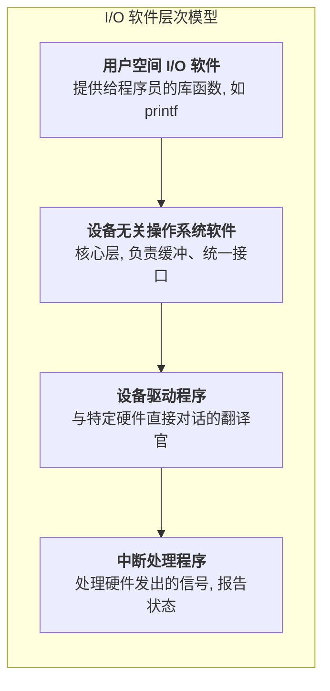

# 面试话术总结：I/O 管理软件 (I/O Management Software)

**面试场景**: 当面试官提问“操作系统是如何管理像键盘、硬盘这些种类繁多的设备的？”或“谈谈你对设备无关性的理解”时，可以参考以下话术进行回答。

---

### 1. 核心目标：设备无关性 (What & Why)

“面试官您好，I/O 管理软件的核心设计目标是实现 **设备无关性**。

简单来说，就是让程序员编写的应用程序，比如一个文件读写程序，**不需要关心底层硬件的具体细节**。无论数据是存在SSD上、机械硬盘上，还是U盘上，我们的代码都不需要修改。操作系统通过一套复杂的I/O软件体系，为我们屏蔽了这些硬件差异，提供了一个统一、简洁的视图。”

### 2. 形象化比喻：公司组织架构 (Analogy)

“我们可以把I/O软件的层次结构想象成一个 **分工明确的公司**：

-   **用户 (用户空间)**：提出需求，比如‘我要打印一份文件’。
-   **项目经理 (设备无关层)**：接收这个通用需求，进行资源协调、任务排队、启动项目。他不关心具体用的是惠普打印机还是佳能打印机。
-   **技术专家 (设备驱动层)**：他是某个特定型号打印机的专家，负责把‘打印文件’这个通用指令，翻译成该打印机能听懂的具体命令。
-   **硬件助理 (中断处理层)**：他守在打印机旁边，等打印完成或卡纸时，立刻向上传递信号，告诉大家任务的最新状态。”

### 3. 核心实现：分层模型 (How)

“为了实现设备无关性，I/O软件被设计成一个清晰的 **四层模型**，从上到下依次是：”



-   **用户空间I/O软件**：这是最顶层，我们平时编程调用的 `printf`、`scanf` 就属于这一层。
-   **设备无关操作系统软件**：这是实现设备无关性的 **核心**。它负责所有设备的通用操作，比如缓冲管理、错误报告、设备命名等。
-   **设备驱动程序**：这是与硬件直接打交道的“翻译官”。每种设备都有自己的驱动，它负责将上层传来的标准指令，翻译成特定硬件能懂的语言。
-   **中断处理程序**：这是最底层，负责处理硬件发出的“信号”（中断），比如“我打印完了”或“我出错了”，并向上层报告。

### 4. 关键技术：缓冲 (Buffering)

“在这个分层模型中，**缓冲技术** 对性能至关重要。通过在内存中设置缓冲区，可以 **缓和CPU和I/O设备之间巨大的速度差异**。

例如，采用 **双缓冲区** 技术，I/O设备向一个缓冲区输入数据的同时，CPU可以从另一个缓冲区中取出数据进行处理。这种 **流水线式的并行操作**，可以大大减少CPU的等待时间，显著提升系统吞吐量。”

### 5. 总结 (Conclusion)

“总的来说，操作系统通过这种 **层层封装、分工明确** 的I/O软件架构，成功地将应用程序与复杂多变的物理硬件解耦，实现了设备无关性，并利用缓冲等技术持续优化系统性能。”


---

### 位示图定位物理块（1023 号）

```latex
$$
\begin{array}{l}
\textbf{例题讲解} \\
\hline \\
\text{物理块从 0 开始编号，若某页面存放在 1023 号物理块，}\\
\text{则在位示图 (bitmap) 中应如何操作？} \\
\\
\textbf{思路} \\
\text{• 每个物理块对应 1 位；1 字节 = 8 位。}\\
\text{• 先确定 1023 位所处的字节序号，再确定该字节内的具体位。}\\
\\
\textbf{解题分析} \\
\begin{array}{|c|l|}
\hline
\textbf{步骤} & \textbf{计算与说明} \\
\hline
\text{字节序号} &
1023 \div 8 = 127 \, (\text{整数商}) \\
\hline
\text{位序号} &
1023 \bmod 8 = 7 \;(\text{从 0 数起的第 7 位}) \\
\hline
\text{操作} &
\text{读取位示图中第 127 个字节，将其第 7 位置为 1 (已占用)} \\
\hline
\end{array} \\
\\
\textbf{结论} \\
\text{定位到 bitmap 第 127 个字节，将最末一位 (bit 7) 设为 1。}
\end{array}
$$
```
