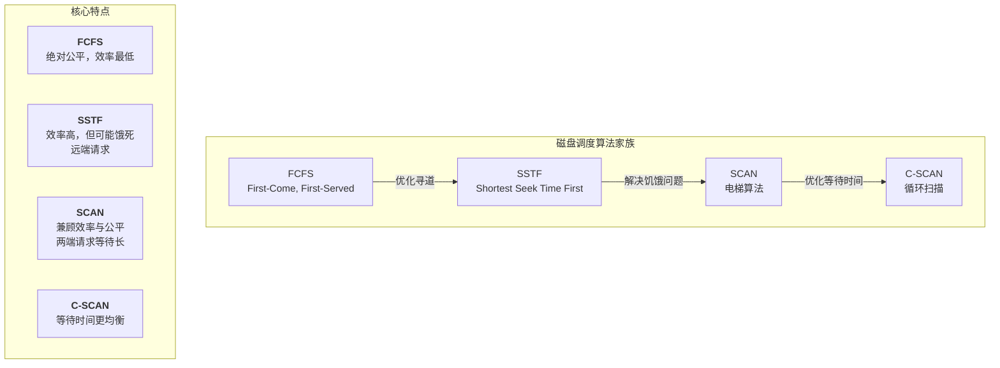

# 面试话术总结：磁盘管理与调度算法 (Disk Management & Scheduling)

**面试场景**: 当面试官提问“磁盘调度的目的是什么？”或“对比一下几种常见的磁盘调度算法”时，可以参考以下话术进行回答。

---

### 1. 核心定义与目的 (What & Why)

“面试官您好，磁盘调度是操作系统 **管理磁盘I/O请求** 的核心技术。

它的主要目的是 **优化磁头的移动路径**。因为在所有I/O操作中，机械式的寻道时间占比最大、也最耗时。通过合理安排请求队列的响应顺序，可以 **最大限度地减少平均寻道时间**，从而提高整个系统的I/O性能和吞吐量。”

### 2. 形象化比喻：电梯调度 (Analogy)

“我们可以把磁盘调度想象成 **一部电梯**。电梯的目标是高效地接送不同楼层的乘客。

-   如果完全按照乘客按按钮的顺序来（**先来先服务**），电梯可能会在1楼和10楼之间频繁地无效往返，效率很低。
-   而一个好的调度算法，就像智能电梯一样，会规划出一条最优路径，比如 **先一路向上** 接送所有乘客，**再一路向下**（**电梯算法**），这样就大大减少了无效的移动，提升了整体效率。”

### 3. 核心算法对比 (How)

“常见的磁盘调度算法主要有以下几种，它们在效率和公平性之间做出了不同的权衡：”

-   **先来先服务 (FCFS)**：最简单，绝对公平，但效率最低，因为磁头移动轨迹完全是随机的。
-   **最短寻道时间优先 (SSTF)**：贪心算法，总是选择离当前磁头最近的请求。平均寻道时间短，但可能导致“饥饿”——远处的请求一直得不到服务。
-   **扫描算法 (SCAN / 电梯算法)**：它模拟电梯运行，在一个方向上移动到底，服务所有沿途请求，然后反向。解决了饥饿问题，但对两端请求不公平，因为刚经过的磁道需要等它走一个完整的来回。
-   **循环扫描算法 (C-SCAN)**：SCAN的优化版。它只在一个方向上服务（比如递增），到达末端后，直接“飞”回起始端，再开始下一轮扫描。这样，所有请求的等待时间都更加均衡。

### 4. 总结 (Conclusion)

“总的来说，从FCFS到C-SCAN，是一个不断在 **效率和公平性之间寻找更优平衡点** 的演进过程。在实际应用中，通常会采用SCAN或C-SCAN及其变种，因为它们在提供良好性能的同时，也避免了饥饿问题，保证了系统的响应公平性。”
